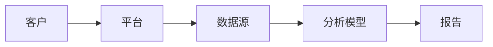
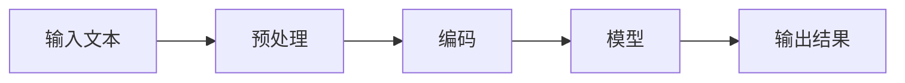
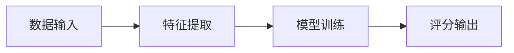
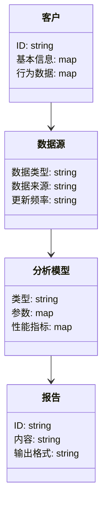
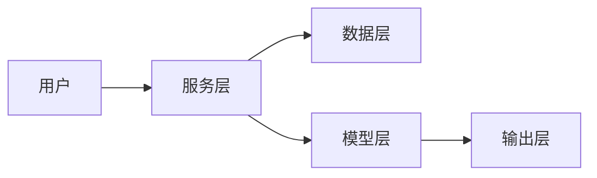
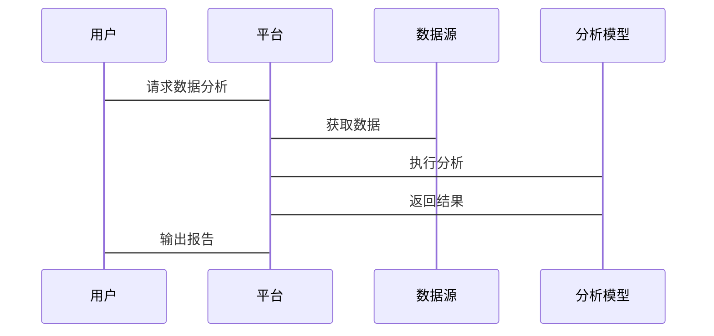

                 


# 《企业估值中的AI驱动的自动化客户洞察平台评估》

## 关键词：企业估值、人工智能、客户洞察平台、自动化评估、数据驱动决策

## 摘要：本文深入探讨了在企业估值过程中，如何利用AI技术构建自动化客户洞察平台，通过数据分析和机器学习算法，实现对客户行为、市场趋势的精准预测和评估。文章详细分析了平台的核心概念、算法原理、系统架构，并通过实际案例展示了如何将理论应用于实践，为企业估值提供高效、准确的解决方案。

---

# 第一章: 企业估值的基本概念与背景

## 1.1 企业估值的定义与重要性

### 1.1.1 企业估值的基本概念
企业估值是指对企业整体价值的评估，通常包括资产、负债、收入、利润等多个维度。在传统企业估值中，主要依赖财务报表分析、DCF模型等方法。然而，随着大数据和人工智能技术的兴起，企业估值的手段和方法也在不断演变。

### 1.1.2 企业估值在商业中的作用
企业估值是企业融资、并购、上市等重要商业活动的基础。准确的估值能够帮助企业做出更明智的决策，优化资源配置，提升企业价值。

### 1.1.3 数字化时代的估值挑战
在数字化时代，企业估值不仅仅是财务数据的分析，还需要结合市场趋势、客户行为、产品竞争力等非财务因素。传统的估值方法往往难以捕捉这些动态变化，因此需要引入更先进的技术手段。

## 1.2 AI驱动的客户洞察平台背景

### 1.2.1 数据驱动决策的兴起
随着数据采集技术的进步，企业能够获得海量的客户数据、市场数据和行为数据。数据驱动决策已经成为企业竞争力的重要来源。

### 1.2.2 客户洞察在企业估值中的价值
客户洞察平台通过对客户行为、偏好、反馈等数据的分析，能够帮助企业更好地理解客户价值，预测客户流失，优化客户关系管理，从而为估值提供更全面的依据。

### 1.2.3 自动化技术的应用前景
自动化客户洞察平台能够实时处理和分析数据，提供动态的估值支持。通过自动化技术，企业能够快速响应市场变化，提升估值的准确性和效率。

## 1.3 本章小结

### 1.3.1 核心概念回顾
企业估值的传统方法和数字化转型的需求，以及AI驱动的客户洞察平台在其中的作用。

### 1.3.2 下文铺垫
接下来的章节将详细介绍客户洞察平台的核心概念、算法原理和系统架构，为实际应用奠定基础。

---

# 第二章: 客户洞察平台的核心概念与框架

## 2.1 客户洞察平台的定义与目标

### 2.1.1 平台的定义
客户洞察平台是一种基于AI技术的数据分析工具，旨在通过对客户数据的深度挖掘，提供客户画像、行为预测、价值评估等服务。

### 2.1.2 平台的核心目标
- 提供客户全生命周期的分析和预测
- 实现实时数据处理和动态估值
- 优化客户关系管理和营销策略

### 2.1.3 平台的边界与外延
客户洞察平台不仅关注客户数据的分析，还与企业的财务系统、CRM系统等其他业务系统进行集成，形成完整的数据闭环。

## 2.2 核心概念与联系

### 2.2.1 实体关系图（ER图）


### 2.2.2 核心概念属性对比表
| 概念 | 属性 |
|------|------|
| 客户 | ID, 基本信息, 行为数据 |
| 数据源 | 类型, 来源, 更新频率 |
| 分析模型 | 类型, 参数, 性能指标 |

## 2.3 本章小结

### 2.3.1 核心概念总结
通过ER图和属性对比表，我们清晰地了解了客户洞察平台的核心构成和各部分之间的关系。

### 2.3.2 框架图的分析
客户洞察平台作为一个复杂的系统，需要各个模块之间的协同工作。ER图展示了系统的整体架构，为后续的系统设计和实现提供了基础。

---

# 第三章: AI驱动的客户洞察平台算法原理

## 3.1 自然语言处理（NLP）模型

### 3.1.1 NLP模型的输入与输出
- **输入**：客户评论、产品描述等文本数据
- **输出**：情感分析结果、关键词提取等

### 3.1.2 模型训练流程
1. 数据预处理：去除停用词、分词
2. 特征提取：TF-IDF、Word2Vec
3. 模型训练：使用深度学习模型（如BERT）进行微调

### 3.1.3 模型评估指标
- 准确率、召回率、F1值
- 混淆矩阵



## 3.2 基于机器学习的客户评分算法

### 3.2.1 算法选择与原理
- 使用随机森林或XGBoost进行客户评分预测
- 特征重要性分析

### 3.2.2 算法实现步骤
1. 数据清洗和特征工程
2. 模型训练与调参
3. 模型评估与部署

### 3.2.3 算法优化建议
- 使用交叉验证
- 处理数据不平衡问题



## 3.3 数学模型与公式

### 3.3.1 情感分析模型
- 使用预训练的BERT模型进行情感分类
- 模型输出为概率值，表示正面或负面情感的概率

### 3.3.2 客户评分模型
- 使用回归模型预测客户评分
- 模型公式：
  $$ y = \beta_0 + \beta_1 x_1 + \beta_2 x_2 + \ldots + \beta_n x_n + \epsilon $$

---

# 第四章: 系统架构设计

## 4.1 问题场景介绍

### 4.1.1 项目介绍
- 系统目标：构建一个AI驱动的客户洞察平台，实现客户行为分析、预测和估值。
- 使用场景：企业客户分析、市场趋势预测、客户关系管理。

## 4.2 系统功能设计

### 4.2.1 领域模型（mermaid类图）


### 4.2.2 系统架构设计（mermaid架构图）


### 4.2.3 系统接口设计
- 用户接口：API接口、网页界面
- 数据接口：数据库连接、数据文件导入

### 4.2.4 系统交互流程（mermaid序列图）


---

# 第五章: 项目实战

## 5.1 环境安装

### 5.1.1 安装Python环境
- 使用Anaconda或虚拟环境
- 安装必要的库：pandas、numpy、scikit-learn、transformers

## 5.2 系统核心实现源代码

### 5.2.1 数据预处理代码
```python
import pandas as pd
from sklearn.model_selection import train_test_split
from sklearn.preprocessing import StandardScaler

# 数据加载
data = pd.read_csv('customer_data.csv')

# 数据清洗
data.dropna(inplace=True)
data['label'] = data['label'].map({'positive': 1, 'negative': 0})

# 特征提取
X = data.drop('label', axis=1)
y = data['label']

# 数据分割
X_train, X_test, y_train, y_test = train_test_split(X, y, test_size=0.2)
```

### 5.2.2 模型训练代码
```python
from sklearn.ensemble import RandomForestClassifier
from sklearn.metrics import accuracy_score

# 模型训练
model = RandomForestClassifier()
model.fit(X_train, y_train)

# 模型预测
y_pred = model.predict(X_test)

# 模型评估
print(accuracy_score(y_test, y_pred))
```

### 5.2.3 算法实现代码
```python
from transformers import AutoTokenizer, AutoModelForTokenClassification
from torch.utils.data import Dataset, DataLoader

# 数据集定义
class CustomDataset(Dataset):
    def __init__(self, sentences, labels):
        self.sentences = sentences
        self.labels = labels

    def __len__(self):
        return len(sentences)

    def __getitem__(self, idx):
        return sentences[idx], labels[idx]

# 数据加载器
dataloader = DataLoader(custom_dataset, batch_size=32, shuffle=True)
```

## 5.3 代码应用解读与分析

### 5.3.1 数据预处理
- 数据清洗：去除缺失值
- 数据分割：训练集和测试集的比例为8:2

### 5.3.2 模型训练
- 使用随机森林进行分类任务
- 模型调参：调整树的深度、叶子节点数等参数

### 5.3.3 算法实现
- 使用预训练的NLP模型进行文本分类
- 自定义数据集和数据加载器，支持分布式训练

## 5.4 实际案例分析和详细讲解剖析

### 5.4.1 案例背景
某电商平台希望通过客户评论分析客户满意度，进而优化产品和服务。

### 5.4.2 数据来源
- 客户评论文本
- 产品评分数据
- 客户购买记录

### 5.4.3 分析过程
1. 数据清洗和预处理
2. 情感分析模型训练
3. 客户评分预测
4. 结果可视化和报告生成

### 5.4.4 结果解读
- 情感分析结果：正面情感占比80%，负面情感占比20%
- 客户评分预测：平均评分4.5分

## 5.5 项目小结

### 5.5.1 核心代码总结
通过代码实现，我们能够快速构建一个基于AI的客户洞察平台，为企业的估值和决策提供支持。

### 5.5.2 实战经验分享
- 数据预处理是关键
- 模型选择和调优影响结果
- 代码复用性和可扩展性设计

---

# 第六章: 总结与展望

## 6.1 核心观点总结

### 6.1.1 核心概念回顾
企业估值需要结合财务数据和客户洞察，AI技术能够提升估值的准确性和效率。

### 6.1.2 技术实现总结
通过构建自动化客户洞察平台，企业能够实时分析客户数据，优化估值流程。

## 6.2 最佳实践 tips

### 6.2.1 数据管理
- 数据清洗要彻底
- 数据存储要安全
- 数据更新要及时

### 6.2.2 模型优化
- 定期重新训练模型
- 优化特征工程
- 监控模型性能

## 6.3 展望与思考

### 6.3.1 未来技术趋势
- 更加智能化的AI算法
- 多模态数据融合
- 自动化决策系统

### 6.3.2 持续优化方向
- 提升模型的解释性
- 扩展平台的功能模块
- 优化用户体验

## 6.4 本章小结

### 6.4.1 未来发展方向
AI驱动的客户洞察平台将继续演进，成为企业估值的核心工具。

### 6.4.2 读者思考
读者可以根据实际需求，结合行业特点，进一步优化和扩展平台功能。

---

# 结语

通过本文的详细讲解，我们了解了AI驱动的客户洞察平台在企业估值中的重要性，掌握了核心概念、算法原理和系统设计方法。希望本文能够为读者提供有价值的参考，帮助企业实现更高效的估值和决策。

