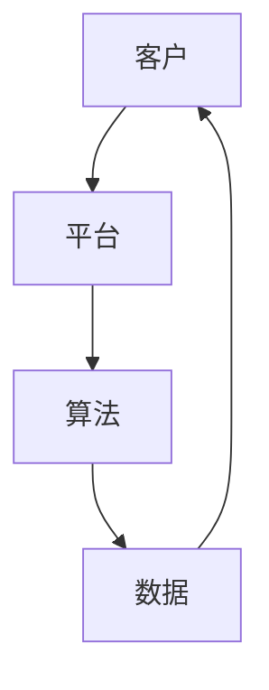
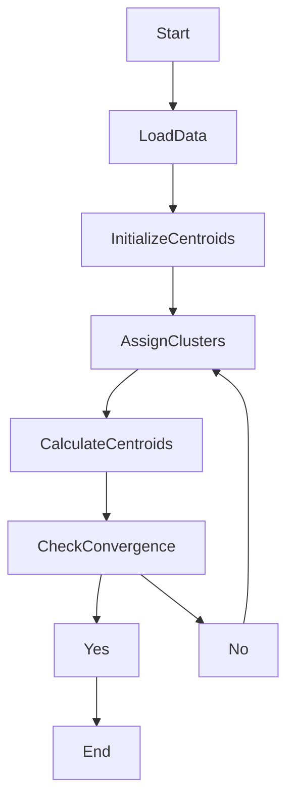
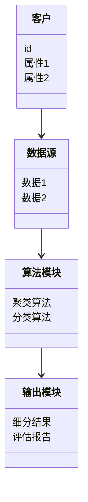

                 


# 《企业估值中的AI驱动的自动化客户细分平台评估》

## 关键词：企业估值、AI驱动、客户细分、自动化评估、机器学习、深度学习、系统架构

## 摘要：本文系统地探讨了AI驱动的自动化客户细分平台在企业估值中的应用。通过分析传统客户细分方法的局限性，介绍了AI技术在客户细分中的优势，并详细阐述了基于机器学习和深度学习的客户细分算法及其在企业估值中的应用场景。本文还提供了系统架构设计、项目实战案例以及最佳实践，为读者提供全面的技术指导。

---

# 第一部分: 企业估值中的客户细分平台概述

## 第1章: 背景介绍

### 1.1 问题背景

#### 1.1.1 企业估值中的客户细分问题
在企业估值过程中，客户细分是至关重要的一步。通过将客户按照某种特征（如行为、偏好、价值等）进行分类，企业可以更好地理解客户群体的需求，制定精准的市场策略，从而提高估值的准确性。

#### 1.1.2 传统客户细分方法的局限性
传统客户细分方法主要依赖于人工分析和统计方法，存在以下问题：
- 数据处理效率低：传统方法需要手动整理和分析大量数据，耗时且容易出错。
- 细分粒度不足：传统方法通常只能进行粗粒度的客户划分，难以满足精细化估值的需求。
- 缺乏动态性：传统方法难以实时更新客户数据，难以应对市场变化。

#### 1.1.3 AI驱动的客户细分的优势
AI技术的应用为客户细分带来了新的可能性：
- 数据处理效率高：AI算法可以快速处理海量数据，提高客户细分的效率。
- 细分粒度精细：基于机器学习的算法能够对客户进行更细粒度的划分，提高估值的准确性。
- 动态性：AI算法可以实时更新，适应市场变化，保持客户细分的动态性。

### 1.2 问题描述

#### 1.2.1 客户细分的定义与目标
客户细分是指根据客户的某些特征（如年龄、性别、收入、消费习惯等）将其划分为不同的群体。其目标是通过精细的客户划分，帮助企业更好地制定市场策略。

#### 1.2.2 企业估值中的客户细分需求
在企业估值中，客户细分可以帮助企业：
- 确定目标客户群体。
- 评估不同客户群体的价值贡献。
- 制定精准的市场推广策略。

#### 1.2.3 问题解决的路径与方法
AI驱动的客户细分平台通过以下路径解决问题：
1. 收集和整理客户数据。
2. 使用机器学习算法对客户进行分类。
3. 评估不同客户的价值贡献。
4. 输出客户细分结果并支持企业决策。

### 1.3 问题解决

#### 1.3.1 AI驱动客户细分的核心思路
AI驱动的客户细分基于以下核心思路：
- 数据驱动：通过收集和分析大量客户数据，利用AI算法进行客户分类。
- 精准划分：使用机器学习和深度学习算法，对客户进行细粒度划分。
- 动态更新：实时更新客户数据，保持客户细分的动态性。

#### 1.3.2 自动化评估平台的构建目标
自动化客户细分平台的构建目标包括：
- 提供高效的客户数据处理能力。
- 提供精准的客户细分结果。
- 提供直观的可视化界面，方便用户查看和分析结果。

#### 1.3.3 平台实现的关键技术
平台实现的关键技术包括：
- 机器学习算法：如K-means、DBSCAN等聚类算法。
- 深度学习算法：如神经网络、卷积神经网络等。
- 数据处理技术：如数据清洗、特征工程等。

### 1.4 边界与外延

#### 1.4.1 平台的应用范围
平台主要应用于企业客户估值、市场细分、精准营销等领域。

#### 1.4.2 与传统客户细分的区别
AI驱动的客户细分平台相比传统方法具有以下优势：
- 数据处理效率高。
- 细分粒度精细。
- 动态性更强。

#### 1.4.3 与其他企业估值方法的对比
与其他企业估值方法（如财务估值、市场估值等）相比，客户细分平台的优势在于其基于客户行为和特征的分析，能够提供更精准的估值依据。

### 1.5 概念结构与核心要素

#### 1.5.1 平台的整体架构
平台的整体架构包括：
- 数据采集模块：负责收集客户数据。
- 数据处理模块：负责清洗和特征提取。
- 模型训练模块：负责训练和优化客户细分模型。
- 结果输出模块：负责输出客户细分结果。

#### 1.5.2 核心要素的定义与关系
核心要素包括：
- 数据来源：客户数据，包括行为数据、交易数据等。
- 分析目标：客户群体划分、价值评估。
- 算法类型：聚类、分类、回归等。
- 评估指标：准确率、召回率、F1值等。

#### 1.5.3 平台的输入输出流程
平台的输入输出流程如下：
1. 输入：客户数据。
2. 数据处理：清洗、特征提取。
3. 模型训练：选择合适的算法进行训练。
4. 输出：客户细分结果、评估报告。

---

## 第2章: 客户细分平台的核心概念

### 2.1 核心概念原理

#### 2.1.1 客户细分的定义与分类
客户细分的定义是根据客户特征将其划分为不同的群体。常见的分类方法包括基于行为的分类、基于价值的分类等。

#### 2.1.2 AI驱动的客户细分算法
AI驱动的客户细分算法主要包括聚类算法和分类算法。聚类算法常用于无监督学习，分类算法常用于有监督学习。

#### 2.1.3 平台评估的核心逻辑
平台评估的核心逻辑包括：
- 数据预处理：清洗、特征提取。
- 算法选择：根据数据特征选择合适的算法。
- 模型训练：训练客户细分模型。
- 结果评估：评估模型的准确率、召回率等。

### 2.2 核心概念属性对比

```mermaid
| 属性 | 描述 |
|------|------|
| 数据来源 | 结构化数据、非结构化数据 |
| 分析目标 | 客户群体划分、价值评估 |
| 算法类型 | 聚类、分类、回归 |
| 评估指标 | 准确率、召回率、F1值 |
```

### 2.3 实体关系图



---

## 第3章: AI驱动的客户细分方法

### 3.1 机器学习与深度学习在客户细分中的应用

#### 3.1.1 机器学习的定义与特点
机器学习是一种人工智能技术，通过数据训练模型，使其能够自动学习和改进。

#### 3.1.2 深度学习的核心优势
深度学习是一种基于人工神经网络的机器学习技术，具有以下优势：
- 能够处理非结构化数据。
- 能够自动提取特征。

#### 3.1.3 结合企业估值的场景
在企业估值中，机器学习和深度学习可以用于客户行为预测、客户价值评估等。

### 3.2 基于聚类的客户细分算法

#### 3.2.1 聚类算法的定义与分类
聚类算法是一种无监督学习算法，用于将数据划分为不同的簇。常见的聚类算法包括K-means、DBSCAN等。

#### 3.2.2 K-means算法的原理与实现
K-means算法是一种经典的聚类算法，其原理如下：
1. 初始化K个中心点。
2. 将每个数据点分配到最近的中心点所在的簇。
3. 重新计算簇的中心点。
4. 重复步骤2和3，直到收敛。

K-means算法的数学公式如下：
$$
\text{目标函数} = \sum_{i=1}^{K} \sum_{j=1}^{n_i} ||x_j - c_i||^2
$$
其中，$K$是簇的个数，$n_i$是第$i$个簇中的数据点个数，$x_j$是数据点，$c_i$是第$i$个簇的中心点。

#### 3.2.3 算法流程图



---

## 第4章: 系统架构与实现

### 4.1 问题场景介绍
在企业估值中，客户细分平台需要处理海量的客户数据，并提供高效的客户细分结果。

### 4.2 系统功能设计

#### 4.2.1 领域模型


### 4.3 系统架构设计

#### 4.3.1 系统架构图
```mermaid
graph LR
    Client --> API Gateway
    API Gateway --> Database
    Database --> Model
    Model --> Output
```

### 4.4 系统接口设计
系统接口设计包括：
- 数据接口：数据输入和输出接口。
- 算法接口：算法调用接口。
- 输出接口：结果输出接口。

### 4.5 系统交互流程

#### 4.5.1 交互流程图
```mermaid
graph LR
    Client --> API Gateway
    API Gateway --> Database
    Database --> Model
    Model --> Output
    Output --> Client
```

---

## 第5章: 项目实战

### 5.1 环境安装

#### 5.1.1 安装Python
```bash
python --version
pip install --upgrade pip
```

#### 5.1.2 安装依赖库
```bash
pip install numpy
pip install scikit-learn
pip install matplotlib
```

### 5.2 系统核心实现

#### 5.2.1 核心代码实现
```python
from sklearn.cluster import KMeans
from sklearn.preprocessing import StandardScaler
import numpy as np

# 数据预处理
data = np.array([[1, 2], [3, 4], [5, 6], [7, 8]])
scaler = StandardScaler()
data_scaled = scaler.fit_transform(data)

# 模型训练
kmeans = KMeans(n_clusters=2)
kmeans.fit(data_scaled)

# 输出结果
print(kmeans.labels_)
```

#### 5.2.2 代码应用解读
上述代码实现了K-means算法，对客户数据进行了聚类分析，输出了客户标签。

### 5.3 案例分析

#### 5.3.1 实际案例分析
以某电商平台为例，使用K-means算法对客户进行聚类分析，发现高价值客户群体。

#### 5.3.2 案例分析解读
通过分析客户数据，识别出高价值客户，制定精准的营销策略。

### 5.4 项目小结
通过项目实战，验证了AI驱动的客户细分平台的有效性，为企业估值提供了有力支持。

---

## 第6章: 最佳实践

### 6.1 小结
本文系统地介绍了AI驱动的客户细分平台在企业估值中的应用，详细讲解了算法原理和系统架构设计。

### 6.2 注意事项
- 数据质量：数据清洗和特征工程是关键。
- 模型选择：根据数据特征选择合适的算法。
- 结果验证：通过评估指标验证模型性能。

### 6.3 拓展阅读
- 《机器学习实战》
- 《深度学习入门》
- 《Python数据处理与分析》

---

## 结语
AI驱动的客户细分平台为企业估值提供了新的思路和方法。通过本文的讲解，读者可以深入了解其原理和实现，为企业估值中的客户细分提供有力支持。

