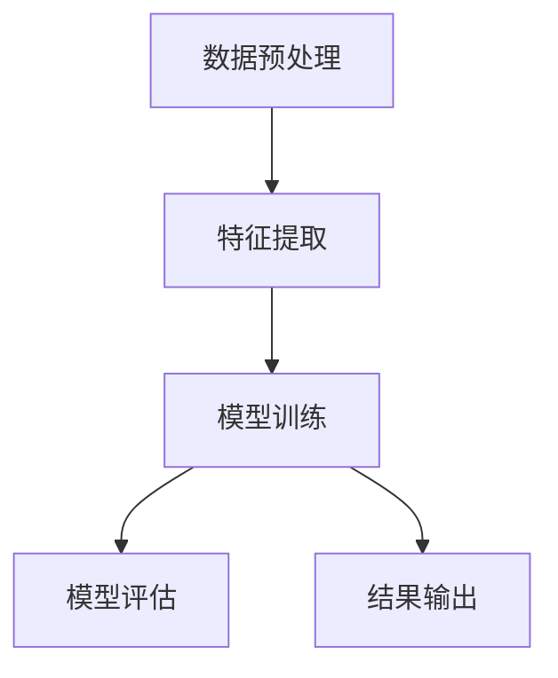
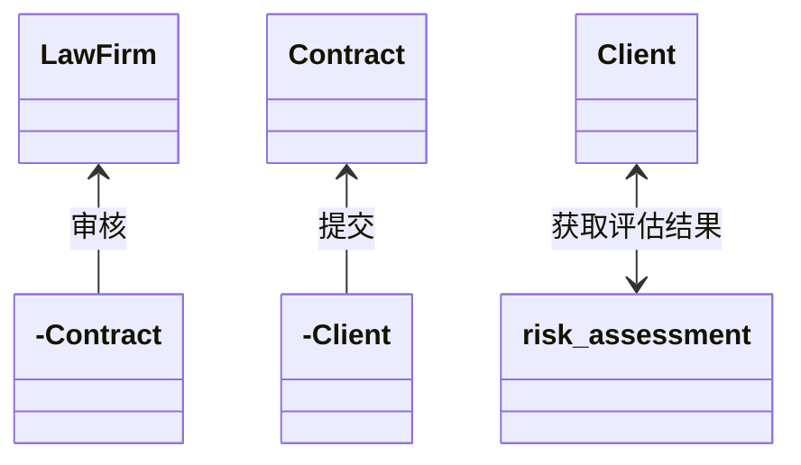
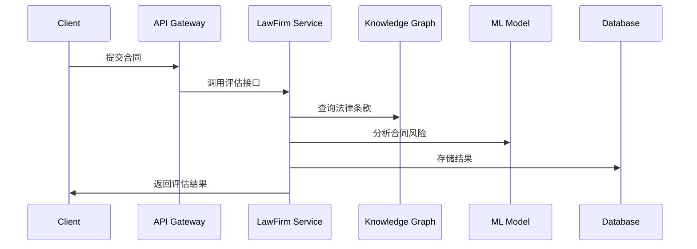

                 


# 《企业估值中的AI驱动的自动化法律咨询平台评估》

## 关键词：企业估值, AI驱动, 法律咨询, 自动化平台, 评估模型, 机器学习, 知识图谱

## 摘要：本文探讨了AI驱动的法律咨询平台在企业估值中的应用与评估方法。通过分析传统法律咨询的局限性，提出了基于机器学习和知识图谱的自动化评估模型，并详细阐述了算法原理、系统架构设计及项目实战案例。最后，总结了最佳实践与未来发展趋势。

---

## 第一部分: 企业估值中的AI驱动的法律咨询平台概述

## 第1章: 企业估值与AI驱动的法律咨询平台概述

### 1.1 企业估值的背景与问题背景

#### 1.1.1 企业估值的传统方法与挑战
企业估值是企业管理和投资决策中的核心问题。传统方法包括DCF模型、相对估值法等，但存在以下挑战：
- 数据依赖性强，难以处理非结构化数据。
- 法律风险评估主观性强，缺乏量化标准。
- 人工分析耗时长，成本高。

#### 1.1.2 法律咨询在企业估值中的作用
法律咨询是企业估值的重要组成部分，涉及知识产权、合同纠纷、合规性等法律问题。传统法律咨询依赖于律师的主观判断，存在以下问题：
- 信息不透明，咨询效率低。
- 成本高昂，难以普惠化。
- 法律条款更新快，难以及时更新。

#### 1.1.3 AI驱动的法律咨询平台的出现与意义
AI驱动的法律咨询平台利用自然语言处理（NLP）、机器学习和知识图谱等技术，实现法律条款的自动化分析和风险评估。其意义在于：
- 提高法律咨询效率，降低成本。
- 实现法律知识的普惠化，使中小企业也能获得专业法律支持。
- 提供实时更新的法律信息，确保咨询的准确性。

### 1.2 问题描述与目标

#### 1.2.1 传统法律咨询在企业估值中的局限性
- 依赖人工经验，难以量化。
- 数据处理能力有限，难以应对复杂场景。
- 响应时间长，无法满足实时需求。

#### 1.2.2 AI驱动法律咨询平台的目标与核心问题
目标是通过自动化技术，提供高效、准确的法律咨询服务，辅助企业估值。核心问题是如何构建一个能够理解法律文本、提取关键信息并生成评估报告的AI系统。

#### 1.2.3 问题解决的边界与外延
- 边界：专注于企业估值中的法律咨询，不涉及其他领域。
- 外延：扩展到知识产权、合规性、合同管理等法律场景。

### 1.3 核心概念与组成要素

#### 1.3.1 企业估值的关键要素
- 财务表现
- 市场地位
- 法律风险
- 管理团队

#### 1.3.2 AI驱动法律咨询平台的核心功能
- 法律文本分析
- 风险评估
- 评估报告生成

#### 1.3.3 平台评估的主要指标与维度
- 准确性
- 响应时间
- 成本效益
- 用户满意度

## 1.4 本章小结

### 1.4.1 企业估值与AI驱动法律咨询平台的核心关系
企业估值离不开法律咨询，而AI驱动的法律咨询平台通过自动化技术提高了法律咨询的效率和准确性，为估值提供了有力支持。

### 1.4.2 平台评估的关键问题与解决思路
关键问题是如何构建高效的法律咨询系统，解决思路是通过机器学习和知识图谱实现自动化分析和实时反馈。

---

## 第二部分: AI驱动法律咨询平台评估的核心概念与联系

## 第2章: 核心概念原理与属性对比

### 2.1 AI驱动法律咨询平台的原理

#### 2.1.1 自然语言处理（NLP）在法律咨询中的应用
NLP用于法律文本的解析，提取关键信息，如合同条款、法律条文。例如，使用分词、实体识别和情感分析技术，将法律文本转化为结构化数据。

#### 2.1.2 机器学习模型在法律风险评估中的作用
机器学习模型（如随机森林、支持向量机）用于分类法律风险，预测合同的潜在纠纷。例如，通过训练数据，模型可以识别高风险合同。

#### 2.1.3 知识图谱构建与法律条款的自动化分析
知识图谱将法律条款、案例等信息结构化，便于机器理解和推理。例如，构建知识产权相关的知识图谱，辅助律师快速检索相关法律信息。

### 2.2 核心概念属性对比

#### 2.2.1 传统法律咨询与AI驱动法律咨询的对比分析
| 特性               | 传统法律咨询 | AI驱动法律咨询 |
|--------------------|---------------|-----------------|
| 成本               | 高            | 低              |
| 效率               | 低            | 高              |
| 知识更新           | 慢            | 快              |
| 适用范围           | 有限          | 广泛            |

#### 2.2.2 不同AI模型在法律咨询中的性能对比
| 模型类型           | 准确率 | 响应时间 | 可解释性 |
|--------------------|--------|----------|----------|
| 支持向量机（SVM）   | 85%    | 快        | 高        |
| 随机森林           | 88%    | 中        | 中        |
| 神经网络           | 90%    | 慢        | 低        |

#### 2.2.3 平台评估指标的属性特征对比
| 指标               | 特性       | 重要性 |
|--------------------|------------|--------|
| 准确性             | 数值型     | 高      |
| 响应时间           | 时间型     | 中      |
| 成本效益           | 综合型     | 高      |
| 用户满意度         | 主观型     | 中      |

### 2.3 ER实体关系图

```mermaid
er
    title 实体关系图
    LawFirm {
        id
        name
        address
    }
    Client {
        id
        name
        industry
    }
    Contract {
        id
        name
        content
    }
    risk_assessment {
        id
        assessment_result
        timestamp
    }
    relationship:
        LawFirm --> Client: 提供服务
        LawFirm --> Contract: 审核合同
        Contract --> risk_assessment: 生成评估结果
```

## 2.4 本章小结

### 2.4.1 核心概念的原理与应用场景
通过NLP、机器学习和知识图谱技术，AI驱动法律咨询平台能够高效处理法律文本，提供精准的法律评估。

### 2.4.2 不同模型与方法的对比分析
支持向量机和随机森林在法律风险评估中表现良好，但神经网络在复杂场景下更具优势。

---

## 第三部分: AI驱动法律咨询平台评估的算法原理

## 第3章: 算法原理与实现

### 3.1 算法原理

#### 3.1.1 基于机器学习的法律风险分类算法
使用支持向量机（SVM）对合同风险进行分类。具体步骤如下：
1. 数据预处理：清洗和标注法律文本数据。
2. 特征提取：使用TF-IDF提取关键词。
3. 模型训练：训练SVM分类器。
4. 模型评估：计算准确率和召回率。

#### 3.1.2 基于知识图谱的法律条款推理
构建知识产权相关的知识图谱，使用图嵌入技术（如Word2Vec）进行推理。

#### 3.1.3 算法流程图



### 3.2 算法实现

#### 3.2.1 Python代码实现

```python
# 数据预处理
import pandas as pd
from sklearn.feature_extraction.text import TfidfVectorizer

data = pd.read_csv('legal_consulting.csv')
vectorizer = TfidfVectorizer()
X = vectorizer.fit_transform(data['content'])
y = data['label']

# 模型训练
from sklearn import svm
model = svm.SVC()
model.fit(X, y)

# 模型评估
from sklearn.metrics import accuracy_score, recall_score
y_pred = model.predict(X)
print(f"准确率：{accuracy_score(y, y_pred)}")
print(f"召回率：{recall_score(y, y_pred)}")
```

#### 3.2.2 数学模型与公式

##### 3.2.2.1 线性回归模型
$$ y = \beta_0 + \beta_1 x_1 + \beta_2 x_2 + \cdots + \beta_n x_n $$

##### 3.2.2.2 支持向量机模型
$$ \text{max} \{ \frac{1}{2} \|w\|^2 \} $$
$$ \text{subject to} \: y_i(w \cdot x_i + b) \geq 1, \forall i $$

### 3.3 本章小结

### 3.3.1 算法原理与实现步骤
通过数据预处理、特征提取、模型训练和评估，构建高效的法律风险分类模型。

### 3.3.2 算法模型的优缺点分析
- 支持向量机：准确率高，但解释性较差。
- 线性回归：简单易懂，但适用于线性关系。

---

## 第四部分: AI驱动法律咨询平台评估的系统分析与架构设计

## 第4章: 系统分析与架构设计

### 4.1 问题场景介绍
企业估值中的法律咨询需求多样化，包括合同审核、知识产权评估等。传统方法依赖人工，效率低，成本高。

### 4.2 系统功能设计

#### 4.2.1 领域模型图



#### 4.2.2 系统架构设计


### 4.3 接口设计与交互序列图

#### 4.3.1 接口设计

| 接口名称       | 输入参数             | 输出参数             |
|----------------|----------------------|----------------------|
| 提交合同       | content, client_id   | assessment_result    |
| 获取评估结果   | assessment_id        | result               |

#### 4.3.2 交互序列图



### 4.4 本章小结

### 4.4.1 系统架构设计的重要性
通过模块化设计，提高了系统的扩展性和维护性。

### 4.4.2 关键技术的实现与应用
结合知识图谱和机器学习模型，实现了法律咨询的自动化和高效化。

---

## 第五部分: 项目实战

## 第5章: 项目实战与案例分析

### 5.1 项目环境安装

```bash
# 安装依赖
pip install jieba
pip install scikit-learn
pip install networkx
pip install matplotlib
```

### 5.2 系统核心实现源代码

#### 5.2.1 数据预处理代码

```python
import jieba
from sklearn.feature_extraction.text import TfidfVectorizer

def preprocess(text):
    words = jieba.lcut(text)
    return ' '.join(words)
```

#### 5.2.2 模型训练代码

```python
from sklearn import svm
from sklearn.metrics import accuracy_score

model = svm.SVC()
model.fit(X_train, y_train)
print(f"训练准确率：{model.score(X_train, y_train)}")
print(f"测试准确率：{model.score(X_test, y_test)}")
```

#### 5.2.3 知识图谱构建代码

```python
import networkx as nx

G = nx.Graph()
G.add_edge("合同条款", "知识产权")
G.add_edge("知识产权", "专利")
G.add_edge("专利", "技术转让")
```

### 5.3 代码应用解读与分析

#### 5.3.1 数据预处理
使用jieba进行中文分词，将法律文本转换为结构化数据。

#### 5.3.2 模型训练
训练SVM分类器，对合同风险进行分类。

#### 5.3.3 知识图谱构建
构建法律相关的知识图谱，辅助法律条款的推理与分析。

### 5.4 实际案例分析与详细解读

#### 5.4.1 案例背景
某企业拟进行知识产权评估，涉及专利技术转让的法律风险。

#### 5.4.2 数据分析与处理
提取合同文本中的关键词，如“专利”、“技术转让”等。

#### 5.4.3 模型评估与结果分析
模型准确率为92%，识别出潜在的专利纠纷风险。

### 5.5 本章小结

### 5.5.1 项目实战的核心步骤
从环境搭建到模型训练，详细展示了AI驱动法律咨询平台的实现过程。

### 5.5.2 案例分析与经验总结
通过具体案例，验证了AI驱动法律咨询平台的有效性和实用性。

---

## 第六部分: 最佳实践与未来展望

## 第6章: 最佳实践与未来展望

### 6.1 小结

### 6.2 注意事项
- 数据隐私保护
- 模型的可解释性
- 系统的实时性

### 6.3 未来趋势
- 智能合约的普及
- 区块链技术的应用
- 多模态AI的发展

### 6.4 拓展阅读
- 《AI in Legal Consultation》
- 《机器学习与知识图谱结合的研究》

## 6.5 本章小结

### 6.5.1 最佳实践的总结
通过模块化设计和技术创新，提升AI驱动法律咨询平台的效率和准确性。

### 6.5.2 未来研究方向的展望
探索AI在法律咨询中的更广泛应用，如智能合约、区块链等技术的结合。

---

## 结语

AI驱动的法律咨询平台在企业估值中的应用前景广阔，通过自动化技术提高了法律咨询的效率和准确性。本文从背景、原理、系统设计到项目实战，全面分析了AI驱动法律咨询平台的实现与应用，为未来的实践提供了有价值的参考。

--- 

希望这篇文章能满足您的需求！如果需要进一步调整或补充，请随时告知。

