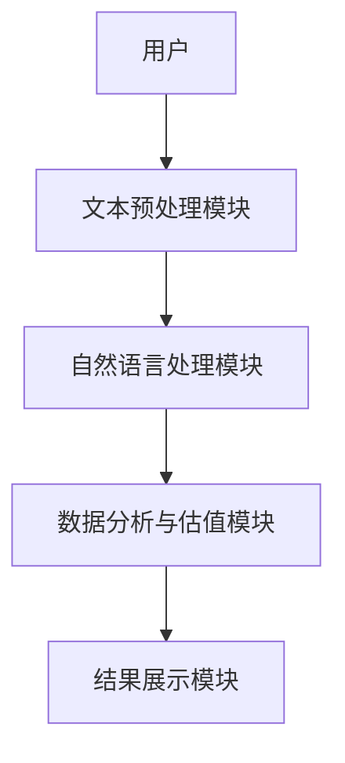
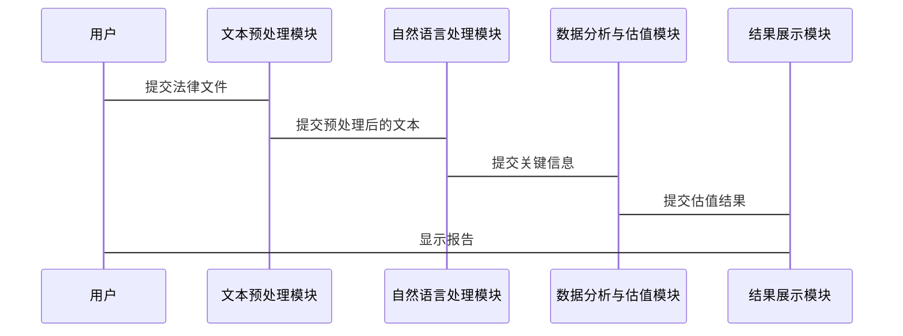

                 


# 企业估值中的AI驱动的自动化法律文件分析平台评估

## 关键词：企业估值, AI驱动, 法律文件分析, 自动化, 自然语言处理

## 摘要：本文探讨了AI驱动的法律文件分析平台在企业估值中的应用。通过分析NLP技术、文本相似度计算和主题建模，本文详细讲解了平台的核心算法和系统架构，并通过案例展示了其实现过程。最后，总结了最佳实践和未来发展方向。

---

## 第1章：企业估值与法律文件分析的背景

### 1.1 企业估值的重要性

企业估值是确定企业市场价值的关键步骤，影响投资决策和企业战略。传统方法依赖财务数据和专家判断，但缺乏对法律文件的深入分析，可能导致估值偏差。

### 1.2 法律文件分析的必要性

法律文件（如合同、财务报表）包含关键信息，直接影响企业价值。传统分析耗时且易出错，AI技术的引入提升了效率和准确性。

### 1.3 AI驱动的法律文件分析的优势

AI技术通过自动化处理和深度学习，快速提取关键信息，优化企业估值流程。当前市场上的工具多基于NLP技术，但仍需克服复杂性挑战。

---

## 第2章：AI驱动的法律文件分析平台的核心概念

### 2.1 平台的定义与范围

AI驱动的法律文件分析平台利用NLP技术，自动化处理和分析法律文件，辅助企业估值。

### 2.2 平台的核心功能与目标

- **文本预处理**：清洗和标准化输入数据。
- **自然语言处理**：提取关键信息和实体。
- **数据分析与估值**：基于提取的信息计算企业价值。
- **结果展示**：生成报告和可视化结果。

### 2.3 平台的输入与输出

- **输入**：多种格式的法律文件。
- **输出**：结构化的分析结果和估值报告。

### 2.4 平台的性能指标

- **分析速度**：处理时间需高效。
- **准确性**：结果需可靠。
- **可扩展性**：适应大量数据。

---

## 第3章：平台的核心算法与技术

### 3.1 自然语言处理技术

#### 3.1.1 分词与词性标注

使用jieba进行分词，用NLTK进行词性标注，提取文本中的名词和动词。

```python
import jieba
from nltk import pos_tag

text = "公司年度利润为1000万元"
tokens = jieba.lcut(text)
print(tokens)  # 输出：['公司', '年度', '利润', '为', '1000', '万元']
tags = pos_tag(tokens)
print(tags)  # 输出：[('公司', 'NN'), ('年度', 'NN'), ('利润', 'NN'), ('为', 'IN'), ('1000', 'CD'), ('万元', 'NN')]
```

#### 3.1.2 句法分析与语义理解

利用spaCy进行句法分析，识别句子结构和语义关系。

```python
import spacy

nlp = spacy.load("zh_core_web_sm")
doc = nlp("公司年度利润为1000万元")
for token in doc:
    print(token.text, token.pos_, token.dep_)
```

#### 3.1.3 基于深度学习的文本表示

使用BERT模型生成文本向量，捕捉语义信息。

```python
from transformers import BertTokenizer, BertModel

tokenizer = BertTokenizer.from_pretrained('bert-base-chinese')
model = BertModel.from_pretrained('bert-base-chinese')

text = "公司年度利润为1000万元"
inputs = tokenizer(text, return_tensors='np')
outputs = model(**inputs)
last_hidden_states = outputs.last_hidden_state
print(last_hidden_states)
```

### 3.2 文本相似度计算

#### 3.2.1 基于向量的相似度计算

使用余弦相似度计算文本相似度。

```python
from sklearn.metrics.pairwise import cosine_similarity

vectorizer = TfidfVectorizer()
vectors = vectorizer.fit_transform(documents)
similarity_matrix = cosine_similarity(vectors)
```

#### 3.2.2 基于预训练模型的相似度计算

使用BERT模型计算文本相似度。

```python
def compute_cosine_similarity(text1, text2):
    inputs1 = tokenizer(text1, return_tensors='np')
    inputs2 = tokenizer(text2, return_tensors='np')
    outputs1 = model(**inputs1)
    outputs2 = model(**inputs2)
    embeddings1 = outputs1.last_hidden_state
    embeddings2 = outputs2.last_hidden_state
    similarity = np.dot(embeddings1, embeddings2.T)
    return similarity

similarity = compute_cosine_similarity(text1, text2)
print(similarity)
```

### 3.3 文本分类与主题建模

#### 3.3.1 基于传统机器学习的文本分类

使用TF-IDF和SVM进行文本分类。

```python
from sklearn.feature_extraction.text import TfidfVectorizer
from sklearn.svm import SVC

vectorizer = TfidfVectorizer()
X = vectorizer.fit_transform(documents)
y = [target for target in targets]
clf = SVC()
clf.fit(X, y)
predicted = clf.predict(X)
```

#### 3.3.2 基于深度学习的文本分类

使用RNN进行文本分类。

```python
import torch
import torch.nn as nn

class TextClassifier(nn.Module):
    def __init__(self, vocab_size, embedding_dim, hidden_dim, output_dim):
        super().__init__()
        self.embedding = nn.Embedding(vocab_size, embedding_dim)
        self.rnn = nn.RNN(embedding_dim, hidden_dim)
        self.fc = nn.Linear(hidden_dim, output_dim)

    def forward(self, x):
        embedded = self.embedding(x)
        output, _ = self.rnn(embedded)
        output = self.fc(output)
        return output

model = TextClassifier(vocab_size, embedding_dim, hidden_dim, output_dim)
criterion = nn.CrossEntropyLoss()
optimizer = torch.optim.Adam(model.parameters())
```

#### 3.3.3 主题建模与LDA算法

使用LDA进行主题建模。

```python
from sklearn.decomposition import LatentDirichletAllocation

X = vectorizer.fit_transform(documents)
lda = LatentDirichletAllocation(n_components=5, random_state=0)
lda.fit(X)
```

### 3.4 算法实现与优化

#### 3.4.1 并行计算与分布式处理

使用多线程优化NLP处理。

```python
import concurrent.futures

def process_document(doc):
    # 文档处理逻辑
    pass

with concurrent.futures.ThreadPoolExecutor() as executor:
    futures = [executor.submit(process_document, doc) for doc in documents]
    for future in concurrent.futures.as_completed(futures):
        result = future.result()
        print(result)
```

---

## 第4章：平台的系统架构与设计

### 4.1 系统架构概述

采用微服务架构，各模块独立运行，便于扩展和维护。



### 4.2 功能模块设计

#### 4.2.1 文本预处理模块

清洗和标准化文本数据。

```python
def preprocess(text):
    # 去除特殊字符
    text = re.sub(r'[^\w\s]', '', text)
    # 转换为小写
    text = text.lower()
    return text
```

#### 4.2.2 自然语言处理模块

提取关键实体和关系。

```python
from spacy import displacy

def extract_entities(doc):
    entities = []
    for ent in doc.ents:
        entities.append((ent.text, ent.label_))
    return entities
```

#### 4.2.3 数据分析与估值模块

基于提取的信息计算企业价值。

```python
def calculate_valuation(entities):
    # 示例逻辑
    valuation = 0
    for ent in entities:
        if ent.label_ == '公司':
            valuation += 1000000  # 示例估值
    return valuation
```

#### 4.2.4 结果展示模块

生成可视化报告。

```python
import matplotlib.pyplot as plt

def generate_report(valuation):
    plt.figure(figsize=(10, 6))
    plt.bar('企业估值', valuation, color='blue')
    plt.title('企业估值报告')
    plt.show()
```

### 4.3 数据流与交互流程



---

## 第5章：项目实战

### 5.1 环境配置

安装必要的库：

```bash
pip install jieba nltk spacy transformers scikit-learn
python -m spacy download zh_core_web_sm
```

### 5.2 核心实现

实现关键功能模块：

#### 5.2.1 文本预处理

```python
import re
import jieba

def preprocess_documents(documents):
    preprocessed = []
    for doc in documents:
        text = re.sub(r'[^\w\s]', '', doc)
        text = text.lower()
        preprocessed.append(text)
    return preprocessed
```

#### 5.2.2 自然语言处理

提取实体和关系：

```python
import spacy

def extract_entities(documents):
    nlp = spacy.load("zh_core_web_sm")
    entities = []
    for doc in documents:
        doc = nlp(doc)
        for ent in doc.ents:
            entities.append((ent.text, ent.label_))
    return entities
```

#### 5.2.3 数据分析与估值

基于实体进行估值：

```python
def calculate_valuation(entities):
    valuation = 0
    for ent in entities:
        if ent[1] == 'ORG':
            valuation += 1000000  # 示例估值
    return valuation
```

#### 5.2.4 生成报告

可视化结果：

```python
import matplotlib.pyplot as plt

def generate_report(valuation):
    plt.figure(figsize=(10, 6))
    plt.bar('企业估值', valuation, color='blue')
    plt.title('企业估值报告')
    plt.show()
```

### 5.3 测试与优化

优化算法性能：

```python
from sklearn.metrics import accuracy_score

# 训练模型
model.fit(X_train, y_train)
# 预测测试集
y_pred = model.predict(X_test)
# 计算准确率
print(accuracy_score(y_test, y_pred))
```

### 5.4 结果分析

分析模型表现：

```python
from sklearn.metrics import classification_report

print(classification_report(y_test, y_pred))
```

---

## 第6章：最佳实践与未来展望

### 6.1 最佳实践

- **数据质量**：确保输入数据的准确性和完整性。
- **模型优化**：定期更新模型，提升准确率。
- **用户反馈**：收集用户反馈，优化用户体验。

### 6.2 小结

AI驱动的法律文件分析平台在企业估值中展现出巨大潜力，通过自动化处理和深度学习，显著提升了效率和准确性。

### 6.3 注意事项

- **数据隐私**：确保处理数据的安全性。
- **模型解释性**：提供清晰的解释，帮助用户理解结果。

### 6.4 拓展阅读

- 探索多模态分析，结合图像和文本信息。
- 研究模型的可解释性，提升用户信任度。

---

## 结语

AI驱动的法律文件分析平台为企业估值提供了创新解决方案，通过自动化处理和深度学习，显著优化了传统方法的不足。随着技术进步，未来将实现更精准、高效的分析，为企业决策提供有力支持。

