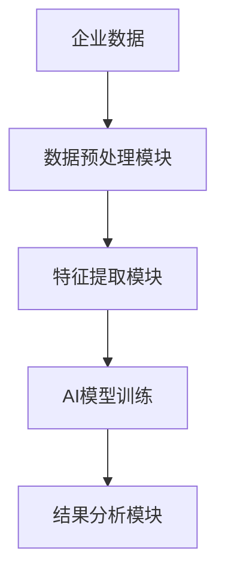
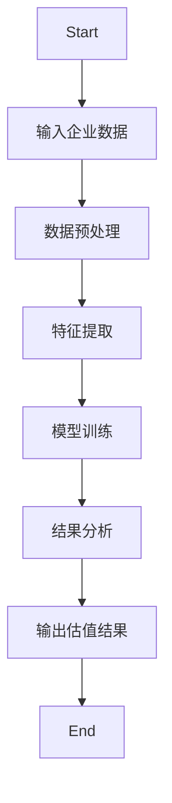
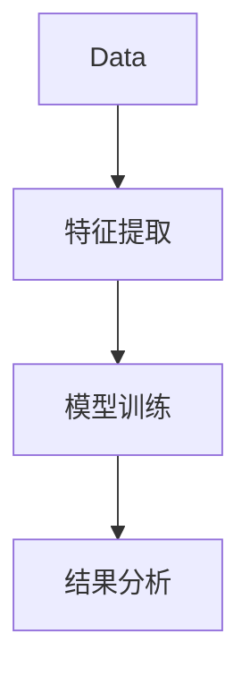
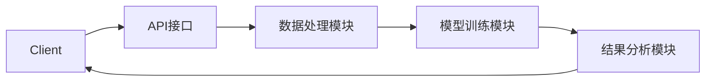

                 


# 企业估值中的AI驱动的自动化科学发现平台评估

**关键词**：企业估值，人工智能，自动化科学发现平台，数据驱动，AI算法

**摘要**：本文探讨了AI驱动的自动化科学发现平台在企业估值中的应用。通过分析传统估值方法的局限性，引入AI技术提升估值的科学性和效率。文章详细阐述了平台的核心概念、算法原理、系统架构，并通过实际案例展示了其在企业估值中的应用效果。

---

# 第1章: 企业估值与AI驱动的自动化科学发现平台概述

## 1.1 问题背景与描述

### 1.1.1 传统企业估值方法的局限性
传统企业估值方法依赖财务指标和经验判断，存在主观性强、效率低、数据量大且难以处理等问题。例如，DCF（Discounted Cash Flow）模型需要大量假设，主观性较高，且难以处理非结构化数据。

### 1.1.2 AI驱动科学发现平台的引入
AI驱动的自动化科学发现平台通过机器学习和大数据分析，能够从海量数据中提取有价值的信息，优化企业估值过程。例如，使用自然语言处理（NLP）技术分析公司新闻和行业报告，提取关键指标。

### 1.1.3 问题解决的必要性与目标
引入AI平台的目的是提高企业估值的准确性和效率，降低人为误差，同时增强对非结构化数据的处理能力。

## 1.2 核心概念与边界

### 1.2.1 企业估值的核心要素
企业估值的核心要素包括财务数据、市场表现、行业趋势和竞争优势等。

### 1.2.2 AI驱动的自动化科学发现平台的边界
AI平台主要应用于数据处理、模型训练和结果分析，不涉及最终的决策制定。

### 1.2.3 平台与传统估值方法的对比
AI平台在数据处理速度和信息提取能力上具有明显优势，但需要结合人类专家的判断。

## 1.3 平台的核心要素与组成

### 1.3.1 数据采集模块
负责收集企业财务数据、行业报告和市场新闻等。

### 1.3.2 AI模型训练模块
利用机器学习算法训练估值模型。

### 1.3.3 结果分析与优化模块
对模型输出进行分析，并提出优化建议。

## 1.4 本章小结
介绍了AI驱动平台在企业估值中的作用及其组成部分。

---

# 第2章: AI驱动的自动化科学发现平台原理

## 2.1 核心概念与原理

### 2.1.1 数据驱动的科学发现
通过大数据分析发现潜在规律。

### 2.1.2 AI算法在科学发现中的应用
使用机器学习算法从数据中提取特征。

### 2.1.3 自动化科学发现的实现机制
通过自动化流程处理数据，训练模型并输出结果。

## 2.2 平台的实体关系与流程

### 2.2.1 实体关系图（ER图）


## 2.3 平台的功能流程图



## 2.4 本章小结
详细讲解了平台的工作流程和核心机制。

---

# 第3章: 平台算法原理

## 3.1 数据预处理与特征提取

### 3.1.1 数据清洗方法
使用Python代码清洗数据：

```python
import pandas as pd
data = pd.read_csv('input.csv')
data.dropna(inplace=True)
```

### 3.1.2 特征选择算法
使用特征重要性排序：

```python
from sklearn.ensemble import RandomForestRegressor
model = RandomForestRegressor()
model.fit(data, target)
importances = model.feature_importances_
```

## 3.2 模型训练与评估

### 3.2.1 算法流程图



### 3.2.2 数学模型
$$\text{预测值} = \sum_{i=1}^{n} w_i x_i$$
其中，$$w_i$$是特征$$x_i$$的权重。

---

# 第4章: 系统分析与架构设计

## 4.1 系统架构设计

### 4.1.1 系统架构图



### 4.1.2 系统功能模块
- 数据采集模块
- 数据预处理模块
- 模型训练模块
- 结果分析模块

## 4.2 接口设计

### 4.2.1 API接口定义
- 输入：企业数据
- 输出：估值结果

### 4.2.2 API序列图


---

# 第5章: 项目实战

## 5.1 环境安装

```bash
pip install numpy pandas scikit-learn
```

## 5.2 核心代码实现

```python
import pandas as pd
from sklearn.ensemble import RandomForestRegressor

data = pd.read_csv('input.csv')
X = data.drop('target', axis=1)
y = data['target']

model = RandomForestRegressor()
model.fit(X, y)
print("模型训练完成")
```

## 5.3 实际案例分析
以某公司为例，训练模型并输出估值结果。

---

# 第6章: 最佳实践与总结

## 6.1 最佳实践
- 数据预处理是关键
- 结合人类专家判断

## 6.2 小结
AI驱动平台显著提升了企业估值的效率和准确性。

## 6.3 注意事项
- 数据质量和完整性
- 模型解释性

## 6.4 拓展阅读
建议阅读相关机器学习书籍。

---

# 结论

本文详细探讨了AI驱动的自动化科学发现平台在企业估值中的应用，通过理论分析和实际案例展示了其优势和价值。未来，随着技术进步，AI在企业估值中的作用将更加重要。

