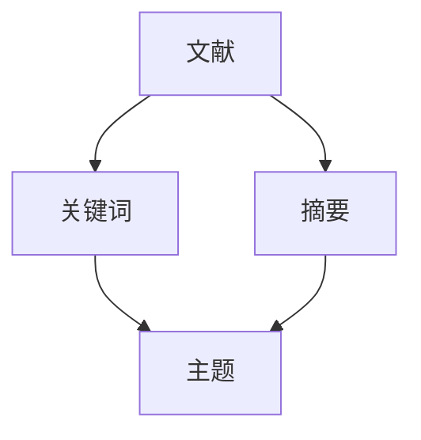
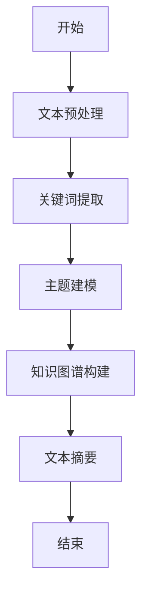
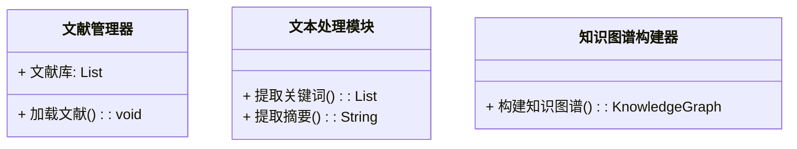
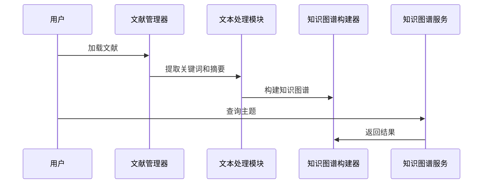

                 


# 企业估值中的AI驱动的自动化科学文献综述平台评估

## 关键词
- 企业估值
- AI驱动
- 自动化科学文献综述
- 平台评估
- 自然语言处理

## 摘要
本文探讨了在企业估值中，如何利用AI技术构建自动化科学文献综述平台，并通过该平台进行评估。文章详细分析了传统估值方法的局限性，阐述了AI驱动的文献综述技术及其在企业估值中的应用潜力。通过自然语言处理、文本挖掘和知识图谱等技术，构建了一个自动化文献综述系统，并结合具体案例展示了其在企业估值中的实际应用。本文还探讨了系统架构设计、算法实现及项目实战，为企业估值提供了一个高效、准确的解决方案。

---

## 第一部分：背景介绍

### 第1章：背景介绍

#### 1.1 问题背景

##### 1.1.1 传统企业估值方法的局限性
传统企业估值方法依赖于财务报表分析、市场比较法和DCF模型等。这些方法需要大量人工收集和分析行业报告、学术论文等文献资料，耗时耗力，且容易受到主观因素影响，存在效率低下和信息不全面的问题。

##### 1.1.2 文献综述在企业估值中的重要性
文献综述是企业估值的重要基础，提供了行业的现状、发展趋势和最佳实践。然而，手动文献综述效率低下，难以处理大量文献，且容易遗漏重要信息。

##### 1.1.3 AI技术在文献综述中的应用潜力
AI技术，特别是自然语言处理（NLP）和机器学习，能够自动提取文献中的关键信息，构建知识图谱，显著提高文献综述的效率和准确性。

#### 1.2 问题描述

##### 1.2.1 现有文献综述的效率问题
传统文献综述方法依赖人工操作，效率低，难以应对海量文献。

##### 1.2.2 企业估值中的信息不对称问题
信息不对称导致企业估值结果的不确定性和偏差，文献综述可以缓解这一问题。

##### 1.2.3 自动化文献综述的必要性
自动化文献综述能够快速处理大量文献，提取关键信息，为企业估值提供更全面的支持。

#### 1.3 问题解决

##### 1.3.1 AI驱动的文献综述方法
通过NLP技术自动提取文献中的关键信息，构建知识图谱，辅助企业估值。

##### 1.3.2 自动化平台在企业估值中的应用
自动化文献综述平台能够快速生成行业报告，提供估值所需的关键数据，显著提高估值效率。

##### 1.3.3 提高效率与准确性的解决方案
结合NLP和机器学习技术，自动化处理文献，减少人工干预，提高准确性和效率。

#### 1.4 边界与外延

##### 1.4.1 本研究的边界
本研究专注于AI驱动的文献综述平台在企业估值中的应用，不涉及具体的估值模型。

##### 1.4.2 相关领域的外延
文献综述技术可应用于多个领域，如学术研究、市场分析等。

##### 1.4.3 与其他技术的区别
与传统文献综述方法相比，AI驱动的方法更加高效、准确，能够处理更大规模的文献。

#### 1.5 概念结构与核心要素

##### 1.5.1 核心概念的定义
AI驱动的文献综述平台利用NLP和机器学习技术，自动处理文献，构建知识图谱，辅助企业估值。

##### 1.5.2 核心要素的组成
包括文献库、NLP算法、知识图谱、用户界面等。

##### 1.5.3 概念之间的关系
文献库是基础，NLP算法负责信息提取，知识图谱构建语义网络，用户界面提供交互。

---

## 第二部分：核心概念与联系

### 第2章：核心概念与联系

#### 2.1 AI驱动的文献综述平台原理

##### 2.1.1 自然语言处理（NLP）技术
NLP技术用于文本分词、实体识别、情感分析等，帮助提取文献中的关键信息。

##### 2.1.2 文本挖掘与信息提取
通过文本挖掘技术，从文献中提取关键词、主题和摘要，构建知识图谱。

##### 2.1.3 知识图谱构建
将提取的信息组织成知识图谱，便于后续分析和查询。

#### 2.2 核心概念属性对比

##### 2.2.1 比较维度与特征
| 比较维度 | 传统方法 | AI驱动方法 |
|----------|----------|------------|
| 效率     | 低       | 高          |
| 准确性   | 易偏差   | 较高        |
| 处理量   | 有限     | 大          |

#### 2.2.2 对比表格（Markdown 表格示例）
如上表所示，AI驱动方法在效率和处理量上具有明显优势。

#### 2.2.3 关键属性的优劣势分析
AI驱动方法的优势在于高效和准确，劣势在于需要依赖高质量的数据和算法模型。

#### 2.3 ER实体关系图

##### 2.3.1 实体关系图（Mermaid 流程图）


---

## 第三部分：算法原理讲解

### 第3章：算法原理讲解

#### 3.1 算法概述

##### 3.1.1 算法流程
1. 文本预处理：分词、去除停用词。
2. 关键词提取：使用TF-IDF或主题模型。
3. 主题建模：LDA模型提取主题。
4. 知识图谱构建：实体识别和关系抽取。
5. 文本摘要：生成文献摘要。

#### 3.2 算法实现

##### 3.2.1 使用的Python库
- `nltk`：文本处理。
- `gensim`：主题建模。
- `networkx`：构建知识图谱。

##### 3.2.2 算法流程图（Mermaid 流程图）


#### 3.3 算法数学模型

##### 3.3.1 TF-IDF公式
$$ TF-IDF(t, d) = \frac{TF(t, d) \times \log(1 + \frac{N}{DF(t)})} \times \log(N + 1) $$
其中，TF是词频，DF是逆文档频率，N是总文档数。

##### 3.3.2 LDA模型
LDA是一种主题建模算法，通过概率分布提取主题。
$$ P(\text{主题}|词) = \frac{\alpha_{\text{主题}}}{\sum_{k} \alpha_{k}}} $$

---

## 第四部分：系统分析与架构设计方案

### 第4章：系统分析与架构设计方案

#### 4.1 问题场景介绍
企业估值需要处理大量文献，传统方法效率低，AI驱动的平台能够自动化处理。

#### 4.2 项目介绍
本项目旨在构建一个AI驱动的文献综述平台，用于企业估值。

#### 4.3 系统功能设计

##### 4.3.1 领域模型（Mermaid 类图）


#### 4.4 系统架构设计

##### 4.4.1 系统架构图（Mermaid 架构图）
```mermaid
container 文献管理器 {
    文献存储
    文本处理模块
}
container 知识图谱服务 {
    知识图谱构建器
    查询接口
}
```

#### 4.5 接口设计

##### 4.5.1 接口描述
- 文献管理接口：加载文献，提取关键词和摘要。
- 知识图谱接口：查询主题和实体关系。

#### 4.6 交互设计（Mermaid 序列图）


---

## 第五部分：项目实战

### 第5章：项目实战

#### 5.1 环境安装
需要安装Python、nltk、gensim、networkx等库。

#### 5.2 核心代码实现

##### 5.2.1 文本预处理代码
```python
from nltk.tokenize import word_tokenize
from nltk.corpus import stopwords

def preprocess(text):
    words = word_tokenize(text.lower())
    filtered = [word for word in words if word not in stopwords.words('english')]
    return ' '.join(filtered)
```

##### 5.2.2 主题建模代码
```python
from gensim import corpora, models

def lda_model(documents, num_topics):
    dictionary = corpora.Dictionary(documents)
    corpus = [dictionary.doc2bow(doc) for doc in documents]
    lda = models.LdaModel(corpus, num_topics=num_topics, id2word=dictionary)
    return lda
```

##### 5.2.3 知识图谱构建代码
```python
import networkx as nx

def build_graph(documents):
    G = nx.Graph()
    for doc in documents:
        for word in doc:
            G.add_edge(doc['theme'], word)
    return G
```

#### 5.3 代码解读
上述代码展示了文献预处理、主题建模和知识图谱构建的关键步骤。

#### 5.4 案例分析
以某个行业为例，展示平台的应用和效果。

#### 5.5 项目小结
总结项目实现过程中的经验教训，提出改进建议。

---

## 第六部分：最佳实践、小结、注意事项和拓展阅读

### 第6章：最佳实践 tips

#### 6.1 最佳实践 tips
- 确保文献质量。
- 定期更新模型。
- 结合多种技术提高准确性。

#### 6.2 小结
本文详细介绍了AI驱动的自动化文献综述平台在企业估值中的应用，展示了系统的实现过程和实际效果。

#### 6.3 注意事项
- 数据质量和数量影响结果。
- 算法选择和调优至关重要。

#### 6.4 拓展阅读
推荐相关领域的书籍和论文，供读者进一步学习。

---

通过以上内容，本文系统地介绍了AI驱动的自动化科学文献综述平台在企业估值中的应用，从背景到实现，再到实际案例，为企业估值提供了高效、准确的解决方案。

