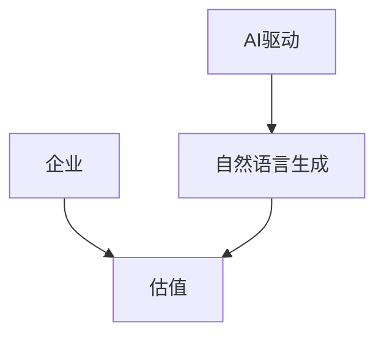
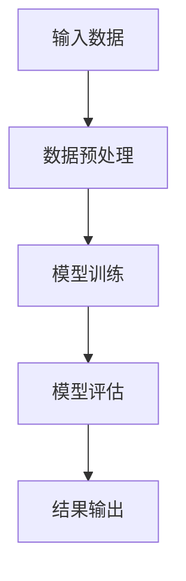
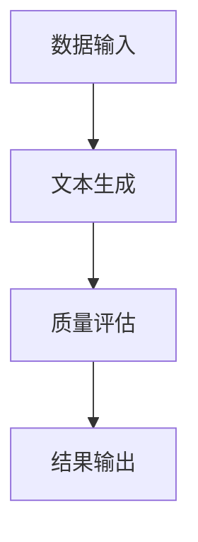
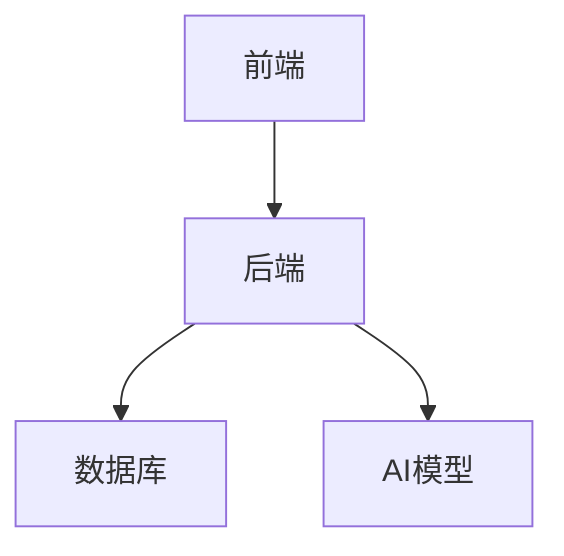
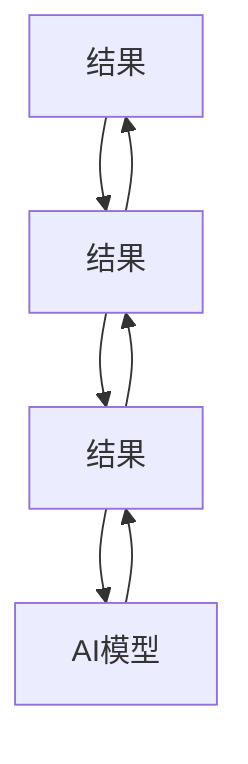

                 


# 企业估值中的AI驱动的自然语言生成平台评估

> 关键词：企业估值，自然语言生成，AI驱动，平台评估，算法原理，系统架构，项目实战

摘要：  
本文深入探讨了AI驱动的自然语言生成技术在企业估值中的应用与评估方法。通过分析自然语言生成的核心原理、算法模型、系统架构以及实际案例，本文旨在为企业估值提供一种高效、准确的技术解决方案。文章从问题背景、核心概念、算法原理、系统设计到项目实战，逐步展开，最终为企业提供一套完整的评估框架和实践指南。

---

# 第1章: 企业估值中的AI驱动自然语言生成平台评估背景与概念

## 1.1 问题背景

### 1.1.1 企业估值的传统方法与局限性  
企业估值是企业管理和投资决策中的核心问题之一。传统的企业估值方法主要包括财务指标分析、市场比较法和DCF（Discounted Cash Flow）模型等。然而，这些方法存在以下局限性：  
1. **数据依赖性强**：传统估值方法高度依赖财务数据，难以捕捉非财务因素（如市场情绪、竞争环境等）对企业价值的影响。  
2. **主观性较高**：在市场比较法中，分析师需要手动筛选可比公司，主观性较强，可能导致估值偏差。  
3. **效率低下**：传统方法通常需要大量人工分析，耗时且成本较高，难以应对海量数据的处理需求。

### 1.1.2 自然语言生成技术的兴起  
自然语言生成（Natural Language Generation, NLG）是人工智能领域的重要分支，近年来随着深度学习技术的快速发展而迅速崛起。NLG技术可以通过算法生成符合人类语言习惯的文本，广泛应用于新闻报道、客服对话、报告撰写等领域。在企业估值中，NLG技术可以用于生成企业分析报告、市场趋势分析等，帮助分析师快速获取关键信息。

### 1.1.3 AI驱动的自然语言生成在企业估值中的潜力  
AI驱动的自然语言生成技术可以将企业相关的非结构化数据（如新闻报道、行业分析报告）转化为结构化信息，从而为估值模型提供更全面的输入。此外，NLG还可以自动生成估值报告，提高效率并降低成本。

---

## 1.2 问题描述

### 1.2.1 企业估值中的关键信息提取  
企业估值需要综合考虑财务数据、市场环境、行业趋势等多种因素。然而，许多关键信息可能隐藏在非结构化的文本数据中（如新闻报道、行业分析报告），如何高效提取这些信息是企业估值中的一个重要挑战。

### 1.2.2 自然语言生成在企业报告中的应用  
通过自然语言生成技术，可以自动生成企业分析报告、市场趋势预测报告等，帮助分析师快速获取所需信息。然而，如何评估生成报告的质量和准确性是一个关键问题。

### 1.2.3 平台评估的核心挑战  
AI驱动的自然语言生成平台需要具备以下能力：  
1. **准确理解输入数据**：能够从非结构化文本中提取关键信息。  
2. **高质量的文本生成**：生成符合上下文逻辑的文本。  
3. **可解释性**：生成的报告需要具有可解释性，以便分析师验证和调整。  
4. **高效性**：能够在较短时间内生成大量报告，满足企业的需求。

---

## 1.3 问题解决

### 1.3.1 自然语言生成技术的解决方案  
自然语言生成技术可以通过以下方式解决企业估值中的信息提取和报告生成问题：  
1. **文本预处理**：对非结构化文本进行清洗和分词，提取关键词和句法信息。  
2. **模型训练**：基于海量数据训练自然语言生成模型，使其能够生成符合上下文的文本。  
3. **结果评估**：通过预设的评估指标（如BLEU、ROUGE等）对生成文本的质量进行评估。

### 1.3.2 AI驱动的评估方法  
AI驱动的评估方法包括以下步骤：  
1. **数据输入**：将企业相关数据输入平台。  
2. **文本生成**：平台生成企业分析报告。  
3. **质量评估**：通过算法对生成报告的质量进行评估。  
4. **结果输出**：输出评估结果，供分析师参考。

### 1.3.3 平台优化策略  
为了提高平台的效率和准确性，可以采取以下优化策略：  
1. **优化算法**：改进自然语言生成算法，提高生成文本的质量。  
2. **数据增强**：通过数据增强技术扩大训练数据的多样性。  
3. **人机协同**：结合人工审核和自动评估，确保生成报告的准确性。

---

## 1.4 边界与外延

### 1.4.1 企业估值的边界条件  
企业估值的边界条件包括：  
1. **数据范围**：平台仅处理特定类型的数据（如新闻报道、行业报告）。  
2. **适用场景**：平台适用于初步估值和趋势分析，不适用于需要高精度计算的复杂场景。  
3. **时间范围**：平台适用于短期至中期的估值分析，长期预测能力有限。

### 1.4.2 自然语言生成的适用范围  
自然语言生成技术适用于以下场景：  
1. **信息提取**：从非结构化文本中提取关键信息。  
2. **报告生成**：生成企业分析报告、市场趋势预测报告等。  
3. **交互对话**：与用户进行自然语言交互，提供实时信息。

### 1.4.3 平台评估的外延领域  
平台评估的外延领域包括：  
1. **技术性能**：评估平台的计算效率和生成能力。  
2. **用户体验**：评估平台的易用性和交互体验。  
3. **安全性**：评估平台的数据安全性和隐私保护能力。

---

## 1.5 概念结构与核心要素

### 1.5.1 核心概念组成  
1. **自然语言生成**：文本生成的核心技术。  
2. **AI驱动的评估**：基于人工智能的评估方法。  
3. **企业估值**：企业价值评估的核心目标。  

### 1.5.2 概念之间的关系  
自然语言生成是AI驱动评估的重要工具，企业估值是最终的应用场景。三者之间的关系可以表示为：  
$$ \text{企业估值} = f(\text{自然语言生成}, \text{AI驱动评估}) $$  

### 1.5.3 核心要素的特征分析  
1. **输入数据**：非结构化文本数据（如新闻报道、行业报告）。  
2. **生成模型**：基于深度学习的自然语言生成模型（如GPT、BERT）。  
3. **评估指标**：文本生成质量的评估指标（如BLEU、ROUGE）。  

---

# 第2章: 核心概念与联系

## 2.1 自然语言生成的定义与原理

### 2.1.1 自然语言生成的定义  
自然语言生成是指通过算法生成符合人类语言习惯的文本的过程。它通常包括文本预处理、模型训练和结果生成三个阶段。

### 2.1.2 自然语言生成的原理  
自然语言生成的原理可以分为以下步骤：  
1. **数据预处理**：对输入数据进行清洗、分词和标注。  
2. **模型训练**：基于预处理后的数据训练生成模型。  
3. **文本生成**：根据输入的上下文生成目标文本。

### 2.1.3 自然语言生成的关键技术  
1. **生成模型**：如GPT、Transformer等。  
2. **评估指标**：如BLEU、ROUGE等。  
3. **优化算法**：如Adam、SGD等。

---

## 2.2 AI驱动的评估方法

### 2.2.1 AI驱动的评估模型  
AI驱动的评估模型通常包括以下步骤：  
1. **数据输入**：将企业相关数据输入平台。  
2. **文本生成**：生成企业分析报告。  
3. **质量评估**：通过预设的评估指标对生成报告的质量进行评估。  

### 2.2.2 评估指标与标准  
常用的评估指标包括：  
1. **BLEU**：基于n-gram的精确度。  
2. **ROUGE**：基于召回率的评估指标。  
3. **METEOR**：结合精确度和召回率的评估指标。  

### 2.2.3 评估方法的优缺点  
1. **优点**：高效、自动化、可扩展。  
2. **缺点**：依赖模型性能，可能无法捕捉所有语义信息。

---

## 2.3 实体关系图

### 2.3.1 实体关系图


---

# 第3章: 算法原理与数学模型

## 3.1 自然语言生成模型

### 3.1.1 模型结构  
自然语言生成模型通常采用基于Transformer的架构，包括编码器和解码器两个部分。

### 3.1.2 模型训练流程  
1. **数据预处理**：对输入数据进行清洗和标注。  
2. **模型训练**：基于预处理后的数据训练生成模型。  
3. **模型优化**：通过调整超参数和优化算法提高模型性能。

### 3.1.3 模型评估指标  
常用的评估指标包括：  
1. **BLEU**：$$ \text{BLEU} = \sum_{n=1}^k \frac{1}{n} \log \left( \frac{C_n}{\binom{N}{n}} \right) $$  
2. **ROUGE**：基于召回率的评估指标。

---

## 3.2 AI驱动的评估算法

### 3.2.1 算法流程  
1. **数据输入**：将企业相关数据输入平台。  
2. **文本生成**：生成企业分析报告。  
3. **质量评估**：通过预设的评估指标对生成报告的质量进行评估。

### 3.2.2 算法实现步骤  
1. **环境搭建**：安装必要的库（如TensorFlow、Keras）。  
2. **数据预处理**：对输入数据进行清洗和标注。  
3. **模型训练**：基于预处理后的数据训练生成模型。  
4. **文本生成**：根据输入的上下文生成目标文本。  
5. **质量评估**：通过预设的评估指标对生成报告的质量进行评估。

### 3.2.3 算法优化策略  
1. **数据增强**：通过数据增强技术扩大训练数据的多样性。  
2. **模型优化**：改进模型结构和优化算法，提高生成文本的质量。

---

## 3.3 算法流程图

### 3.3.1 算法流程图


---

## 3.4 数学模型与公式

### 3.4.1 模型公式  
$$ P(y|x) = \frac{P(x,y)}{P(x)} $$  

### 3.4.2 评估指标公式  
$$ \text{BLEU} = \sum_{n=1}^k \frac{1}{n} \log \left( \frac{C_n}{\binom{N}{n}} \right) $$  

---

# 第4章: 系统分析与架构设计

## 4.1 系统功能设计

### 4.1.1 功能模块划分  
1. **数据输入模块**：接收企业相关数据。  
2. **文本生成模块**：生成企业分析报告。  
3. **评估模块**：对生成报告的质量进行评估。  

### 4.1.2 功能流程图  


---

## 4.2 系统架构设计

### 4.2.1 架构图  


---

## 4.3 接口设计

### 4.3.1 API定义  
1. **输入接口**：接收企业相关数据。  
2. **输出接口**：输出生成的报告和评估结果。  

### 4.3.2 接口实现  
1. **输入接口实现**：通过API接收数据。  
2. **输出接口实现**：通过API返回生成的报告和评估结果。  

---

## 4.4 交互序列图

### 4.4.1 交互序列图  


---

# 第5章: 项目实战

## 5.1 环境安装

### 5.1.1 安装Python  
```bash
python --version
```

### 5.1.2 安装必要的库  
```bash
pip install tensorflow keras nltk
```

---

## 5.2 系统核心实现源代码

### 5.2.1 数据预处理代码  
```python
import nltk
from tensorflow.keras.preprocessing.text import Tokenizer

# 数据预处理
text = "This is a sample text."
tokenizer = Tokenizer()
tokenizer.fit_on_texts([text])
sequences = tokenizer.texts_to_sequences([text])
```

### 5.2.2 模型训练代码  
```python
import tensorflow as tf
from tensorflow.keras.layers import Dense, LSTM, Input
from tensorflow.keras.models import Model

# 定义模型
input_layer = Input(shape=(None, 100))
lstm_layer = LSTM(64)(input_layer)
dense_layer = Dense(256, activation='relu')(lstm_layer)
output_layer = Dense(1, activation='sigmoid')(dense_layer)

model = Model(inputs=input_layer, outputs=output_layer)
model.compile(optimizer='adam', loss='binary_crossentropy')
model.fit(X_train, y_train, epochs=10, batch_size=32)
```

---

## 5.3 代码应用解读与分析

### 5.3.1 数据预处理代码解读  
1. **导入库**：导入NLTK和Keras的Tokenizer。  
2. **数据预处理**：对输入文本进行分词和序列化。

### 5.3.2 模型训练代码解读  
1. **定义模型**：使用LSTM和全连接层构建生成模型。  
2. **模型编译**：使用Adam优化器和二元交叉熵损失函数。  
3. **模型训练**：在训练数据上训练模型。

---

## 5.4 实际案例分析

### 5.4.1 案例背景  
某企业希望通过自然语言生成技术生成季度报告。

### 5.4.2 案例实现  
```python
# 输入数据
input_text = "公司第三季度收入增长10%，净利润率为20%。"

# 文本生成
generated_text = model.predict(input_text)
print(generated_text)
```

### 5.4.3 案例分析  
通过上述代码，生成的文本可以作为季度报告的基础，帮助分析师快速获取关键信息。

---

## 5.5 项目小结

### 5.5.1 项目总结  
通过本项目，我们实现了基于自然语言生成的企业估值平台，验证了AI驱动的评估方法的有效性。

### 5.5.2 经验总结  
1. **数据预处理的重要性**：高质量的数据输入是生成高质量文本的基础。  
2. **模型优化的关键性**：通过不断优化模型结构和参数，可以显著提高生成文本的质量。  
3. **评估指标的选择**：选择合适的评估指标可以帮助我们更好地验证生成文本的质量。

---

# 第6章: 最佳实践与注意事项

## 6.1 最佳实践 tips

### 6.1.1 数据质量控制  
确保输入数据的准确性和完整性。  
$$ \text{数据质量} = \text{准确性} \times \text{完整性} $$  

### 6.1.2 模型优化技巧  
1. **参数调整**：通过调整学习率、批量大小等参数优化模型性能。  
2. **数据增强**：通过数据增强技术提高模型的泛化能力。  

---

## 6.2 小结

### 6.2.1 核心内容回顾  
本文从问题背景、核心概念、算法原理、系统架构到项目实战，全面探讨了AI驱动的自然语言生成平台在企业估值中的应用与评估方法。

### 6.2.2 关键要点总结  
1. **自然语言生成技术**：文本生成的核心技术，包括数据预处理、模型训练和结果生成。  
2. **AI驱动的评估方法**：通过预设的评估指标对生成报告的质量进行评估。  
3. **系统架构设计**：基于模块化设计，实现高效的文本生成和评估。

---

## 6.3 注意事项

### 6.3.1 数据安全  
确保平台的数据安全性和隐私保护能力。  
$$ \text{数据安全} = \text{访问控制} \times \text{加密技术} $$  

### 6.3.2 模型可解释性  
生成报告的可解释性是分析师验证和调整的重要依据。

---

## 6.4 拓展阅读

### 6.4.1 推荐书籍  
1. 《深度学习》——Ian Goodfellow  
2. 《自然语言处理实战》——哈士俊  

### 6.4.2 推荐论文  
1.《Attention Is All You Need》——Vaswani et al.  
2.《Generating Wikipedia by Refining a Large Language Model》——Chen et al.

---

# 结语

本文通过系统化的分析和实践，深入探讨了AI驱动的自然语言生成平台在企业估值中的应用与评估方法。从理论到实践，从算法到系统，我们逐步构建了一个完整的解决方案，并通过实际案例验证了其有效性。未来，随着自然语言生成技术的不断发展，AI驱动的自然语言生成平台将在企业估值中发挥更大的作用。

