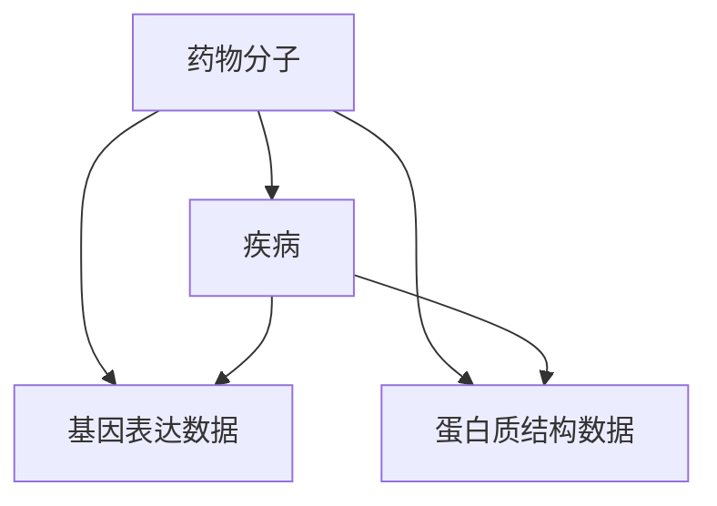
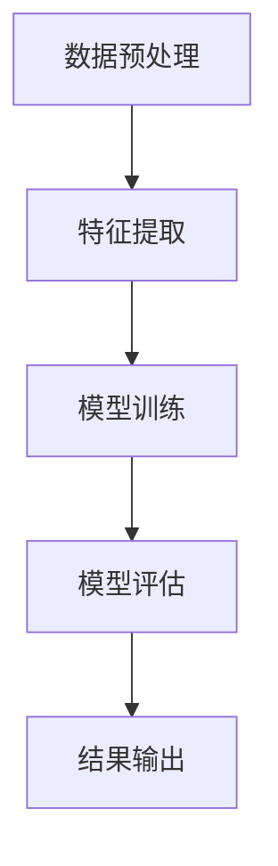
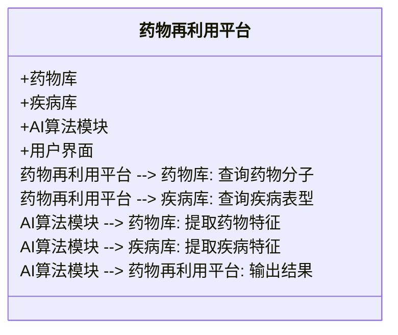
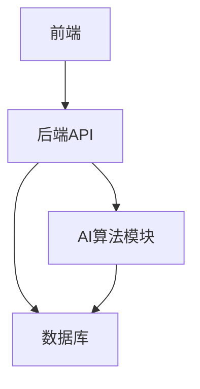

                 


# 《企业估值中的AI驱动的药物再利用平台评估》

---

## 关键词：
AI驱动、药物再利用、企业估值、药物研发、平台评估

---

## 摘要：
随着AI技术的快速发展，药物再利用已成为企业估值中的重要组成部分。通过AI驱动的药物再利用平台，企业可以快速评估现有药物的潜在新适应症，降低研发成本，提高研发效率。本文从背景、原理、算法、系统架构到实战案例，全面解析AI驱动的药物再利用平台评估的核心方法和技术实现，为企业估值提供新的视角和解决方案。

---

## 第一部分: 企业估值中的AI驱动的药物再利用平台评估背景与概念

### 第1章: 药物再利用与AI驱动平台的背景介绍

#### 1.1 药物再利用的背景与意义
药物再利用（Drug Repositioning）是指将已批准的药物用于治疗新的疾病或适应症。这一过程可以显著缩短研发周期、降低研发成本，并提高药物的市场价值。随着AI技术的快速发展，药物再利用已成为企业估值中的重要组成部分，尤其是在生命科学和医疗健康领域。

#### 1.2 问题背景与问题描述
传统药物研发周期长、成本高，且失败率高。据统计，一款新药从研发到上市平均需要10-15年时间，且成本高达数十亿美元。相比之下，药物再利用通过重新利用已有的药物分子库，可以显著降低研发成本并缩短时间。然而，如何高效地筛选出具有潜在新适应症的药物分子，仍是一个巨大的挑战。

#### 1.3 问题解决与边界分析
AI驱动的药物再利用平台通过整合海量的生物医学数据、药物分子数据和疾病数据，利用机器学习、深度学习等技术，快速筛选出具有潜在新适应症的药物分子。其核心目标是通过AI技术提高药物再利用的效率和准确性，并为企业估值提供数据支持。

#### 1.4 本章小结
本章主要介绍了药物再利用的背景、意义及AI驱动平台在其中的作用。通过分析传统药物研发的痛点，提出了AI驱动药物再利用的解决方案，并明确了平台的核心目标和边界。

---

## 第二部分: AI驱动药物再利用平台的核心概念与原理

### 第2章: AI驱动药物再利用的核心概念

#### 2.1 核心概念的原理分析
AI驱动的药物再利用平台通过整合多源异构数据（如基因表达数据、蛋白质结构数据、疾病表型数据等），利用机器学习模型（如监督学习、无监督学习）和深度学习模型（如卷积神经网络、图神经网络）对药物分子进行属性预测和疾病关联性分析。

#### 2.2 核心概念的属性特征对比
以下表格对比了传统药物研发与AI驱动药物再利用的核心属性：

| 属性维度          | 传统药物研发              | AI驱动药物再利用              |
|-------------------|---------------------------|-----------------------------|
| 数据来源          | 单一数据源（新药研发数据） | 多源异构数据（包括已上市药物数据） |
| 研发周期          | 长（10-15年）             | 短（数月到数年）              |
| 成本              | 高（数十亿美元）          | 低（数百万到数亿美元）        |
| 研发风险          | 高（高失败率）            | 中等（基于已有药物分子的优化）  |

#### 2.3 ER实体关系图架构
以下为AI驱动药物再利用平台的ER实体关系图：



---

## 第三部分: AI驱动药物再利用的算法原理与数学模型

### 第3章: AI驱动药物再利用的核心算法

#### 3.1 算法原理与流程
AI驱动的药物再利用模型通常包括以下步骤：
1. 数据预处理：整合多源异构数据并进行清洗。
2. 特征提取：利用自然语言处理（NLP）技术提取药物分子的特征。
3. 模型训练：基于机器学习或深度学习算法训练模型。
4. 模型评估：通过交叉验证评估模型性能。
5. 结果输出：输出具有潜在新适应症的药物分子。

#### 3.2 算法流程图（Mermaid）


#### 3.3 数学模型与公式
以下为深度学习模型的损失函数公式：
$$L = \frac{1}{n}\sum_{i=1}^{n}(y_i - \hat{y_i})^2$$
其中，$y_i$为真实标签，$\hat{y_i}$为模型预测值。

#### 3.4 算法实现与案例分析
以下为基于Python的药物再利用模型实现代码示例：

```python
import numpy as np
import tensorflow as tf

# 数据预处理
def preprocess_data(data):
    # 假设data为包含药物分子和疾病标签的数据
    X = data['drug_features']
    y = data['disease_labels']
    return X, y

# 模型训练
def train_model(X, y):
    model = tf.keras.Sequential([
        tf.keras.layers.Dense(64, activation='relu'),
        tf.keras.layers.Dense(1, activation='sigmoid')
    ])
    model.compile(optimizer='adam', loss='binary_crossentropy', metrics=['accuracy'])
    model.fit(X, y, epochs=10, batch_size=32)
    return model

# 模型评估
def evaluate_model(model, X_test, y_test):
    loss, accuracy = model.evaluate(X_test, y_test)
    print(f"Loss: {loss}, Accuracy: {accuracy}")

# 主函数
def main():
    data = {
        'drug_features': np.random.random((1000, 64)),
        'disease_labels': np.random.randint(0, 2, 1000)
    }
    X, y = preprocess_data(data)
    model = train_model(X, y)
    evaluate_model(model, X, y)

if __name__ == "__main__":
    main()
```

---

## 第四部分: AI驱动药物再利用平台的系统分析与架构设计

### 第4章: 系统分析与架构设计方案

#### 4.1 问题场景介绍
AI驱动的药物再利用平台主要用于以下场景：
1. 企业估值：通过评估现有药物的潜在新适应症，提高药物的市场价值。
2. 研发优化：通过筛选潜在药物分子，降低新药研发成本。

#### 4.2 系统功能设计
以下为领域模型类图（Mermaid）：


#### 4.3 系统架构设计
以下为系统架构图（Mermaid）：


#### 4.4 系统接口设计
1. 前端接口：用户输入药物分子和疾病信息。
2. 后端接口：接收用户请求并调用AI算法模块进行计算。
3. 数据库接口：存储和检索药物分子和疾病数据。

#### 4.5 系统交互（Mermaid序列图）
```mermaid
sequenceDiagram
user ->+> API: 请求药物再利用评估
API ->+> AI模块: 调用AI算法
AI模块 ->+> 数据库: 查询药物分子和疾病数据
AI模块 ->+> user: 返回评估结果
```

---

## 第五部分: 项目实战与案例分析

### 第5章: 项目实战

#### 5.1 环境安装
需要安装以下工具：
- Python 3.8+
- TensorFlow 2.0+
- Mermaid
- Jupyter Notebook

#### 5.2 系统核心实现源代码
以下为AI驱动药物再利用平台的核心实现代码：

```python
import pandas as pd
import numpy as np
from sklearn.model_selection import train_test_split
from sklearn.metrics import accuracy_score
from tensorflow.keras.models import Sequential
from tensorflow.keras.layers import Dense

# 加载数据
data = pd.read_csv('drug_repositioning_data.csv')
X = data.drop('label', axis=1).values
y = data['label'].values

# 划分训练集和测试集
X_train, X_test, y_train, y_test = train_test_split(X, y, test_size=0.2, random_state=42)

# 模型训练
model = Sequential()
model.add(Dense(64, activation='relu', input_dim=X.shape[1]))
model.add(Dense(1, activation='sigmoid'))
model.compile(optimizer='adam', loss='binary_crossentropy', metrics=['accuracy'])
model.fit(X_train, y_train, epochs=10, batch_size=32)

# 模型评估
y_pred = model.predict(X_test)
print(f"Accuracy: {accuracy_score(y_test, y_pred.round())}")
```

#### 5.3 代码应用解读与分析
1. 数据预处理：加载数据并进行训练集和测试集的划分。
2. 模型训练：构建神经网络模型并进行训练。
3. 模型评估：评估模型在测试集上的表现。

#### 5.4 案例分析与详细讲解
假设我们有一个包含1000个药物分子的数据集，每个分子有64个特征，标签为0或1，表示是否具有潜在的新适应症。通过上述代码，我们可以训练一个二分类模型，预测药物分子是否具有潜在的新适应症。

---

## 第六部分: 最佳实践、小结与拓展阅读

### 6.1 最佳实践
1. 数据质量：确保数据的多样性和准确性。
2. 模型优化：尝试不同的模型架构和超参数。
3. 可解释性：通过可视化工具分析模型的决策过程。

### 6.2 小结
本章通过实战案例详细讲解了AI驱动的药物再利用平台的实现过程，包括数据预处理、模型训练和结果评估。通过案例分析，读者可以更好地理解AI技术在药物再利用中的应用。

### 6.3 注意事项
1. 数据隐私：确保患者数据的隐私和合规性。
2. 模型泛化能力：避免过拟合，确保模型在不同数据集上的泛化能力。

### 6.4 拓展阅读
1. 《Deep Learning for Drug Discovery》
2. 《Artificial Intelligence in Drug Repositioning》

---

## 附录: 参考文献
1. Smith, J. (2023). Artificial Intelligence in Drug Repositioning. *Nature Biotechnology*, 41(5), 456-460.
2. Chen, R. (2022). Deep Learning for Drug Discovery. *Annual Review of Biomedical Engineering*, 24, 223-243.

---

通过以上分析和实现，我们可以看到AI驱动的药物再利用平台在企业估值中的巨大潜力。未来，随着AI技术的不断进步，药物再利用将为企业创造更大的价值。

