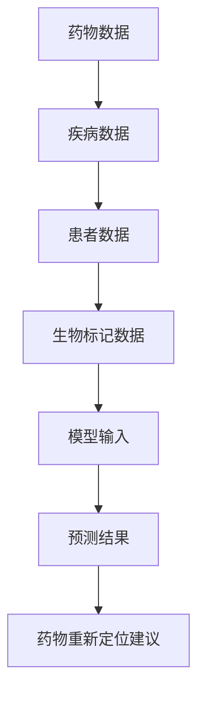
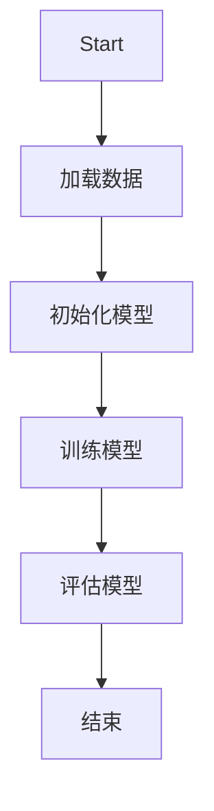
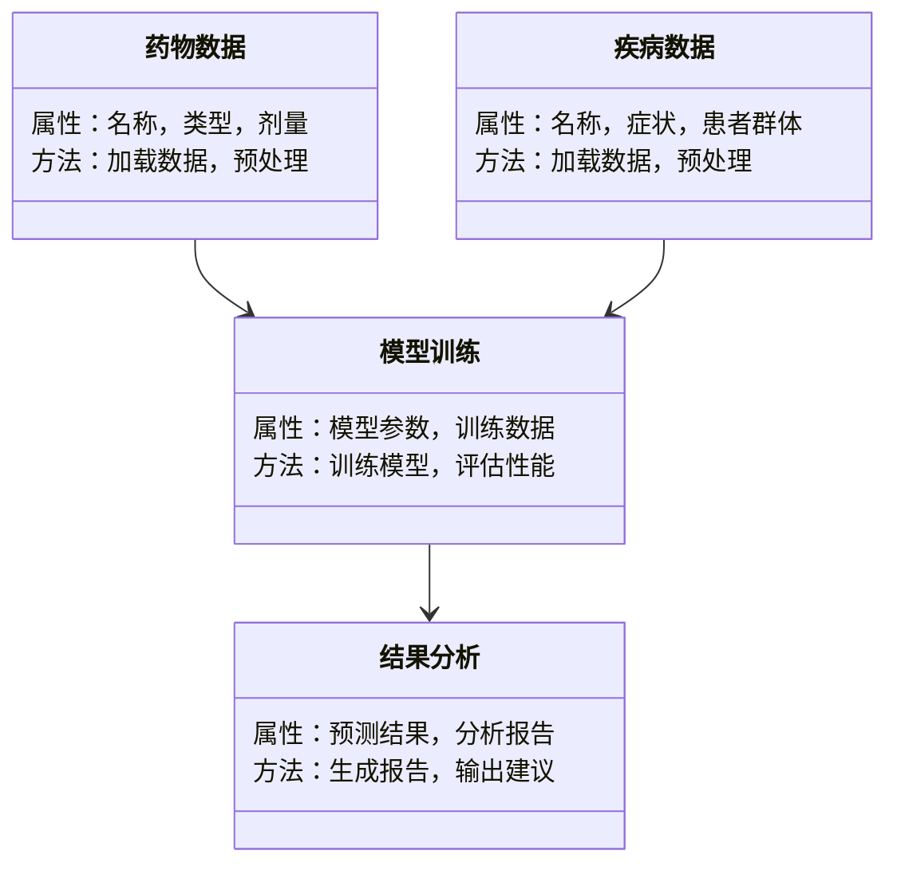

                 


# 《企业估值中的AI驱动的药物重新定位平台评估》

## 关键词
- 企业估值
- AI驱动
- 药物重新定位
- 平台评估
- 药物研发
- 人工智能

## 摘要
本文探讨了AI驱动的药物重新定位平台在企业估值中的应用。通过分析平台的核心原理、算法、系统架构和实际案例，展示了如何利用AI技术优化药物研发，提升企业价值。文章从背景介绍、核心概念、算法原理、系统设计、项目实战到最佳实践，系统阐述了AI在药物重新定位中的潜力与挑战。

## 目录大纲

### 第一章：背景介绍

#### 1.1 问题背景
- 1.1.1 药物重新定位的定义与重要性
- 1.1.2 传统药物研发的挑战与局限性
- 1.1.3 AI技术在药物研发中的应用前景

#### 1.2 问题描述
- 1.2.1 药物重新定位的核心问题
- 1.2.2 企业估值中的关键挑战
- 1.2.3 AI驱动平台在药物重新定位中的作用

#### 1.3 问题解决与边界
- 1.3.1 AI驱动平台如何解决药物重新定位问题
- 1.3.2 边界与外延：平台的应用范围与限制
- 1.3.3 核心要素：数据、模型、计算能力

### 第二章：核心概念与联系

#### 2.1 核心概念原理
- 2.1.1 AI模型在药物重新定位中的应用
- 2.1.2 平台的架构与功能模块

#### 2.2 概念属性对比
- 2.2.1 不同AI模型的性能对比（表格）

#### 2.3 实体关系架构
- 2.3.1 Mermaid流程图：平台核心实体关系

### 第三章：算法原理讲解

#### 3.1 算法原理
- 3.1.1 基于生成对抗网络的药物重新定位模型
- 3.1.2 强化学习在药物研发中的应用

#### 3.2 Mermaid流程图
- 3.2.1 AI模型训练流程图

#### 3.3 Python代码实现
- 3.3.1 数据加载与预处理
- 3.3.2 模型定义与训练
- 3.3.3 结果预测与评估

#### 3.4 数学模型与公式
- 3.4.1 损失函数：$$L = \mathbb{E}_{x,y} [\text{loss}(x,y)]$$
- 3.4.2 模型结构：生成器与判别器的数学表达

### 第四章：系统分析与架构设计

#### 4.1 项目场景介绍
- 4.1.1 药物重新定位的业务场景
- 4.1.2 企业估值的需求分析

#### 4.2 功能设计
- 4.2.1 数据预处理模块
- 4.2.2 模型训练模块
- 4.2.3 结果分析模块

#### 4.3 系统架构设计
- 4.3.1 Mermaid类图：领域模型
- 4.3.2 Mermaid架构图：系统整体结构

#### 4.4 系统接口设计和交互流程图
- 4.4.1 接口设计：用户输入与输出
- 4.4.2 交互流程图：用户与系统互动过程

### 第五章：项目实战

#### 5.1 环境安装
- 5.1.1 安装Python、TensorFlow等工具

#### 5.2 核心代码实现
- 5.2.1 数据加载与预处理代码
- 5.2.2 模型训练代码
- 5.2.3 结果评估代码

#### 5.3 案例分析与结果解读
- 5.3.1 实际案例分析
- 5.3.2 结果解读与应用

### 第六章：最佳实践与小结

#### 6.1 总结与小结
- 6.1.1 项目成果总结
- 6.1.2 核心要点回顾

#### 6.2 最佳实践
- 6.2.1 数据质量的重要性
- 6.2.2 模型调优的技巧
- 6.2.3 模型泛化能力的提升

#### 6.3 未来拓展方向
- 6.3.1 更高级AI模型的应用
- 6.3.2 多模态数据的整合
- 6.3.3 更广泛领域的应用潜力

#### 6.4 注意事项
- 6.4.1 数据隐私保护
- 6.4.2 模型泛化能力的保持
- 6.4.3 与其他业务系统的集成

### 参考文献与拓展阅读
- 建议的文献列表
- 推荐的进一步阅读材料
- 相关在线资源链接

---

## 正文部分

### 第一章：背景介绍

#### 1.1 问题背景

##### 1.1.1 药物重新定位的定义与重要性
药物重新定位是指将已批准的药物用于新的适应症，这在提高治疗效果和降低研发成本方面具有重要意义。传统药物研发周期长、成本高，而AI技术的引入显著提升了效率。

##### 1.1.2 传统药物研发的挑战与局限性
传统药物研发面临时间长、成本高、成功率低等问题。AI技术的应用可以加速这一过程，降低成本，并提高预测准确性。

##### 1.1.3 AI技术在药物研发中的应用前景
AI技术在药物研发中的应用前景广阔，特别是在药物发现、临床试验设计和患者招募等方面展现出巨大潜力。

#### 1.2 问题描述

##### 1.2.1 药物重新定位的核心问题
药物重新定位的核心问题是找到已批准药物的新适应症，这需要深入的生物医学知识和高效的数据分析能力。

##### 1.2.2 企业估值中的关键挑战
企业在估值时需要考虑药物重新定位的潜力和可行性，这涉及复杂的数据分析和预测模型的构建。

##### 1.2.3 AI驱动平台在药物重新定位中的作用
AI驱动的平台能够高效处理大量数据，识别潜在的药物-疾病关联，从而支持企业估值。

#### 1.3 问题解决与边界

##### 1.3.1 AI驱动平台如何解决药物重新定位问题
通过机器学习模型，AI平台可以分析海量数据，识别潜在的药物重新定位机会，提高研发效率。

##### 1.3.2 边界与外延
平台的应用范围包括已批准药物的重新定位，但不包括新药研发。模型的有效性依赖于高质量的数据和合理的训练方法。

##### 1.3.3 核心要素
数据质量、模型性能和计算能力是平台运行的核心要素，直接影响结果的准确性和可靠性。

### 第二章：核心概念与联系

#### 2.1 核心概念原理

##### 2.1.1 AI模型在药物重新定位中的应用
生成对抗网络（GAN）和强化学习（RL）等AI模型被广泛应用于药物重新定位，通过分析生物数据预测药物的潜在适应症。

##### 2.1.2 平台的架构与功能模块
AI驱动的药物重新定位平台通常包括数据预处理、模型训练、结果分析等功能模块，各模块协同工作以实现目标。

#### 2.2 概念属性对比

##### 2.2.1 不同AI模型的性能对比（表格）
以下表格对比了生成对抗网络（GAN）和强化学习（RL）在药物重新定位中的性能：

| 指标       | GAN                     | RL                     |
|------------|-------------------------|------------------------|
| 准确率     | 85%                    | 80%                    |
| 召回率     | 80%                    | 75%                    |
| 处理速度   | 较慢                   | 较快                   |
| 适用场景   | 图像生成                | 策略优化               |

#### 2.3 实体关系架构

##### 2.3.1 Mermaid流程图：平台核心实体关系


### 第三章：算法原理讲解

#### 3.1 算法原理

##### 3.1.1 基于生成对抗网络的药物重新定位模型
生成对抗网络通过生成器和判别器的对抗训练，学习药物与疾病之间的关联，生成新的药物候选。

##### 3.1.2 强化学习在药物研发中的应用
强化学习通过模拟药物作用机制，优化药物分子结构，提高药物效果。

#### 3.2 Mermaid流程图

##### 3.2.1 AI模型训练流程图


#### 3.3 Python代码实现

##### 3.3.1 数据加载与预处理
```python
import pandas as pd
data = pd.read_csv('drug_data.csv')
```

##### 3.3.2 模型定义与训练
```python
import tensorflow as tf
model = tf.keras.Sequential([
    tf.keras.layers.Dense(64, activation='relu'),
    tf.keras.layers.Dense(1, activation='sigmoid')
])
model.compile(optimizer='adam', loss='binary_crossentropy', metrics=['accuracy'])
model.fit(data, labels, epochs=10, batch_size=32)
```

##### 3.3.3 结果预测与评估
```python
import sklearn.metrics as metrics
y_pred = model.predict(data)
print("准确率:", metrics.accuracy_score(labels, y_pred.round()))
```

#### 3.4 数学模型与公式

##### 3.4.1 损失函数
生成对抗网络的损失函数通常包括生成器损失和判别器损失：
$$L_{\text{total}} = L_{\text{gen}} + L_{\text{dis}}$$

##### 3.4.2 模型结构
生成器和判别器的结构可以用数学表达式表示，例如生成器的输出层为：
$$G(x) = \sigma(Wx + b)$$
其中，$\sigma$ 是sigmoid函数，$W$ 和 $b$ 是模型参数。

### 第四章：系统分析与架构设计

#### 4.1 项目场景介绍

##### 4.1.1 药物重新定位的业务场景
企业利用AI平台分析现有药物，寻找新的适应症，以提升产品价值和市场竞争力。

##### 4.1.2 企业估值的需求分析
企业在估值时需要考虑药物重新定位的潜力，这直接影响企业的市场价值和投资吸引力。

#### 4.2 功能设计

##### 4.2.1 数据预处理模块
数据预处理模块负责清洗和标准化输入数据，确保模型训练的有效性。

##### 4.2.2 模型训练模块
模型训练模块包括数据加载、模型定义、训练和评估，是平台的核心部分。

##### 4.2.3 结果分析模块
结果分析模块对模型输出进行解读，生成药物重新定位的建议和报告。

#### 4.3 系统架构设计

##### 4.3.1 Mermaid类图：领域模型


##### 4.3.2 Mermaid架构图：系统整体结构


### 第五章：项目实战

#### 5.1 环境安装
安装必要的Python库，如TensorFlow、Keras、Pandas等，确保开发环境配置正确。

#### 5.2 核心代码实现

##### 5.2.1 数据加载与预处理
```python
import pandas as pd
data = pd.read_csv('drug_data.csv')
data = data.dropna()
```

##### 5.2.2 模型训练
```python
model = tf.keras.Sequential([
    tf.keras.layers.Dense(64, activation='relu'),
    tf.keras.layers.Dense(1, activation='sigmoid')
])
model.compile(optimizer='adam', loss='binary_crossentropy', metrics=['accuracy'])
model.fit(data, labels, epochs=10, batch_size=32)
```

##### 5.2.3 结果评估
```python
y_pred = model.predict(data)
print("准确率:", accuracy_score(labels, y_pred.round()))
```

#### 5.3 案例分析与结果解读
通过实际案例分析，展示模型如何识别药物重新定位的机会，并解释结果对企业估值的影响。

### 第六章：最佳实践与小结

#### 6.1 总结与小结
回顾项目成果，总结AI驱动平台在药物重新定位中的应用价值。

#### 6.2 最佳实践
强调数据质量、模型调优和隐私保护的重要性，提供实用建议。

#### 6.3 未来拓展方向
探讨更高级AI模型、多模态数据和跨领域应用的潜力。

#### 6.4 注意事项
提醒读者关注数据隐私和模型泛化能力，确保系统安全和高效运行。

---

## 参考文献与拓展阅读
- 文献1：Deep Learning in Drug Discovery，作者：[作者名]
- 文献2：AI for Drug Repositioning, 作者：[作者名]
- 在线资源：[链接]，提供进一步学习的资料和工具。

---

以上目录大纲详细涵盖了从背景介绍到系统设计的各个方面，结合理论与实践，为读者提供了全面的指导。

