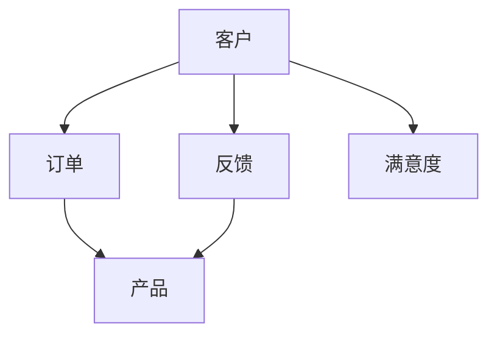
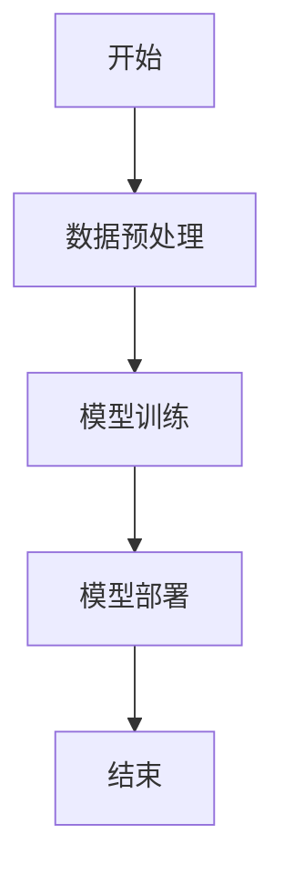
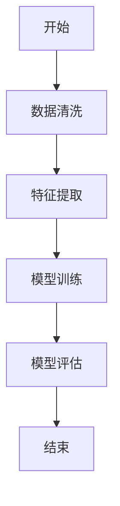
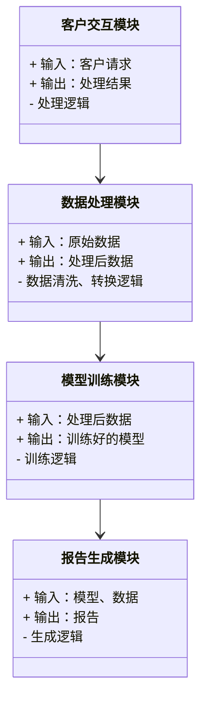
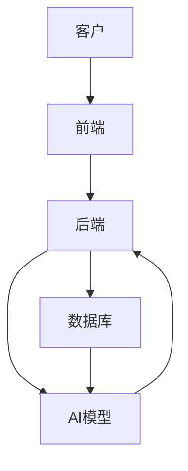
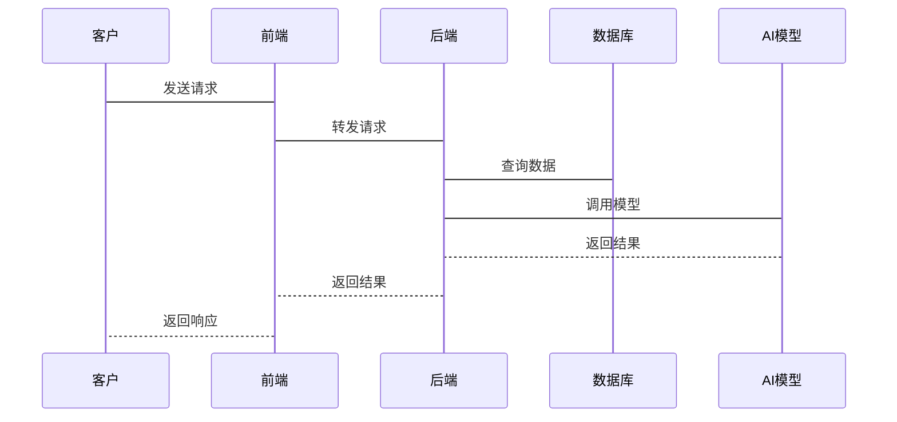

                 


# 企业估值中的AI驱动的虚拟客服系统评估

> 关键词：AI驱动、虚拟客服系统、企业估值、自然语言处理、机器学习、系统架构、项目实战

> 摘要：本文深入探讨了AI驱动的虚拟客服系统在企业估值中的应用，分析了其核心概念、算法原理、系统架构，并通过具体案例展示了如何通过虚拟客服系统优化企业估值。文章结合理论与实践，为读者提供了从理论到实践的全面指导。

---

## 第一部分: 企业估值中的AI驱动虚拟客服系统评估背景介绍

---

### 第1章: 企业估值与虚拟客服系统概述

#### 1.1 问题背景

##### 1.1.1 企业估值的传统方法与挑战
传统的企业估值方法依赖于财务数据和人工分析，存在以下挑战：
- 数据范围有限：仅依赖财务数据，忽略了客户反馈、市场趋势等非结构化数据。
- 分析效率低：人工分析耗时长，难以实时更新。
- 信息不对称：投资者和企业之间的信息传递不畅，影响估值准确性。

##### 1.1.2 虚拟客服系统的定义与作用
虚拟客服系统是一种通过AI技术模拟真人客服的自动化系统，其作用包括：
- 提供24/7的客户支持。
- 收集和分析客户反馈。
- 协助企业优化客户服务流程。

##### 1.1.3 AI驱动虚拟客服系统的概念与优势
AI驱动的虚拟客服系统通过自然语言处理和机器学习技术，能够理解客户意图、提供个性化服务，并实时分析客户数据，显著提升企业估值的准确性。

#### 1.2 问题描述

##### 1.2.1 传统客服系统的局限性
传统客服系统存在以下问题：
- 人工成本高：需要大量客服人员，增加了企业运营成本。
- 响应时间长：无法满足客户的即时需求。
- 服务质量不稳定：受人工因素影响，服务质量参差不齐。

##### 1.2.2 企业估值中的信息不对称问题
信息不对称导致投资者难以准确评估企业价值，影响市场资源配置效率。虚拟客服系统通过收集和分析客户数据，能够有效减少信息不对称。

##### 1.2.3 虚拟客服系统在企业估值中的应用场景
虚拟客服系统可以通过以下方式影响企业估值：
- 提供客户反馈数据，帮助企业优化产品和服务。
- 分析客户行为，预测市场需求和企业未来的盈利能力。
- 通过高效的客户支持提升客户满意度，增强品牌价值。

#### 1.3 问题解决

##### 1.3.1 AI驱动虚拟客服系统的核心功能
AI驱动的虚拟客服系统具备以下核心功能：
- 自然语言处理：理解客户的语言需求。
- 智能路由：将客户需求分配到合适的处理流程。
- 实时分析：分析客户数据并生成报告。

##### 1.3.2 通过虚拟客服系统优化企业估值的方法
通过虚拟客服系统，企业可以实时收集和分析客户数据，优化客户服务流程，提升客户满意度，从而提高企业估值。

##### 1.3.3 AI技术在客服系统评估中的具体应用
AI技术在客服系统评估中的具体应用包括：
- 使用自然语言处理分析客户反馈。
- 利用机器学习预测客户流失风险。
- 通过深度学习优化客服响应策略。

#### 1.4 边界与外延

##### 1.4.1 系统的边界与功能范围
系统的边界包括：
- 客户端：用户与虚拟客服的交互界面。
- 后台系统：数据存储、分析和处理模块。
- 管理界面：管理员对系统进行配置和监控的界面。

##### 1.4.2 系统的外延与扩展可能性
系统的外延包括：
- 与企业其他系统的集成，如CRM、ERP等。
- 支持多语言和多渠道（如电话、邮件、社交媒体）的客户交互。
- 集成第三方数据分析工具，提升数据处理能力。

##### 1.4.3 与其他企业估值方法的结合
虚拟客服系统可以与传统的财务分析、市场分析等方法结合，提供更全面的企业估值方法。

#### 1.5 概念结构与核心要素组成

##### 1.5.1 系统的整体架构
系统的整体架构包括：
- 前端：用户与虚拟客服的交互界面。
- 后端：数据存储、分析和处理模块。
- 接口：与其他系统的集成接口。

##### 1.5.2 核心要素的定义与关系
核心要素包括：
- 数据源：客户反馈、交易数据、市场数据等。
- AI模型：自然语言处理模型、机器学习模型等。
- 分析模块：数据清洗、特征提取、预测模型等。
- 输出结果：客户满意度、预测估值等。

##### 1.5.3 系统的输入、输出与中间过程
输入：客户文本、语音请求、系统日志等。
输出：客户满意度报告、预测估值报告等。
中间过程：数据预处理、模型训练、结果生成。

---

### 第2章: AI驱动虚拟客服系统的核心概念与联系

#### 2.1 核心概念原理

##### 2.1.1 AI驱动虚拟客服系统的模型结构
AI驱动虚拟客服系统的模型结构包括：
- 数据预处理：清洗、转换数据。
- 模型训练：训练NLP模型和机器学习模型。
- 模型部署：将模型部署到生产环境。

##### 2.1.2 自然语言处理（NLP）在虚拟客服中的应用
NLP在虚拟客服中的应用包括：
- 分词：将客户文本分解为词语。
- 词性标注：标注词语的词性。
- 情感分析：分析客户情感倾向。
- 文本分类：将客户文本归类到不同的类别。

##### 2.1.3 机器学习在系统评估中的作用
机器学习在系统评估中的作用包括：
- 预测客户流失风险。
- 分类客户类型。
- 预测客户满意度。

#### 2.2 核心概念属性对比

##### 2.2.1 不同AI模型的性能对比
以下是一个简单的性能对比表：

| 模型类型       | 准确率 | 响应时间 | 资源需求 |
|----------------|--------|-----------|-----------|
| 基础NLP模型    | 70%    | 1秒       | 低         |
| 预训练模型（如BERT） | 85% | 2秒       | 中         |
| 微调模型        | 90%    | 3秒       | 高         |

##### 2.2.2 系统功能模块的属性分析
以下是系统功能模块的属性分析表：

| 功能模块       | 输入   | 输出   | 功能描述                     |
|----------------|--------|---------|------------------------------|
| 分词模块       | 文本    | 分词结果 | 将客户文本分解为词语         |
| 情感分析模块   | 文本    | 情感倾向 | 分析客户对产品或服务的情感倾向 |
| 预测模型模块   | 数据    | 预测结果 | 预测客户流失风险或满意度     |

##### 2.2.3 数据来源与处理方式的对比
以下是数据来源与处理方式的对比表：

| 数据来源       | 数据类型 | 处理方式       |
|----------------|----------|----------------|
| 客户反馈       | 文本     | 分词、情感分析  |
| 交易数据       | 结构化   | 数据清洗、特征提取 |
| 市场数据       | 统计     | 数据整合、预测分析 |

#### 2.3 ER实体关系图架构

##### 2.3.1 实体关系图
以下是实体关系图的Mermaid图：



---

### 第3章: 算法原理讲解

#### 3.1 算法原理介绍

##### 3.1.1 自然语言处理模型的算法流程
以下是自然语言处理模型的算法流程的Mermaid图：



##### 3.1.2 机器学习算法的实现步骤
以下是机器学习算法的实现步骤的Mermaid图：



##### 3.1.3 算法实现的核心代码
以下是一个简单的机器学习算法实现示例：

```python
from sklearn import datasets
from sklearn.tree import DecisionTreeClassifier
from sklearn.model_selection import train_test_split
from sklearn.metrics import accuracy_score

# 加载数据集
iris = datasets.load_iris()
X = iris.data
y = iris.target

# 划分训练集和测试集
X_train, X_test, y_train, y_test = train_test_split(X, y, test_size=0.3)

# 训练决策树模型
model = DecisionTreeClassifier()
model.fit(X_train, y_train)

# 预测
y_pred = model.predict(X_test)

# 计算准确率
accuracy = accuracy_score(y_test, y_pred)
print(f"准确率: {accuracy}")
```

##### 3.1.4 算法的数学模型与公式
以下是决策树算法的核心数学公式：

$$ Gini指数 = \sum_{i=1}^{n} p_i(1 - p_i) $$

其中，$p_i$ 是第$i$个类别的概率。

---

### 第4章: 系统分析与架构设计方案

#### 4.1 问题场景介绍

##### 4.1.1 系统的目标与范围
系统的目标是通过AI驱动的虚拟客服系统优化企业估值，提升客户满意度，降低运营成本。

##### 4.1.2 系统的约束条件与假设
系统的约束条件包括：
- 数据隐私和安全。
- 系统的可扩展性。
- 系统的实时性要求。

##### 4.1.3 系统的输入与输出
系统的输入包括：
- 客户请求：文本、语音等。
- 系统日志：操作记录。
- 市场数据：行业趋势、竞争对手信息。

系统的输出包括：
- 客户满意度报告。
- 企业估值预测报告。

#### 4.2 系统功能设计

##### 4.2.1 系统功能模块
系统功能模块包括：
- 客户交互模块：处理客户请求。
- 数据处理模块：清洗和转换数据。
- 模型训练模块：训练AI模型。
- 报告生成模块：生成客户满意度和企业估值报告。

##### 4.2.2 系统功能实现的Mermaid类图
以下是系统功能实现的Mermaid类图：



#### 4.3 系统架构设计

##### 4.3.1 系统架构的Mermaid架构图
以下是系统架构的Mermaid架构图：



#### 4.4 系统接口设计

##### 4.4.1 系统接口的定义与实现
系统的接口包括：
- 前端接口：处理客户请求。
- 后端接口：处理数据和模型训练。
- 数据库接口：存储和检索数据。

##### 4.4.2 系统接口的交互设计
以下是系统接口交互的Mermaid序列图：



---

### 第5章: 项目实战

#### 5.1 环境安装与配置

##### 5.1.1 系统运行环境
- 操作系统：Linux/Windows/MacOS
- Python版本：3.6+
- 需要安装的库：scikit-learn、NLTK、transformers、pymysql

##### 5.1.2 项目安装步骤
1. 安装Python和必要的库：
   ```bash
   pip install scikit-learn nltk transformers pymysql
   ```
2. 下载预训练的BERT模型：
   ```bash
   pip install -q -r requirements.txt
   ```

#### 5.2 核心代码实现

##### 5.2.1 数据预处理代码
```python
import pandas as pd
from sklearn.model_selection import train_test_split
from sklearn.feature_extraction.text import TfidfVectorizer
from sklearn.naive_bayes import MultinomialNB

# 加载数据集
data = pd.read_csv('customer_feedback.csv')
X = data['text']
y = data['label']

# 划分训练集和测试集
X_train, X_test, y_train, y_test = train_test_split(X, y, test_size=0.3)

# 特征提取
vectorizer = TfidfVectorizer()
X_train_vec = vectorizer.fit_transform(X_train)
X_test_vec = vectorizer.transform(X_test)

# 训练模型
model = MultinomialNB()
model.fit(X_train_vec, y_train)

# 预测
y_pred = model.predict(X_test_vec)
print(f"准确率: {accuracy_score(y_test, y_pred)}")
```

##### 5.2.2 情感分析代码
```python
from transformers import pipeline

# 加载预训练的情感分析模型
sentiment_pipeline = pipeline("sentiment-analysis")

# 分析文本
result = sentiment_pipeline("客户对我们的服务非常满意")
print(result)
```

##### 5.2.3 客户满意度预测代码
```python
import numpy as np
from sklearn.ensemble import RandomForestClassifier

# 加载数据集
data = pd.read_csv('customer_feedback.csv')
X = data[['text', 'age', 'gender']]
y = data['satisfaction']

# 特征工程
from sklearn.preprocessing import OneHotEncoder
from sklearn.compose import ColumnTransformer

transformer = ColumnTransformer([
    ('text', TfidfVectorizer(), ['text']),
    ('categorical', OneHotEncoder(), ['age', 'gender'])
])

X_train, X_test, y_train, y_test = train_test_split(X, y, test_size=0.3)

X_train_trans = transformer.fit_transform(X_train)
X_test_trans = transformer.transform(X_test)

# 训练模型
model = RandomForestClassifier()
model.fit(X_train_trans, y_train)

# 预测
y_pred = model.predict(X_test_trans)
print(f"准确率: {accuracy_score(y_test, y_pred)}")
```

##### 5.2.4 系统交互代码
```python
from flask import Flask, request, jsonify
import pymysql

app = Flask(__name__)

# 数据库连接
conn = pymysql.connect(host='localhost', user='root', password='password', db='customer_data')

@app.route('/api/feedback', methods=['POST'])
def feedback():
    data = request.json
    cursor = conn.cursor()
    cursor.execute("INSERT INTO feedback (text, satisfaction) VALUES (%s, %s)", 
                   (data['text'], data['satisfaction']))
    conn.commit()
    return jsonify({'status': 'success'})

if __name__ == '__main__':
    app.run(debug=True)
```

#### 5.3 实际案例分析与实现

##### 5.3.1 案例分析
假设我们有一个客户反馈数据集，包含客户的文本反馈和满意度评分。我们可以通过虚拟客服系统分析客户反馈，预测客户满意度，并优化客户服务流程。

##### 5.3.2 代码实现与分析
以下是完整的代码实现：

```python
import pandas as pd
from sklearn.model_selection import train_test_split
from sklearn.feature_extraction.text import TfidfVectorizer
from sklearn.naive_bayes import MultinomialNB
from transformers import pipeline
from flask import Flask, request, jsonify
import pymysql

# 情感分析模型
sentiment_pipeline = pipeline("sentiment-analysis")

# 数据预处理与建模
data = pd.read_csv('customer_feedback.csv')
X = data['text']
y = data['label']

X_train, X_test, y_train, y_test = train_test_split(X, y, test_size=0.3)

vectorizer = TfidfVectorizer()
X_train_vec = vectorizer.fit_transform(X_train)
X_test_vec = vectorizer.transform(X_test)

model = MultinomialNB()
model.fit(X_train_vec, y_train)

y_pred = model.predict(X_test_vec)
print(f"准确率: {accuracy_score(y_test, y_pred)}")

# 系统交互接口
app = Flask(__name__)
conn = pymysql.connect(host='localhost', user='root', password='password', db='customer_data')

@app.route('/api/feedback', methods=['POST'])
def feedback():
    data = request.json
    cursor = conn.cursor()
    cursor.execute("INSERT INTO feedback (text, satisfaction) VALUES (%s, %s)", 
                   (data['text'], data['satisfaction']))
    conn.commit()
    return jsonify({'status': 'success'})

if __name__ == '__main__':
    app.run(debug=True)
```

##### 5.3.3 实际应用效果与问题总结
通过上述代码，我们可以实现客户反馈的情感分析、满意度预测，并构建一个简单的虚拟客服系统接口。实际应用中，还需要考虑以下问题：
- 数据隐私和安全。
- 系统的可扩展性和稳定性。
- 模型的实时更新和优化。

---

### 第6章: 最佳实践、小结、注意事项与拓展阅读

#### 6.1 最佳实践

##### 6.1.1 系统设计与实现建议
- 确保系统的可扩展性和可维护性。
- 定期更新AI模型，提升预测准确性。
- 重视数据隐私和安全。

##### 6.1.2 系统优化建议
- 使用更先进的AI模型（如BERT、GPT）。
- 引入实时数据分析功能。
- 优化系统交互流程，提升用户体验。

#### 6.2 小结
本文详细介绍了AI驱动的虚拟客服系统在企业估值中的应用，从背景介绍、核心概念、算法原理到系统架构和项目实战，为读者提供了全面的指导。

#### 6.3 注意事项

##### 6.3.1 开发过程中需要注意的问题
- 数据隐私和安全。
- 系统的稳定性和可用性。
- 模型的准确性和实时性。

##### 6.3.2 实际应用中的注意事项
- 确保系统的可扩展性和可维护性。
- 定期更新AI模型，提升预测准确性。
- 重视用户隐私和数据安全。

#### 6.4 拓展阅读
以下是一些推荐阅读资料：
- 《深入浅出机器学习》。
- 《自然语言处理实战》。
- 《企业估值与数据分析》。

---

以上就是《企业估值中的AI驱动的虚拟客服系统评估》的完整目录和内容框架，涵盖了从理论到实践的各个方面，旨在为读者提供一个全面的指导。

