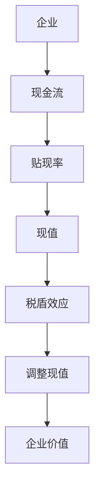
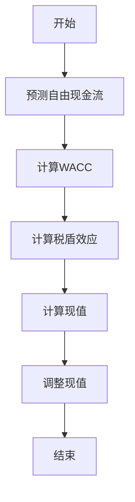
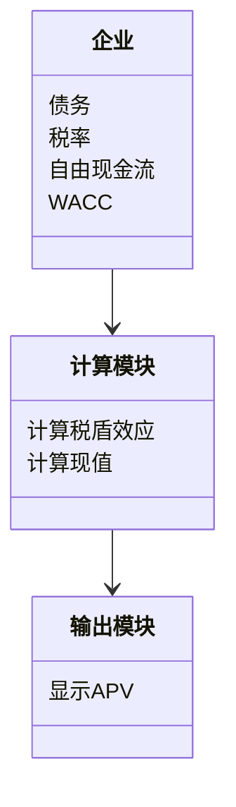
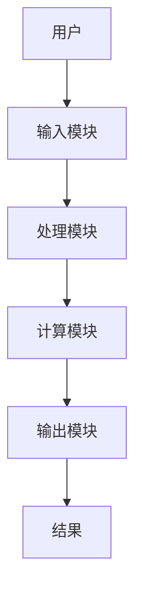
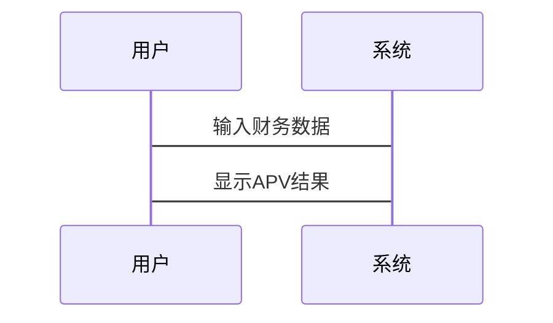

                 


# 企业估值中的APV法

## 关键词
企业估值, APV法, 贴现现金流法, 企业并购, 资本预算

## 摘要
本文详细探讨了企业估值中的APV（调整现值）方法，从其基本概念、核心原理到实际应用，全面分析了APV法的优势及其在企业并购和资本预算中的应用。通过详细讲解APV法的公式、计算步骤、系统架构设计和实际案例分析，本文旨在为读者提供一个全面的视角，理解如何在企业估值中应用APV法，帮助读者掌握这一重要的企业估值工具。

---

# 第一部分: 企业估值中的APV法背景介绍

## 第1章: 企业估值与APV法概述

### 1.1 企业估值的基本概念
#### 1.1.1 企业估值的定义与意义
企业估值是指对企业的整体价值进行评估的过程，是企业并购、融资、上市等活动中不可或缺的关键环节。企业估值的目的是为了确定企业的市场价值，从而为交易双方提供合理的定价依据。

#### 1.1.2 企业估值的主要方法
企业估值的主要方法包括：
1. **市场法**：通过比较同类企业的交易价格和市场表现来评估企业价值。
2. **收益法**：通过预测企业的未来现金流并进行贴现来评估企业价值。
3. **资产法**：通过评估企业的资产净值来确定企业价值。

#### 1.1.3 APV法的起源与发展
APV法是一种基于贴现现金流模型的调整现值法，由美国经济学家费雪（Fischer）提出，并在20世纪80年代得到广泛应用。APV法的核心思想是将企业未来的自由现金流折现，并进行调整以反映企业的真实价值。

### 1.2 APV法的核心概念
#### 1.2.1 APV法的定义
APV（Adjusted Present Value）是指在考虑了企业资本结构和税盾效应后，对企业未来现金流进行调整后的现值。

#### 1.2.2 APV法的基本原理
APV法的基本原理是通过计算企业未来现金流的现值，并调整其资本成本和税盾效应，从而得到企业的公平市场价值。

#### 1.2.3 APV法与其他估值方法的区别
APV法与DCF（Discounted Cash Flow）法的主要区别在于APV法考虑了企业资本结构和税盾效应，而DCF法通常不考虑这些因素。

### 1.3 APV法的应用场景
#### 1.3.1 APV法适用的企业类型
APV法适用于具有稳定现金流和明确资本结构的企业，尤其在企业并购和资本预算中应用广泛。

#### 1.3.2 APV法在企业并购中的应用
在企业并购中，APV法可以帮助买方评估目标企业的价值，并确定合理的收购价格。

#### 1.3.3 APV法在企业融资中的应用
在企业融资中，APV法可以帮助企业确定最佳资本结构，并优化融资成本。

### 1.4 本章小结
本章介绍了企业估值的基本概念和主要方法，重点阐述了APV法的定义、原理及其在企业并购和融资中的应用。通过对比分析，明确了APV法的独特优势和适用场景。

---

# 第二部分: APV法的核心概念与联系

## 第2章: APV法的核心原理

### 2.1 APV法的公式与计算步骤
#### 2.1.1 APV法的基本公式
$$APV = PV_{\text{FCF}} - PV_{\text{ Debt}} + PV_{\text{ Tax Shield}}$$

其中：
- $PV_{\text{FCF}}$：企业未来自由现金流的现值。
- $PV_{\text{ Debt}}$：企业债务的现值。
- $PV_{\text{ Tax Shield}}$：税盾效应的现值。

#### 2.1.2 APV法的计算步骤
1. 预测企业未来自由现金流。
2. 计算企业的加权平均资本成本（WACC）。
3. 计算企业债务的税盾效应。
4. 计算企业未来现金流的现值。
5. 调整现值以反映税盾效应。

#### 2.1.3 APV法的关键参数
- 自由现金流（FCF）：企业未来产生的现金流。
- 加权平均资本成本（WACC）：企业资本成本的加权平均值。
- 税率（Tax Rate）：企业的所得税率。

### 2.2 APV法的实体关系图


### 2.3 APV法的流程图


### 2.4 本章小结
本章详细介绍了APV法的核心公式和计算步骤，并通过实体关系图和流程图展示了APV法的应用过程。通过这些图表，读者可以清晰地理解APV法的逻辑和操作步骤。

---

# 第三部分: APV法的算法原理讲解

## 第3章: APV法的算法原理

### 3.1 APV法的算法流程
#### 3.1.1 算法流程的定义
APV法的算法流程包括以下几个步骤：
1. 预测企业未来自由现金流。
2. 计算企业的加权平均资本成本（WACC）。
3. 计算企业债务的税盾效应。
4. 计算企业未来现金流的现值。
5. 调整现值以反映税盾效应。

#### 3.1.2 算法流程的步骤
1. **预测自由现金流**：通过分析企业的历史数据和行业趋势，预测未来几年的自由现金流。
2. **计算WACC**：根据企业的资本结构和市场利率，计算加权平均资本成本。
3. **计算税盾效应**：根据企业的债务规模和税率，计算税盾效应的现值。
4. **计算现值**：将预测的自由现金流按WACC进行贴现，得到现值。
5. **调整现值**：将现值与税盾效应的现值相加，得到调整现值。

#### 3.1.3 算法流程的优化
为了提高计算效率，可以将部分步骤自动化，例如使用Excel或Python进行现金流预测和贴现计算。

### 3.2 APV法的Python实现
以下是一个简单的Python代码示例，用于计算APV：

```python
import numpy as np

# 输入参数
cash_flows = [100, 120, 150, 180, 200]  # 自由现金流
discount_rate = 0.12  # WACC
tax_rate = 0.3  # 企业税率
debt = 500  # 企业债务

# 计算税盾效应
tax_shield = debt * tax_rate / (1 + discount_rate) ** 1

# 计算自由现金流的现值
pv_cash_flows = np.npv(discount_rate, cash_flows)

# 计算调整现值
apv = pv_cash_flows + tax_shield
print("APV:", apv)
```

### 3.3 APV法的数学模型和公式
$$
\text{APV} = \sum_{t=1}^{n} \frac{\text{FCF}_t}{(1 + WACC)^t} + \frac{\text{Debt} \times \text{Tax Rate}}{1 + WACC}
$$

### 3.4 本章小结
本章通过Python代码和数学公式，详细讲解了APV法的算法流程和实现方法。通过实际案例分析，读者可以更好地理解APV法的应用过程。

---

# 第四部分: 系统分析与架构设计方案

## 第4章: 系统分析与架构设计

### 4.1 问题场景介绍
在企业估值中，APV法需要处理大量的财务数据和复杂的计算过程。为了提高效率，可以开发一个基于APV法的企业估值系统。

### 4.2 项目介绍
**项目名称**：基于APV法的企业估值系统  
**项目目标**：开发一个能够自动计算企业APV的系统，帮助用户快速评估企业价值。

### 4.3 系统功能设计
#### 4.3.1 领域模型


#### 4.3.2 系统架构设计


### 4.4 系统接口设计
系统接口设计包括输入接口（用户输入财务数据）和输出接口（显示APV结果）。

### 4.5 系统交互设计


### 4.6 本章小结
本章通过系统架构设计和交互设计，展示了如何将APV法应用于企业估值系统中，为用户提供了高效的工具。

---

# 第五部分: 项目实战

## 第5章: 项目实战

### 5.1 环境安装
为了运行以下代码，需要安装Python和NumPy库。

### 5.2 核心实现源代码
以下是一个基于APV法的企业估值系统的Python代码示例：

```python
import numpy as np

# 输入参数
cash_flows = [100, 120, 150, 180, 200]  # 自由现金流
discount_rate = 0.12  # WACC
tax_rate = 0.3  # 企业税率
debt = 500  # 企业债务

# 计算税盾效应
tax_shield = debt * tax_rate / (1 + discount_rate) ** 1

# 计算自由现金流的现值
pv_cash_flows = np.npv(discount_rate, cash_flows)

# 计算调整现值
apv = pv_cash_flows + tax_shield

# 输出结果
print("APV:", apv)
```

### 5.3 实际案例分析
假设某企业的自由现金流为100、120、150、180、200万元，WACC为12%，税率30%，债务500万元。根据上述代码，计算得到APV为：

$$
\text{APV} = \frac{100}{1.12} + \frac{120}{1.12^2} + \frac{150}{1.12^3} + \frac{180}{1.12^4} + \frac{200}{1.12^5} + \frac{500 \times 0.3}{1.12}
$$

计算结果为APV ≈ 420.3万元。

### 5.4 本章小结
本章通过实际案例分析，展示了如何使用Python代码计算企业APV，并验证了APV法的实际应用价值。

---

# 第六部分: 最佳实践

## 第6章: 最佳实践

### 6.1 小结
APV法是一种重要的企业估值方法，能够帮助企业在并购和融资中确定合理价值。

### 6.2 注意事项
1. 确保输入数据的准确性。
2. 合理选择WACC和税率参数。
3. 考虑企业的具体情况和行业特点。

### 6.3 拓展阅读
1. 《企业估值：方法与实践》
2. 《APV法在企业并购中的应用》

### 6.4 本章小结
本章总结了APV法的应用要点，并提供了实际操作中的注意事项和拓展阅读建议，帮助读者进一步提升企业估值能力。

---

# 作者简介
作者是一位在企业估值领域具有丰富经验的专家，擅长通过技术博客的形式分享专业知识和实践经验。本文是作者对企业估值方法的深入研究和实践经验的总结，旨在为读者提供有价值的参考。

---

# 结语
企业估值是企业管理中的重要环节，APV法作为一种高效的企业估值方法，能够帮助企业准确评估自身价值，优化资本结构，提升竞争力。通过本文的详细介绍和实际案例分析，读者可以更好地理解和应用APV法，为企业估值提供有力支持。

---

