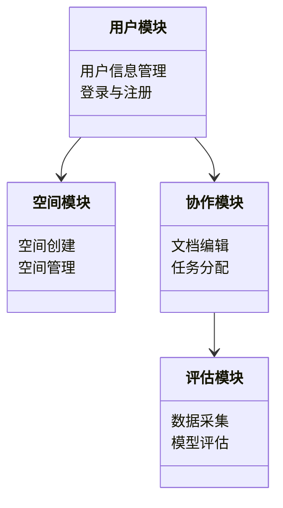
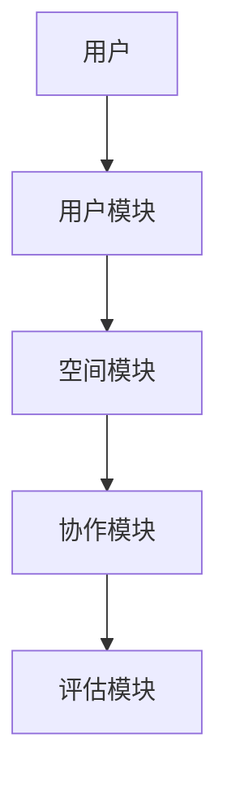
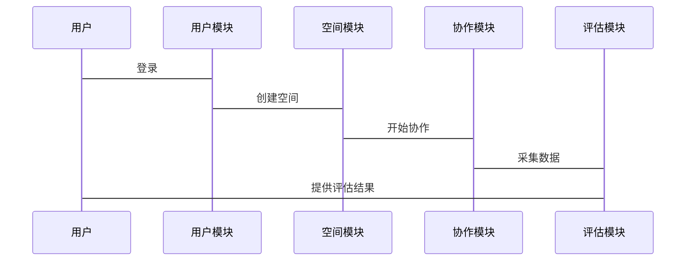

                 


# 企业估值中的AR/VR协作办公平台评估

> 关键词：企业估值，AR/VR，协作办公，平台评估，技术分析

> 摘要：本文深入探讨了在企业估值中，AR/VR协作办公平台的评估方法与技术分析。通过系统地介绍AR/VR协作办公平台的核心概念、算法原理、系统架构以及实际项目案例，本文为企业在选择和评估AR/VR协作办公平台时提供了有价值的参考和指导。

---

## 目录

1. [AR/VR协作办公平台评估的背景与现状](#1-arvrcollaborative-office-platform-assessment-background-and-current-status)
2. [AR/VR协作办公平台的核心概念](#2-arvrcollaborative-office-platform-core-concepts)
3. [AR/VR协作办公平台评估的算法原理](#3-arvrcollaborative-office-platform-assessment-algorithm-principles)
4. [协作办公平台的系统架构与设计](#4-collaborative-office-platform-system-architecture-and-design)
5. [AR/VR协作办公平台评估的项目实战](#5-arvrcollaborative-office-platform-assessment-project-practice)
6. [AR/VR协作办公平台评估的最佳实践与总结](#6-arvrcollaborative-office-platform-assessment-best-practices-and-conclusion)

---

## 第1章: AR/VR协作办公平台评估的背景与现状

### 1.1 AR/VR协作办公平台的背景介绍

#### 1.1.1 AR/VR技术的发展历程
- **增强现实（AR）**：通过计算机生成的虚拟信息叠加到真实环境中，提供交互式的体验。
- **虚拟现实（VR）**：创建一个完全虚拟的三维环境，用户可以通过设备沉浸其中。
- **技术演进**：从简单的2D界面到复杂的3D空间，AR/VR技术在办公领域的应用逐渐成熟。

#### 1.1.2 协作办公平台的演变
- **传统协作工具**：依赖文本和邮件，效率低下。
- **在线协作工具**：如Google Docs、Teams，提升了实时协作能力。
- **AR/VR协作办公**：通过虚拟空间实现更直观、高效的协作体验。

#### 1.1.3 AR/VR与协作办公的结合
- 提供更直观的空间协作体验。
- 支持多人实时互动，提升团队协作效率。
- 适用于远程办公和虚拟团队管理。

### 1.2 当前企业估值中的协作办公平台现状

#### 1.2.1 传统协作办公工具的局限性
- **信息孤岛**：数据分散，难以整合。
- **协作效率低**：依赖邮件和文档，反馈延迟。
- **用户体验差**：难以提供沉浸式体验。

#### 1.2.2 AR/VR协作办公的优势
- **沉浸式体验**：提升用户参与感。
- **实时协作**：多人同步操作，效率提升。
- **可视化管理**：便于复杂任务的协调与执行。

#### 1.2.3 企业估值中的协作办公平台需求
- **提升效率**：降低企业运营成本。
- **增强用户体验**：提高员工满意度和创造力。
- **数据驱动决策**：通过数据分析优化协作流程。

### 1.3 本章小结
AR/VR技术为协作办公带来了革命性的变化，企业估值中的协作办公平台需求日益增长。通过分析AR/VR协作办公平台的优势，企业可以更好地优化协作流程，提升整体效率。

---

## 第2章: AR/VR协作办公平台的核心概念

### 2.1 AR/VR协作办公平台的定义与特点

#### 2.1.1 AR/VR协作办公平台的定义
- **定义**：通过AR/VR技术实现的虚拟协作空间，支持多人实时互动。
- **特点**：
  - **沉浸式体验**：用户可以在虚拟空间中自由交互。
  - **实时协作**：多人实时编辑、讨论和反馈。
  - **高度定制化**：支持不同场景下的协作需求。

### 2.2 AR/VR协作办公平台的核心要素分析

#### 2.2.1 用户行为分析
- **用户角色**：包括普通用户、管理员等。
- **用户交互**：包括点击、拖拽、语音聊天等操作。
- **用户反馈**：通过数据分析优化用户体验。

#### 2.2.2 平台功能模块
- **空间创建**：用户可以创建和定制虚拟空间。
- **协作工具**：包括文档编辑、白板书写等功能。
- **用户管理**：支持用户权限设置和管理。

#### 2.2.3 评估指标体系
- **性能指标**：包括延迟、响应时间等。
- **用户体验指标**：包括满意度、使用频率等。
- **协作效率指标**：包括任务完成时间、反馈速度等。

### 2.3 本章小结
AR/VR协作办公平台的核心概念涵盖了技术实现、用户行为和评估指标。通过分析这些核心要素，企业可以更好地选择和优化协作平台。

---

## 第3章: AR/VR协作办公平台评估的算法原理

### 3.1 多维度评估模型的构建

#### 3.1.1 数据采集与特征提取
- **数据采集方法**：包括用户行为数据、系统性能数据等。
- **特征提取算法**：使用机器学习算法提取关键特征。
- **数据预处理**：清洗、归一化等步骤。

#### 3.1.2 评估模型的构建与训练
- **模型选择**：选择适合的机器学习模型。
- **模型训练流程**：包括数据输入、特征提取、模型训练等。
- **模型调优**：通过参数调整优化模型性能。

#### 3.1.3 模型评估与优化
- **评估指标**：包括准确率、召回率等。
- **模型优化方法**：包括交叉验证、网格搜索等。
- **模型的可解释性**：通过可视化工具分析模型决策过程。

### 3.2 本章小结
通过构建多维度评估模型，企业可以更全面地评估AR/VR协作办公平台的性能和用户体验。

---

## 第4章: 协作办公平台的系统架构与设计

### 4.1 系统功能模块设计

#### 4.1.1 系统功能模块
- **用户模块**：包括用户注册、登录等。
- **空间模块**：包括空间创建、管理等。
- **协作模块**：包括文档编辑、任务分配等。
- **评估模块**：包括数据采集、模型评估等。

#### 4.1.2 系统功能设计的类图


### 4.2 系统架构设计

#### 4.2.1 系统架构设计的流程图


#### 4.2.2 系统交互的序列图


### 4.3 本章小结
通过系统架构设计，企业可以更好地规划和实施AR/VR协作办公平台的开发与部署。

---

## 第5章: AR/VR协作办公平台评估的项目实战

### 5.1 环境配置

#### 5.1.1 系统环境
- **操作系统**：Windows 10或更高版本。
- **开发工具**：Visual Studio、PyCharm等。
- **依赖库**：Python的numpy、pandas、scikit-learn等。

### 5.2 核心代码实现

#### 5.2.1 数据采集代码
```python
import numpy as np
import pandas as pd

# 读取数据
data = pd.read_csv('collaboration_data.csv')

# 提取特征
features = data[['response_time', 'user_activity', 'task_completion']]
```

#### 5.2.2 模型训练代码
```python
from sklearn.model

