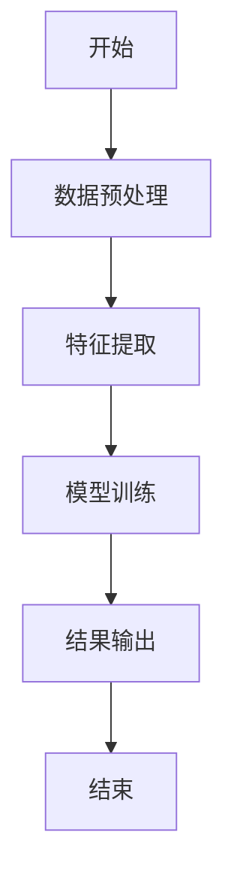
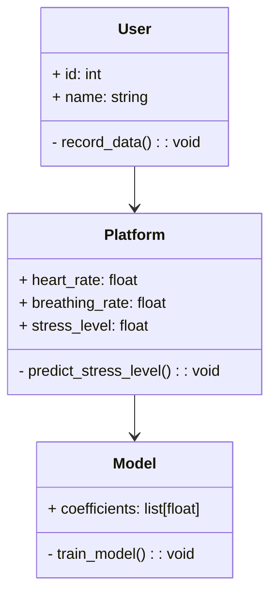
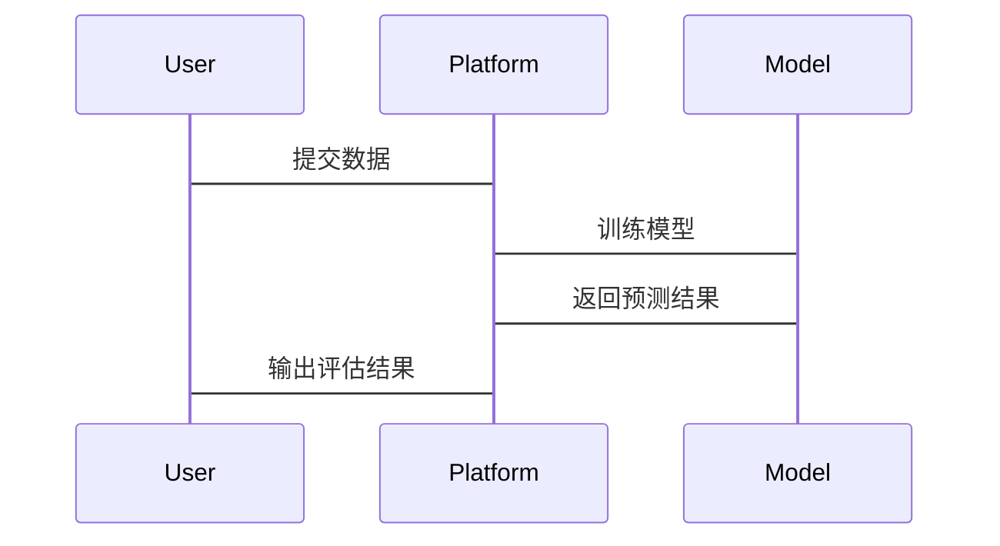

                 


# 《企业估值中的AR/VR心理健康治疗平台评估》

## 关键词：
- AR/VR
- 心理健康治疗
- 企业估值
- 平台评估
- 算法模型

## 摘要：
随着AR/VR技术的快速发展，其在心理健康治疗领域的应用逐渐崭露头角。本文从企业估值的角度，详细探讨了AR/VR心理健康治疗平台的评估方法。文章首先介绍了AR/VR技术的基本原理及其在心理健康治疗中的应用场景，随后分析了平台的核心功能和评估模型。通过详细的算法原理和系统架构设计，本文提出了一个基于AR/VR技术的心理健康治疗平台评估框架，并通过实际案例展示了如何进行平台评估。最后，本文总结了平台评估的关键点，并提出了未来的研究方向。

---

## 第1章: AR/VR技术与心理健康治疗的结合

### 1.1 AR/VR技术的发展与应用背景

#### 1.1.1 AR/VR技术的基本概念与发展历程
- **增强现实（AR）**：通过将数字信息叠加在现实世界中，提供一种增强的交互体验。
- **虚拟现实（VR）**：通过模拟环境，提供一种沉浸式的体验。
- **发展历程**：从早期的军事用途到如今的民用领域，AR/VR技术在多个行业得到了广泛应用。

#### 1.1.2 心理健康治疗的需求与现状
- **心理健康问题**：现代社会中，心理健康问题日益严重，尤其是在企业中，员工的压力、焦虑等问题亟待解决。
- **传统治疗方法**：传统心理治疗方法存在效率低、成本高等问题。

#### 1.1.3 AR/VR技术在心理健康治疗中的潜力
- **沉浸式体验**：VR技术可以提供高度沉浸的环境，帮助患者进行暴露疗法。
- **实时反馈**：AR技术可以实时跟踪患者的生理指标，提供个性化的治疗方案。

### 1.2 AR/VR在心理健康治疗中的应用场景

#### 1.2.1 暴露疗法与虚拟现实
- **暴露疗法**：通过逐步暴露患者于恐惧的环境，帮助其克服心理障碍。
- **VR实现**：利用VR技术模拟真实环境，患者可以在安全的虚拟环境中进行治疗。

#### 1.2.2 认知行为疗法与增强现实
- **认知行为疗法**：通过改变患者的思维模式，帮助其克服心理问题。
- **AR实现**：AR技术可以将治疗工具（如认知重构卡片）叠加在现实环境中，帮助患者更好地理解自己的思维模式。

#### 1.2.3 VR冥想与放松训练
- **冥想训练**：通过VR技术提供一个平静的环境，帮助患者放松身心。
- **放松训练**：利用VR技术模拟自然环境（如森林、海滩），帮助患者缓解压力。

### 1.3 企业估值中的平台评估需求

#### 1.3.1 企业心理健康管理的重要性
- **员工效率**：心理健康问题会影响员工的工作效率和创造力。
- **企业成本**：心理健康问题可能导致高昂的医疗费用和员工流失。

#### 1.3.2 AR/VR平台在企业中的应用价值
- **员工培训**：利用AR/VR技术进行心理健康的培训和教育。
- **压力管理**：通过AR/VR平台帮助员工缓解压力，提升心理健康水平。

#### 1.3.3 平台评估的核心问题与目标
- **评估指标**：如何量化AR/VR平台的效果。
- **评估方法**：如何设计科学的评估模型，帮助企业决策。

### 1.4 本章小结
本章从AR/VR技术的发展背景出发，详细探讨了其在心理健康治疗中的应用场景，并结合企业的实际需求，提出了平台评估的核心问题与目标。

---

## 第2章: AR/VR心理健康治疗平台的核心概念与联系

### 2.1 AR/VR技术的核心原理

#### 2.1.1 增强现实（AR）的基本原理
- **传感器**：通过摄像头、陀螺仪等传感器获取现实环境的信息。
- **渲染引擎**：将数字信息叠加在现实环境中，形成增强的视觉效果。
- **交互方式**：用户可以通过手势、语音等方式与AR环境进行交互。

#### 2.1.2 虚拟现实（VR）的基本原理
- **沉浸式体验**：通过头显设备将用户完全沉浸在虚拟环境中。
- **图形渲染**：利用高性能图形处理器渲染三维场景。
- **交互方式**：用户可以通过手柄、头显等方式与虚拟环境进行交互。

#### 2.1.3 AR与VR的主要区别与应用场景
- **区别**：AR将数字信息叠加在现实环境中，而VR则完全沉浸在一个虚拟环境中。
- **应用场景**：AR适用于辅助现实环境中的操作，而VR适用于需要高度沉浸体验的场景。

### 2.2 心理健康治疗的核心要素

#### 2.2.1 认知行为疗法的基本原理
- **认知重构**：通过改变患者的思维模式，帮助其克服心理问题。
- **行为疗法**：通过改变患者的外在行为，帮助其建立新的行为习惯。

#### 2.2.2 暴露疗法的核心要素
- **逐步暴露**：患者逐步暴露于恐惧的环境，帮助其适应并克服恐惧。
- **实时反馈**：治疗师可以实时监控患者的心理状态，并给予反馈。

#### 2.2.3 VR冥想与放松训练的实现机制
- **环境模拟**：通过VR技术模拟平静的环境，帮助患者放松身心。
- **生物反馈**：通过监测患者的心率、呼吸等生理指标，提供实时反馈。

### 2.3 AR/VR平台与心理健康治疗的结合

#### 2.3.1 AR/VR技术在心理健康治疗中的优势
- **沉浸式体验**：帮助患者更好地投入到治疗过程中。
- **实时反馈**：通过传感器实时监测患者的生理指标，提供个性化的治疗方案。
- **可重复性**：患者可以在虚拟环境中反复进行暴露疗法，而不会受到实际环境的限制。

#### 2.3.2 平台的核心功能模块与实现方式
- **环境模拟模块**：利用AR/VR技术模拟真实的治疗环境。
- **实时反馈模块**：通过传感器实时监测患者的生理指标，并提供反馈。
- **个性化治疗模块**：根据患者的具体情况，提供个性化的治疗方案。

#### 2.3.3 平台的用户交互设计与体验优化
- **用户界面设计**：设计直观、易用的用户界面，提升用户体验。
- **交互方式优化**：通过优化手势、语音等交互方式，提升用户的沉浸感。

### 2.4 本章小结
本章详细探讨了AR/VR技术的核心原理及其在心理健康治疗中的应用，并分析了平台的核心功能模块与实现方式。

---

## 第3章: AR/VR心理健康治疗平台的评估模型与算法原理

### 3.1 评估模型的基本原理

#### 3.1.1 模型的输入与输出
- **输入**：患者的心理状态数据、生理指标数据、治疗环境数据等。
- **输出**：平台的评估结果，包括治疗效果、用户体验、成本效益等。

#### 3.1.2 模型的核心算法与实现步骤
- **算法流程图（Mermaid）**


#### 3.1.3 模型的评估指标与优化方法
- **评估指标**：治疗效果、用户体验、成本效益等。
- **优化方法**：通过机器学习算法优化模型的预测精度。

### 3.2 算法原理的详细讲解

#### 3.2.1 算法流程图（Mermaid）


#### 3.2.2 算法实现的Python代码示例
```python
def evaluate_platform(platform_data):
    # 数据预处理
    processed_data = platform_data.dropna()
    # 特征提取
    features = processed_data[['heart_rate', 'breathing_rate', 'temperature']]
    # 模型训练
    model = LinearRegression()
    model.fit(features, processed_data['stress_level'])
    # 结果输出
    predicted_stress = model.predict(features)
    return predicted_stress
```

#### 3.2.3 算法的数学模型和公式
- **线性回归模型**：
  $$ y = \beta_0 + \beta_1x_1 + \beta_2x_2 + \dots + \beta_nx_n + \epsilon $$
  其中，$y$ 是目标变量，$x_i$ 是自变量，$\beta_i$ 是回归系数，$\epsilon$ 是误差项。

#### 3.2.4 详细讲解与举例说明
- **例子**：假设我们有一个平台，其输入数据包括心率、呼吸率和体温，输出数据是压力水平。通过线性回归模型，我们可以预测用户的压力水平，并根据预测结果进行平台评估。

### 3.3 本章小结
本章详细讲解了评估模型的基本原理，并通过具体的Python代码和数学公式，详细阐述了算法的实现过程。

---

## 第4章: 系统分析与架构设计方案

### 4.1 问题场景介绍
- **问题场景**：企业希望评估一个基于AR/VR技术的心理健康治疗平台，以确定其是否值得投资。

### 4.2 系统功能设计

#### 4.2.1 领域模型（Mermaid类图）


### 4.3 系统架构设计

#### 4.3.1 系统架构图（Mermaid架构图）


#### 4.3.2 系统交互设计（Mermaid序列图）


### 4.4 本章小结
本章从系统架构设计的角度，详细分析了AR/VR心理健康治疗平台的实现过程，并通过类图和序列图展示了系统的交互过程。

---

## 第5章: 项目实战

### 5.1 环境安装
- **Python环境**：安装Python 3.8以上版本。
- **依赖库安装**：安装numpy、pandas、scikit-learn等库。

### 5.2 系统核心实现源代码
```python
import numpy as np
import pandas as pd
from sklearn.linear_model import LinearRegression

def evaluate_platform(platform_data):
    # 数据预处理
    processed_data = platform_data.dropna()
    # 特征提取
    features = processed_data[['heart_rate', 'breathing_rate', 'temperature']]
    # 标签提取
    labels = processed_data['stress_level']
    # 模型训练
    model = LinearRegression()
    model.fit(features, labels)
    # 模型预测
    predicted_labels = model.predict(features)
    return predicted_labels
```

### 5.3 代码应用解读与分析
- **代码解读**：上述代码实现了对平台数据的预处理、特征提取和模型训练，最终输出预测的标签。
- **分析**：通过线性回归模型，我们可以预测用户的压力水平，并根据预测结果进行平台评估。

### 5.4 实际案例分析和详细讲解剖析
- **案例分析**：假设我们有一个包含1000条数据的平台，我们可以通过上述代码进行数据预处理和模型训练，最终得到预测的压力水平。

### 5.5 项目小结
本章通过实际案例分析，详细讲解了如何使用Python代码实现AR/VR心理健康治疗平台的评估模型，并通过代码解读和分析，帮助读者更好地理解模型的实现过程。

---

## 第6章: 最佳实践

### 6.1 小结
- **总结**：本文从企业估值的角度，详细探讨了AR/VR心理健康治疗平台的评估方法，通过理论分析和实际案例，提出了一个科学的评估框架。

### 6.2 注意事项
- **数据隐私**：在实际应用中，需要注意患者数据的隐私保护。
- **模型优化**：需要根据实际情况不断优化模型的预测精度。

### 6.3 拓展阅读
- **推荐书籍**：《虚拟现实与心理健康治疗》、《增强现实技术与应用》。
- **推荐论文**：相关领域的最新研究论文。

### 6.4 本章小结
本章总结了本文的核心内容，并提出了未来的研究方向和拓展阅读建议。

---

## 附录: 全部代码清单

### 附录A: 评估模型的Python代码
```python
import numpy as np
import pandas as pd
from sklearn.linear_model import LinearRegression

def evaluate_platform(platform_data):
    # 数据预处理
    processed_data = platform_data.dropna()
    # 特征提取
    features = processed_data[['heart_rate', 'breathing_rate', 'temperature']]
    # 标签提取
    labels = processed_data['stress_level']
    # 模型训练
    model = LinearRegression()
    model.fit(features, labels)
    # 模型预测
    predicted_labels = model.predict(features)
    return predicted_labels
```

### 附录B: 系统架构设计的类图


### 附录C: 系统交互设计的序列图


---

## 结语
通过本文的详细分析，读者可以全面了解AR/VR心理健康治疗平台的评估方法，并能够通过实际案例和代码实现，掌握平台评估的核心技术。未来，随着AR/VR技术的不断发展，心理健康治疗平台的评估方法也将不断优化，为企业估值提供更加科学的依据。

