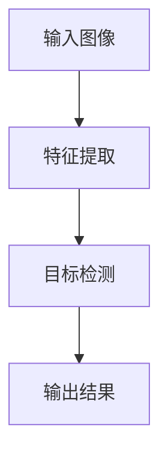
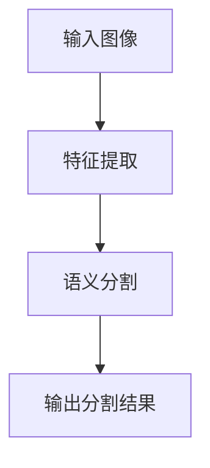
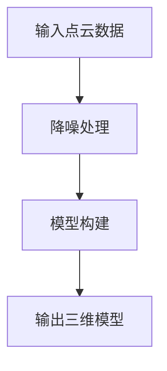
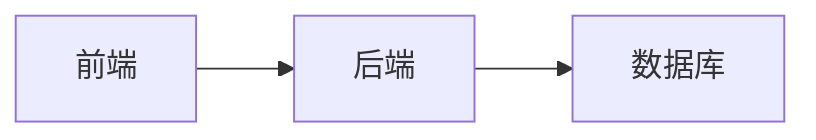
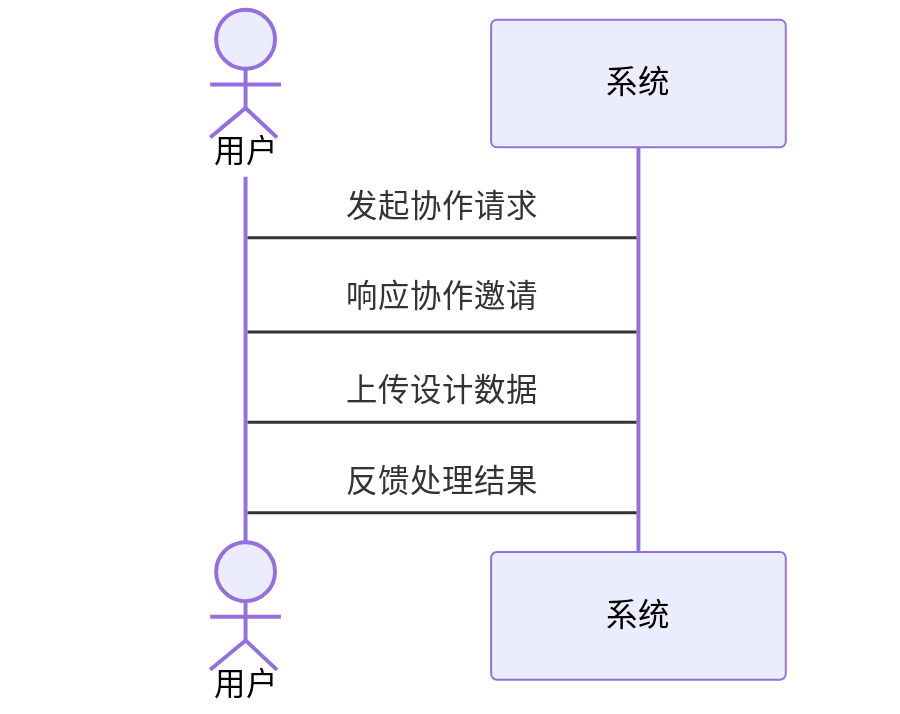

                 


```markdown
# 企业估值中的AR工业设计协作平台评估

## 关键词：AR技术、工业设计协作、企业估值、算法原理、系统架构

## 摘要：随着增强现实（AR）技术的快速发展，AR工业设计协作平台在企业估值中的应用越来越广泛。本文从背景介绍、核心概念、算法原理、系统架构、项目实战等方面，详细探讨了AR工业设计协作平台的评估方法，为企业估值提供了新的视角和解决方案。

---

## 第一部分: 背景介绍

### 第1章: 问题背景
#### 1.1 AR技术在工业设计中的应用现状
- **传统工业设计协作的不足**：依赖二维图纸，沟通效率低，协作成本高。
- **AR技术的优势**：实时三维可视化，提升协作效率，降低沟通成本。
- **企业估值中的技术需求**：通过AR技术优化设计流程，提升企业竞争力。

#### 1.2 问题描述
- **协作效率低下**：设计变更频繁，信息传递不畅。
- **数据处理复杂**：多维度数据难以整合，影响评估准确性。
- **技术解决方案**：利用AR技术实现实时协作和数据可视化。

#### 1.3 问题解决
- **优化协作流程**：通过AR技术实现设计数据的实时共享和协作。
- **提升数据处理能力**：利用AR技术整合多维度数据，提升评估准确性。

### 第2章: 核心概念与联系
#### 2.1 核心概念原理
- **AR技术的基本原理**：通过摄像头捕捉环境，叠加虚拟模型实现三维可视化。
- **工业设计协作平台的工作流程**：用户通过AR设备进行实时协作，数据实时同步。

#### 2.2 概念属性特征对比
| 特性         | AR工业设计协作平台     | 传统协作工具         |
|--------------|-----------------------|----------------------|
| 协作效率     | 高                   | 低                   |
| 数据处理能力 | 强                   | 弱                   |
| 实时性       | 高                   | 低                   |

#### 2.3 ER实体关系图
```mermaid
er
actor: 用户
object: 设计数据
usecase: 协作设计
actor --> usecase
usecase --> object
```

---

## 第二部分: 算法原理讲解

### 第3章: 算法原理
#### 3.1 多目标检测算法
- **原理**：通过卷积神经网络检测多个目标。
- **流程图**：


#### 3.2 语义分割算法
- **原理**：将图像分割为不同区域，识别每个区域的语义信息。
- **流程图**：


#### 3.3 点云处理算法
- **原理**：通过点云数据构建三维模型。
- **流程图**：


#### 3.4 数学模型与公式
- **多目标检测的损失函数**：
  $$ L = L_{cls} + L_{loc} $$
- **语义分割的卷积操作**：
  $$ F(x) = \sum_{i=1}^{n} w_i x_i $$

---

## 第三部分: 系统分析与架构设计

### 第4章: 系统架构
#### 4.1 项目场景
- **汽车设计协作平台**：通过AR技术实现汽车设计的实时协作。

#### 4.2 系统功能设计
- **用户管理**：用户注册、登录、权限管理。
- **数据处理**：设计数据的上传、下载、同步。
- **协作功能**：实时协作、设计变更同步。

#### 4.3 系统架构设计


#### 4.4 系统接口设计
- **用户登录接口**：`POST /login`
- **数据上传接口**：`POST /upload`

#### 4.5 系统交互设计


---

## 第四部分: 项目实战

### 第5章: 项目实战
#### 5.1 环境安装
- **安装依赖**：Python、PyTorch、OpenCV。

#### 5.2 核心代码实现
```python
import torch
import cv2

def detect_objects(image):
    # 多目标检测
    model = torch.load("model.pth")
    outputs = model(image)
    return outputs
```

#### 5.3 案例分析
- **汽车设计协作平台**：通过AR技术实现汽车设计的实时协作，提升设计效率。

#### 5.4 代码解读与分析
- **目标检测**：使用YOLO模型实现目标检测。
- **语义分割**：使用U-Net模型实现语义分割。

#### 5.5 项目小结
- **经验总结**：AR技术显著提升了协作效率。
- **可能错误**：数据同步延迟，解决方案：优化网络架构。

---

## 第五部分: 总结与展望

### 第6章: 总结
#### 6.1 最佳实践
- **小结**：通过AR技术实现工业设计协作的实时性和高效性。
- **注意事项**：确保数据安全，优化网络性能。

#### 6.2 拓展阅读
- 推荐书籍：《增强现实技术与应用》。
- 技术博客：深入探讨AR技术的数学原理。

---

## 第7章: 思考与总结

通过本文的详细分析，我们了解了AR工业设计协作平台在企业估值中的重要性。从背景介绍到算法原理，再到系统架构和项目实战，我们为企业提供了新的估值视角和解决方案。未来，随着AR技术的不断发展，工业设计协作平台将更加智能化，为企业估值带来更大的价值。

```

