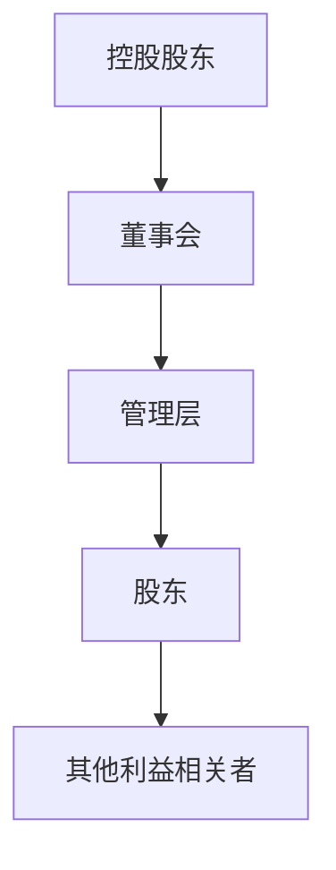
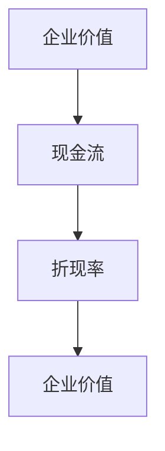

                 

# 企业估值中的公司治理因素

> 关键词：企业估值、公司治理、财务表现、治理风险、现金流预测

> 摘要：公司治理在企业估值中扮演着重要角色。本文探讨了公司治理的核心要素及其对财务表现和企业价值的影响。通过分析股权结构、董事会治理和利益相关者治理，本文揭示了公司治理如何通过影响现金流、风险管理和决策质量来影响企业估值。案例分析和数学模型进一步验证了这些理论观点，为企业估值提供了实用的指导和建议。

---

## 第1章: 企业估值与公司治理概述

### 1.1 企业估值的基本概念

#### 1.1.1 企业估值的定义与意义
企业估值是指对企业的整体价值进行评估的过程。它是企业融资、并购和投资决策的重要依据。企业估值的意义在于帮助投资者和经理人了解企业的市场价值，从而做出更明智的决策。

#### 1.1.2 企业估值的核心要素
企业估值的核心要素包括财务表现、市场地位、竞争优势、管理团队、行业环境等。其中，公司治理是影响企业价值的重要因素。

#### 1.1.3 公司治理在企业估值中的地位
公司治理是企业管理和决策的基础，直接影响企业的财务表现和市场信誉。良好的公司治理可以降低代理成本，提高企业透明度和决策效率，从而提升企业价值。

### 1.2 公司治理的基本概念

#### 1.2.1 公司治理的定义与内涵
公司治理是指通过公司章程、董事会、管理层和利益相关者之间的关系，确保企业有效运作和价值最大化的过程。公司治理的内涵包括股权结构、董事会治理、利益相关者治理等。

#### 1.2.2 公司治理的主要模式
公司治理的主要模式包括股东主权模式、董事会主权模式和利益相关者主权模式。不同模式适用于不同企业类型和行业环境。

#### 1.2.3 公司治理与企业价值的关系
公司治理通过影响企业的财务表现、风险管理和决策质量，间接影响企业价值。良好的公司治理可以提高企业的市场信誉和长期发展潜力，从而提升企业估值。

### 1.3 本章小结
本章概述了企业估值和公司治理的基本概念及其关系。公司治理是企业估值的重要因素，影响企业的财务表现和市场价值。

---

## 第2章: 公司治理的核心要素

### 2.1 股权结构与控制权分配

#### 2.1.1 股权结构的类型与特点
股权结构可以分为集中型和分散型。集中型股权结构通常由控股股东主导，分散型股权结构则由多个小股东共同持有。股权结构的特点包括控制权集中、代理成本低等。

#### 2.1.2 控制权分配的影响
控制权分配影响企业的决策效率和代理成本。集中控制权可以提高决策效率，但可能导致控股股东滥用权力；分散控制权可以避免权力滥用，但可能增加代理成本。

#### 2.1.3 股权结构与企业估值的关系
良好的股权结构可以降低代理成本，提高企业透明度和市场信誉，从而提升企业估值。

#### 2.1.4 Mermaid图：股权结构与控制权分配

### 2.2 董事会治理与决策机制

#### 2.2.1 董事会的结构与功能
董事会是公司治理的核心机构，负责制定企业战略、监督管理层和评估企业绩效。董事会结构包括独立董事、执行董事等。

#### 2.2.2 董事会决策的影响因素
董事会决策的影响因素包括信息完整性、独立董事比例、董事会会议频率等。

#### 2.2.3 董事会治理与企业价值的关系
高效的董事会治理可以提高企业的战略制定能力和监督效率，从而提升企业价值。

### 2.3 利益相关者治理

#### 2.3.1 利益相关者的定义与分类
利益相关者包括股东、债权人、员工、客户、供应商等。不同利益相关者对企业的期望和要求不同。

#### 2.3.2 利益相关者治理的挑战
利益相关者治理的挑战包括利益冲突、信息不对称和决策复杂性。

#### 2.3.3 利益相关者治理与企业估值的关系
良好的利益相关者治理可以提高企业的社会声誉和长期发展潜力，从而提升企业估值。

### 2.4 本章小结
本章分析了公司治理的核心要素，包括股权结构、董事会治理和利益相关者治理。这些因素通过影响企业的决策效率、代理成本和社会声誉，间接影响企业估值。

---

## 第3章: 公司治理对财务表现的影响

### 3.1 公司治理与财务绩效的关系

#### 3.1.1 财务绩效的定义与衡量
财务绩效是指企业在一定时期内的财务状况和经营成果。常用的衡量指标包括净利润率、ROE、ROA等。

#### 3.1.2 公司治理对财务绩效的影响路径
公司治理通过影响企业的管理效率、风险管理和战略决策，间接影响财务绩效。

#### 3.1.3 财务绩效与企业估值的关系
良好的财务绩效可以提高企业的市场价值，从而提升企业估值。

### 3.2 公司治理与财务风险的管理

#### 3.2.1 财务风险的定义与类型
财务风险是指企业在经营过程中由于财务状况变化而面临的风险。主要包括流动性风险、偿债风险和盈利能力风险。

#### 3.2.2 公司治理在风险管理中的作用
公司治理通过建立风险管理机制、监督管理层和优化资本结构，降低财务风险。

#### 3.2.3 财务风险管理与企业估值的关系
有效的财务风险管理可以降低企业的财务风险，提高企业的市场信誉和长期发展潜力，从而提升企业估值。

### 3.3 案例分析: 公司治理对财务表现的影响

#### 3.3.1 案例背景介绍
某公司因董事会治理不善，导致财务造假，最终影响企业估值。

#### 3.3.2 案例分析与启示
良好的公司治理可以避免财务造假，提高企业透明度和市场信誉，从而提升企业估值。

### 3.4 本章小结
本章分析了公司治理对财务表现的影响，包括财务绩效和财务风险管理。良好的公司治理可以提高企业的财务绩效，降低财务风险，从而提升企业估值。

---

## 第4章: 公司治理在企业估值中的应用

### 4.1 公司治理与企业价值评估模型

#### 4.1.1 常用企业价值评估模型概述
常用的企业价值评估模型包括DCF模型、EV/EBITDA模型、相对估值法等。

#### 4.1.2 公司治理因素在模型中的体现
公司治理因素如股权结构、董事会治理和利益相关者治理通过影响企业的现金流、风险和管理效率，间接影响企业价值。

#### 4.1.3 公司治理调整对企业价值的影响
良好的公司治理可以提高企业的现金流、降低风险，从而提升企业价值。

#### 4.1.4 Mermaid图：企业价值评估模型

### 4.2 公司治理与现金流预测

#### 4.2.1 现金流预测的定义与方法
现金流预测是估计企业在未来一定时期内的现金流入和流出的过程。常用方法包括历史数据分析、情景分析和模型预测。

#### 4.2.2 公司治理对现金流预测的影响
良好的公司治理可以提高企业的管理效率和透明度，从而提高现金流预测的准确性。

#### 4.2.3 现金流预测与企业估值的关系
准确的现金流预测是企业估值的基础，良好的公司治理可以提高现金流预测的准确性，从而提升企业估值。

### 4.3 公司治理与风险评估

#### 4.3.1 风险评估的定义与方法
风险评估是识别和评估企业在经营过程中面临的风险的过程。常用方法包括风险矩阵和概率-影响分析。

#### 4.3.2 公司治理对风险评估的影响
公司治理通过建立风险管理机制和监督管理层，降低企业面临的风险。

#### 4.3.3 风险评估与企业估值的关系
有效的风险评估可以降低企业的经营风险，提高企业的市场信誉和长期发展潜力，从而提升企业估值。

### 4.4 案例分析: 公司治理在企业估值中的应用

#### 4.4.1 案例背景介绍
某公司通过优化公司治理结构，提高企业透明度和管理效率，从而提升企业估值。

#### 4.4.2 案例分析与启示
良好的公司治理可以提高企业的现金流预测和风险管理能力，从而提升企业估值。

### 4.5 本章小结
本章分析了公司治理在企业估值中的应用，包括企业价值评估模型、现金流预测和风险评估。良好的公司治理可以提高企业的现金流预测和风险管理能力，从而提升企业估值。

---

## 第5章: 公司治理风险的识别与评估

### 5.1 公司治理风险的定义与分类

#### 5.1.1 公司治理风险的定义
公司治理风险是指由于公司治理结构和机制的缺陷，导致企业面临的风险。

#### 5.1.2 公司治理风险的分类
公司治理风险可以分为代理风险、信息不对称风险和利益相关者风险。

### 5.2 公司治理风险的识别

#### 5.2.1 风险识别方法
风险识别方法包括财务指标分析、内部审计和外部评级。

#### 5.2.2 风险识别的挑战
风险识别的挑战包括信息不对称和复杂性。

### 5.3 公司治理风险的评估

#### 5.3.1 风险评估方法
风险评估方法包括概率-影响分析和风险矩阵。

#### 5.3.2 风险评估的影响因素
风险评估的影响因素包括企业规模、行业环境和公司治理结构。

### 5.4 案例分析: 公司治理风险的识别与评估

#### 5.4.1 案例背景介绍
某公司因董事会治理不善，导致企业面临财务危机。

#### 5.4.2 案例分析与启示
良好的公司治理可以降低公司治理风险，提高企业的市场信誉和长期发展潜力。

### 5.5 本章小结
本章分析了公司治理风险的识别与评估，包括定义、分类、识别方法和评估方法。良好的公司治理可以降低公司治理风险，提高企业的市场信誉和长期发展潜力。

---

## 第6章: 公司治理的外部影响

### 6.1 行业特点与公司治理

#### 6.1.1 不同行业公司治理的差异
不同行业的公司治理差异主要体现在股权结构、董事会治理和利益相关者治理方面。

#### 6.1.2 行业环境对治理的影响
行业环境对治理的影响包括市场竞争、监管环境和企业规模。

### 6.2 监管环境与公司治理

#### 6.2.1 监管政策对公司治理的影响
监管政策通过影响企业治理结构和行为，间接影响企业估值。

#### 6.2.2 监管环境的差异
不同国家和地区的监管环境差异较大，影响企业治理结构和行为。

### 6.3 公司治理的外部挑战

#### 6.3.1 全球化背景下的治理挑战
全球化背景下的治理挑战包括跨国经营、文化差异和国际监管。

#### 6.3.2 行业趋势与公司治理
行业趋势如数字化转型和可持续发展对治理结构和行为的影响。

### 6.4 案例分析: 行业特点与公司治理

#### 6.4.1 案例背景介绍
某行业因监管政策变化，导致企业治理结构调整。

#### 6.4.2 案例分析与启示
良好的公司治理可以适应行业特点和监管环境变化，提高企业的市场竞争力。

### 6.5 本章小结
本章分析了公司治理的外部影响，包括行业特点、监管环境和全球化背景。良好的公司治理可以适应外部环境变化，提高企业的市场竞争力。

---

## 第7章: 总结与展望

### 7.1 总结

#### 7.1.1 公司治理在企业估值中的重要性
公司治理在企业估值中起着关键作用，影响企业的财务表现、风险管理和决策质量。

#### 7.1.2 公司治理的核心要素
公司治理的核心要素包括股权结构、董事会治理和利益相关者治理。

#### 7.1.3 公司治理与企业估值的关系
良好的公司治理可以提高企业的市场信誉和长期发展潜力，从而提升企业估值。

### 7.2 展望

#### 7.2.1 公司治理研究的未来方向
公司治理研究的未来方向包括数字化转型、可持续发展和全球化的治理挑战。

#### 7.2.2 公司治理在企业估值中的应用前景
公司治理在企业估值中的应用前景广阔，特别是在数字化转型和可持续发展的背景下。

### 7.3 本章小结
本章总结了公司治理在企业估值中的重要性，并展望了未来的研究方向和应用前景。

---

## 参考文献

（此处列出相关的书籍、论文和其他参考文献。）

---

## 致谢

（此处感谢参与写作和提供帮助的人。）

---

## 附录

（此处可以列出相关的数据、表格或补充材料。）

---

通过以上结构，我们可以系统地探讨企业估值中的公司治理因素，从核心概念到实际应用，为读者提供全面而深入的分析。

