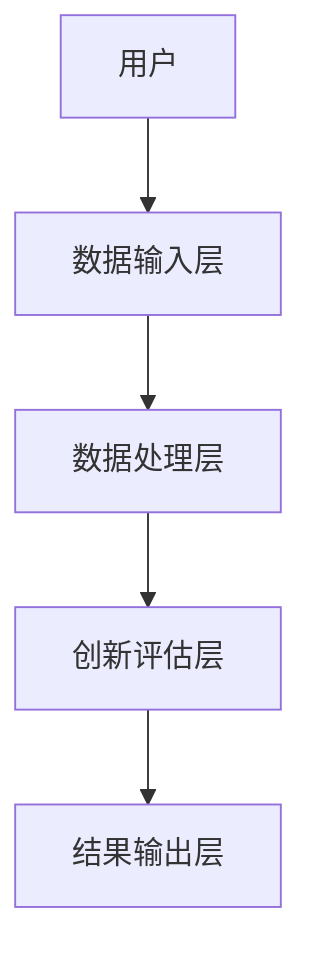

                 


# 企业估值中的创新生态系统评估

## 关键词：企业估值, 创新生态系统, 创新资源, 创新能力, 创新网络

## 摘要：  
在当今快速变化的商业环境中，企业的创新生态系统已成为其核心竞争力的重要组成部分。本文详细探讨了创新生态系统对企业估值的影响，分析了创新资源、能力和网络的评估方法，并提出了创新生态系统评估的理论框架和实践应用。通过系统分析和案例研究，本文为企业的估值提供了新的视角和方法。

---

## 第一部分: 企业估值与创新生态系统概述

### 第1章: 创新生态系统的基本概念

#### 1.1 什么是创新生态系统
- 创新生态系统是指由企业内外部的创新资源、能力和网络所构成的动态系统，旨在为企业创造持续的创新价值。
- 创新生态系统的核心要素包括创新资源（如技术、数据、人才）、创新能力（如研发能力、市场洞察力）和创新网络（如合作伙伴、供应商、客户）。

#### 1.2 创新生态系统与企业估值的关系
- 传统的企业估值方法（如DCF模型）往往忽视了创新资源对企业未来盈利能力的影响。
- 创新生态系统评估能够量化企业的创新能力、资源储备和网络优势，从而更准确地评估企业价值。

---

### 第2章: 企业估值的传统方法与创新生态系统评估的必要性

#### 2.1 传统企业估值方法的局限性
- 传统方法主要依赖财务数据，难以衡量企业的创新能力和潜在增长机会。
- 创新资源的分布不均和创新网络的复杂性使得传统方法难以捕捉企业的核心竞争力。

#### 2.2 创新生态系统评估的必要性
- 创新生态系统评估能够识别企业的创新潜力，帮助企业发现新的增长点。
- 通过评估创新资源和能力，企业可以更好地规划未来发展路径。

---

## 第二部分: 创新生态系统评估的核心概念

### 第3章: 创新资源的分类与特征

#### 3.1 创新资源的分类
- 技术资源：包括专利、技术储备、研发能力等。
- 数据资源：包括用户数据、市场数据、竞争对手数据等。
- 人力资源：包括技术创新人才、管理团队、外部合作伙伴等。

#### 3.2 创新资源的特征对比
| 特征       | 技术资源         | 数据资源         | 人力资源         |
|------------|------------------|------------------|------------------|
| 核心作用   | 支撑技术创新     | 支撑数据驱动决策 | 支撑组织创新     |
| 可扩展性   | 高               | 中               | 低               |
| 变化速度   | 中               | 高               | 低               |

---

### 第4章: 创新能力的评估维度

#### 4.1 技术创新能力
- 评估企业研发投入、专利数量、技术领先性等指标。
- 示例：某科技公司过去5年的研发投入占总收入的比例分别为10%、12%、15%、18%、20%，显示出持续增长的趋势。

#### 4.2 商业创新能力
- 评估企业市场拓展能力、产品迭代速度、客户满意度等指标。
- 示例：某企业过去3年的产品发布周期从12个月缩短至6个月，显示出较强的市场响应能力。

#### 4.3 组织创新能力
- 评估企业组织架构的灵活性、内部协作效率、员工创新积极性等指标。
- 示例：某公司通过扁平化组织结构和敏捷开发模式，显著提高了内部协作效率。

---

## 第三部分: 创新生态系统评估的算法原理与实现

### 第5章: 创新生态系统评估的数学模型

#### 5.1 创新价值评估的数学模型
- 创新价值 = 技术创新贡献 × 市场创新贡献 × 组织创新贡献
- 公式：$$ V_{\text{创新}} = T \times M \times O $$

#### 5.2 创新网络的价值评估模型
- 创新网络价值 = 合作伙伴数量 × 合作伙伴质量 × 合作伙伴关系稳定性
- 公式：$$ V_{\text{网络}} = N \times Q \times S $$

---

### 第6章: 创新生态系统评估的系统架构

#### 6.1 系统功能设计
- 用户输入：企业创新资源、能力和网络数据。
- 数据处理：计算创新资源的权重、分析创新网络的关系。
- 输出结果：创新生态系统评估报告，包括创新价值评分、建议和改进措施。

#### 6.2 系统架构设计


---

## 第四部分: 项目实战与案例分析

### 第7章: 项目实战

#### 7.1 环境安装
- 安装Python和相关库（如pandas、numpy、matplotlib）。
- 示例代码：
  ```python
  import pandas as pd
  import numpy as np

  # 示例数据：创新资源评分
  resources = pd.DataFrame({
      '技术资源': [8, 7, 9],
      '数据资源': [6, 8, 7],
      '人力资源': [9, 8, 8]
  })
  ```

#### 7.2 核心代码实现
- 创新价值计算代码：
  ```python
  def calculate_innovation_value(resources, capabilities, network):
      return resources.mean() * capabilities.mean() * network.mean()
  ```

#### 7.3 案例分析
- 某科技公司创新资源评分为9，创新能力评分为8，创新网络评分为7，计算出的创新价值评分为：
  $$ V_{\text{创新}} = 9 \times 8 \times 7 = 504 $$

---

## 第五部分: 总结与展望

### 第8章: 总结

#### 8.1 创新生态系统评估的核心要点
- 创新资源、能力和网络是企业创新生态系统的核心要素。
- 创新生态系统评估能够帮助企业更准确地进行估值和战略规划。

#### 8.2 实践中的注意事项
- 数据的准确性和完整性是创新生态系统评估的关键。
- 创新生态系统评估需要结合企业的实际情况进行调整和优化。

### 第9章: 未来研究方向

#### 9.1 智能化评估工具
- 开发基于人工智能的创新生态系统评估工具，提高评估的效率和准确性。

#### 9.2 行业-specific 模型
- 针对不同行业特点，开发定制化的创新生态系统评估模型。

---

通过以上步骤，我们可以全面评估企业的创新生态系统，为企业的估值提供更准确的依据。

