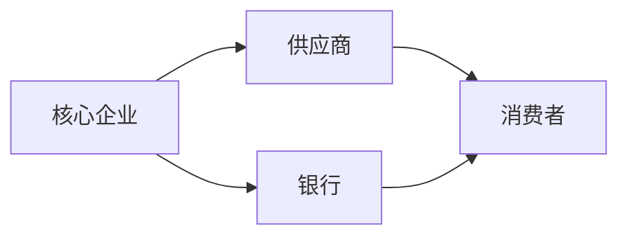
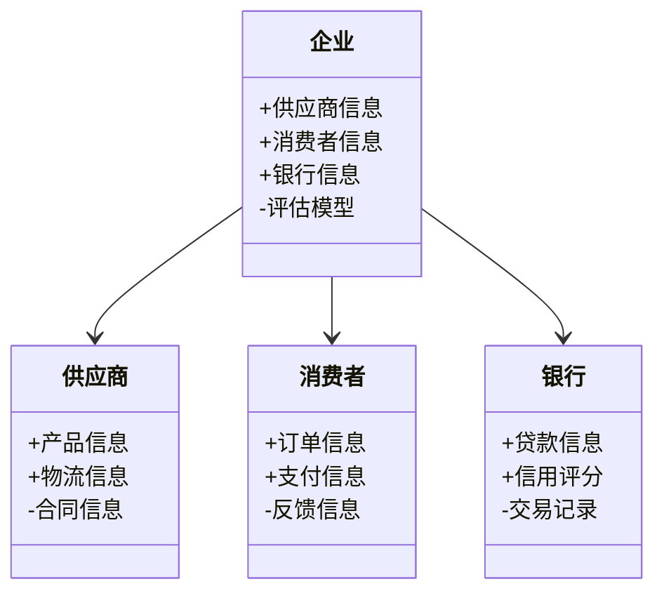

                 


# 《企业估值中的区块链供应链金融评估》

---

## 关键词：
企业估值、区块链、供应链金融、数学模型、算法原理、系统架构

---

## 摘要：
本文深入探讨了区块链技术在供应链金融评估中的应用，结合企业估值的理论与实践，分析了区块链如何提升供应链金融的透明度与效率。通过构建数学模型和算法，本文提出了基于区块链的供应链金融评估方法，并通过案例分析展示了该方法的实际应用价值。文章内容涵盖区块链与供应链金融的核心概念、评估模型的设计与实现、系统架构的优化以及项目实战的详细步骤，为读者提供了从理论到实践的全面指导。

---

## 第一部分: 企业估值中的区块链供应链金融评估概述

---

### 第1章: 区块链与供应链金融的结合

#### 1.1 区块链技术的基本概念
- 1.1.1 区块链的定义与特点
  - 去中心化、不可篡改、透明性、可追溯性
- 1.1.2 区块链的核心技术原理
  - 区块链的工作原理：区块、链、共识机制、智能合约
- 1.1.3 区块链在金融领域的应用
  - 比特币、以太坊、智能合约在金融中的应用

#### 1.2 供应链金融的基本概念
- 1.2.1 供应链金融的定义与特点
  - 定义：通过整合企业上下游资源，提供融资支持
  - 特点：依赖信任关系、涉及多方协作、资金流动复杂
- 1.2.2 供应链金融的主要模式
  - 应收账款融资、存货融资、订单融资
- 1.2.3 供应链金融在企业估值中的作用
  - 提供透明的融资渠道、优化资金流动、降低企业估值风险

#### 1.3 区块链与供应链金融的结合
- 1.3.1 区块链技术在供应链金融中的应用场景
  - 贸易数据上链、智能合约自动执行、融资流程优化
- 1.3.2 区块链如何提升供应链金融的透明度与效率
  - 实现数据共享、减少信任成本、自动化执行合同
- 1.3.3 区块链在供应链金融中的优势与挑战
  - 优势：去中心化、不可篡改、提高透明度
  - 挑战：技术复杂性、数据隐私问题、监管合规性

#### 1.4 本章小结
- 区块链技术为供应链金融提供了新的解决方案，通过提高透明度和效率，优化了企业估值中的关键环节。

---

### 第2章: 区块链供应链金融评估的核心概念

#### 2.1 区块链供应链金融评估的背景
- 2.1.1 企业估值中的供应链金融问题
  - 资金流动不透明、估值数据不准确、融资风险高
- 2.1.2 区块链技术如何解决供应链金融评估中的痛点
  - 提供实时数据、降低信息不对称、优化估值模型
- 2.1.3 区块链供应链金融评估的边界与外延
  - 确定评估范围：从核心企业到上下游供应商
  - 外延：扩展到企业整体估值

#### 2.2 核心概念与联系
- 2.2.1 区块链供应链金融评估的实体关系图

- 2.2.2 区块链供应链金融评估的领域模型


#### 2.3 核心概念的数学模型
- 2.3.1 供应链金融评估的数学模型
$$ 企业价值 = \sum_{t=1}^{n} \frac{现金流_t}{(1 + r)^t} $$
其中，$r$ 是折现率，$现金流_t$ 是第 $t$ 年的现金流。

- 2.3.2 区块链技术对模型的优化
  - 智能合约自动执行：确保融资流程的透明性和自动化
  - 数据不可篡改：提高估值数据的准确性

#### 2.4 本章小结
- 区块链供应链金融评估通过优化数据共享和流程自动化，显著提升了企业估值的准确性和效率。

---

## 第二部分: 区块链供应链金融评估的算法原理与系统架构

---

### 第3章: 区块链供应链金融评估的算法原理

#### 3.1 供应链金融评估的数学模型
- 3.1.1 现金流贴现模型
$$ 企业价值 = \sum_{t=1}^{n} \frac{CF_t}{(1 + r)^t} $$
- 3.1.2 概率论在供应链金融评估中的应用
  - 贷款违约概率（PD）的计算
  - 预期损失（EL）的计算
$$ EL = PD \times LGD \times 暂时未偿还的贷款余额 $$

#### 3.2 区块链技术在算法中的应用
- 3.2.1 区块链如何确保数据的真实性和完整性
  - 区块链的不可篡改性
- 3.2.2 区块链如何实现智能合约的自动执行
  - 智能合约的工作流程：触发条件、执行操作、记录结果

#### 3.3 算法实现的流程
- 3.3.1 数据采集与处理
  - 从区块链中提取交易数据
  - 数据清洗与预处理
- 3.3.2 模型训练与优化
  - 使用历史数据训练模型参数
  - 调整模型参数以提高准确性
- 3.3.3 结果输出与可视化
  - 生成企业估值报告
  - 可视化展示关键指标

#### 3.4 本章小结
- 区块链技术通过确保数据真实性和智能合约自动执行，显著优化了供应链金融评估的算法流程。

---

### 第4章: 区块链供应链金融评估的系统架构设计

#### 4.1 系统架构的总体设计
- 4.1.1 系统功能模块划分
  - 数据采集模块、智能合约模块、评估模块、可视化模块
- 4.1.2 系统架构图


#### 4.2 系统功能设计
- 4.2.1 数据采集模块
  - 从区块链中获取交易数据
  - 数据清洗与预处理
- 4.2.2 智能合约模块
  - 设计智能合约实现融资流程自动化
  - 智能合约的编写与部署
- 4.2.3 评估模块
  - 训练数学模型并进行企业估值
  - 输出评估结果
- 4.2.4 可视化模块
  - 生成可视化报告
  - 展示关键指标

#### 4.3 系统架构优化
- 4.3.1 区块链的选择与配置
  - 使用以太坊或fabric等区块链框架
- 4.3.2 智能合约的优化
  - 提高智能合约的执行效率
  - 降低智能合约的运行成本

#### 4.4 本章小结
- 系统架构设计为区块链供应链金融评估提供了高效、可靠的实现方案。

---

## 第三部分: 区块链供应链金融评估的项目实战

---

### 第5章: 项目实战: 某汽车制造企业的供应链金融评估

#### 5.1 项目背景
- 某汽车制造企业的供应链金融问题
  - 资金流动不透明
  - 估值数据不准确
- 区块链技术的应用需求
  - 提高透明度
  - 优化资金流动

#### 5.2 环境配置与数据准备
- 5.2.1 环境安装
  - 安装以太坊节点
  - 配置智能合约环境
- 5.2.2 数据收集
  - 从区块链中提取交易数据
  - 数据清洗与预处理

#### 5.3 核心代码实现
- 5.3.1 智能合约实现
```solidity
// SPDX-License-Identifier: MIT
pragma solidity ^0.8.0;

contract SupplyChainFinance {
    struct Supplier {
        address supplierAddress;
        uint256 loanAmount;
        uint256 repaymentDeadline;
    }

    mapping(address => Supplier) suppliers;

    function requestLoan(address _supplier, uint256 _loanAmount) public {
        suppliers[_supplier] = Supplier(_supplier, _loanAmount, block.timestamp + 30 days);
    }

    function repayLoan(address _supplier) public payable {
        require(suppliers[_supplier].repaymentDeadline <= block.timestamp, "Loan not yet due");
        uint256 amount = suppliers[_supplier].loanAmount;
        require(msg.value >= amount, "Insufficient funds");
        delete suppliers[_supplier];
        payable(suppliers[_supplier].supplierAddress).transfer(amount);
    }
}
```
- 5.3.2 评估模型实现
```python
import numpy as np

def calculate_enterprise_value(cash_flows, discount_rate, periods):
    enterprise_value = 0
    for t in range(periods):
        if t >= len(cash_flows):
            cash_flow = 0
        else:
            cash_flow = cash_flows[t]
        enterprise_value += cash_flow / (1 + discount_rate) ** t
    return enterprise_value

# 示例数据
cash_flows = [100, 200, 300]
discount_rate = 0.1
periods = 5

print(calculate_enterprise_value(cash_flows, discount_rate, periods))
```

#### 5.4 实验结果与分析
- 5.4.1 实验结果
  - 企业估值计算结果
  - 智能合约执行结果
- 5.4.2 结果分析
  - 估值结果的准确性
  - 智能合约的执行效率

#### 5.5 本章小结
- 通过实际案例展示了区块链供应链金融评估方法的有效性。

---

## 第四部分: 总结与展望

---

### 第6章: 总结与展望

#### 6.1 总结
- 区块链技术为供应链金融评估提供了新的解决方案
- 提高了企业估值的准确性和效率
- 优化了供应链金融的整体流程

#### 6.2 展望
- 技术的进一步融合：区块链与其他技术（如人工智能）的结合
- 应用场景的扩展：供应链金融在更多行业中的应用
- 监管与政策的支持：区块链技术的合规性与政策支持

#### 6.3 最佳实践 Tips
- 选择合适的区块链框架
- 确保智能合约的安全性
- 优化系统的性能

#### 6.4 本章小结
- 区块链供应链金融评估具有广阔的应用前景，未来将与更多技术结合，推动企业估值的进一步优化。

---

## 结语

区块链供应链金融评估不仅是一项技术挑战，更是一项具有重要现实意义的创新实践。通过本文的深入分析与案例展示，读者可以全面掌握这一领域的核心概念、算法原理和系统架构设计。未来，随着技术的不断进步和应用场景的扩展，区块链供应链金融评估将在企业估值中发挥更加重要的作用。

