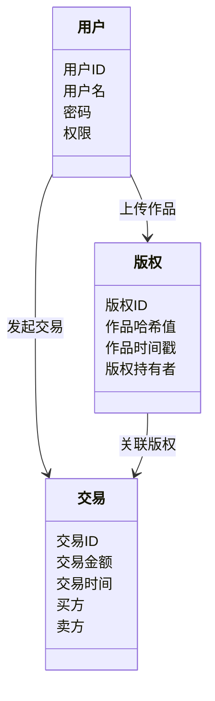
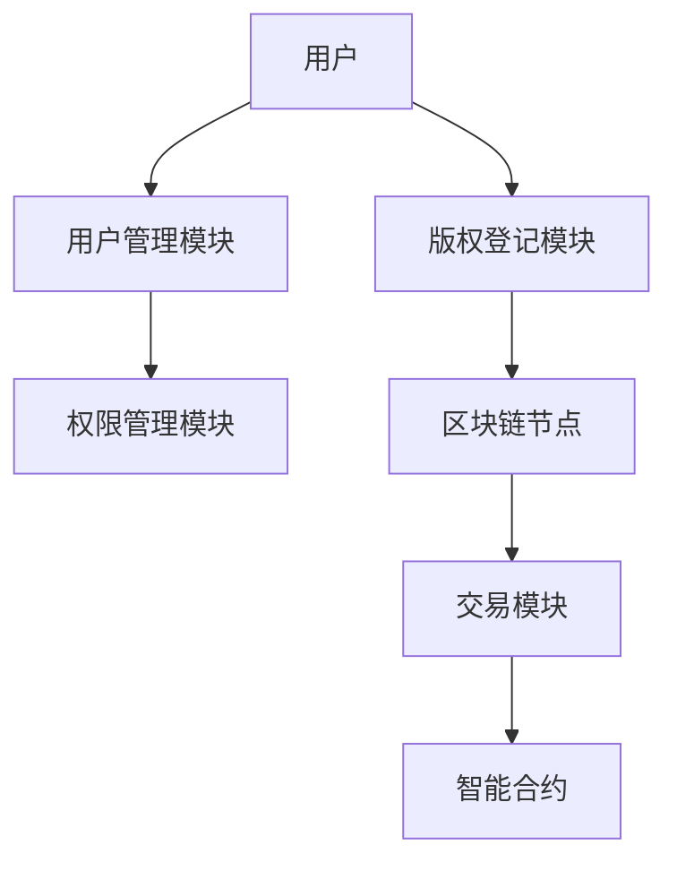
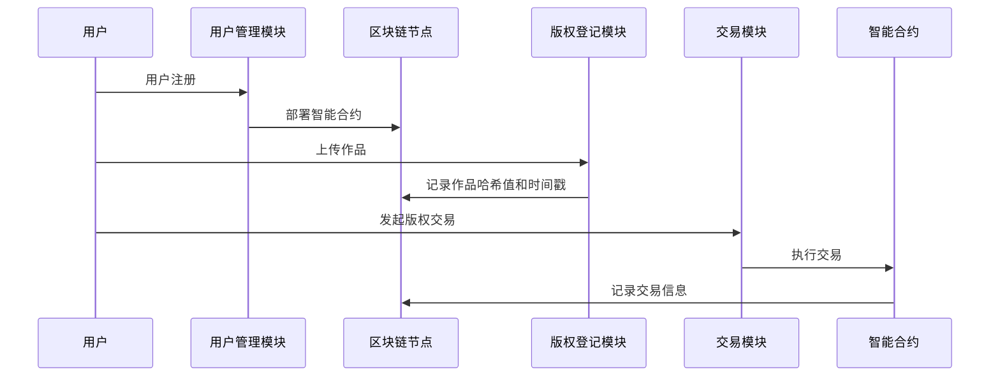

                 


# 企业估值中的区块链数字版权管理平台评估

## 关键词：
区块链、数字版权管理、企业估值、智能合约、共识机制、版权保护

## 摘要：
区块链技术在数字版权管理中的应用为企业估值提供了新的思路和工具。本文从数字版权管理的背景与挑战出发，详细探讨区块链技术在版权登记、交易和保护中的核心作用。通过分析智能合约、共识机制等关键算法，结合实际系统设计与项目案例，本文揭示了区块链数字版权管理平台如何助力企业实现高效、透明的版权评估与管理。

---

## 第1章：区块链数字版权管理平台的背景与挑战

### 1.1 数字版权管理的现状与挑战

#### 1.1.1 数字版权管理的核心问题
数字版权管理（Digital Rights Management，DRM）旨在保护数字内容的版权，防止未经授权的复制、分发和修改。然而，传统 DRM 系统面临以下问题：
- **技术限制**：难以防止内容被非法复制或篡改。
- **信任缺失**：内容创作者与消费者之间缺乏信任机制。
- **成本高昂**：版权登记、交易和分发过程涉及高昂的中间成本。
- **透明度不足**：版权交易过程不透明，容易引发纠纷。

#### 1.1.2 传统版权管理的痛点与不足
传统的版权管理依赖中心化机构（如版权局、律师事务所等），存在以下痛点：
- **效率低下**：版权登记和查询需要大量人工操作，耗时且成本高。
- **信任问题**：中心化机构可能因人为操作或腐败导致信任缺失。
- **数据孤岛**：不同机构之间的数据无法互通，导致信息碎片化。

#### 1.1.3 区块链技术在版权管理中的应用前景
区块链技术通过去中心化、不可篡改和透明性等特性，为数字版权管理提供了革命性的解决方案：
- **去中心化**：消除对中心化机构的依赖，降低信任成本。
- **不可篡改**：区块链上的数据一旦记录，无法被篡改，确保版权信息的真实性和完整性。
- **透明性**：所有交易记录在区块链上公开可查，提升透明度和信任度。

---

### 1.2 区块链技术的基本概念

#### 1.2.1 区块链的定义与核心特点
区块链是一种分布式账本技术，通过去中心化的网络节点共同维护一个不可篡改的账本。其核心特点包括：
- **去中心化**：无需依赖单一中心机构。
- **不可篡改**：数据一旦写入区块链，无法被修改。
- **透明性**：所有交易记录公开可查。
- **安全性**：通过密码学和共识机制确保数据安全。

#### 1.2.2 区块链的共识机制
共识机制是区块链的核心组成部分，用于确保所有节点对账本状态达成一致。常见的共识机制包括：
- **工作量证明（PoW）**：比特币采用的机制，节点通过计算哈希值来证明工作量。
- **权益证明（PoS）**：以太坊2.0采用的机制，节点通过持有代币的权益来获得记账权。
- **实用拜占庭容错（PBFT）**：适用于联盟链的高效共识机制。

#### 1.2.3 智能合约的基本原理
智能合约是区块链上的自动化程序，用于自动执行合同条款。其特点包括：
- **自动化**：无需人工干预，自动执行合同条款。
- **可编程性**：可以根据需求编写复杂的逻辑。
- **安全性**：通过区块链的去中心化特性确保合约的安全性。

---

### 1.3 数字版权管理平台的定义与架构

#### 1.3.1 数字版权管理平台的构成要素
数字版权管理平台通常包括以下要素：
- **用户身份认证**：确保用户身份的真实性和合法性。
- **版权登记**：将作品的版权信息记录在区块链上。
- **版权交易**：通过智能合约实现版权的自动交易和结算。
- **版权保护**：通过区块链技术和数字水印防止内容被非法复制和篡改。

#### 1.3.2 平台的核心功能模块
- **版权登记模块**：用户上传作品并完成版权登记，区块链生成唯一哈希值。
- **版权交易模块**：通过智能合约实现版权的自动交易和结算。
- **版权保护模块**：通过区块链和数字水印技术防止内容被篡改和侵权。

#### 1.3.3 平台的业务流程与价值链条
- **用户注册**：用户通过身份认证后，可以在平台上注册。
- **版权登记**：用户上传作品并完成版权登记，区块链生成唯一哈希值。
- **版权交易**：用户可以通过平台将版权出售给其他用户，交易通过智能合约自动完成。
- **版权保护**：平台通过区块链技术和数字水印技术，确保版权信息的真实性和内容的完整性。

---

### 1.4 区块链在企业估值中的应用价值

#### 1.4.1 区块链技术对企业估值的影响
区块链技术通过提升透明度、减少信任成本和降低交易成本，为企业估值提供了新的视角。例如：
- **版权资产透明化**：通过区块链技术，企业的版权资产可以实时记录和追踪，提升资产透明度。
- **估值准确性**：区块链上的交易记录可以提供准确的市场数据，帮助企业更准确地评估版权资产的价值。

#### 1.4.2 数字版权管理平台的评估维度
数字版权管理平台的评估维度包括：
- **技术性能**：平台的区块链技术实现、智能合约的效率、系统的安全性等。
- **用户体验**：平台的易用性、界面设计、功能完善性等。
- **成本效益**：平台的运营成本、用户使用成本等。

#### 1.4.3 平台评估对企业价值提升的作用
通过评估数字版权管理平台的技术性能、用户体验和成本效益，企业可以优化其版权管理流程，提升资产价值和运营效率。例如：
- **提升资产透明度**：通过区块链技术，企业的版权资产可以实时记录和追踪，提升资产透明度。
- **降低运营成本**：通过智能合约实现自动交易和结算，降低人工干预成本。
- **提升市场竞争力**：通过高效的版权管理，企业可以更快地响应市场需求，提升市场竞争力。

---

## 第2章：区块链数字版权管理平台的核心概念

### 2.1 区块链技术与数字版权管理的结合

#### 2.1.1 区块链在版权登记中的应用
通过区块链技术，数字版权管理平台可以实现作品的唯一性和不可篡改性。例如：
- **作品哈希值存储**：将作品的哈希值存储在区块链上，确保作品的唯一性和真实性。
- **时间戳记录**：通过区块链的时间戳技术，记录作品的创作时间和版权归属。

#### 2.1.2 区块链在版权交易中的作用
通过智能合约，数字版权管理平台可以实现自动化的版权交易和结算。例如：
- **智能合约自动执行**：当版权交易达成后，智能合约自动执行交易条款，完成资金结算和版权转移。
- **透明化交易记录**：区块链上的交易记录公开可查，提升交易透明度和信任度。

#### 2.1.3 区块链在版权保护中的优势
通过区块链技术和数字水印技术，数字版权管理平台可以实现作品的防篡改和防盗用。例如：
- **数字水印技术**：在作品中嵌入数字水印，确保作品的来源和版权归属。
- **区块链溯源**：通过区块链技术，可以追溯作品的创作和交易历史，防止侵权行为。

---

### 2.2 数字版权管理平台的系统架构

#### 2.2.1 平台的整体架构设计
数字版权管理平台通常采用分层架构，包括：
- **数据层**：存储作品的哈希值、时间戳和交易记录等。
- **网络层**：实现节点之间的通信和数据传输。
- **共识层**：实现区块链的共识机制，确保数据的一致性。
- **应用层**：实现用户身份认证、版权登记、交易和保护等功能。

#### 2.2.2 平台的功能模块划分
- **用户管理模块**：负责用户身份认证和权限管理。
- **版权登记模块**：实现作品的哈希值存储和时间戳记录。
- **版权交易模块**：实现版权的智能合约交易和结算。
- **版权保护模块**：实现作品的数字水印嵌入和区块链溯源。

#### 2.2.3 平台的用户角色与权限管理
- **普通用户**：可以进行作品的上传、版权登记和交易。
- **管理员**：负责平台的运维和权限管理。
- **节点角色**：包括矿工、验证节点等，负责区块链的共识和数据存储。

---

### 2.3 区块链数字版权管理的核心算法

#### 2.3.1 智能合约的实现原理
智能合约的实现流程如下：
1. **合约部署**：将智能合约部署到区块链上。
2. **合约调用**：用户通过调用智能合约的 API 进行操作。
3. **合约执行**：智能合约根据用户输入的参数自动执行相应的逻辑。
4. **合约验证**：通过区块链的共识机制，确保合约执行结果的正确性。

#### 2.3.2 区块链共识机制的选择与优化
共识机制的选择直接影响区块链的性能和安全性。以下是对几种常见共识机制的比较：

| 共识机制 | 优点 | 缺点 |
|----------|------|------|
| PoW     | 安全性高 | 能耗高 |
| PoS     | 能耗低 | 安全性较低 |
| PBFT     | 高效性 | 依赖可信节点 |

---

#### 2.3.3 数字版权的加密与解密算法
数字版权的加密与解密算法需要确保作品的安全性和版权的唯一性。例如：
- **哈希算法**：使用 SHA-256 算法对作品进行哈希值计算，确保作品的唯一性。
- **加密算法**：使用 AES 加密算法对作品进行加密，防止未经授权的访问。

---

## 第3章：区块链数字版权管理平台的算法原理

### 3.1 智能合约的实现流程

#### 3.1.1 合约的定义与部署
智能合约的定义和部署流程如下：
1. **合约编写**：使用 Solidity 等智能合约编程语言编写合约代码。
2. **合约部署**：将合约部署到区块链上，并支付部署费用。
3. **合约地址获取**：合约部署完成后，获取合约的地址。

#### 3.1.2 合约的执行与验证
智能合约的执行和验证流程如下：
1. **合约调用**：用户通过调用合约的 API 进行操作。
2. **合约执行**：智能合约根据用户输入的参数自动执行相应的逻辑。
3. **合约验证**：通过区块链的共识机制，确保合约执行结果的正确性。

#### 3.1.3 合约的安全性与可扩展性
智能合约的安全性是区块链数字版权管理平台的核心问题之一。为了提高合约的安全性，可以采取以下措施：
- **代码审计**：对智能合约进行代码审计，发现潜在的安全漏洞。
- **沙盒环境**：在智能合约的执行环境中引入沙盒机制，防止恶意代码的执行。

---

### 3.2 区块链共识机制的数学模型

#### 3.2.1 工作量证明机制（PoW）
PoW 的数学模型如下：
- 概率公式：$$P = \frac{\text{计算能力}}{\text{总计算能力}}$$
- 通过计算哈希值的难度，确保节点需要投入足够的计算资源才能获得记账权。

#### 3.2.2 权益证明机制（PoS）
PoS 的数学模型如下：
- 概率公式：$$P = \frac{\text{持币量}}{\text{总持币量}}$$
- 通过持币量的比例来决定节点的记账权。

#### 3.2.3 共识机制的比较与优化
通过比较 PoW 和 PoS 的优缺点，可以发现：
- **PoW** 的安全性高，但能耗高。
- **PoS** 的能耗低，但安全性较低。
- **PBFT** 的效率高，但依赖可信节点。

---

### 3.3 数字版权的加密与解密算法

#### 3.3.1 哈希算法
哈希算法用于对作品进行唯一标识。例如，使用 SHA-256 算法对作品进行哈希值计算：
$$\text{哈希值} = \text{SHA-256}(\text{作品内容})$$

#### 3.3.2 加密算法
加密算法用于对作品进行加密和解密。例如，使用 AES 加密算法对作品进行加密：
$$\text{加密内容} = \text{AES}(\text{明文}, \text{密钥})$$
$$\text{解密内容} = \text{AES}(\text{加密内容}, \text{密钥})$$

---

## 第4章：区块链数字版权管理平台的系统分析与架构设计

### 4.1 系统功能设计

#### 4.1.1 用户管理模块
用户管理模块的功能设计如下：
- **用户注册**：用户通过身份认证后，可以在平台上注册。
- **用户登录**：用户通过身份认证后，可以登录平台。
- **用户权限管理**：根据用户角色（普通用户、管理员）分配不同的权限。

#### 4.1.2 版权登记模块
版权登记模块的功能设计如下：
- **作品上传**：用户上传作品到平台。
- **版权登记**：平台将作品的哈希值和时间戳记录在区块链上。
- **版权查询**：用户可以通过输入作品的哈希值查询版权信息。

#### 4.1.3 版权交易模块
版权交易模块的功能设计如下：
- **版权发布**：用户可以通过平台发布版权信息。
- **版权购买**：其他用户可以通过平台购买版权。
- **智能合约执行**：通过智能合约实现版权的自动交易和结算。

#### 4.1.4 版权保护模块
版权保护模块的功能设计如下：
- **数字水印嵌入**：在作品中嵌入数字水印，确保作品的来源和版权归属。
- **区块链溯源**：通过区块链技术，可以追溯作品的创作和交易历史，防止侵权行为。

---

### 4.2 系统架构设计

#### 4.2.1 领域模型设计
领域模型设计如下：



#### 4.2.2 系统架构设计
系统架构设计如下：



#### 4.2.3 系统接口设计
系统接口设计如下：
- **用户接口**：提供用户注册、登录、作品上传、版权查询等功能。
- **区块链接口**：提供区块链节点的交互接口，包括哈希值存储、时间戳记录、交易记录等。
- **智能合约接口**：提供智能合约的调用接口，包括合约部署、合约调用、合约验证等。

#### 4.2.4 系统交互设计
系统交互设计如下：



---

## 第5章：区块链数字版权管理平台的项目实战

### 5.1 环境安装与配置

#### 5.1.1 安装Python与区块链框架
安装 Python 和区块链框架（如 Ethereum、Hyperledger 等）：
```bash
# 安装Python
sudo apt-get install python3 python3-pip
# 安装Solidity编译器
npm install -g solc
# 安装Ethereum节点
npm install -g ethereumjs-testrpc
```

#### 5.1.2 配置区块链网络
配置 Ethereum 网络：
```bash
# 启动Ethereum节点
ethereumjs-testrpc --account 1
```

### 5.2 系统核心实现

#### 5.2.1 智能合约实现
智能合约实现（Solidity）：
```solidity
// SPDX-License-Identifier: MIT
pragma solidity ^0.8.0;

contract CopyrightManagement {
    struct Copyright {
        bytes32 hash;
        address owner;
        uint256 timestamp;
    }

    event CopyrightCreated(bytes32 indexed hash, address indexed owner, uint256 timestamp);

    function createCopyright(bytes32 hash, uint256 timestamp) public {
        Copyright memory newCopyright = Copyright(hash, msg.sender, timestamp);
        emit CopyrightCreated(newCopyright.hash, newCopyright.owner, newCopyright.timestamp);
    }
}
```

#### 5.2.2 作品上传与版权登记
作品上传与版权登记流程：
1. 用户上传作品到平台。
2. 平台将作品的哈希值和时间戳记录在区块链上。
3. 平台生成唯一的版权ID。

#### 5.2.3 版权交易实现
版权交易实现（智能合约）：
```solidity
// SPDX-License-Identifier: MIT
pragma solidity ^0.8.0;

contract CopyrightTrading {
    struct Transaction {
        bytes32 copyrightHash;
        address seller;
        address buyer;
        uint256 price;
        uint256 timestamp;
    }

    event CopyrightTraded(bytes32 indexed hash, address indexed seller, address indexed buyer, uint256 price);

    function tradeCopyright(bytes32 hash, address seller, address buyer, uint256 price) public {
        Transaction memory newTransaction = Transaction(hash, seller, buyer, price, block.timestamp);
        emit CopyrightTraded(newTransaction.hash, newTransaction.seller, newTransaction.buyer, newTransaction.price);
    }
}
```

---

### 5.3 实际案例分析与详细解读

#### 5.3.1 案例背景
某企业希望利用区块链技术实现数字版权管理，提升企业估值。通过搭建一个数字版权管理平台，企业可以实现作品的版权登记、交易和保护。

#### 5.3.2 平台实现
通过上述智能合约和系统设计，企业可以实现以下功能：
- **作品上传与版权登记**：用户上传作品到平台，平台将作品的哈希值和时间戳记录在区块链上。
- **版权交易**：通过智能合约实现版权的自动交易和结算。
- **版权保护**：通过区块链技术和数字水印技术，防止内容被非法复制和篡改。

#### 5.3.3 平台评估
通过评估平台的技术性能、用户体验和成本效益，企业可以优化其版权管理流程，提升资产价值和运营效率。例如：
- **提升资产透明度**：通过区块链技术，企业的版权资产可以实时记录和追踪，提升资产透明度。
- **降低运营成本**：通过智能合约实现自动交易和结算，降低人工干预成本。
- **提升市场竞争力**：通过高效的版权管理，企业可以更快地响应市场需求，提升市场竞争力。

---

## 第6章：区块链数字版权管理平台的最佳实践与小结

### 6.1 最佳实践

#### 6.1.1 技术选型
- **区块链平台**：根据需求选择公有链（如 Ethereum）或联盟链（如 Hyperledger）。
- **智能合约语言**：Solidity 是 Ethereum 的推荐语言，适合大多数场景。
- **共识机制**：根据性能和安全性需求选择 PoW、PoS 或 PBFT。

#### 6.1.2 安全注意事项
- **智能合约审计**：在部署智能合约前，必须进行代码审计，确保合约的安全性。
- **权限管理**：合理分配用户权限，防止未经授权的访问。
- **数据加密**：对敏感数据进行加密处理，确保数据的安全性。

#### 6.1.3 性能优化
- **链下存储**：将非关键数据存储在链下，降低区块链的负载。
- **分片技术**：通过分片技术提高区块链的交易吞吐量。
- **缓存机制**：通过缓存机制减少重复查询，提高系统性能。

---

### 6.2 小结与展望

本文详细探讨了区块链数字版权管理平台在企业估值中的应用。通过分析区块链技术的核心原理和数字版权管理平台的系统设计，本文揭示了区块链技术在版权登记、交易和保护中的革命性作用。未来，随着区块链技术的不断发展，数字版权管理平台将在企业估值中发挥更大的作用，为企业提供更高效、更安全的版权管理解决方案。

---

## 总结
通过本文的分析，我们可以看到，区块链技术为数字版权管理提供了全新的思路和工具。通过智能合约、共识机制和区块链存储等技术，企业可以实现数字版权的高效管理，提升资产价值和运营效率。未来，随着区块链技术的不断发展，数字版权管理平台将在企业估值中发挥更大的作用，为企业提供更高效、更安全的版权管理解决方案。

