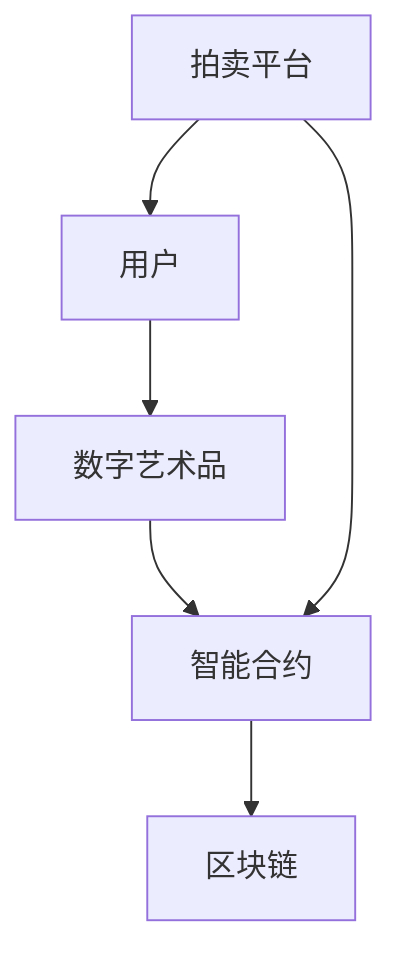
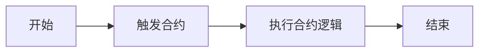

                 


# 区块链数字艺术品拍卖平台的企业估值评估

## 关键词：区块链、数字艺术品、拍卖平台、企业估值、智能合约

## 摘要：本文详细探讨了区块链技术在数字艺术品拍卖平台中的应用，分析了其对企业估值的影响。通过介绍区块链的基本原理、数字艺术品的特性、拍卖平台的架构设计，以及实际案例分析，本文为读者提供了全面的评估方法和实现方案。

---

# 第一部分: 区块链数字艺术品拍卖平台的背景与核心概念

## 第1章: 问题背景与描述

### 1.1 问题背景

#### 1.1.1 数字艺术品的兴起与挑战
数字艺术品的兴起得益于数字技术的发展，艺术家可以通过数字媒介创作独特的作品，如NFT（非同质化代币）。然而，数字艺术品面临的主要挑战包括版权保护、真伪验证和价值评估。

#### 1.1.2 区块链技术在数字艺术品交易中的作用
区块链技术通过去中心化、不可篡改和透明性等特点，解决了数字艺术品交易中的信任问题。它能够记录艺术品的全生命周期，确保其所有权和真实性。

#### 1.1.3 传统拍卖模式的局限性
传统拍卖模式存在信息不对称、交易成本高、流程繁琐等问题。此外，数字艺术品的虚拟特性使得传统拍卖模式难以有效评估其价值。

### 1.2 问题描述

#### 1.2.1 数字艺术品拍卖中的信任问题
数字艺术品的虚拟性和易复制性导致买家难以信任其真实性。传统的中心化机构无法完全解决这一问题，而区块链技术提供了去中心化的信任机制。

#### 1.2.2 现有评估体系的不足
现有的数字艺术品评估体系主要依赖专家经验和市场数据，存在主观性强、数据不透明等问题。这使得企业估值缺乏客观性和准确性。

#### 1.2.3 区块链技术如何解决这些问题
区块链技术通过智能合约和分布式账本，确保数字艺术品的交易记录透明可追溯，解决了信任问题。同时，区块链上的数据可以用于更准确的企业估值。

### 1.3 问题解决与边界

#### 1.3.1 区块链技术如何实现透明与信任
通过区块链，数字艺术品的每一笔交易都会被记录并加密，确保其真实性和不可篡改性。这使得买家和卖家都能信任交易记录的真实性。

#### 1.3.2 数字艺术品拍卖平台的边界与外延
数字艺术品拍卖平台的边界包括用户身份验证、艺术品上链、拍卖过程管理等。外延则涉及法律合规、用户体验优化等方面。

#### 1.3.3 核心要素与组成结构
核心要素包括区块链底层技术、智能合约、数字艺术品存储与展示、用户交互界面、支付与结算系统。

---

## 第2章: 核心概念与联系

### 2.1 区块链技术原理

#### 2.1.1 区块链的基本概念
区块链是一种去中心化的分布式账本技术，通过共识机制保证数据的一致性和不可篡改性。

#### 2.1.2 区块链的核心特征
- 去中心化：数据由多个节点共同维护，不存在单点故障。
- 不可篡改：数据一旦上链，难以被修改。
- 透明性：区块链上的交易对所有参与者可见，确保透明度。

#### 2.1.3 区块链的共识机制
常见的共识机制包括工作量证明（PoW）、权益证明（PoS）等。这些机制确保区块链网络中达成一致。

### 2.2 数字艺术品的属性特征

#### 2.2.1 数字艺术品的定义
数字艺术品是指以数字形式存在的艺术作品，通常以NFT形式存在，具有唯一性和可验证性。

#### 2.2.2 数字艺术品的独特性
数字艺术品的独特性体现在其唯一标识和创作者的签名。通过区块链技术，可以确保每件数字艺术品的唯一性。

#### 2.2.3 数字艺术品的可验证性
通过区块链技术，数字艺术品的来源和所有权可以被验证，确保其真实性和合法性。

### 2.3 核心概念的对比分析

#### 2.3.1 区块链与数字艺术品的关系
区块链作为底层技术，为数字艺术品的交易提供了信任和安全的保障。

#### 2.3.2 智能合约在数字艺术品交易中的作用
智能合约是一种自动执行的合同，可以自动执行交易和支付，确保交易的透明和高效。

#### 2.3.3 数字艺术品拍卖平台的实体关系图



---

## 第3章: 区块链数字艺术品拍卖平台的系统架构

### 3.1 系统功能设计

#### 3.1.1 用户模块
用户模块包括用户注册、登录、个人资料管理等功能。

#### 3.1.2 数字艺术品模块
数字艺术品模块负责艺术品的上链、展示和管理，确保其唯一性和可验证性。

#### 3.1.3 拍卖模块
拍卖模块包括拍卖信息发布、竞拍、成交确认等功能，确保拍卖过程的公平和透明。

#### 3.1.4 支付模块
支付模块集成多种支付方式，确保交易的高效和安全。

#### 3.1.5 智能合约模块
智能合约模块负责自动执行交易和支付，确保合同的自动履行。

### 3.2 系统架构设计

#### 3.2.1 分层架构
系统采用分层架构，包括表现层、业务逻辑层和数据访问层，确保各层职责分明。

#### 3.2.2 微服务架构
采用微服务架构，将系统功能分解为多个独立的服务，提高系统的可扩展性和灵活性。

#### 3.2.3 数据库设计
数据库设计包括用户表、艺术品表、拍卖记录表等，确保数据的完整性和一致性。

#### 3.2.4 接口设计
系统需要设计RESTful API接口，确保与其他模块的高效通信。

#### 3.2.5 交互流程设计
设计拍卖流程的交互流程图，确保用户操作的直观和高效。

---

## 第4章: 算法原理与数学模型

### 4.1 区块链共识机制

#### 4.1.1 工作量证明机制（PoW）
工作量证明机制通过计算哈希值来证明工作量，确保区块链的安全性。

#### 4.1.2 权益证明机制（PoS）
权益证明机制通过持有代币的数量来决定记账权，减少能源消耗。

#### 4.1.3 智能合约的执行流程
智能合约的执行流程包括合约部署、触发、执行和终止，确保自动化的交易过程。

### 4.2 数学模型与公式

#### 4.2.1 智能合约的执行流程图


#### 4.2.2 区块链交易的哈希函数
哈希函数将数据转换为固定长度的哈希值，确保数据的唯一性和完整性。

#### 4.2.3 拍卖价格预测模型
$$ P = a \times \ln(t) + b $$

---

## 第5章: 项目实战与案例分析

### 5.1 环境安装与配置

#### 5.1.1 区块链开发环境搭建
安装以太坊节点、Solidity编译器等开发工具。

#### 5.1.2 智能合约开发工具安装
安装Ganache、Remix等智能合约开发工具。

#### 5.1.3 测试网络配置
配置测试网络，确保智能合约的测试环境正常。

### 5.2 核心代码实现

#### 5.2.1 智能合约编写
```solidity
// SPDX-License-Identifier: MIT
pragma solidity ^0.8.0;

contract DigitalArtAuction {
    struct ArtPiece {
        uint256 tokenId;
        address owner;
        uint256 reservePrice;
        uint256 startTime;
        uint256 endTime;
    }

    ArtPiece[] public auctionList;

    function createAuction(uint256 tokenId, uint256 reservePrice, uint256 duration) public {
        ArtPiece memory newAuction = ArtPiece({
            tokenId: tokenId,
            owner: msg.sender,
            reservePrice: reservePrice,
            startTime: block.timestamp,
            endTime: block.timestamp + duration
        });
        auctionList.push(newAuction);
    }

    function bid(uint256 auctionIndex, uint256 amount) public payable {
        ArtPiece memory auction = auctionList[auctionIndex];
        require(auction.endTime >= block.timestamp, "Auction has ended");
        require(amount >= auction.reservePrice, "Bid amount is too low");
        // 转账逻辑
        (bool sent, ) = auction.owner.call{value: amount}(new bytes(0));
        require(sent, "Failed to send funds");
        auctionList[auctionIndex].owner = msg.sender;
    }
}
```

#### 5.2.2 代码应用解读与分析
智能合约实现了拍卖创建和 bidding 功能，确保拍卖过程的自动化和透明性。

### 5.3 案例分析与详细讲解

#### 5.3.1 项目介绍
以一个数字艺术品拍卖平台为例，展示其架构设计和功能实现。

#### 5.3.2 实际案例分析
分析一个实际的NFT拍卖项目，探讨其成功经验和不足之处。

### 5.4 项目小结
总结项目实施过程中的经验教训，提出改进建议。

---

## 第6章: 最佳实践、小结、注意事项、拓展阅读

### 6.1 最佳实践 tips
- 选择合适的区块链平台和共识机制。
- 确保智能合约的安全性，避免漏洞。
- 提供良好的用户体验，降低用户使用门槛。

### 6.2 小结
区块链技术为数字艺术品拍卖平台提供了信任和透明的解决方案，帮助企业更准确地进行估值。

### 6.3 注意事项
- 确保法律合规，遵守相关法律法规。
- 定期进行系统维护和更新，确保平台的稳定性和安全性。
- 加强用户教育，提升用户的数字资产意识。

### 6.4 拓展阅读
建议读者进一步阅读《区块链技术与NFT应用》和《智能合约开发实战》等书籍，深入理解区块链技术的应用。

---

# 结语

通过本文的详细讲解，读者可以全面了解区块链数字艺术品拍卖平台的架构设计、算法原理和实际应用。希望本文能够为企业的估值和数字化转型提供有价值的参考和指导。

