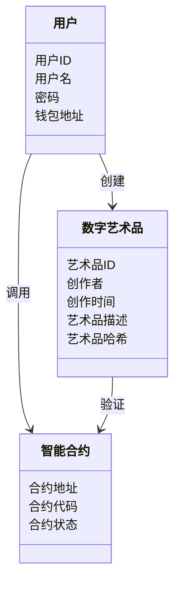
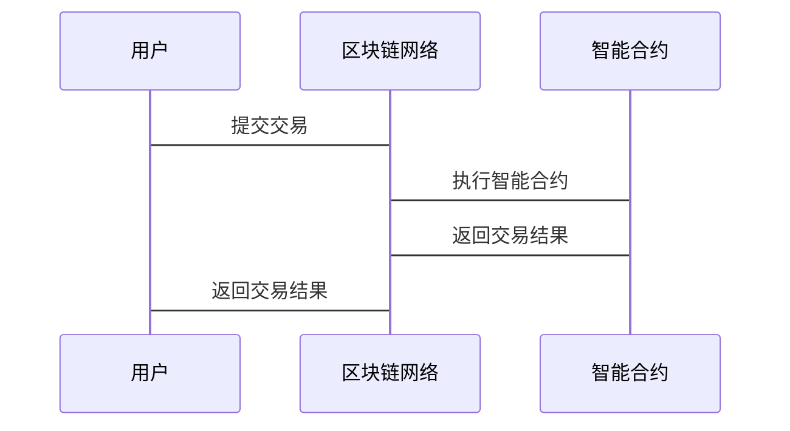

                 


# 企业估值中的区块链数字艺术品认证平台评估

> 关键词：区块链，数字艺术品，企业估值，智能合约，NFT，哈希函数

> 摘要：本文详细探讨了区块链技术在数字艺术品认证中的应用，分析了区块链数字艺术品认证平台的评估方法，结合实际案例和系统架构设计，为企业估值提供了新的思路和方法。

---

## 第一部分: 企业估值中的区块链数字艺术品认证平台背景与概念

### 第1章: 数字艺术品与区块链技术的结合背景

#### 1.1 数字艺术品的现状与挑战

##### 1.1.1 数字艺术品的定义与特点
数字艺术品是指以数字形式存在的艺术作品，包括数字绘画、数字摄影、数字雕塑等。与传统艺术品相比，数字艺术品具有以下特点：
- **数字化存储**：数字艺术品可以以文件形式存储，便于传播和分享。
- **易复制性**：数字艺术品可以轻松被复制和传播，导致其独特性和价值难以保证。
- **版权保护难题**：由于数字艺术品的易复制性，版权保护成为一个重要的问题。

##### 1.1.2 数字艺术品交易的痛点
数字艺术品的交易面临以下痛点：
- **版权归属不清**：由于数字艺术品可以被轻松复制，很难证明其原始创作者和所有者。
- **交易信任缺失**：买家和卖家之间的信任问题导致交易成本高，交易效率低。
- **缺乏透明度**：数字艺术品的交易过程缺乏透明度，容易出现假货和欺诈行为。

##### 1.1.3 区块链技术如何解决数字艺术品的痛点
区块链技术具有去中心化、不可篡改和可追溯等特点，可以有效解决数字艺术品交易中的痛点：
- **确权**：通过区块链技术，可以确保数字艺术品的版权归属明确，防止盗版和侵权。
- **可信交易**：区块链可以提供一个透明的交易平台，确保交易的公正性和可信度。
- **溯源**：区块链可以记录数字艺术品的全生命周期信息，包括创作、交易和流转，便于追溯和管理。

#### 1.2 区块链技术的背景与发展

##### 1.2.1 区块链的基本概念
区块链是一种分布式账本技术，通过去中心化的方式记录和验证数据。区块链的核心特点包括：
- **去中心化**：数据分布在多个节点上，没有单一的中心控制点。
- **不可篡改**：数据一旦记录在区块链上，就无法被篡改。
- **可追溯**：区块链上的数据可以被追溯，确保数据的来源和真实性。

##### 1.2.2 区块链的核心技术特点
区块链的核心技术包括：
- **共识机制**：通过共识机制确保所有节点达成一致，例如比特币使用的PoW（工作量证明）和以太坊使用的PoS（权益证明）。
- **智能合约**：一种自动执行的脚本，可以在区块链上自动执行预设的条件。
- **分布式网络**：数据分布在多个节点上，确保数据的高可用性和安全性。

##### 1.2.3 区块链在数字艺术品领域的应用潜力
区块链在数字艺术品领域的应用潜力主要体现在以下几个方面：
- **版权保护**：通过区块链技术，可以确保数字艺术品的版权归属明确。
- **可信交易**：区块链可以提供一个透明的交易平台，降低交易成本和信任风险。
- **溯源与追踪**：区块链可以记录数字艺术品的全生命周期信息，便于管理和追溯。

#### 1.3 数字艺术品认证平台的必要性

##### 1.3.1 数字艺术品认证的需求
数字艺术品的认证需求主要体现在以下几个方面：
- **确权**：确保数字艺术品的创作者和所有者身份明确。
- **防伪**：防止数字艺术品被篡改或伪造。
- **可信交易**：通过认证平台，可以提高交易的可信度，降低交易风险。

##### 1.3.2 区块链在数字艺术品认证中的优势
区块链在数字艺术品认证中的优势包括：
- **去中心化**：区块链的去中心化特性可以确保认证过程的公正性和透明度。
- **不可篡改**：区块链上的数据无法被篡改，确保认证结果的真实性和可靠性。
- **可追溯**：区块链可以记录数字艺术品的全生命周期信息，便于追溯和管理。

##### 1.3.3 平台评估对企业估值的意义
平台评估对企业估值的意义主要体现在以下几个方面：
- **提高交易效率**：通过区块链技术，可以提高数字艺术品的交易效率，降低交易成本。
- **增强市场信任**：通过平台评估，可以增强市场参与者之间的信任，促进市场的发展。
- **提升企业价值**：通过区块链数字艺术品认证平台，可以提升企业的核心竞争力和市场价值。

#### 1.4 本章小结
本章主要介绍了数字艺术品的现状与挑战，区块链技术的背景与发展，以及数字艺术品认证平台的必要性。通过分析数字艺术品交易中的痛点，我们发现区块链技术可以有效解决这些问题，为企业估值提供新的思路和方法。

---

## 第二部分: 区块链数字艺术品认证平台的核心概念

### 第2章: 区块链数字艺术品认证平台的核心概念

#### 2.1 区块链数字艺术品认证平台的定义

##### 2.1.1 平台的基本功能
区块链数字艺术品认证平台的基本功能包括：
- **数字艺术品上链**：将数字艺术品的元数据（如创作时间、作者、作品描述等）记录在区块链上。
- **认证与验证**：通过区块链技术，验证数字艺术品的真实性和版权归属。
- **交易与流转**：支持数字艺术品的在线交易和流转，确保交易的透明和可信。

##### 2.1.2 平台的用户角色
平台的用户角色包括：
- **创作者**：数字艺术品的创作者，负责将作品上链并进行认证。
- **买家**：数字艺术品的购买者，通过平台购买认证的数字艺术品。
- **平台管理员**：负责平台的运维和管理，包括用户管理、数据存储等。

##### 2.1.3 平台的核心业务流程
平台的核心业务流程包括：
1. **作品上链**：创作者将数字艺术品的元数据上传到平台，经过区块链的验证和存储。
2. **认证与验证**：买家可以通过平台验证数字艺术品的真实性和版权归属。
3. **交易与流转**：买家购买数字艺术品后，平台记录交易信息，并支持作品的流转。

#### 2.2 平台的组成与核心要素

##### 2.2.1 平台的组成
区块链数字艺术品认证平台的组成包括：
- **区块链底层**：提供去中心化的数据存储和验证功能。
- **智能合约**：用于自动执行平台的业务逻辑，例如认证和交易。
- **用户界面**：供用户进行操作，包括作品上链、认证和交易等。

##### 2.2.2 平台的核心要素
平台的核心要素包括：
- **区块链网络**：确保数据的安全性和不可篡改性。
- **智能合约**：实现平台的业务逻辑和自动化操作。
- **用户身份认证**：确保用户的身份真实性和交易的可信度。

##### 2.2.3 平台的功能边界
平台的功能边界包括：
- **上链范围**：仅限于数字艺术品的元数据，不包括作品的实际内容。
- **认证范围**：仅限于数字艺术品的版权归属和交易信息，不涉及作品的实际价值评估。

#### 2.3 平台的边界与外延

##### 2.3.1 平台的边界
平台的边界是指平台的功能范围和数据范围。平台的主要功能是认证和验证数字艺术品的版权归属和交易信息，不涉及数字艺术品的实际内容和市场价值评估。

##### 2.3.2 平台的外部系统交互
平台的外部系统交互包括：
- **数字钱包**：用于存储和管理用户的数字资产。
- **数字市场**：用于数字艺术品的展示和交易。
- **法律机构**：用于法律合规和版权保护。

##### 2.3.3 平台的扩展性与兼容性
平台的扩展性与兼容性包括：
- **兼容性**：支持多种区块链网络，例如以太坊、Solana等。
- **扩展性**：支持更多的功能，例如智能合约的升级和新功能的添加。

#### 2.4 本章小结
本章主要介绍了区块链数字艺术品认证平台的核心概念，包括平台的基本功能、用户角色、核心业务流程、组成与核心要素、边界与外延等。通过这些概念的介绍，我们可以更好地理解平台的设计和实现。

---

## 第三部分: 区块链数字艺术品认证平台的算法原理

### 第3章: 区块链数字艺术品认证平台的算法原理

#### 3.1 区块链技术的去中心化原理

##### 3.1.1 去中心化的基本概念
去中心化是指数据和计算资源分布在多个节点上，而不是集中在单个中心节点。通过去中心化，可以避免单点故障和数据篡改的风险。

##### 3.1.2 去中心化对数字艺术品认证的意义
去中心化对数字艺术品认证的意义在于：
- **防止数据篡改**：通过去中心化的区块链技术，可以防止数据被篡改和伪造。
- **提高数据安全性**：通过分布在多个节点上的数据，可以提高数据的安全性和可靠性。

##### 3.1.3 去中心化与中心化平台的对比
去中心化与中心化平台的对比包括：
- **数据存储**：去中心化平台的数据分布在多个节点上，中心化平台的数据集中在单个中心节点。
- **数据访问**：去中心化平台的数据访问需要通过共识机制，中心化平台的数据访问由中心节点控制。
- **数据安全性**：去中心化平台的数据安全性更高，中心化平台容易受到攻击。

#### 3.2 智能合约在平台中的应用

##### 3.2.1 智能合约的定义与特点
智能合约是一种自动执行的脚本，通过区块链技术实现自动化的业务逻辑。智能合约的特点包括：
- **自动化**：智能合约可以自动执行预设的条件，无需人工干预。
- **不可篡改**：智能合约一旦部署在区块链上，就无法被篡改。
- **透明性**：智能合约的代码是公开的，可以被审计和验证。

##### 3.2.2 智能合约在数字艺术品交易中的作用
智能合约在数字艺术品交易中的作用包括：
- **自动验证**：通过智能合约，可以自动验证数字艺术品的真实性和版权归属。
- **自动交易**：通过智能合约，可以实现数字艺术品的自动交易和流转。

##### 3.2.3 智能合约的安全性与可靠性
智能合约的安全性与可靠性包括：
- **代码审计**：通过代码审计，确保智能合约的安全性和可靠性。
- **测试与验证**：通过测试和验证，确保智能合约的功能正常。
- **法律合规**：确保智能合约的代码符合相关法律法规。

#### 3.3 数字签名与哈希函数

##### 3.3.1 数字签名的原理
数字签名是一种通过加密技术确保数据完整性和真实性的方法。数字签名的原理包括：
- **哈希函数**：将数据转换为哈希值，确保数据的唯一性和完整性。
- **公私钥加密**：通过公私钥加密技术，确保数据的保密性和真实性。

##### 3.3.2 哈希函数在数字艺术品认证中的应用
哈希函数在数字艺术品认证中的应用包括：
- **数据完整性验证**：通过哈希函数，可以验证数字艺术品的数据完整性。
- **数据唯一性验证**：通过哈希函数，可以验证数字艺术品的唯一性。

##### 3.3.3 数学模型与公式
哈希函数的数学模型可以表示为：
$$ H(x) = \text{hash}(x) $$
其中，$x$是输入数据，$H(x)$是哈希值。

数字签名的数学模型可以表示为：
$$ S = \text{Sign}(x, k) $$
其中，$x$是输入数据，$k$是私钥，$S$是签名。

#### 3.4 本章小结
本章主要介绍了区块链数字艺术品认证平台的算法原理，包括去中心化原理、智能合约的应用、数字签名与哈希函数的原理和应用。通过这些算法原理的分析，我们可以更好地理解平台的技术实现。

---

## 第四部分: 区块链数字艺术品认证平台的系统分析与架构设计

### 第4章: 区块链数字艺术品认证平台的系统分析与架构设计

#### 4.1 问题场景介绍

##### 4.1.1 问题背景
数字艺术品的认证和交易面临以下问题：
- **版权归属不清**：数字艺术品的版权归属难以证明。
- **交易信任缺失**：数字艺术品的交易过程缺乏信任。
- **数据安全风险**：数字艺术品的数据容易被篡改和伪造。

##### 4.1.2 问题描述
通过区块链技术，可以解决数字艺术品认证和交易中的痛点，实现数字艺术品的版权保护和可信交易。

#### 4.2 系统功能设计

##### 4.2.1 领域模型（Mermaid 类图）


##### 4.2.2 系统架构设计（Mermaid 架构图）
```mermaid
container 区块链网络 {
    participant 节点1
    participant 节点2
    participant 节点3
}
actor 用户
actor 创作者
actor 买家
actor 平台管理员

用户 --> 区块链网络: 提交交易
创作者 --> 区块链网络: 上链作品
买家 --> 区块链网络: 验证作品
平台管理员 --> 区块链网络: 管理平台
```

#### 4.3 系统接口设计

##### 4.3.1 API 接口
- **提交交易接口**：用于用户提交数字艺术品的交易请求。
- **验证作品接口**：用于验证数字艺术品的真实性和版权归属。
- **上链作品接口**：用于创作者将数字艺术品的元数据上链。

##### 4.3.2 接口设计
- **提交交易接口**：`POST /submit-transaction`
- **验证作品接口**：`GET /verify-artwork`
- **上链作品接口**：`POST /upload-artwork`

#### 4.4 系统交互设计（Mermaid 序列图）


#### 4.5 本章小结
本章主要介绍了区块链数字艺术品认证平台的系统分析与架构设计，包括问题场景、系统功能设计、系统架构设计、系统接口设计和系统交互设计。通过这些设计，我们可以更好地理解平台的技术实现和运行机制。

---

## 第五部分: 区块链数字艺术品认证平台的项目实战

### 第5章: 区块链数字艺术品认证平台的项目实战

#### 5.1 环境安装

##### 5.1.1 区块链平台的选择
选择一个适合的区块链平台，例如以太坊、Solana等。

##### 5.1.2 安装与配置
按照平台的文档，安装和配置区块链环境。

#### 5.2 系统核心实现

##### 5.2.1 智能合约的实现
以下是智能合约的代码示例（Solidity）：
```solidity
// SPDX-License-Identifier: MIT
pragma solidity ^0.8.0;

contract Artwork {
    struct Artwork {
        address payable owner;
        string artist;
        uint256 creationTime;
        string description;
        bytes32 hash;
    }

    mapping(uint256 => Artwork) public artworks;

    function uploadArtwork(uint256 id, string memory artist, uint256 creationTime, string memory description, bytes32 hash) public {
        Artwork memory artwork = Artwork({
            owner: msg.sender,
            artist: artist,
            creationTime: creationTime,
            description: description,
            hash: hash
        });
        artworks[id] = artwork;
    }

    function verifyArtwork(uint256 id) public view returns (bool) {
        Artwork memory artwork = artworks[id];
        return artwork.owner == msg.sender;
    }
}
```

##### 5.2.2 数字艺术品的上链与验证
以下是数字艺术品的上链与验证代码示例：
```python
from web3 import Web3, HTTPProvider

# 初始化区块链节点
web3 = Web3(HTTPProvider('http://localhost:8545'))

# 加载智能合约ABI
abi = [{'inputs': [{'name': 'id', 'type': 'uint256'}, {'name': 'artist', 'type': 'string'}, {'name': 'creationTime', 'type': 'uint256'}, {'name': 'description', 'type': 'string'}, {'name': 'hash', 'type': 'bytes32'}, {'name': 'value', 'type': 'uint256'}, {'name': 'gas', 'type': 'uint256'}, {'name': 'gasPrice', 'type': 'uint256'}, {'name': 'nonce', 'type': 'uint256'}], 'name': 'uploadArtwork', 'outputs': [], 'type': 'function'}, ...]

artwork_contract = web3.eth.contract(address='0x...', abi=abi)

# 上链数字艺术品
artwork_contract.functions.uploadArtwork(1, 'Artist', 1625795200, 'Digital Artwork Description', '0x12345678').transact()

# 验证数字艺术品
result = artwork_contract.functions.verifyArtwork(1).call()
print(result)  # 输出：True 或 False
```

#### 5.3 项目实战总结

##### 5.3.1 实战案例分析
通过上述代码示例，我们可以实现数字艺术品的上链与验证功能。

##### 5.3.2 代码解读与分析
- **智能合约实现**：通过Solidity语言实现智能合约，定义数字艺术品的元数据和相关功能。
- **数字艺术品的上链与验证**：通过Python代码与区块链节点交互，实现数字艺术品的上链和验证。

##### 5.3.3 项目小结
通过项目实战，我们掌握了区块链数字艺术品认证平台的核心技术，包括智能合约的实现、数字艺术品的上链与验证等。

---

## 第六部分: 区块链数字艺术品认证平台的最佳实践

### 第6章: 区块链数字艺术品认证平台的最佳实践

#### 6.1 小结

##### 6.1.1 核心要点回顾
- 区块链技术在数字艺术品认证中的应用
- 智能合约的实现与应用
- 数字签名与哈希函数的原理与应用

##### 6.1.2 项目总结
通过本项目，我们掌握了区块链数字艺术品认证平台的核心技术，包括智能合约的实现、数字艺术品的上链与验证等。

#### 6.2 注意事项

##### 6.2.1 技术实现中的注意事项
- **安全性**：确保智能合约的安全性，防止漏洞被利用。
- **可扩展性**：设计平台时要考虑扩展性，以便未来添加更多功能。

##### 6.2.2 项目实施中的注意事项
- **测试**：在部署平台之前，进行全面的测试，确保平台的功能正常。
- **法律合规**：确保平台符合相关法律法规，特别是版权保护方面的法律法规。

#### 6.3 拓展阅读

##### 6.3.1 拓展阅读资料
- **区块链技术入门与实战**：深入理解区块链技术的核心原理和实现方法。
- **智能合约开发指南**：掌握智能合约的开发技巧和最佳实践。
- **数字艺术品与区块链的结合应用**：了解数字艺术品与区块链技术的更多结合应用。

##### 6.3.2 推荐书籍与资源
- 《区块链开发实战》
- 《智能合约开发指南》
- 《数字艺术品与区块链》

#### 6.4 本章小结
本章主要介绍了区块链数字艺术品认证平台的最佳实践，包括小结、注意事项和拓展阅读。通过这些内容，我们可以更好地理解和应用区块链技术在数字艺术品认证中的应用。

---

## 附录: 参考文献与工具

- **参考文献**
  - 区块链技术入门与实战
  - 智能合约开发指南
  - 数字艺术品与区块链的结合应用

- **工具推荐**
  - **Solidity**：智能合约开发语言
  - **Web3.py**：Python与区块链交互的库
  - **Truffle**：区块链开发框架

---

通过本文的详细讲解，我们可以看到区块链技术在数字艺术品认证中的巨大潜力。通过区块链技术，我们可以实现数字艺术品的版权保护、可信交易和溯源管理，为企业估值提供新的思路和方法。未来，随着区块链技术的不断发展，数字艺术品认证平台将发挥越来越重要的作用。

