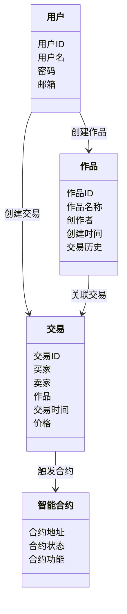
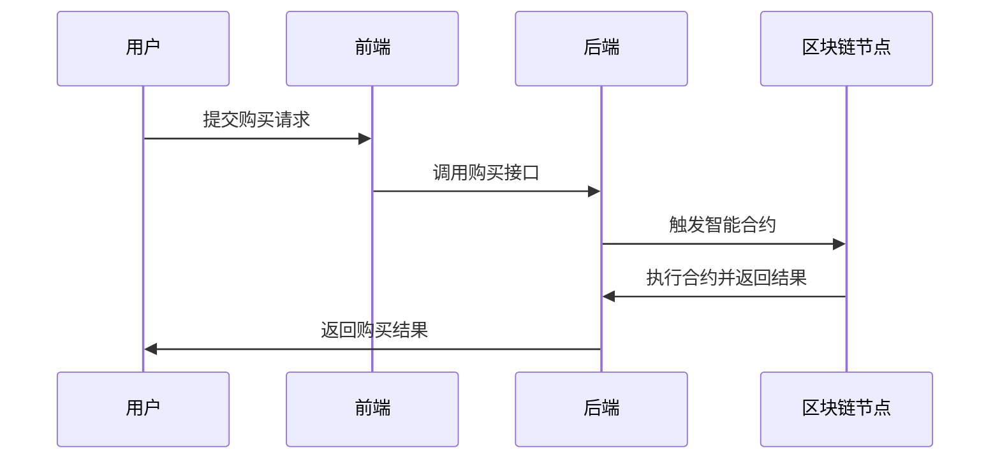

                 


# 《企业估值中的区块链数字艺术平台评估》

> 关键词：企业估值、区块链、数字艺术、NFT、智能合约、数字平台评估、区块链技术

> 摘要：随着区块链技术的快速发展，数字艺术市场迎来了前所未有的变革。区块链技术通过去中心化和不可篡改的特性，为数字艺术的估值和交易提供了全新的解决方案。本文将深入探讨区块链在数字艺术平台评估中的应用，从背景、核心概念、算法原理到系统架构，再到项目实战，全面解析如何利用区块链技术对企业估值进行准确评估。

---

# 第一部分: 区块链数字艺术平台评估的背景与概述

## 第1章: 数字艺术与区块链的结合

### 1.1 数字艺术的定义与特点

#### 1.1.1 数字艺术的起源与发展

数字艺术是一种利用数字技术创作的艺术形式，起源于20世纪末。随着计算机技术的飞速发展，数字艺术逐渐从实验性创作走向商业化应用。数字艺术的特点包括：

- **数字化**：作品以数字形式存在，可以通过计算机进行创作和传播。
- **多样性**：数字艺术涵盖数字绘画、3D建模、虚拟现实艺术等多种形式。
- **互动性**：数字艺术可以通过交互技术与观众进行互动，增强用户体验。

#### 1.1.2 数字艺术的主要形式与应用场景

数字艺术的主要形式包括数字绘画、数字雕塑、数字摄影、数字音乐、数字视频等。应用场景广泛，如游戏开发、电影制作、广告设计、虚拟现实（VR）和增强现实（AR）等领域。

#### 1.1.3 数字艺术的市场价值与挑战

数字艺术市场近年来迅速崛起，尤其是在区块链技术的应用下，数字艺术品的价值得到了显著提升。然而，数字艺术也面临一些挑战，如版权保护、作品的唯一性以及市场的流动性问题。

### 1.2 区块链技术的基本概念

#### 1.2.1 区块链的定义与核心特点

区块链是一种去中心化的分布式账本技术，具有以下核心特点：

- **去中心化**：数据存储在多个节点上，没有单点故障。
- **不可篡改**：数据一旦写入区块链，难以被修改或删除。
- **透明性**：所有交易记录公开透明，但参与者身份可以匿名。
- **智能合约**：区块链上的自动执行脚本，用于自动执行合同条款。

#### 1.2.2 区块链的技术架构与实现原理

区块链的技术架构通常包括以下几个部分：

1. **共识机制**：如工作量证明（PoW）、权益证明（PoS）等，用于确保所有节点达成一致。
2. **区块结构**：包含交易数据、时间戳、哈希值等。
3. **节点网络**：分布式节点组成的网络，负责数据的验证和传播。
4. **智能合约**：在区块链上运行的自动化程序，用于执行特定的业务逻辑。

#### 1.2.3 区块链在数字艺术中的应用潜力

区块链技术为数字艺术提供了以下潜在应用：

- **版权保护**：通过区块链记录数字艺术品的创作和交易历史，确保作品的唯一性和所有权。
- **透明交易**：区块链上的交易记录可以公开查询，增强市场的透明度和信任度。
- **自动化结算**：通过智能合约实现数字艺术品的自动交易和结算，减少中间环节。

## 第2章: 区块链数字艺术平台的兴起

### 2.1 数字艺术平台的现状与问题

#### 2.1.1 数字艺术平台的主要类型

数字艺术平台主要分为以下几种类型：

1. **数字画廊**：展示和销售数字艺术品的在线平台。
2. **NFT市场**：专注于非同质化代币（NFT）的交易市场。
3. **虚拟现实平台**：结合VR技术，提供沉浸式数字艺术体验。

#### 2.1.2 现有平台的痛点与局限性

数字艺术平台在传统模式下存在以下问题：

- **版权问题**：数字艺术品容易被复制和盗用，创作者的权益难以保障。
- **信任缺失**：平台可能存在虚假交易或欺诈行为，影响市场的信任度。
- **流动性低**：数字艺术品的交易市场不够活跃，导致作品价值难以体现。

#### 2.1.3 区块链技术如何解决这些问题

区块链技术通过去中心化和不可篡改的特性，解决了数字艺术平台的痛点：

- **版权保护**：通过区块链记录数字艺术品的创作和交易历史，确保作品的唯一性和所有权。
- **信任机制**：区块链的透明性和不可篡改性增强了平台的可信度。
- **提高流动性**：区块链技术降低了交易成本和门槛，提高了数字艺术品的交易活跃度。

### 2.2 区块链数字艺术平台的核心优势

#### 2.2.1 通过区块链实现数字艺术的唯一性与所有权

区块链技术通过智能合约和哈希值存储，确保每件数字艺术品的唯一性和不可篡改性。这意味着每件数字艺术品都有唯一的标识，且所有权可以被明确记录和转移。

#### 2.2.2 区块链在数字艺术交易中的信任机制

区块链的去中心化特性确保了数字艺术交易的透明性和信任度。每笔交易都会被记录在区块链上，且无法被篡改，从而减少了欺诈行为的发生。

#### 2.2.3 区块链如何提升数字艺术的市场流动性

区块链技术通过智能合约实现了自动化交易和结算，降低了交易成本和门槛，提高了数字艺术品的市场流动性。同时，区块链的透明性吸引了更多的买家和卖家，进一步推动了市场的活跃度。

## 第3章: 区块链数字艺术平台的估值模型

### 3.1 估值模型的基本概念

#### 3.1.1 估值模型的定义与分类

估值模型是用于评估数字艺术平台价值的工具，常见的分类包括：

1. **市场法**：基于市场交易数据进行估值。
2. **成本法**：基于平台的建设成本进行估值。
3. **收益法**：基于平台未来预期收益进行估值。

#### 3.1.2 不同估值模型的优缺点对比

不同估值模型有其各自的优缺点：

- **市场法**：优点是数据透明，易于操作；缺点是受市场波动影响较大。
- **成本法**：优点是基于实际成本，结果较为客观；缺点是难以反映平台的市场价值。
- **收益法**：优点是考虑了平台的未来收益；缺点是需要准确预测未来收益。

#### 3.1.3 选择适合数字艺术平台的估值模型

在选择估值模型时，需要考虑平台的具体情况，如交易数据的完整性、成本的可获得性以及未来收益的预测难度等因素。

### 3.2 区块链数字艺术平台的估值指标

#### 3.2.1 平台用户数量与活跃度

用户数量和活跃度是衡量数字艺术平台价值的重要指标。用户数量越多，平台的交易潜力越大；用户活跃度越高，平台的交易活跃度也越高。

#### 3.2.2 数字艺术品的交易量与价格

交易量和价格是数字艺术平台的核心指标。交易量越大，平台的流动性越强；价格越高，说明数字艺术品的市场认可度越高。

#### 3.2.3 平台的技术架构与安全性

平台的技术架构和安全性直接影响其信任度和稳定性。一个安全稳定的平台更容易吸引用户和交易，从而提升平台的价值。

#### 3.2.4 平台的商业模式与盈利能力

平台的商业模式和盈利能力是评估其长期价值的重要因素。一个具有可持续商业模式和盈利能力的平台，其价值会更高。

## 第4章: 区块链数字艺术平台的评估流程

### 4.1 评估流程的总体框架

区块链数字艺术平台的评估流程通常包括以下几个步骤：

1. **数据收集**：收集平台的交易数据、用户数据、技术架构等信息。
2. **数据清洗**：对收集到的数据进行清洗和预处理，确保数据的准确性和完整性。
3. **数据分析**：通过对数据的分析，评估平台的用户活跃度、交易量、安全性等指标。
4. **模型构建**：根据分析结果，选择合适的估值模型进行建模。
5. **模型验证**：对模型进行验证和调整，确保其准确性和可靠性。
6. **结果输出**：根据模型输出评估结果，并提出改进建议。

### 4.2 数据收集与预处理

#### 4.2.1 数据来源

数据来源包括平台的公开数据、区块链上的交易数据以及第三方数据源等。

#### 4.2.2 数据清洗

数据清洗的目的是去除噪声数据和异常值，确保数据的准确性和一致性。常用的数据清洗方法包括：

- **重复数据处理**：去除重复数据。
- **缺失值处理**：填补或删除缺失数据。
- **异常值处理**：识别并处理异常值。

### 4.3 数据分析与建模

#### 4.3.1 数据分析方法

常用的分析方法包括：

- **描述性分析**：对数据进行总结和描述，了解数据的基本情况。
- **预测性分析**：通过机器学习等方法预测平台的未来表现。
- **诊断性分析**：分析数据背后的原因，找出问题的根源。

#### 4.3.2 估值模型的选择与实现

根据平台的具体情况，选择合适的估值模型。常用的估值模型包括线性回归、随机森林、神经网络等。模型的实现需要结合平台的交易数据和用户数据，进行特征选择和模型训练。

### 4.4 模型验证与优化

#### 4.4.1 模型验证方法

模型验证通常采用交叉验证、留出验证等方法，确保模型的泛化能力。

#### 4.4.2 模型优化

模型优化的目标是提高模型的准确性和稳定性。常用的优化方法包括参数调优、特征优化、模型融合等。

### 4.5 评估结果与建议

#### 4.5.1 评估结果输出

评估结果通常包括平台的当前价值、未来潜力、风险因素等。

#### 4.5.2 改进建议

根据评估结果，提出改进建议，如优化平台的技术架构、提升用户体验、加强市场推广等。

---

# 第二部分: 区块链数字艺术平台的算法原理

## 第5章: 区块链数字艺术平台的智能合约实现

### 5.1 智能合约的定义与作用

#### 5.1.1 智能合约的定义

智能合约是区块链上的自动化程序，用于自动执行合同条款。它可以在区块链网络上运行，无需中心化的中间人。

#### 5.1.2 智能合约的作用

智能合约在数字艺术平台中的作用包括：

- **自动执行交易**：当满足特定条件时，自动执行交易并转移所有权。
- **确保交易安全**：通过智能合约确保交易的安全性和可靠性。
- **降低交易成本**：通过自动化交易流程，降低交易成本和时间。

### 5.2 智能合约的实现步骤

#### 5.2.1 合约开发环境搭建

智能合约的开发需要搭建合适的开发环境，如安装以太坊的Solidity编译器、以太坊钱包等。

#### 5.2.2 合约功能设计

根据数字艺术平台的需求，设计智能合约的功能模块，如用户注册、作品上架、作品购买、作品转移等。

#### 5.2.3 合约代码实现

使用Solidity语言编写智能合约代码，并进行编译和部署到区块链网络上。

#### 5.2.4 合约测试与调试

通过测试用例对智能合约进行测试和调试，确保其功能的正确性和稳定性。

### 5.3 智能合约的案例分析

#### 5.3.1 智能合约的功能实现

以NFT交易平台为例，智能合约的功能包括：

1. **作品上架**：用户将数字艺术品上架到平台，智能合约记录作品信息和所有权。
2. **作品购买**：买家通过智能合约支付款项，智能合约自动转移作品所有权。
3. **作品转移**：新的所有者可以通过智能合约将作品再次出售或转移。

#### 5.3.2 智能合约的安全性

智能合约的安全性是数字艺术平台的重要保障。需要确保智能合约的代码安全、逻辑正确，避免漏洞和攻击。

## 第6章: 基于区块链的NFT估值模型

### 6.1 NFT估值模型的定义与作用

#### 6.1.1 NFT估值模型的定义

NFT估值模型是一种基于区块链技术的数字艺术品估值方法，通过分析数字艺术品的交易数据、市场趋势、创作者声誉等因素，估算其市场价值。

#### 6.1.2 NFT估值模型的作用

NFT估值模型可以帮助投资者和收藏者准确评估数字艺术品的价值，降低投资风险，提高市场的透明度和信任度。

### 6.2 NFT估值模型的实现步骤

#### 6.2.1 数据收集与预处理

收集数字艺术品的交易数据、市场数据、创作者信息等，进行数据清洗和特征提取。

#### 6.2.2 模型选择与训练

根据数据特点选择合适的估值模型，如线性回归、随机森林、神经网络等，并进行模型训练。

#### 6.2.3 模型验证与优化

通过交叉验证、网格搜索等方法优化模型参数，提高模型的准确性和稳定性。

#### 6.2.4 模型部署与应用

将训练好的模型部署到数字艺术平台，实时评估数字艺术品的市场价值。

### 6.3 NFT估值模型的数学公式

#### 6.3.1 基于线性回归的NFT估值模型

线性回归模型可以表示为：

$$
\text{Value} = \beta_0 + \beta_1 \times \text{Transaction Volume} + \beta_2 \times \text{Creator Reputation} + \epsilon
$$

其中，$\beta_0$是截距，$\beta_1$和$\beta_2$是回归系数，$\epsilon$是误差项。

#### 6.3.2 基于随机森林的NFT估值模型

随机森林是一种基于决策树的集成学习方法，适合处理高维数据和非线性关系。NFT估值模型可以通过随机森林算法实现，具体步骤如下：

1. **数据预处理**：对交易数据、用户数据等进行清洗和特征提取。
2. **模型训练**：使用训练数据训练随机森林模型。
3. **模型预测**：对新数据进行预测，得到数字艺术品的估值。

#### 6.3.3 基于神经网络的NFT估值模型

神经网络是一种深度学习方法，适合处理复杂的非线性关系。NFT估值模型可以通过卷积神经网络（CNN）或循环神经网络（RNN）实现，具体步骤如下：

1. **数据预处理**：对数字艺术品的图像、文本等进行特征提取和归一化处理。
2. **模型训练**：使用训练数据训练神经网络模型。
3. **模型预测**：对新数据进行预测，得到数字艺术品的估值。

### 6.4 NFT估值模型的案例分析

#### 6.4.1 案例背景

以某知名NFT交易平台为例，分析其数字艺术品的交易数据，包括交易量、价格、创作者声誉等因素。

#### 6.4.2 数据分析

通过数据分析发现，数字艺术品的交易量和创作者声誉对其市场价值有显著影响。因此，选择线性回归模型作为估值模型。

#### 6.4.3 模型实现

使用Python的Scikit-learn库实现线性回归模型，具体代码如下：

```python
from sklearn.linear_model import LinearRegression
from sklearn.metrics import mean_squared_error

# 数据预处理
X = df[['Transaction Volume', 'Creator Reputation']]
y = df['Price']

# 模型训练
model = LinearRegression()
model.fit(X, y)

# 模型预测
y_pred = model.predict(X)

# 模型评估
mse = mean_squared_error(y, y_pred)
print(f"均方误差: {mse}")
print(f"回归系数: {model.coef_}")
print(f"截距: {model.intercept_}")
```

#### 6.4.4 模型优化

通过调整模型参数和特征选择，优化模型的准确性和稳定性。

---

# 第三部分: 区块链数字艺术平台的系统架构设计

## 第7章: 区块链数字艺术平台的系统架构

### 7.1 系统功能设计

#### 7.1.1 领域模型设计

数字艺术平台的领域模型包括用户、作品、交易、智能合约等实体。用mermaid类图表示如下：



#### 7.1.2 系统架构设计

数字艺术平台的系统架构包括前端、后端、区块链节点、数据库等模块。用mermaid架构图表示如下：

```mermaid
archi
    前端 --> 后端: API调用
    后端 --> 区块链节点: 合约调用
    后端 --> 数据库: 数据存储与查询
    区块链节点 --> 数据库: 同步数据
```

#### 7.1.3 系统交互设计

用mermaid序列图表示用户购买数字艺术品的交互流程：



### 7.2 系统接口设计

#### 7.2.1 用户接口

用户接口包括网页端和移动端，提供注册、登录、浏览作品、提交交易等功能。

#### 7.2.2 API接口

平台提供RESTful API接口，供第三方应用调用，如作品上架、交易查询、合约调用等。

---

# 第四部分: 区块链数字艺术平台的项目实战

## 第8章: 项目环境与核心代码实现

### 8.1 项目环境搭建

#### 8.1.1 安装以太坊钱包

安装以太坊钱包（如MetaMask），并配置Solidity编译器和以太坊节点。

#### 8.1.2 安装Python开发环境

安装Python解释器、Pip包管理器，并安装必要的库（如Web3.py、Scikit-learn等）。

### 8.2 核心代码实现

#### 8.2.1 智能合约实现

使用Solidity语言编写NFT交易平台的智能合约代码，并进行编译和部署。

#### 8.2.2 后端接口开发

使用Python的Flask框架开发平台的后端接口，实现用户认证、作品管理、交易管理等功能。

#### 8.2.3 前端页面开发

使用React框架开发平台的前端页面，实现用户界面、作品展示、交易功能等。

### 8.3 项目实战案例

#### 8.3.1 项目概述

以一个小型NFT交易平台为例，展示如何利用区块链技术实现数字艺术品的估值和交易。

#### 8.3.2 核心代码解读

1. 智能合约代码（Solidity）：

```solidity
// SPDX-License-Identifier: MIT
pragma solidity ^0.8.0;

contract NFTMarketplace {
    struct NFT {
        uint256 tokenId;
        address owner;
        uint256 price;
    }

    mapping(uint256 => NFT) public nfts;

    function createNFT(uint256 tokenId, uint256 price) public {
        nfts[tokenId] = NFT(tokenId, msg.sender, price);
    }

    function buyNFT(uint256 tokenId) public payable {
        NFT memory nft = nfts[tokenId];
        require(msg.value >= nft.price, "Price too low");
        require(nft.owner != msg.sender, "Already owns this NFT");

        nft.owner = msg.sender;
        nfts[tokenId] = nft;
    }
}
```

2. 后端接口代码（Python）：

```python
from flask import Flask, request, jsonify
from web3 import Web3

app = Flask(__name__)
web3 = Web3(Web3.HTTPProvider("http://localhost:8545"))

@app.route('/create_nft', methods=['POST'])
def create_nft():
    data = request.json
    contract_address = data['contract_address']
    tokenId = data['token_id']
    price = data['price']
    
    # 调用智能合约创建NFT
    tx_hash = web3.eth.sendTransaction({
        'to': contract_address,
        'value': 0,
        'data': f"0x{web3.keccak('createNFT(uint256,uint256)').hex()}"
                f"{web3.solidityKeccak(['uint256','uint256'], [tokenId, price])}"
    })
    return jsonify({'status': 'success', 'tx_hash': tx_hash.hex()})

@app.route('/buy_nft', methods=['POST'])
def buy_nft():
    data = request.json
    contract_address = data['contract_address']
    tokenId = data['token_id']
    buyer_address = data['buyer_address']
    
    # 调用智能合约购买NFT
    tx_hash = web3.eth.sendTransaction({
        'to': contract_address,
        'value': data['price'],
        'data': f"0x{web3.keccak('buyNFT(uint256)').hex()}"
                f"{web3.solidityKeccak(['uint256'], [tokenId])}"
    })
    return jsonify({'status': 'success', 'tx_hash': tx_hash.hex()})
}
```

#### 8.3.3 案例分析与总结

通过项目实战，验证了区块链技术在数字艺术平台评估中的可行性。智能合约的实现确保了交易的安全性和自动化，NFT估值模型的实现提供了准确的市场估值。

---

# 第五部分: 总结与展望

## 第9章: 总结与展望

### 9.1 总结

本文从背景、核心概念、算法原理、系统架构到项目实战，全面探讨了区块链技术在数字艺术平台评估中的应用。通过智能合约和NFT估值模型的实现，展示了如何利用区块链技术解决数字艺术市场中的痛点，提升平台的估值能力和市场信任度。

### 9.2 展望

随着区块链技术的不断发展，数字艺术市场将迎来更多的创新和变革。未来，可以通过以下方式进一步优化数字艺术平台的估值和交易：

1. **提升平台的用户体验**：优化界面设计，增加交互功能，提高用户的参与度和满意度。
2. **增强平台的安全性**：通过改进智能合约的设计和增加多层验证机制，进一步提升平台的安全性。
3. **扩展平台的生态系统**：引入更多的数字艺术形式和应用场景，丰富平台的内容和功能。
4. **推动行业标准的制定**：通过制定统一的行业标准，提升数字艺术市场的规范性和透明度。

---

# 结语

区块链技术为数字艺术平台的估值和交易提供了全新的解决方案。通过智能合约和NFT估值模型的实现，数字艺术市场将更加透明、安全和高效。未来，随着技术的不断进步和市场的不断发展，数字艺术平台将在区块链技术的助力下，展现出更加广阔的发展前景。

