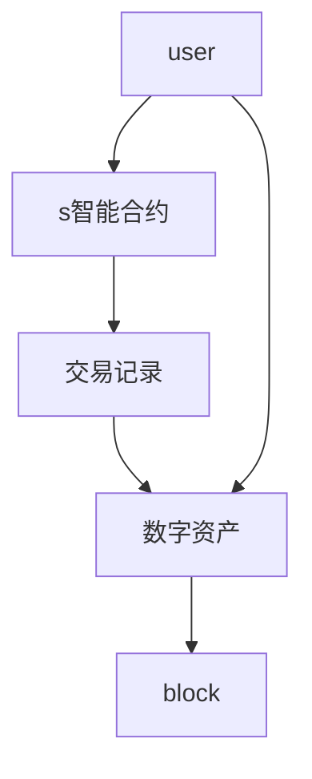
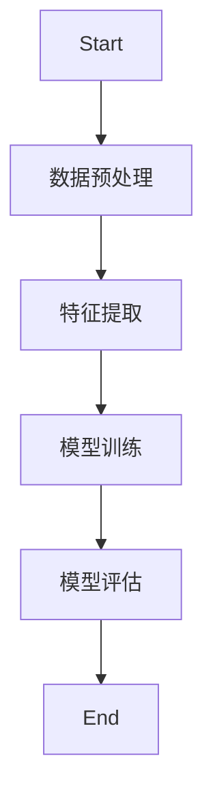
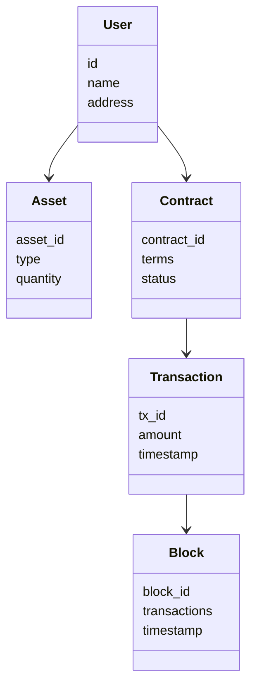

                 


# 企业估值中的区块链数字资产托管平台评估

> **关键词**：企业估值，区块链，数字资产，托管平台，评估模型  
>
> **摘要**：本文深入探讨了区块链技术在数字资产托管平台评估中的应用，结合企业估值的核心需求，详细分析了区块链数字资产托管平台的架构、算法原理及实际案例，为企业估值提供了新的视角和方法。

---

## 第一部分：企业估值中的区块链数字资产托管平台概述

### 第1章：区块链数字资产托管平台的背景与现状

#### 1.1 数字资产托管的现状与挑战

##### 1.1.1 数字资产托管的定义与分类
数字资产托管是指将数字资产（如加密货币、代币等）委托给第三方机构进行保管和管理的过程。根据托管方式的不同，数字资产托管可以分为以下几类：
- **中心化托管**：资产由单一机构管理，如传统银行或交易所。
- **去中心化托管**：资产通过区块链等分布式技术进行管理，用户拥有私钥控制。
- **混合托管**：结合中心化和去中心化的特点，提供更高的安全性和便利性。

##### 1.1.2 当前数字资产托管的主要模式
传统的数字资产托管模式存在以下问题：
- **安全性低**：中心化机构易受黑客攻击或内部欺诈。
- **透明性差**：用户难以追踪资产的流动和管理。
- **信任成本高**：用户需要依赖托管机构的信用。

##### 1.1.3 区块链技术在数字资产托管中的作用
区块链技术通过去中心化、不可篡改和透明性等特点，解决了传统托管模式的痛点。区块链托管模式的优势包括：
- **安全性**：通过分布式账本和智能合约保障资产安全。
- **透明性**：用户可以实时查看资产状态和交易记录。
- **去信任化**：通过技术手段降低对托管机构的信任依赖。

#### 1.2 区块链技术的特点与优势

##### 1.2.1 区块链的核心技术原理
区块链是一种分布式账本技术，通过去中心化的网络节点共同维护数据的一致性。其核心机制包括：
- **分布式账本**：数据分布在多个节点上，避免单点故障。
- **共识机制**：通过算法确保所有节点对数据的一致性达成共识。
- **智能合约**：自动执行预设的业务逻辑，减少人为干预。

##### 1.2.2 区块链的去中心化特性
去中心化是区块链的核心特性之一，它通过消除单一控制点来提高系统的安全性。去中心化的优势包括：
- **抗审查性**：无法通过单点机构进行审查或冻结资产。
- **抗故障性**：单个节点故障不会导致整个系统瘫痪。

##### 1.2.3 区块链的安全性与透明性
区块链通过加密算法和数学原理确保数据的安全性和不可篡改性。其透明性特点使得所有交易记录均可追溯，为数字资产托管提供了更高的信任基础。

#### 1.3 企业估值中的数字资产托管需求

##### 1.3.1 企业估值的基本概念
企业估值是指通过对企业财务状况、市场地位、盈利能力等多方面进行评估，确定企业价值的过程。数字资产作为企业的一项重要资产，其价值评估直接影响企业的整体估值。

##### 1.3.2 数字资产在企业估值中的重要性
随着区块链技术的广泛应用，数字资产（如比特币、以太坊等）逐渐成为企业的重要资产。如何准确评估数字资产的价值，成为企业估值中的关键问题。

##### 1.3.3 区块链数字资产托管平台对估值的影响
区块链数字资产托管平台通过提供透明、安全的资产托管服务，为数字资产的价值评估提供了可靠的基础。以下是其具体影响：
- **提高估值的准确性**：通过区块链技术确保资产记录的真实性。
- **增强估值的可信度**：透明的交易记录和智能合约保障估值过程的公正性。
- **降低估值风险**：通过区块链技术减少资产丢失或被篡改的风险。

---

## 第二部分：区块链数字资产托管平台的核心概念与联系

### 第2章：区块链数字资产托管平台的核心概念

#### 2.1 区块链数字资产托管平台的定义
区块链数字资产托管平台是指基于区块链技术，提供数字资产托管、管理、交易等服务的平台。它通过智能合约和分布式账本技术，实现数字资产的安全托管和价值评估。

#### 2.2 平台的核心组成部分

##### 2.2.1 智能合约
智能合约是区块链平台中的自动执行脚本，用于实现托管、转让等操作。以下是智能合约的关键特性：
- **自动化**：根据预设条件自动执行操作。
- **不可篡改性**：代码一旦部署，无法被修改。
- **透明性**：所有操作记录在区块链上，可被查询和验证。

##### 2.2.2 分布式账本
分布式账本是区块链平台的核心数据结构，记录了所有数字资产的交易和状态。其特点包括：
- **去中心化**：数据分布在多个节点上，避免单点故障。
- **一致性**：所有节点的数据保持一致。
- **可追溯性**：每笔交易都可以被追溯和验证。

##### 2.2.3 资产估值模块
资产估值模块是区块链数字资产托管平台的重要组成部分，用于评估数字资产的价值。其主要功能包括：
- **数据采集**：收集市场数据、交易记录等信息。
- **特征提取**：提取影响资产价值的关键特征。
- **模型训练**：基于机器学习算法构建估值模型。
- **结果输出**：输出数字资产的估值结果。

#### 2.3 平台与企业估值的关系

##### 2.3.1 平台如何支持企业估值
区块链数字资产托管平台通过提供透明、安全的资产托管服务，为数字资产的价值评估提供了可靠的基础。以下是具体支持方式：
- **数据支持**：提供详细的交易记录和资产状态数据，支持精准估值。
- **技术支持**：通过智能合约和区块链技术，确保估值过程的公正性和安全性。
- **服务支持**：提供专业的估值工具和咨询服务，帮助企业完成数字资产估值。

##### 2.3.2 平台如何影响企业估值
区块链数字资产托管平台通过以下方式影响企业估值：
- **提高估值的准确性**：通过区块链技术确保资产记录的真实性。
- **增强估值的可信度**：透明的交易记录和智能合约保障估值过程的公正性。
- **降低估值风险**：通过区块链技术减少资产丢失或被篡改的风险。

#### 2.4 核心概念的ER实体关系图

##### 2.4.1 实体关系图
以下是数字资产托管平台的核心实体及其关系：



---

## 第三部分：区块链数字资产托管平台的算法原理

### 第3章：评估模型的算法原理

#### 3.1 数据采集与预处理

##### 3.1.1 数据来源
数字资产托管平台的估值数据来源包括：
- **市场数据**：如比特币价格、以太坊价格等。
- **交易数据**：如交易时间、交易金额、交易频率等。
- **资产数据**：如资产种类、资产数量、资产状态等。

##### 3.1.2 数据预处理
数据预处理是确保模型准确性的关键步骤，包括：
- **去重**：去除重复数据。
- **清洗**：处理缺失值和异常值。
- **转换**：将数据转换为适合模型输入的形式。

#### 3.2 特征提取与选择

##### 3.2.1 特征提取
特征提取是通过分析数据，提取影响资产价值的关键特征。常见的特征包括：
- **市场特征**：如市场波动率、交易量等。
- **技术特征**：如区块链网络的活跃度、节点数等。
- **资产特征**：如资产的发行量、持有分布等。

##### 3.2.2 特征选择
特征选择是通过筛选关键特征，提高模型的准确性和效率。常用的方法包括：
- **过滤法**：基于统计指标筛选特征。
- **包装法**：通过模型性能优化特征选择。
- **嵌入法**：在模型训练过程中自动提取特征。

#### 3.3 模型训练与评估

##### 3.3.1 模型选择
根据估值需求选择合适的模型。常见的模型包括：
- **线性回归**：适用于简单线性关系的预测。
- **随机森林**：适用于复杂非线性关系的预测。
- **神经网络**：适用于高度复杂的特征关系。

##### 3.3.2 模型训练
以线性回归为例，模型的训练过程如下：
1. **数据准备**：将特征数据转换为数值形式。
2. **参数初始化**：随机初始化模型参数。
3. **模型训练**：通过最小二乘法优化模型参数。
4. **模型评估**：计算模型的预测误差，如均方误差（MSE）。

##### 3.3.3 模型评估
模型评估是通过测试数据验证模型的准确性。常用的评估指标包括：
- **均方误差（MSE）**：衡量预测值与真实值的差距。
- **决定系数（R²）**：衡量模型对数据的拟合程度。

#### 3.4 算法流程图

##### 3.4.1 算法流程
以下是区块链数字资产托管平台评估模型的算法流程图：



---

## 第四部分：区块链数字资产托管平台的系统分析与架构设计

### 第4章：系统功能设计

#### 4.1 问题场景介绍
企业需要对数字资产进行估值，以确保企业估值的准确性。传统的估值方法存在数据不透明、计算复杂等问题，而区块链数字资产托管平台通过提供透明、安全的资产托管服务，为数字资产的估值提供了可靠的基础。

#### 4.2 系统功能设计

##### 4.2.1 领域模型设计
以下是区块链数字资产托管平台的领域模型图：



##### 4.2.2 功能模块设计
区块链数字资产托管平台的功能模块包括：
- **资产登记模块**：用户上传资产信息，系统进行验证和登记。
- **估值计算模块**：基于区块链数据和机器学习算法，计算数字资产的估值。
- **风险评估模块**：评估数字资产的风险，如市场风险、操作风险等。
- **智能合约模块**：通过智能合约实现资产的自动托管和转移。

---

## 第五部分：区块链数字资产托管平台的项目实战

### 第5章：项目实战

#### 5.1 环境配置
以下是项目实战的环境配置：
- **操作系统**：Linux（推荐 Ubuntu 20.04）
- **编程语言**：Python 3.8+
- **区块链框架**：以太坊（Solidity）
- **机器学习库**：Scikit-learn、XGBoost
- **可视化工具**：Matplotlib、Seaborn

#### 5.2 核心代码实现

##### 5.2.1 智能合约实现
以下是智能合约的Solidity代码示例：

```solidity
// SPDX-License-Identifier: MIT
pragma solidity ^0.8.0;

contract AssetManager {
    mapping(address => uint256) private balances;

    function deposit(uint256 amount) external {
        balances[msg.sender] += amount;
    }

    function withdraw(uint256 amount) external {
        require(balances[msg.sender] >= amount, "Insufficient balance");
        balances[msg.sender] -= amount;
    }

    function getBalance(address addr) external view returns (uint256) {
        return balances[addr];
    }
}
```

##### 5.2.2 估值模型实现
以下是基于XGBoost的估值模型实现：

```python
import xgboost as xgb
import pandas as pd
import numpy as np

# 数据加载
data = pd.read_csv('asset_data.csv')

# 特征与标签分离
X = data.drop('value', axis=1)
y = data['value']

# 模型训练
model = xgb.XGBRegressor(n_estimators=100, learning_rate=0.1)
model.fit(X, y)

# 模型预测
predictions = model.predict(X)
```

#### 5.3 测试与结果分析
以下是模型测试结果：

```python
# 模型评估
from sklearn.metrics import mean_squared_error, r2_score

mse = mean_squared_error(y, predictions)
r2 = r2_score(y, predictions)

print(f"均方误差: {mse}")
print(f"决定系数: {r2}")
```

---

## 第六部分：最佳实践与总结

### 第6章：最佳实践

#### 6.1 选择合适的区块链平台
选择适合企业需求的区块链平台是成功实施数字资产托管的关键。建议考虑以下因素：
- **性能**：平台的交易吞吐量和响应时间。
- **安全性**：平台的抗攻击能力和安全性。
- **可扩展性**：平台的可扩展性和灵活性。

#### 6.2 数据隐私保护
在数字资产托管中，数据隐私保护至关重要。建议采取以下措施：
- **加密技术**：对敏感数据进行加密处理。
- **访问控制**：通过权限管理控制数据访问范围。

#### 6.3 智能合约安全
智能合约的安全性直接关系到数字资产的安全。建议采取以下措施：
- **代码审计**：定期对智能合约代码进行安全审计。
- **漏洞修复**：及时修复智能合约中的漏洞。

#### 6.4 持续监控与优化
数字资产托管平台需要持续监控和优化，以应对市场变化和技术进步。建议采取以下措施：
- **实时监控**：实时监控平台的运行状态和交易情况。
- **模型更新**：定期更新估值模型，确保其准确性。

---

## 总结

区块链数字资产托管平台为企业估值提供了新的视角和方法。通过区块链技术的去中心化、安全性、透明性等特点，平台能够实现数字资产的高效托管和精准估值。随着技术的不断进步，区块链数字资产托管平台将在企业估值中发挥越来越重要的作用。

