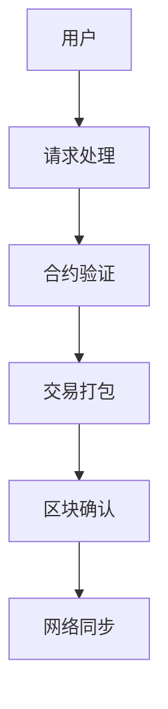

                 


# 《企业估值中的区块链数字资产托管系统评估》

## 关键词：区块链技术、数字资产托管、企业估值、系统评估、区块链节点、智能合约、分布式账本

## 摘要：  
本文探讨了区块链数字资产托管系统在企业估值中的重要性，分析了区块链技术的核心原理及其在数字资产托管中的应用。通过系统架构设计、算法原理、评估方法和实际案例，详细阐述了如何构建和评估高效的数字资产托管系统，为企业估值提供技术支持和实践参考。

---

# 第1章 区块链数字资产托管系统概述

## 1.1 问题背景与定义

### 1.1.1 传统企业估值中的问题与挑战
传统企业估值依赖于财务报表和人工评估，存在数据不透明、估值误差大、难以反映实时价值等问题。数字资产的兴起为企业估值带来了新的维度，但同时也增加了复杂性。

### 1.1.2 区块链数字资产托管的概念与定义
区块链数字资产托管是指将数字资产（如加密货币、代币等）存储在区块链系统中，通过智能合约和分布式账本确保资产的安全性和透明性。

### 1.1.3 问题解决：区块链技术在资产托管中的作用
区块链技术通过去中心化、不可篡改和透明性，解决了传统托管中的信任和安全问题，提高了估值的准确性和实时性。

## 1.2 区块链数字资产托管系统的现状

### 1.2.1 当前数字资产托管的主要模式
- 中心化托管：依赖第三方平台，如 Coinbase。
- 去中心化托管：基于区块链的智能合约，如 DAO。

### 1.2.2 区块链技术在数字资产托管中的应用现状
- 智能合约自动执行托管协议。
- 分布式账本确保资产记录的不可篡改性。

### 1.2.3 系统边界与外延
- 边界：数字资产的存储、交易和估值。
- 外延：与企业的财务系统、估值模型的集成。

## 1.3 区块链数字资产托管与传统资产托管的对比

### 1.3.1 核心要素对比
| 对比维度 | 区块链数字资产托管 | 传统资产托管 |
|----------|---------------------|---------------|
| 安全性   | 高                  | 中            |
| 透明性   | 高                  | 低            |
| 成本     | 低                  | 高            |

### 1.3.2 系统功能对比
- 区块链：支持智能合约自动执行，实时更新资产状态。
- 传统：依赖人工审核和记录，更新延迟。

### 1.3.3 优劣势分析
- 优势：高安全性和透明性，降低估值误差。
- 劣势：技术复杂性高，需要较高的技术投入。

## 1.4 本章小结
区块链数字资产托管系统通过去中心化和智能合约，显著提升了资产托管的安全性和透明性，为企业的估值提供了更可靠的数据支持。

---

# 第2章 区块链数字资产托管系统的核心概念与联系

## 2.1 核心概念原理

### 2.1.1 区块链技术的基本原理
区块链通过分布式账本、共识机制和智能合约实现数据的安全性和一致性。

### 2.1.2 数字资产托管的核心机制
数字资产托管通过智能合约和区块链节点的分布式存储，确保资产的安全性和可追溯性。

### 2.1.3 系统的关键属性特征
- **去中心化**：避免单点故障。
- **不可篡改**：确保数据真实。
- **透明性**：支持实时查询和验证。

## 2.2 核心概念属性对比表

| 对比维度 | 区块链技术 | 数字资产托管 |
|----------|------------|--------------|
| 技术属性 | 分布式账本、共识机制 | 智能合约、去中心化存储 |
| 业务属性 | 资产记录、交易确认 | 资产托管、估值支持 |
| 安全性   | 高          | 高            |

## 2.3 ER实体关系图

```mermaid
erDiagram
    用户 o-|{拥有}| 数字资产
    数字资产 o-|{存储于}| 托管系统
    托管系统 o-|{运行于}| 区块链节点
    用户 --> 托管系统 : 请求托管
    托管系统 --> 区块链节点 : 更新记录
```

## 2.4 本章小结
通过分析区块链技术和数字资产托管的核心概念，明确了系统的架构和各部分之间的关系，为后续的系统设计奠定了基础。

---

# 第3章 区块链数字资产托管系统的算法原理

## 3.1 算法原理概述

### 3.1.1 区块链共识机制
- **工作原理**：节点通过共识机制（如PoW、PoS）达成一致，确保账本的一致性。
- **数学模型**：共识机制的计算复杂度和效率可以通过公式表示：
  $$ T = \frac{H}{\text{hash rate}} $$
  其中，T为完成一个区块的时间，H为哈希值难度，hash rate为节点的计算能力。

### 3.1.2 智能合约的执行流程
- **智能合约执行步骤**：
  1. 用户发起请求。
  2. 合约自动验证请求合法性。
  3. 合约触发相应操作。
  4. 区块链记录交易并更新账本。

### 3.1.3 分布式账本的更新机制
- **更新流程**：
  1. 新交易生成。
  2. 交易被打包成区块。
  3. 区块通过共识机制确认。
  4. 区块链网络同步更新。

## 3.2 算法流程图



## 3.3 本章小结
通过分析区块链的共识机制、智能合约和分布式账本更新机制，明确了数字资产托管系统的技术实现基础。

---

# 第4章 数字资产托管系统的评估方法

## 4.1 评估方法概述

### 4.1.1 资产流动性评估
- **流动性计算**：通过资产的交易频率和市场深度进行评估。
- **公式**：流动性 = （24小时交易量 / 24小时平均价格）× 资产数量。

### 4.1.2 技术安全性评估
- **安全性指标**：包括节点数量、共识机制的安全性、代码审计结果等。
- **公式**：安全性评分 = ∑（各指标得分 × 权重）。

### 4.1.3 合规性评估
- **合规性标准**：符合相关法律法规和行业规范。

## 4.2 评估模型设计

### 4.2.1 综合评估模型
- **模型公式**：
  $$ \text{总评分} = 0.4 \times \text{流动性评分} + 0.3 \times \text{技术评分} + 0.3 \times \text{合规评分} $$

### 4.2.2 评分标准
| 评分维度 | 流动性评分 | 技术评分 | 合规评分 |
|----------|------------|----------|----------|
| 评分范围 | 0-100      | 0-100    | 0-100    |

## 4.3 本章小结
通过构建综合评估模型，明确了数字资产托管系统在企业估值中的评估方法和关键指标。

---

# 第5章 系统架构设计

## 5.1 系统功能设计

### 5.1.1 功能模块
- 用户模块：资产上传、状态查询。
- 托管模块：智能合约管理、资产记录更新。
- 监控模块：实时监控资产状态、交易提醒。

### 5.1.2 功能流程图

```mermaid
graph TD
    用户 --> 托管模块 : 上传资产
    托管模块 --> 区块链节点 : 更新记录
    用户 <-- 托管模块 : 查询状态
    监控模块 --> 用户 : 交易提醒
```

## 5.2 系统架构设计

### 5.2.1 架构图


### 5.2.2 接口设计
- 用户接口：API用于资产上传和查询。
- 托管系统接口：与区块链节点通信的API。

## 5.3 本章小结
通过系统架构设计，明确了数字资产托管系统的功能模块和各部分的交互流程。

---

# 第6章 项目实战

## 6.1 项目介绍

### 6.1.1 项目背景
构建一个基于区块链的数字资产托管系统，用于支持企业估值。

## 6.2 系统实现

### 6.2.1 核心代码实现

```python
# 智能合约实现
class SmartContract:
    def __init__(self):
        self.accounts = {}

    def deposit(self, user, amount):
        if user not in self.accounts:
            self.accounts[user] = 0
        self.accounts[user] += amount
        return True

    def withdraw(self, user, amount):
        if user not in self.accounts or self.accounts[user] < amount:
            return False
        self.accounts[user] -= amount
        return True

    def get_balance(self, user):
        return self.accounts.get(user, 0)
```

### 6.2.2 代码解读
- `SmartContract`类实现数字资产的存取和查询功能。
- `deposit`方法处理资产存入，`withdraw`处理资产取出，`get_balance`查询余额。

## 6.3 实际案例分析

### 6.3.1 案例背景
某企业需要估值其持有的数字资产，选择使用基于区块链的托管系统。

### 6.3.2 案例分析
- 资产存入：用户通过API调用智能合约的`deposit`方法。
- 资产查询：用户通过API调用`get_balance`方法。
- 资产估值：根据托管系统记录的实时数据，结合市场数据进行估值。

## 6.4 本章小结
通过实际项目的实现和案例分析，验证了区块链数字资产托管系统的可行性和有效性。

---

# 第7章 最佳实践与小结

## 7.1 最佳实践

### 7.1.1 技术方面
- 定期进行代码审计和安全测试。
- 选择合适的共识机制和智能合约语言。

### 7.1.2 业务方面
- 确保符合相关法律法规和行业标准。
- 与企业的财务系统无缝集成。

## 7.2 小结
本文详细探讨了区块链数字资产托管系统在企业估值中的应用，通过理论分析和实际案例，展示了系统的可行性和优势。

## 7.3 注意事项
- 确保系统的高可用性和安全性。
- 定期更新系统和智能合约，以应对新的技术挑战。

## 7.4 拓展阅读
- 区块链技术入门与应用
- 智能合约开发指南
- 企业估值方法论

---

# 结语

通过本文的分析和实践，读者可以深入理解区块链数字资产托管系统在企业估值中的重要性，并能够将其应用于实际业务中，为企业创造更大的价值。

