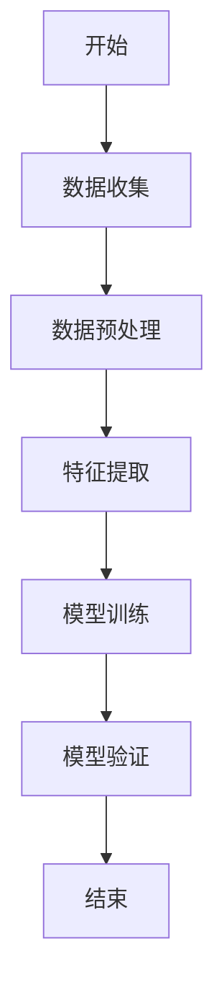
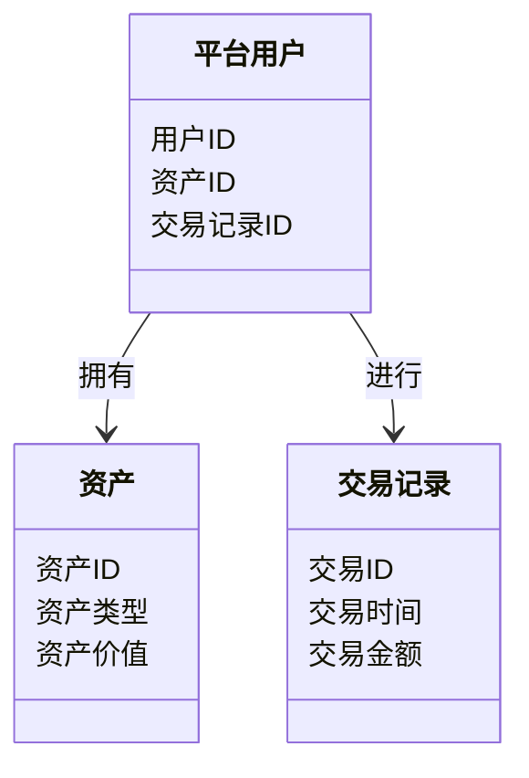
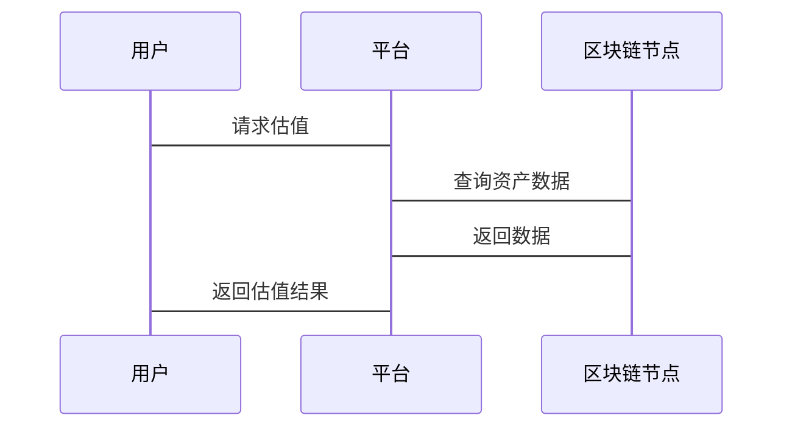

                 


# 《企业估值中的区块链数字资产证券化平台评估》

> 关键词：区块链，数字资产，证券化平台，企业估值，技术实现

> 摘要：本文详细探讨了区块链技术在数字资产证券化平台中的应用，特别是在企业估值中的重要性。文章从背景介绍、核心概念、算法原理、系统架构设计、项目实战以及最佳实践等方面，系统地分析了区块链数字资产证券化平台的评估方法，为读者提供了全面的技术指导和实践参考。

---

# 第一部分: 区块链数字资产证券化平台背景与概述

## 第1章: 区块链数字资产证券化平台概述

### 1.1 数字资产证券化与区块链技术

#### 1.1.1 数字资产证券化的定义与特点

数字资产证券化是指将传统资产（如股权、债权等）转化为数字形式的证券，通过区块链技术实现其发行、流通和管理。其特点包括透明性、可追溯性、去中心化和高效性。

- **透明性**：区块链的公开账本使得所有交易记录均可查，提升信任度。
- **可追溯性**：每笔交易均可追踪，便于监管和审计。
- **去中心化**：通过区块链技术，避免了传统中心化机构的单点故障和权力集中。
- **高效性**：智能合约自动执行，减少中间环节，提升交易效率。

#### 1.1.2 区块链技术在数字资产证券化中的作用

区块链技术为数字资产证券化提供了可靠的技术基础：

- **数据完整性**：区块链的不可篡改性确保了证券数据的真实性和完整性。
- **交易透明性**：所有交易记录在区块链上公开可查，增强透明度。
- **智能合约**：通过智能合约自动执行交易，降低人为干预风险。

#### 1.1.3 数字资产证券化平台的背景与发展趋势

随着区块链技术的成熟和普及，数字资产证券化平台逐渐成为企业估值的重要工具。传统估值方法依赖于中介机构提供的数据，存在信息不对称和数据不准确的问题。而数字资产证券化平台通过区块链技术，实现了数据的实时更新和透明共享，为企业的估值提供了更准确和可靠的依据。

---

### 1.2 企业估值与数字资产证券化平台

#### 1.2.1 传统企业估值方法的局限性

传统企业估值方法通常依赖于历史数据、财务报表和市场分析，存在以下问题：

- **信息不对称**：数据来源单一，难以全面反映企业的实际情况。
- **数据滞后性**：财务报表定期更新，无法实时反映企业动态。
- **人为干预**：估值过程中可能存在人为调整，影响结果的准确性。

#### 1.2.2 数字资产证券化平台对企业估值的影响

数字资产证券化平台通过区块链技术，将企业的资产信息实时记录在区块链上，提供了一个透明、高效、不可篡改的估值环境。平台能够实时更新企业的资产数据，包括股权、债权、知识产权等，为估值提供更全面和准确的信息。

#### 1.2.3 区块链技术如何提升企业估值的准确性

区块链技术通过以下方式提升企业估值的准确性：

- **实时数据更新**：区块链上的数据实时更新，确保估值数据的及时性。
- **数据透明性**：所有数据公开可查，减少信息不对称。
- **智能合约**：通过智能合约自动执行估值模型，减少人为干预。

---

### 1.3 区块链数字资产证券化平台的核心要素

#### 1.3.1 数字资产的发行与流通

数字资产的发行和流通是数字资产证券化平台的核心功能。通过区块链技术，平台可以实现资产的快速发行、转让和结算，提升交易效率。

#### 1.3.2 区块链技术的去中心化特性

去中心化是区块链的核心特性之一。数字资产证券化平台通过去中心化设计，避免了传统中心化机构的单点故障和权力集中，提高了系统的安全性和可靠性。

#### 1.3.3 平台的透明性与可追溯性

区块链的透明性和可追溯性为数字资产证券化平台提供了重要的技术支撑。所有交易记录均可追溯，便于监管和审计，同时提高了平台的公信力。

---

## 第2章: 区块链数字资产证券化平台的背景介绍

### 2.1 问题背景

#### 2.1.1 传统企业估值中的信息不对称问题

传统企业估值过程中，信息来源单一且不透明，导致估值结果可能存在偏差。例如，中介机构提供的财务报表可能存在人为调整，影响估值的准确性。

#### 2.1.2 数字资产证券化平台的兴起

随着区块链技术的发展，数字资产证券化平台逐渐兴起，为企业估值提供了新的技术手段。平台通过区块链技术实现资产的数字化和证券化，提升了估值的准确性和效率。

#### 2.1.3 区块链技术如何解决传统估值问题

区块链技术通过以下方式解决传统估值问题：

- **数据透明性**：区块链上的数据公开可查，减少信息不对称。
- **数据完整性**：区块链的不可篡改性确保了数据的准确性。
- **智能合约**：通过智能合约自动执行估值模型，减少人为干预。

### 2.2 问题描述

#### 2.2.1 数字资产证券化平台的核心功能

数字资产证券化平台的核心功能包括资产发行、资产流通、资产管理和估值服务。平台通过区块链技术实现资产的数字化和证券化，为企业提供高效的估值服务。

#### 2.2.2 区块链技术在平台中的应用

区块链技术在数字资产证券化平台中的应用主要体现在以下几个方面：

- **资产发行**：通过智能合约实现资产的数字化发行。
- **资产流通**：区块链技术支持资产的快速转让和结算。
- **数据存储**：区块链上的数据存储确保了资产信息的安全性和可追溯性。

#### 2.2.3 平台的边界与外延

平台的边界主要集中在数字资产的发行、流通和管理方面，而外延则涉及与传统金融系统的整合，以及与其他区块链项目的协同。

### 2.3 问题解决

#### 2.3.1 数字资产证券化平台的解决方案

数字资产证券化平台的解决方案包括以下几点：

- **区块链技术的应用**：通过区块链技术实现资产的数字化和证券化。
- **智能合约的使用**：通过智能合约自动执行交易和估值。
- **数据的透明性与可追溯性**：通过区块链实现数据的透明和可追溯。

#### 2.3.2 区块链技术在平台中的具体应用

区块链技术在平台中的具体应用包括：

- **资产发行**：通过智能合约实现资产的快速发行。
- **资产流通**：区块链技术支持资产的快速转让和结算。
- **数据存储**：区块链上的数据存储确保了资产信息的安全性和可追溯性。

#### 2.3.3 平台如何提升企业估值的准确性

平台通过以下方式提升企业估值的准确性：

- **实时数据更新**：区块链上的数据实时更新，确保估值数据的及时性。
- **数据透明性**：所有数据公开可查，减少信息不对称。
- **智能合约**：通过智能合约自动执行估值模型，减少人为干预。

### 2.4 核心概念与联系

#### 2.4.1 核心概念原理

数字资产证券化平台的核心概念包括资产数字化、区块链技术和智能合约。这些概念共同作用，实现资产的高效流通和准确估值。

#### 2.4.2 核心概念属性特征对比表格

| 概念           | 中心化       | 去中心化       | 传统证券       | 数字资产证券   |
|----------------|--------------|---------------|----------------|----------------|
| 透明性         | 低           | 高             | 低             | 高             |
| 可追溯性       | 低           | 高             | 低             | 高             |
| 成本           | 高           | 中             | 高             | 低             |
| 效率           | 低           | 高             | 低             | 高             |

#### 2.4.3 ER实体关系图架构

```mermaid
er
  actor 平台用户 {
    <---(1,n) 用户
    <---(1,n) 资产
    <---(1,n) 交易记录
  }
```

---

## 第3章: 区块链数字资产证券化平台的算法原理

### 3.1 评估模型的构建

#### 3.1.1 数据收集与预处理

数据收集与预处理是评估模型构建的基础。首先需要收集企业的各项数据，包括财务数据、市场数据和区块链上的交易数据。然后对数据进行清洗和特征提取，确保数据的准确性和完整性。

#### 3.1.2 特征提取与选择

特征提取与选择是评估模型构建的重要步骤。需要根据企业的具体情况，选择与估值相关的特征，如收入、利润、资产规模等。同时，利用区块链技术提供的实时数据，提取更多的特征，提升模型的准确性。

#### 3.1.3 模型训练与验证

模型训练与验证是评估模型构建的关键环节。通常使用机器学习算法，如线性回归、随机森林等，对特征数据进行训练，并验证模型的准确性和稳定性。通过交叉验证等方法，确保模型的泛化能力。

### 3.2 数字资产证券化平台的评估算法

#### 3.2.1 算法流程图



#### 3.2.2 代码实现

以下是一个简单的线性回归模型的Python代码示例：

```python
import pandas as pd
import numpy as np
from sklearn.linear_model import LinearRegression
from sklearn.metrics import mean_squared_error

# 数据加载
data = pd.read_csv('data.csv')

# 特征提取
X = data[['收入', '利润', '资产规模']]
y = data['估值']

# 模型训练
model = LinearRegression()
model.fit(X, y)

# 模型预测
y_pred = model.predict(X)

# 模型评估
 mse = mean_squared_error(y, y_pred)
 print('均方误差:', mse)
```

#### 3.2.3 算法数学模型

线性回归的数学模型可以表示为：

$$ y = \beta_0 + \beta_1x_1 + \beta_2x_2 + ... + \beta_nx_n + \epsilon $$

其中，$y$ 是目标变量，$x_i$ 是特征变量，$\beta_i$ 是回归系数，$\epsilon$ 是误差项。

---

## 第4章: 系统分析与架构设计方案

### 4.1 问题场景介绍

#### 4.1.1 问题场景描述

数字资产证券化平台需要解决的主要问题包括数据的实时更新、交易的透明性和系统的安全性。通过区块链技术，平台可以实现数据的实时更新和交易的透明性，同时确保系统的安全性。

#### 4.1.2 项目介绍

数字资产证券化平台是一个基于区块链技术的金融平台，旨在为企业提供高效的估值服务。平台通过智能合约实现资产的数字化和证券化，为企业提供准确的估值结果。

### 4.2 系统功能设计

#### 4.2.1 领域模型设计



#### 4.2.2 系统架构设计


### 4.3 系统接口设计

#### 4.3.1 系统接口设计

数字资产证券化平台需要设计以下几个主要接口：

- **资产发行接口**：用于资产的数字化发行。
- **资产转让接口**：用于资产的转让和结算。
- **估值查询接口**：用于查询资产的估值结果。

#### 4.3.2 系统交互流程图



---

## 第5章: 项目实战

### 5.1 环境安装

#### 5.1.1 安装必要的工具

为了运行数字资产证券化平台，需要安装以下工具：

- **Python**：用于数据分析和模型训练。
- **TensorFlow**：用于机器学习模型的训练。
- **Solidity**：用于编写智能合约。
- **Ethereum**：用于部署智能合约和测试。

### 5.2 系统核心实现

#### 5.2.1 核心代码实现

以下是一个简单的智能合约实现示例：

```solidity
// SPDX-License-Identifier: MIT
pragma solidity ^0.8.0;

contract DigitalAsset {
    mapping(address => uint256) public balances;

    function mint(address recipient, uint256 amount) public {
        balances[recipient] += amount;
    }

    function transfer(address recipient, uint256 amount) public {
        require(balances[msg.sender] >= amount, "余额不足");
        balances[msg.sender] -= amount;
        balances[recipient] += amount;
    }
}
```

#### 5.2.2 代码应用解读

上述智能合约代码实现了数字资产的发行和转让功能。`mint`函数用于资产的发行，`transfer`函数用于资产的转让。通过区块链技术，确保了资产的唯一性和不可篡改性。

### 5.3 实际案例分析

#### 5.3.1 案例背景

假设某企业希望通过数字资产证券化平台进行估值。首先，企业需要将资产信息记录在区块链上，然后通过智能合约实现资产的数字化和证券化。

#### 5.3.2 案例分析

企业将股权信息记录在区块链上，通过智能合约实现股权的发行和转让。平台通过区块链上的数据，实时更新企业的股权信息，为估值提供准确的数据支持。

---

## 第6章: 最佳实践与小结

### 6.1 小结

本文详细探讨了区块链技术在数字资产证券化平台中的应用，特别是在企业估值中的重要性。文章从背景介绍、核心概念、算法原理、系统架构设计、项目实战以及最佳实践等方面，系统地分析了区块链数字资产证券化平台的评估方法，为读者提供了全面的技术指导和实践参考。

### 6.2 注意事项

- **数据隐私**：在实际应用中，需要特别注意数据的隐私保护，确保敏感信息不被泄露。
- **模型可解释性**：模型的可解释性是实际应用中的重要考虑因素，需要确保模型结果的透明性和可解释性。
- **技术可行性**：在实际项目中，需要充分考虑技术的可行性和实施难度，确保项目能够顺利落地。

### 6.3 拓展阅读

- **《区块链技术与应用》**：深入探讨区块链技术的核心原理和应用场景。
- **《数字资产证券化：理论与实践》**：系统地介绍数字资产证券化的理论基础和实际应用。
- **《智能合约开发指南》**：详细讲解智能合约的开发和应用。

---

通过本文的分析和实践，读者可以全面了解区块链技术在数字资产证券化平台中的应用，掌握企业估值的核心方法和实现技巧。希望本文能够为相关领域的研究和实践提供有价值的参考。

