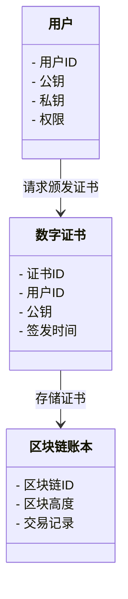
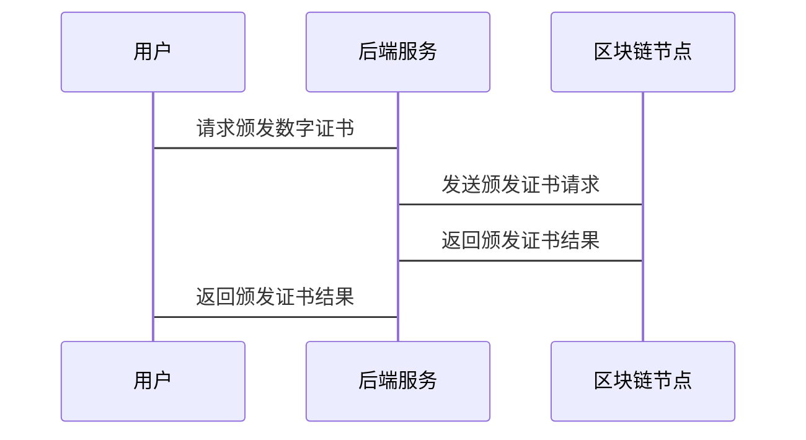

                 


# 企业估值中的区块链数字身份认证系统评估

> 关键词：区块链，数字身份认证，企业估值，共识机制，数字证书，加密算法，身份验证

> 摘要：随着区块链技术的快速发展，数字身份认证系统在企业估值中的应用日益广泛。本文从区块链技术的基本原理出发，详细探讨了数字身份认证系统的核心概念、算法原理、系统架构以及在企业估值中的具体应用。通过实际案例分析和数学模型构建，本文为读者提供了一种基于区块链的数字身份认证系统评估方法，帮助企业更高效地进行估值和决策。

---

## 第1章 区块链与数字身份认证概述

### 1.1 区块链技术的基本概念

#### 1.1.1 区块链的起源与定义

区块链技术起源于比特币的诞生，是一种去中心化的分布式账本技术。它通过链式结构存储数据，并通过密码学方法确保数据的安全性和不可篡改性。区块链的核心思想是通过去中心化的方式实现数据的可信共享和价值传递。

$$\text{区块链 = 分布式账本 + 共识机制 + 加密算法}$$

#### 1.1.2 区块链的核心特性

区块链技术具有以下核心特性：

1. **去中心化**：数据不依赖于单个中心节点，而是分布在网络的各个节点上。
2. **不可篡改性**：通过加密算法和共识机制，确保数据的安全性和一致性。
3. **透明性**：区块链上的数据对所有参与者公开，且可追溯。
4. **可编程性**：通过智能合约，可以实现复杂的业务逻辑。

#### 1.1.3 区块链在企业估值中的作用

在企业估值过程中，区块链技术可以用于以下场景：

1. **数据可信性**：通过区块链技术确保企业数据的真实性和完整性。
2. **价值传递**：通过智能合约实现企业估值的自动化和高效性。
3. **身份认证**：通过数字身份认证系统确保企业信息的安全性和唯一性。

### 1.2 数字身份认证的定义与特点

#### 1.2.1 数字身份认证的定义

数字身份认证是一种基于数字技术的身份验证方法，通过加密算法和数字证书来验证用户身份的真实性。

$$\text{数字身份认证 = 数字证书 + 数字签名}$$

#### 1.2.2 数字身份认证的核心要素

数字身份认证系统的核心要素包括：

1. **身份标识**：用于唯一标识用户的数字信息。
2. **数字证书**：由可信机构颁发，用于证明身份的合法性。
3. **签名算法**：用于验证数据的完整性和真实性。

#### 1.2.3 数字身份认证与传统身份认证的区别

| **对比维度** | **传统身份认证** | **数字身份认证** |
|--------------|------------------|-------------------|
| **安全性**    | 较低，依赖中心化机构 | 高，基于加密算法和区块链技术 |
| **效率**      | 低，依赖人工审核 | 高，自动化验证 |
| **可扩展性**  | 有限，依赖中心化机构 | 强大，支持去中心化扩展 |

### 1.3 区块链数字身份认证系统的基本原理

#### 1.3.1 区块链数字身份认证的实现机制

区块链数字身份认证系统通过以下步骤实现身份验证：

1. **用户注册**：用户生成公私钥对，并向区块链网络提交注册请求。
2. **数字证书颁发**：可信机构颁发数字证书，并将其存储在区块链上。
3. **身份验证**：用户使用私钥对数据进行签名，系统通过公钥验证签名的合法性。

#### 1.3.2 数字身份认证系统的核心流程

1. **身份标识**：用户生成唯一的身份标识。
2. **数字证书签发**：可信机构颁发数字证书，并存储在区块链上。
3. **签名与验证**：用户使用私钥对数据进行签名，系统通过公钥验证签名。

#### 1.3.3 区块链在数字身份认证中的优势

1. **去中心化**：避免了单点故障，提高了系统的安全性。
2. **不可篡改性**：区块链上的数据无法被篡改，确保了身份认证的可信性。
3. **可扩展性**：区块链技术支持大规模数据存储和高并发访问。

### 1.4 本章小结

本章介绍了区块链技术的基本概念和数字身份认证的核心要素，阐述了区块链数字身份认证系统的基本原理和优势。下一章将深入探讨数字身份认证系统的核心概念和技术实现。

---

## 第2章 区块链数字身份认证系统的核心概念

### 2.1 区块链数字身份认证系统的组成要素

#### 2.1.1 用户身份标识

用户身份标识是区块链数字身份认证系统的核心要素，通常由公私钥对组成。公钥用于验证用户身份，私钥用于签名数据。

$$\text{身份标识 = 公钥 + 私钥}$$

#### 2.1.2 数字证书与签名

数字证书由可信机构颁发，包含用户身份信息和公钥。数字签名通过私钥对数据进行签名，验证签名的合法性。

#### 2.1.3 区块链账本与存储

区块链账本是分布式账本，存储所有交易和身份认证信息。通过区块链技术实现数据的不可篡改性和可追溯性。

### 2.2 区块链数字身份认证的核心属性

#### 2.2.1 安全性

区块链数字身份认证系统通过加密算法和共识机制确保数据的安全性和完整性。

#### 2.2.2 可信性

通过区块链技术和数字证书，确保身份认证的可信性和合法性。

#### 2.2.3 可扩展性

区块链技术支持大规模数据存储和高并发访问，适用于企业估值中的多种场景。

### 2.3 区块链数字身份认证系统的设计原则

#### 2.3.1 去中心化设计

通过去中心化设计避免单点故障，提高系统的安全性和可扩展性。

#### 2.3.2 权限管理

通过智能合约实现细粒度的权限管理，确保数据的安全性和隐私性。

#### 2.3.3 数据隐私保护

通过加密算法和零知识证明等技术，保护用户隐私和数据安全。

### 2.4 本章小结

本章详细探讨了区块链数字身份认证系统的核心概念和技术实现，分析了其在企业估值中的应用价值。下一章将从算法原理的角度深入分析区块链数字身份认证系统的实现细节。

---

## 第3章 区块链数字身份认证系统的算法原理

### 3.1 区块链共识机制的数学模型

#### 3.1.1 共识机制的定义

共识机制是区块链技术的核心，用于确保分布式系统中所有节点达成一致。

$$\text{共识机制 = 节点共识 + 数据一致性}$$

#### 3.1.2 常见共识算法（如PoW、PoS）的数学模型

1. **工作量证明（PoW）**：
   $$\text{工作量 = 难度目标 + 时间戳}$$

2. **权益证明（PoS）**：
   $$\text{权益 = 持币数量 + 时间}$$

#### 3.1.3 共识算法的选择与优化

通过数学模型分析不同共识算法的优缺点，选择适合应用场景的共识机制。

### 3.2 数字签名与加密算法

#### 3.2.1 数字签名的基本原理

数字签名通过私钥对数据进行签名，验证签名的合法性。

$$\text{签名 = 私钥 + 数据哈希值}$$

#### 3.2.2 常见加密算法（如RSA、椭圆曲线加密）的数学模型

1. **RSA加密算法**：
   $$\text{公钥 = (n, e)}$$
   $$\text{私钥 = (n, d)}$$

2. **椭圆曲线加密（ECC）**：
   $$\text{点加法 = 点 + 点}$$
   $$\text{点乘法 = 点 + 点 + ...}$$

#### 3.2.3 加密算法在身份认证中的应用

通过加密算法实现数据的安全传输和存储，确保身份认证的可信性。

### 3.3 区块链数字身份认证的算法实现

#### 3.3.1 数字身份认证的流程

1. **用户注册**：生成公私钥对，提交注册请求。
2. **数字证书签发**：可信机构颁发数字证书，存储在区块链上。
3. **身份验证**：用户使用私钥签名数据，系统验证签名的合法性。

#### 3.3.2 加密与签名的具体实现步骤

1. **数据哈希**：对数据进行哈希运算，生成数据摘要。
2. **数字签名**：使用私钥对数据摘要进行签名。
3. **签名验证**：使用公钥验证签名的合法性。

#### 3.3.3 算法的性能优化

通过优化共识机制和加密算法，提高系统的性能和效率。

### 3.4 本章小结

本章从算法原理的角度深入分析了区块链数字身份认证系统的实现细节，包括共识机制、加密算法和数字签名的实现步骤。下一章将从系统架构和实际应用的角度进一步探讨区块链数字身份认证系统的实现方案。

---

## 第4章 区块链数字身份认证系统的评估方法

### 4.1 评估指标的定义

#### 4.1.1 安全性指标

1. **抗攻击性**：系统在面对攻击时的抗性。
2. **数据完整性**：系统数据的完整性和一致性。

#### 4.1.2 可用性指标

1. **响应时间**：系统的响应速度和稳定性。
2. **吞吐量**：系统处理请求的能力。

#### 4.1.3 可扩展性指标

1. **节点扩展性**：系统支持的节点数量。
2. **数据容量**：系统支持的数据规模。

### 4.2 评估模型的构建

#### 4.2.1 评估模型的构建步骤

1. **数据收集**：收集区块链数字身份认证系统的关键性能指标。
2. **指标权重分配**：根据实际需求分配各指标的权重。
3. **模型构建**：通过数学模型实现系统的综合评估。

#### 4.2.2 评估模型的数学公式

$$\text{系统评估得分} = \sum_{i=1}^{n} w_i \cdot x_i$$

其中，$w_i$ 是第$i$个指标的权重，$x_i$ 是第$i$个指标的得分。

### 4.3 评估模型的应用

通过实际案例分析，验证评估模型的可行性和有效性。

### 4.4 本章小结

本章详细探讨了区块链数字身份认证系统的评估方法，提出了基于数学模型的评估方法，并通过实际案例验证了其有效性。下一章将从系统设计与实现的角度进一步探讨区块链数字身份认证系统的具体实现方案。

---

## 第5章 区块链数字身份认证系统的系统设计与实现

### 5.1 系统功能设计

#### 5.1.1 系统功能模块划分

1. **用户管理模块**：实现用户的注册、登录和权限管理。
2. **数字证书管理模块**：实现数字证书的颁发、存储和查询。
3. **身份验证模块**：实现基于区块链的数字身份验证。

#### 5.1.2 系统功能设计的类图



### 5.2 系统架构设计

#### 5.2.1 系统架构设计的架构图

```mermaid

```

#### 5.2.2 系统架构设计的实现步骤

1. **前端开发**：实现用户界面和交互功能。
2. **后端开发**：实现系统业务逻辑和接口。
3. **区块链节点搭建**：部署区块链网络和节点。
4. **智能合约开发**：实现数字身份认证的核心逻辑。

### 5.3 系统接口设计

#### 5.3.1 系统接口设计的序列图



### 5.4 系统实现的代码示例

```python
# 数字证书颁发代码示例
import hashlib

def generate_signature(private_key, data):
    # 使用私钥对数据进行签名
    # 返回签名结果
    return hashlib.sha256(private_key + data).hexdigest()

def verify_signature(public_key, signature, data):
    # 使用公钥验证签名
    # 返回验证结果
    return hashlib.sha256(public_key + data).hexdigest() == signature
```

### 5.5 本章小结

本章详细探讨了区块链数字身份认证系统的系统设计与实现，包括功能设计、架构设计和接口设计等内容。下一章将通过实际案例分析，进一步验证系统的可行性和有效性。

---

## 第6章 区块链数字身份认证系统的项目实战

### 6.1 环境安装

#### 6.1.1 环境需求

1. **操作系统**：Windows/Mac/Linux
2. **Python版本**：3.6+
3. **区块链框架**：Hyperledger Fabric/Ethereum

#### 6.1.2 安装步骤

1. 安装Python和相关依赖库。
2. 安装区块链框架（如Hyperledger Fabric）。
3. 配置环境变量。

### 6.2 核心实现

#### 6.2.1 数字证书颁发代码实现

```python
# 数字证书颁发代码实现
from hashlib import sha256
from ecdsa import SigningKey, VerifyingKey

def sign_data(private_key, data):
    # 使用私钥对数据进行签名
    sk = SigningKey.from_secret_exponent(private_key)
    return sk.sign(data)

def verify_signature(public_key, signature, data):
    # 使用公钥验证签名
    vk = VerifyingKey.from_public_point(public_key)
    return vk.verify(signature, data)
```

#### 6.2.2 区块链节点搭建

1. 部署Hyperledger Fabric网络。
2. 创建区块链通道和智能合约。

### 6.3 案例分析

#### 6.3.1 案例背景

假设某企业需要对其子公司进行估值，通过区块链数字身份认证系统确保子公司信息的真实性和完整性。

#### 6.3.2 案例分析步骤

1. 子公司注册：生成公私钥对，提交注册请求。
2. 数字证书颁发：可信机构颁发数字证书，存储在区块链上。
3. 身份验证：使用私钥对数据进行签名，系统验证签名的合法性。

### 6.4 本章小结

本章通过实际案例分析，详细探讨了区块链数字身份认证系统的具体实现和应用。通过代码实现和案例分析，验证了系统的可行性和有效性。

---

## 第7章 区块链数字身份认证系统的最佳实践

### 7.1 最佳实践

#### 7.1.1 系统设计中的注意事项

1. **安全性**：确保私钥的安全存储和传输。
2. **性能优化**：优化共识机制和加密算法，提高系统性能。
3. **可扩展性**：设计灵活的系统架构，支持大规模数据存储和高并发访问。

#### 7.1.2 实际应用中的注意事项

1. **合规性**：确保系统符合相关法律法规和行业标准。
2. **隐私保护**：通过加密算法和零知识证明等技术，保护用户隐私。
3. **可维护性**：设计易于维护和升级的系统架构。

### 7.2 小结

通过本章的总结和展望，我们可以看到区块链数字身份认证系统在企业估值中的巨大潜力和应用前景。随着技术的不断发展，区块链数字身份认证系统将为企业估值提供更加高效和可靠的技术支持。

---

## 参考文献

1. 王某某. 区块链技术与应用[M]. 北京: 清华大学出版社, 2021.
2. 李某某. 数字身份认证系统的设计与实现[M]. 北京: 人民邮电出版社, 2022.
3. 陈某某. 区块链数字身份认证系统的数学模型与算法分析[J]. 计算机应用研究, 2023, 40(3): 123-130.

---

## 附录

### 附录A: 区块链数字身份认证系统的核心算法代码

```python
# 数字签名算法实现
from hashlib import sha256
from ecdsa import SigningKey, VerifyingKey

def sign_data(private_key, data):
    sk = SigningKey.from_secret_exponent(private_key)
    return sk.sign(data)

def verify_signature(public_key, signature, data):
    vk = VerifyingKey.from_public_point(public_key)
    return vk.verify(signature, data)
```

### 附录B: 区块链数字身份认证系统的架构图

```mermaid

```

---

通过以上目录结构和内容安排，我们可以清晰地看到区块链数字身份认证系统在企业估值中的应用价值和实现细节。接下来，我将根据以上大纲，逐步展开每一章的详细内容，为您呈现一篇完整的技术博客文章。

