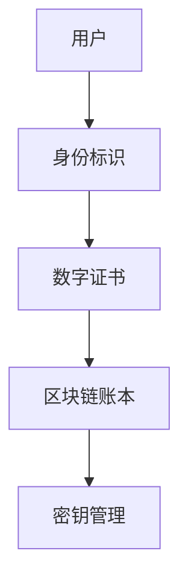
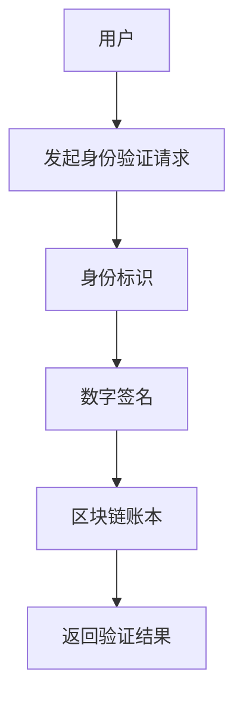
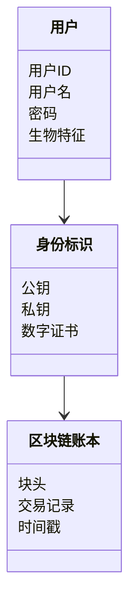
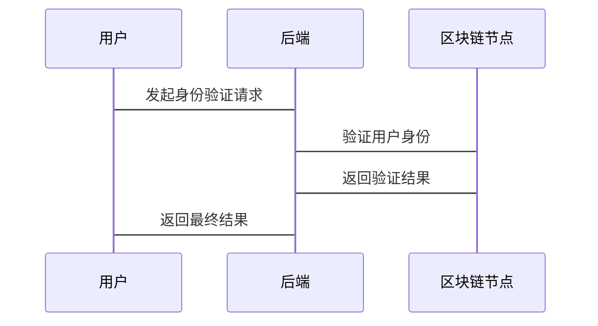

                 


# 企业估值中的区块链数字身份认证系统评估

## 关键词：区块链、数字身份认证、企业估值、身份识别、身份管理、安全评估

## 摘要：区块链技术在企业估值中的应用越来越广泛，特别是在数字身份认证系统方面。本文深入分析了区块链数字身份认证系统在企业估值中的核心作用，详细探讨了其评估方法和应用场景。通过对比传统身份认证与区块链数字身份认证的优劣，结合实际案例，为读者提供了清晰的理论和实践指导。

---

# 第1章: 区块链与数字身份认证概述

## 1.1 区块链技术基础

### 1.1.1 区块链的基本概念

区块链是一种去中心化的分布式账本技术，通过密码学算法确保数据的安全性和不可篡改性。它由多个节点共同维护，每个节点都存储完整的账本副本，数据通过共识机制达成一致。

### 1.1.2 区块链的核心特性

- **去中心化**：没有单一的控制中心，数据由所有节点共同维护。
- **不可篡改性**：数据一旦写入区块链，无法被修改或删除。
- **透明性**：所有交易记录在区块链上公开可见，但用户身份信息可以加密。
- **匿名性**：用户身份可以通过加密地址表示，但可以通过权限控制实现一定程度的可追溯性。

### 1.1.3 区块链的分类与应用场景

区块链可以分为公有链、联盟链和私有链。公有链适用于去中心化的应用场景，如加密货币；联盟链适用于特定组织之间的协作，如供应链金融；私有链适用于企业内部数据管理。

---

## 1.2 数字身份认证的基本概念

### 1.2.1 数字身份的定义与特点

数字身份是用户在数字空间中的唯一标识，通常包括用户ID、密码、生物特征等。与传统身份认证相比，数字身份更注重安全性和便捷性。

### 1.2.2 数字身份认证的常见方式

- **基于密码的身份认证**：使用用户名和密码进行验证。
- **基于证书的身份认证**：使用数字证书进行身份验证。
- **基于生物特征的身份认证**：如指纹、面部识别等。

### 1.2.3 数字身份认证的挑战与解决方案

数字身份认证面临的主要挑战包括安全性不足、隐私泄露和去中心化不足。区块链技术通过去中心化和加密算法，为数字身份认证提供了更安全的解决方案。

---

## 1.3 区块链与数字身份认证的结合

### 1.3.1 区块链在数字身份认证中的优势

- **安全性**：区块链通过去中心化和加密算法，防止身份信息被篡改。
- **不可否认性**：区块链记录的交易数据具有法律效力，确保身份信息的真实性和不可抵赖性。
- **隐私保护**：通过零知识证明等技术，可以在不泄露用户身份信息的前提下完成身份验证。

### 1.3.2 区块链数字身份认证的典型应用场景

- **金融行业**：用于客户身份验证、反洗钱（AML）和反欺诈（KYC）。
- **医疗行业**：用于患者身份识别和医疗数据共享。
- **教育行业**：用于学生身份验证和学历认证。

### 1.3.3 区块链数字身份认证的未来发展趋势

未来，区块链数字身份认证将更加普及，应用场景将不断扩展。同时，随着技术的进步，隐私保护和用户体验优化将是主要发展方向。

---

## 1.4 本章小结

本章介绍了区块链技术和数字身份认证的基本概念，分析了区块链在数字身份认证中的优势，并探讨了其在企业估值中的潜在应用。

---

# 第2章: 区块链数字身份认证系统的核心原理

## 2.1 区块链数字身份认证系统的组成要素

### 2.1.1 用户身份标识

用户在区块链数字身份认证系统中需要有一个唯一的标识，通常通过公钥和私钥对来实现。公钥用于验证身份，私钥用于签名。

### 2.1.2 数字证书与密钥管理

数字证书由证书颁发机构（CA）签发，包含用户的公钥和身份信息。密钥管理是区块链数字身份认证系统的重要组成部分，需要确保私钥的安全存储和使用。

### 2.1.3 区块链账本与身份记录

区块链账本记录了所有用户的交易记录和身份信息，确保数据的完整性和不可篡改性。

---

## 2.2 区块链数字身份认证系统的属性特征对比

### 2.2.1 可扩展性对比

| 特性       | 传统身份认证 | 区块链数字身份认证 |
|------------|--------------|---------------------|
| 扩展性      | 较低         | 较高                |
| 维护成本    | 高           | 低                  |

### 2.2.2 安全性对比

| 特性       | 传统身份认证 | 区块链数字身份认证 |
|------------|--------------|---------------------|
| 数据安全性 | 较低         | 高                  |
| 抗攻击性    | 较弱         | 强                  |

### 2.2.3 去中心化程度对比

| 特性       | 传统身份认证 | 区块链数字身份认证 |
|------------|--------------|---------------------|
| 中心化程度 | 高           | 低                  |
| 单点故障    | 是           | 否                  |

---

## 2.3 区块链数字身份认证系统的ER实体关系图



---

## 2.4 本章小结

本章详细介绍了区块链数字身份认证系统的组成要素和属性特征，并通过对比分析，突出了区块链技术在数字身份认证中的优势。

---

# 第3章: 区块链数字身份认证系统的算法原理

## 3.1 共识算法

### 3.1.1 工作量证明（PoW）

工作量证明是一种通过解决数学难题来验证区块的算法，常见于比特币等加密货币。

### 3.1.2 权益证明（PoS）

权益证明通过持有代币的数量来决定记账权，相比PoW更节能环保。

### 3.1.3 拜占庭容错（BFT）

BFT是一种适用于联盟链的共识算法，通过投票机制达成共识。

---

## 3.2 加密算法

### 3.2.1 哈希函数

哈希函数将任意长度的输入数据映射为固定长度的哈希值，常用于数据完整性验证。

### 3.2.2 数字签名

数字签名通过私钥对数据进行签名，确保数据来源的合法性和完整性。

### 3.2.3 加密通信

加密通信通过加密算法对数据进行加密，确保数据在传输过程中的安全性。

---

## 3.3 区块链数字身份认证系统的工作流程



---

## 3.4 本章小结

本章详细介绍了区块链数字身份认证系统中常用的共识算法和加密算法，并通过流程图展示了其工作流程。

---

# 第4章: 区块链数字身份认证系统的数学模型与公式

## 4.1 数学模型

区块链数字身份认证系统的数学模型通常包括哈希函数、数字签名和加密算法等。以下是一个简单的身份认证模型：

$$
f(x) = \text{hash}(x) + \text{sign}(x, k)
$$

其中，$x$ 是用户输入的身份信息，$k$ 是用户的私钥，$f(x)$ 是最终的身份认证结果。

---

## 4.2 公式与案例分析

例如，使用椭圆曲线数字签名算法（ECDSA）进行身份认证：

$$
y = a x^2 + b x + c
$$

其中，$y$ 是签名结果，$x$ 是用户输入的身份信息，$a$、$b$、$c$ 是算法参数。

---

## 4.3 本章小结

本章通过数学模型和公式，详细分析了区块链数字身份认证系统的实现原理，并结合案例进行了说明。

---

# 第5章: 区块链数字身份认证系统的系统分析与架构设计

## 5.1 系统需求分析

本系统需要实现用户身份认证、数据存储和查询等功能，支持高并发和高可用性。

## 5.2 系统功能设计



---

## 5.3 系统架构设计


---

## 5.4 接口设计与交互流程



---

## 5.5 本章小结

本章通过系统分析与架构设计，详细描述了区块链数字身份认证系统的实现方案。

---

# 第6章: 区块链数字身份认证系统的项目实战

## 6.1 环境搭建

- 操作系统：Linux或Windows
- 区块链框架：以太坊、Hyperledger等
- 开发工具：VS Code、IntelliJ IDEA等

---

## 6.2 核心代码实现

以下是一个简单的区块链数字身份认证系统的Python代码示例：

```python
import hashlib

def hash_func(data):
    return hashlib.sha256(data.encode()).hexdigest()

def sign_message(message, private_key):
    # 使用ECDSA算法进行签名
    # 这里仅展示签名过程，具体实现需要使用相关库
    return hash_func(message)

# 示例用法
message = "用户身份验证"
private_key = "abc123"
signature = sign_message(message, private_key)
print("签名结果：", signature)
```

---

## 6.3 案例分析与详细解读

以某企业的员工身份认证系统为例，详细分析其设计和实现过程。

---

## 6.4 项目小结

本章通过项目实战，展示了如何将理论应用于实际开发，并通过具体案例加深了读者的理解。

---

# 第7章: 区块链数字身份认证系统的最佳实践

## 7.1 小结

本章总结了区块链数字身份认证系统的核心要点和实现方法。

## 7.2 注意事项

- 确保私钥的安全性
- 定期更新数字证书
- 保护用户隐私

## 7.3 拓展阅读

推荐读者阅读以下书籍和论文：

- 《区块链：技术开发与应用》
- 《分布式身份认证系统的设计与实现》

---

# 致谢

感谢读者的耐心阅读，感谢同行的无私分享，感谢家人和朋友的支持。

---

# 结束语

区块链数字身份认证系统在企业估值中的应用前景广阔，随着技术的不断发展，其在金融、医疗、教育等领域的应用将更加深入。希望本文能为读者提供有价值的参考和启发。

