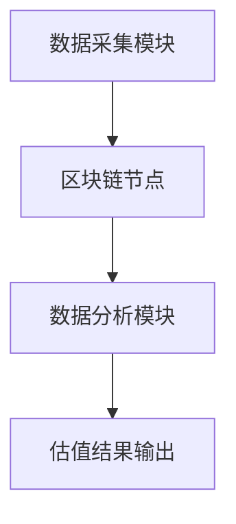
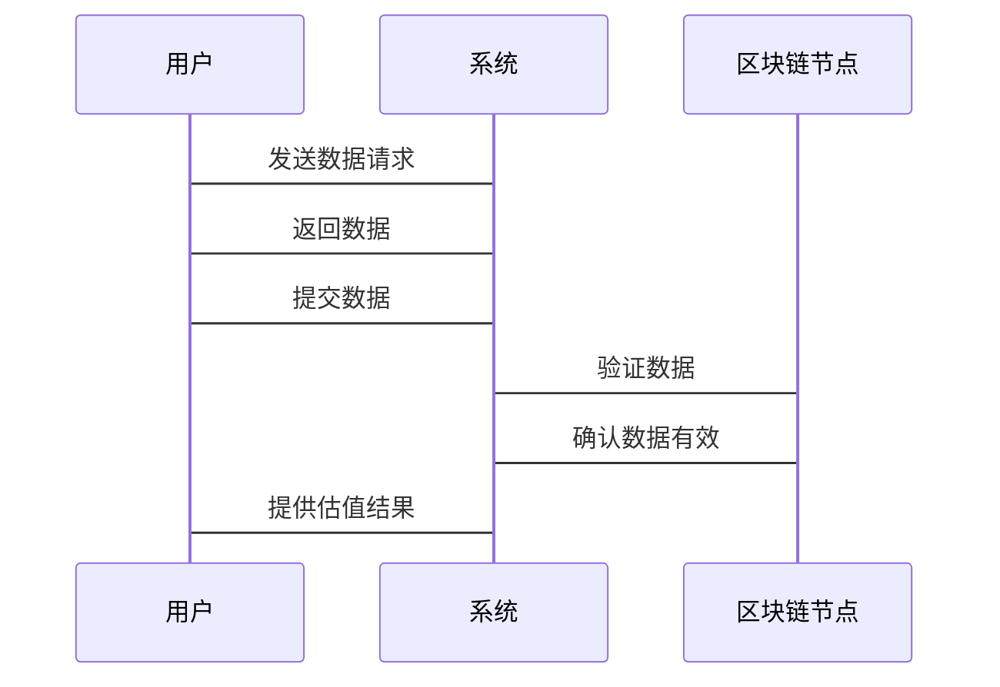

                 


# 《企业估值中的区块链物联网安全平台评估》

---

## 关键词：企业估值、区块链、物联网、安全平台、数据隐私、信任机制、资产评估

---

## 摘要：  
本文探讨了区块链和物联网技术在企业估值中的应用，特别是区块链物联网安全平台在提升数据透明度和安全性方面的作用。通过分析区块链的去中心化特性和物联网的安全监控能力，本文提出了一个基于区块链的物联网安全平台评估模型，旨在解决传统企业估值方法中的数据不透明和信任缺失问题。文章详细阐述了平台的架构设计、算法原理和实现方案，并通过实际案例分析展示了该模型的有效性。

---

## 第一部分: 企业估值中的区块链物联网安全平台概述

### 第1章: 企业估值的基本概念

#### 1.1 企业估值的定义与作用
企业估值是通过对企业的财务状况、市场表现和潜在价值进行评估，确定其市场价值的过程。传统的估值方法依赖于财务报表和市场数据，但存在数据不透明、难以验证的问题。

#### 1.2 区块链技术在企业估值中的应用
区块链的去中心化和不可篡改特性，为企业的数据透明化提供了技术支持。通过区块链，企业可以实现数据的实时记录和验证，增强估值过程中的信任机制。

#### 1.3 物联网安全平台的核心功能
物联网安全平台通过实时监控和数据分析，帮助企业发现和防范安全风险，提升数据的准确性和可靠性，从而为估值提供更可靠的基础。

---

### 第2章: 区块链与物联网安全平台的结合

#### 2.1 区块链与物联网的协同作用
区块链确保了物联网数据的可信度，而物联网则为区块链提供了丰富的实时数据源。这种协同作用使得企业估值更加准确和实时。

#### 2.2 区块链物联网安全平台的核心要素
- 数据采集与传输的安全性：通过区块链技术确保数据的完整性和不可篡改性。
- 区块链节点的分布与信任机制：构建去中心化的信任网络，减少数据篡改的可能性。
- 平台的可扩展性与灵活性：适应不同企业的需求，支持多种应用场景。

#### 2.3 平台的架构分析
- 分层架构设计：数据采集层、区块链层、应用层。
- 数据流与信息处理流程：数据采集→区块链验证→平台分析→估值结果输出。
- 模块化设计：支持功能扩展和性能优化。

---

## 第二部分: 区块链物联网安全平台评估模型

### 第3章: 评估模型的构建原理

#### 3.1 数据采集与清洗
- 数据采集：通过物联网设备实时采集企业数据。
- 数据清洗：去除噪声数据，确保数据的准确性和完整性。

#### 3.2 数据特征提取
- 利用区块链技术提取数据的关键特征，如时间戳、设备ID、数据类型等。

#### 3.3 数据分析与建模
- 使用机器学习算法（如随机森林、支持向量机）进行数据分析和建模。

### 第4章: 评估模型的算法选择与实现

#### 4.1 算法选择
- 机器学习算法：随机森林用于分类，支持向量机用于回归。
- 区块链技术：用于数据存储和验证。

#### 4.2 算法实现
```python
import pandas as pd
from sklearn.ensemble import RandomForestClassifier
from sklearn.metrics import accuracy_score

# 数据预处理
data = pd.read_csv('dataset.csv')
X = data.drop('label', axis=1)
y = data['label']

# 模型训练
model = RandomForestClassifier(n_estimators=100)
model.fit(X, y)

# 模型预测
y_pred = model.predict(X)
print('模型准确率:', accuracy_score(y, y_pred))
```

#### 4.3 数学公式
$$\text{模型准确率} = \frac{\text{正确预测数}}{\text{总预测数}} \times 100\%$$

---

## 第三部分: 系统分析与架构设计方案

### 第5章: 系统功能设计

#### 5.1 问题场景介绍
企业估值中的数据真实性问题，如财务数据造假、供应链数据不透明等。

#### 5.2 系统功能设计
- 数据采集模块：实时采集企业数据。
- 区块链节点：验证数据的完整性和真实性。
- 数据分析模块：基于机器学习算法进行数据建模和估值。

### 第6章: 系统架构设计

#### 6.1 系统架构图


#### 6.2 接口设计
- 数据采集接口：接收物联网设备的数据。
- 区块链接口：验证数据的合法性和真实性。

### 第7章: 系统交互设计

#### 7.1 交互流程图


---

## 第四部分: 项目实战

### 第8章: 环境安装与核心代码实现

#### 8.1 环境安装
- 安装Python、机器学习库（如scikit-learn）、区块链框架（如Ethereum）。

#### 8.2 核心代码实现
```python
from sklearn.model_selection import train_test_split
from sklearn.metrics import mean_squared_error
import numpy as np

# 数据加载
data = np.loadtxt('dataset.csv', delimiter=',')
X = data[:, :-1]
y = data[:, -1]

# 数据分割
X_train, X_test, y_train, y_test = train_test_split(X, y, test_size=0.2)

# 模型训练
model = LinearRegression()
model.fit(X_train, y_train)

# 模型预测
y_pred = model.predict(X_test)
print('均方误差:', mean_squared_error(y_test, y_pred))
```

---

## 第五部分: 最佳实践与未来展望

### 第9章: 最佳实践

#### 9.1 小结
通过区块链和物联网技术的结合，企业估值的准确性和透明度得到了显著提升。

#### 9.2 注意事项
- 数据隐私保护：确保数据在传输和存储过程中的安全性。
- 系统性能优化：提升数据处理速度和模型预测效率。

### 第10章: 未来展望

#### 10.1 技术发展趋势
- 人工智能与区块链的结合：进一步提升模型的预测精度。
- 物联网设备的智能化：推动数据采集和分析的自动化。

---

## 结语

区块链物联网安全平台为企业估值提供了全新的解决方案，通过提升数据的透明度和安全性，帮助企业做出更明智的决策。随着技术的不断发展，这一领域的应用前景将更加广阔。

--- 

希望这篇博客能够为企业估值中的区块链物联网安全平台评估提供有价值的参考和启发。

