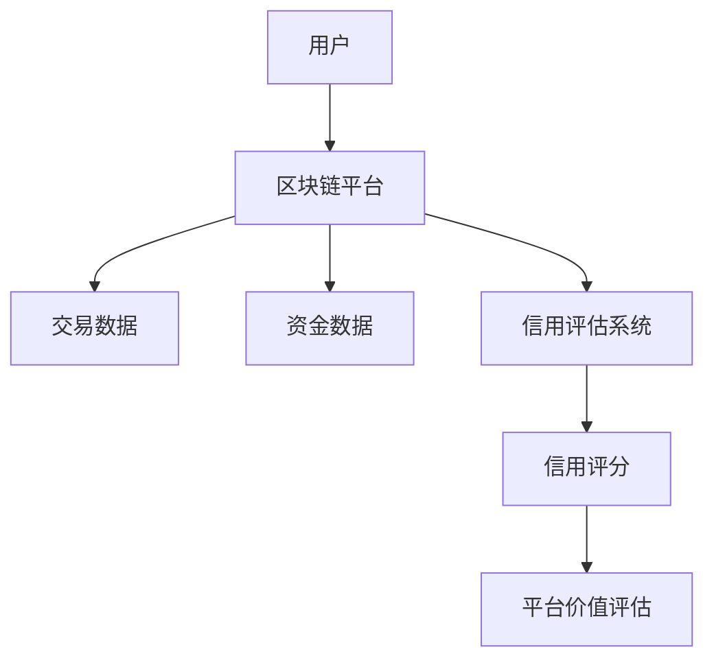
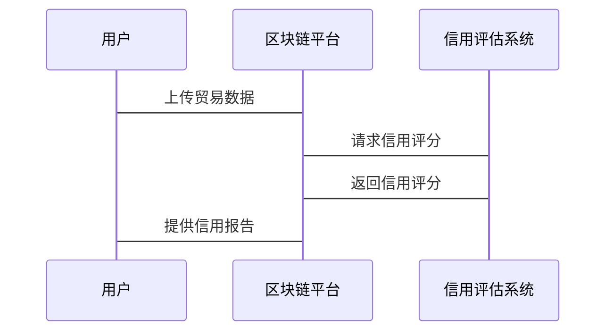

                 


# 企业估值中的区块链跨境贸易融资平台评估

> 关键词：区块链技术，跨境贸易融资，企业估值，智能合约，信用评估

> 摘要：本文深入探讨了区块链技术在跨境贸易融资中的应用及其对平台估值的影响。通过分析区块链技术的核心概念、跨境贸易融资的痛点，以及区块链如何解决这些问题，构建了一个基于区块链的跨境贸易融资平台评估模型。文章详细讲解了评估模型的设计、实现和应用场景，并通过实际案例分析展示了模型的有效性。最后，文章总结了区块链技术在跨境贸易融资中的优势和未来发展方向。

---

# 第一部分: 区块链与跨境贸易融资平台概述

## 第1章: 区块链技术基础与跨境贸易融资背景

### 1.1 区块链技术基础

#### 1.1.1 区块链的定义与核心概念

区块链是一种分布式账本技术，通过去中心化的网络记录数据，并通过共识机制保证数据的一致性和不可篡改性。其核心概念包括：

- **分布式账本**：数据分布在多个节点上，确保数据的透明性和一致性。
- **去中心化**：消除单一中心控制点，降低单点故障风险。
- **共识机制**：通过算法确保所有节点对数据状态达成一致。
- **智能合约**：自动执行预定义的合同条款，减少人为干预。

#### 1.1.2 区块链的主要特点

- **不可篡改**：数据一旦写入区块链，难以被修改，确保数据的真实性。
- **可追溯性**：区块链记录了数据的全生命周期，便于追踪和审计。
- **透明性**：所有交易记录对授权方公开，降低信任成本。

#### 1.1.3 区块链与跨境贸易融资的关联

区块链在跨境贸易融资中的应用主要体现在以下几个方面：

- **跨境支付的效率提升**：通过区块链技术，实现跨境支付的实时清算，减少中间环节。
- **贸易融资的透明化**：通过区块链记录贸易数据，降低信息不对称。
- **信用风险的降低**：通过区块链技术，建立信任机制，减少违约风险。

### 1.2 跨境贸易融资的现状与挑战

#### 1.2.1 跨境贸易融资的传统模式

传统的跨境贸易融资模式主要依赖银行信用证、保函等工具，流程复杂且效率低下：

- **银行信用证**：买方银行向卖方银行开具信用证，确保买方支付货款。
- **保函**：卖方银行向买方提供担保，确保买方履行合同义务。
- **质押融资**：企业以存货、应收账款等作为质押，向银行申请融资。

#### 1.2.2 跨境贸易融资中的痛点

- **信息不对称**：传统模式中，买卖双方信息不透明，容易导致信任问题。
- **资金流动性不足**：由于信息不对称和信任问题，企业难以获得足够的融资支持。
- **跨境支付效率低**：传统跨境支付需要经过多个中间银行，耗时长且费用高。
- **信用风险高**：传统模式下，企业信用评估成本高，风险难以控制。

#### 1.2.3 区块链技术如何解决这些问题

- **提高透明度**：区块链技术能够记录所有交易数据，并保证数据的透明性和不可篡改性。
- **降低信任成本**：通过区块链技术建立的信任机制，减少信息不对称。
- **提升融资效率**：通过区块链技术优化流程，减少中间环节，提升融资效率。

---

## 第2章: 区块链技术在跨境贸易融资中的应用

### 2.1 跨境贸易融资平台的区块链架构

#### 2.1.1 区块链在跨境支付中的应用

区块链技术在跨境支付中的应用主要体现在以下方面：

- **跨境支付的流程优化**：通过区块链技术实现支付的实时清算，减少中间银行的参与，降低支付成本。
- **智能合约的应用**：通过智能合约自动执行支付条款，确保支付的安全性和及时性。
- **跨境支付的透明性**：区块链技术能够记录支付的全生命周期，便于追踪和审计。

#### 2.1.2 区块链在贸易融资中的应用

区块链技术在贸易融资中的应用主要体现在以下几个方面：

- **贸易融资的数字化**：通过区块链技术将贸易合同、发票、运输单据等数字化，实现贸易数据的高效共享。
- **资金流向的可追溯性**：通过区块链技术记录资金的流向，确保资金的合法使用。
- **信用评估的准确性**：通过区块链技术建立企业的信用档案，提高信用评估的准确性。

### 2.2 跨境贸易融资平台的系统架构

#### 2.2.1 平台的功能模块

- **贸易信息上链**：将贸易合同、发票、运输单据等信息上链，确保信息的透明性和不可篡改性。
- **资金流转记录**：记录资金的流转过程，确保资金的合法使用。
- **信用评估系统**：基于区块链上的数据，对企业进行信用评估，提供信用评分。
- **智能合约执行**：通过智能合约自动执行贸易合同中的条款，确保合同的履行。

#### 2.2.2 区块链网络的架构设计

- **节点分布**：区块链网络中的节点分布在全球各地，确保数据的分散存储和高可用性。
- **数据存储**：数据以区块形式存储，每个区块包含多个交易记录，通过链式结构保证数据的完整性。
- **交易确认机制**：通过共识机制（如PoW、PoS等）确认交易的有效性，确保数据的一致性。

---

## 第3章: 区块链跨境贸易融资平台的评估模型

### 3.1 评估模型的构建

#### 3.1.1 平台信用评估的核心指标

在构建区块链跨境贸易融资平台的评估模型时，需要考虑以下几个核心指标：

- **交易量**：平台上的交易量越大，说明平台的活跃度越高。
- **资金流动效率**：资金的流转速度越快，说明平台的效率越高。
- **平台透明度**：平台数据的透明性和可追溯性越高，用户信任度越高。
- **风险控制能力**：平台的风险控制能力越强，信用评分越高。

#### 3.1.2 评估模型的数学公式

信用评分和平台价值的评估模型可以表示为以下公式：

$$
信用评分 = \alpha \times 交易量 + \beta \times 资金流动效率 + \gamma \times 平台透明度
$$

$$
平台价值 = \theta \times 信用评分 + \phi \times 用户满意度
$$

其中，$\alpha$、$\beta$、$\gamma$、$\theta$、$\phi$为模型的权重系数，需要根据实际情况进行调整。

### 3.2 评估模型的实现

#### 3.2.1 数据采集与处理

- **数据采集**：从区块链平台中采集交易数据、资金流动数据、用户评价等数据。
- **数据清洗**：对采集到的数据进行清洗，去除异常数据和重复数据。
- **数据存储**：将处理后的数据存储在数据库中，供后续分析使用。

#### 3.2.2 评估算法的选择与实现

- **信用评分算法**：基于交易量、资金流动效率、平台透明度等指标，计算信用评分。
- **平台价值评估算法**：基于信用评分和用户满意度，计算平台价值。
- **算法实现的代码示例**

以下是信用评分算法的Python实现代码示例：

```python
def calculate_credit_score(transactions, liquidity, transparency):
    alpha = 0.5
    beta = 0.3
    gamma = 0.2
    credit_score = alpha * transactions + beta * liquidity + gamma * transparency
    return credit_score

# 示例数据
transactions = 1000
liquidity = 0.8
transparency = 0.9

# 计算信用评分
credit_score = calculate_credit_score(transactions, liquidity, transparency)
print("信用评分:", credit_score)
```

---

## 第4章: 区块链跨境贸易融资平台的系统分析与架构设计

### 4.1 系统功能设计

#### 4.1.1 平台功能模块

- **用户管理**：包括用户注册、登录、权限管理等功能。
- **贸易信息管理**：包括贸易合同、发票、运输单据等信息的上链和管理。
- **资金管理**：包括资金流转记录、智能合约执行等功能。
- **信用评估系统**：包括信用评分计算、风险控制等功能。

#### 4.1.2 功能模块的实现流程

- **用户注册与登录**：用户通过区块链平台进行注册，并通过身份验证登录平台。
- **贸易信息上链**：用户上传贸易合同、发票等信息，并通过智能合约进行验证和上链。
- **资金流转记录**：平台记录资金的流转过程，并通过智能合约自动执行支付条款。
- **信用评估与报告生成**：平台基于区块链上的数据，计算信用评分，并生成信用报告。

### 4.2 系统架构设计

#### 4.2.1 系统架构图



#### 4.2.2 系统接口设计

- **API 接口定义**：平台提供RESTful API接口，用于数据的上传、查询和处理。
- **接口调用流程**：用户通过API接口上传贸易数据，平台处理数据并返回结果。

#### 4.2.3 系统交互设计



---

## 第5章: 区块链跨境贸易融资平台的项目实战

### 5.1 项目环境搭建

#### 5.1.1 环境搭建步骤

- **安装区块链框架**：选择合适的区块链框架（如Hyperledger Fabric、Ethereum等）。
- **安装开发工具**：安装必要的开发工具，如IDE、调试工具等。
- **配置网络环境**：配置本地网络环境，确保节点之间的通信顺畅。

#### 5.1.2 核心代码实现

以下是区块链跨境贸易融资平台的核心代码实现示例：

```python
# 区块链节点管理
class NodeManager:
    def __init__(self):
        self.nodes = []

    def add_node(self, node):
        self.nodes.append(node)

    def remove_node(self, node):
        self.nodes.remove(node)

    def get_nodes(self):
        return self.nodes

# 智能合约实现
class SmartContract:
    def __init__(self, contract_id):
        self.contract_id = contract_id
        self.status = "init"

    def execute(self):
        self.status = "executing"
        # 执行智能合约逻辑
        pass

    def terminate(self):
        self.status = "terminated"
```

#### 5.1.3 代码功能解读与分析

- **节点管理**：通过NodeManager类管理区块链节点，包括节点的添加、删除和查询。
- **智能合约实现**：通过SmartContract类实现智能合约的执行和终止，确保合约的自动执行。

### 5.2 实际案例分析与详细讲解

#### 5.2.1 案例背景介绍

假设一家跨国贸易公司A与供应商B签订了一份贸易合同，金额为100万美元。公司A通过区块链平台向供应商B支付货款，并通过智能合约自动执行支付条款。

#### 5.2.2 案例实现流程

- **合同上链**：公司A和供应商B的贸易合同信息被上传至区块链平台，并通过智能合约进行验证。
- **支付执行**：公司A通过区块链平台向供应商B支付货款，智能合约自动执行支付条款，确保资金的安全性和及时性。
- **信用评估**：平台基于交易数据和资金流动数据，计算公司的信用评分，并生成信用报告。

---

## 第6章: 总结与展望

### 6.1 最佳实践与小结

- **小结**：通过区块链技术，能够有效提升跨境贸易融资的效率和透明度，降低信用风险。
- **注意事项**：在实际应用中，需要考虑数据隐私、合规性等问题，确保平台的安全性和合法性。
- **拓展阅读**：建议深入学习区块链技术的核心原理和相关应用，关注区块链技术的最新发展动态。

### 6.2 未来发展方向

- **技术优化**：进一步优化区块链技术的性能，提升平台的处理能力。
- **应用场景扩展**：探索区块链技术在其他领域的应用，如供应链金融、跨境支付等。
- **政策与法规**：关注相关政策与法规的制定，确保平台的合规性。

---

通过本文的分析和讲解，我们深入探讨了区块链技术在跨境贸易融资中的应用及其对平台估值的影响。未来，随着区块链技术的不断发展，其在跨境贸易融资中的应用将更加广泛和深入，为企业估值提供更加精准和可靠的依据。

