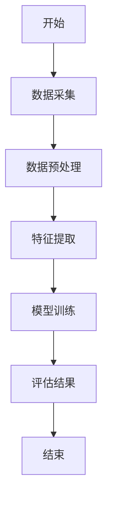
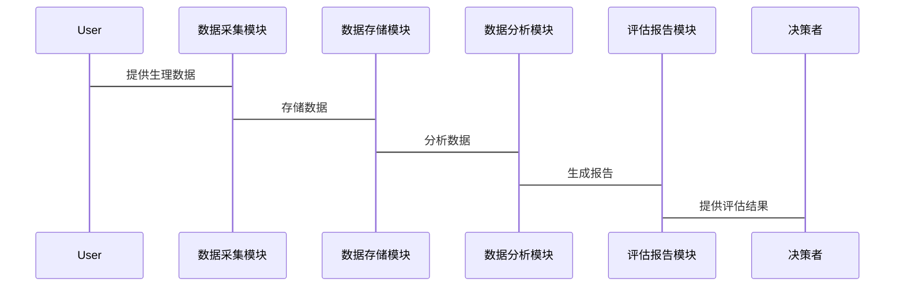

                 


---

# 企业估值中的可穿戴医疗设备评估

> 关键词：企业估值、可穿戴医疗设备、数据驱动、评估算法、系统架构、项目实战

> 摘要：本文系统地探讨了在企业估值过程中，如何评估可穿戴医疗设备的价值。文章从背景介绍、核心概念、算法原理、系统架构到项目实战，全面分析了可穿戴医疗设备评估的关键点，帮助读者掌握从理论到实践的完整流程。

---

# 第一部分: 企业估值中的可穿戴医疗设备评估概述

# 第1章: 可穿戴医疗设备与企业估值背景

## 1.1 可穿戴医疗设备的定义与特点

### 1.1.1 可穿戴医疗设备的定义

可穿戴医疗设备是指能够佩戴在人体的某个部位，通过传感器采集生理数据，并通过无线方式传输到终端设备的医疗工具。这类设备通常包括智能手表、健康手环、智能血压计等。

### 1.1.2 可穿戴医疗设备的核心特点

- **实时监测**：可穿戴设备能够实时采集用户的生理数据，如心率、血压、血氧等。
- **便携性**：设备设计轻便，用户可以在日常生活中方便使用。
- **数据驱动**：设备通过传感器和算法，将采集的数据转化为可分析的格式。
- **智能分析**：部分设备具备AI功能，能够对数据进行初步分析，提供健康建议。

### 1.1.3 可穿戴医疗设备的分类

- **健康监测类**：如智能手表、健康手环。
- **疾病管理类**：如用于糖尿病管理的智能血糖仪。
- **康复辅助类**：如用于术后康复的可穿戴设备。

## 1.2 企业估值中的可穿戴医疗设备评估背景

### 1.2.1 企业估值的基本概念

企业估值是指对企业整体价值的评估，通常用于企业并购、融资等场景。传统的估值方法依赖于财务数据和市场分析，但随着科技的发展，可穿戴设备提供了新的数据来源。

### 1.2.2 可穿戴医疗设备在企业估值中的重要性

可穿戴设备能够提供实时、连续的生理数据，这些数据可以用于评估员工的健康状况，进而影响企业的劳动力成本、保险费用等。例如，企业可以通过员工的健康数据，优化健康管理策略。

### 1.2.3 当前市场中的主要可穿戴医疗设备类型

- **健康监测设备**：如Fitbit、Apple Watch。
- **疾病管理设备**：如智能血糖仪、智能血压计。
- **康复设备**：如用于术后康复的智能康复带。

## 1.3 问题背景与问题描述

### 1.3.1 企业估值中的数据采集挑战

传统的企业估值依赖于财务数据和市场分析，但这些数据往往无法反映员工的健康状况。而可穿戴设备能够提供实时的健康数据，为企业估值提供新的视角。

### 1.3.2 可穿戴医疗设备数据的特点

- **实时性**：数据采集频率高，能够反映用户实时的健康状况。
- **连续性**：设备可以持续采集数据，提供长期的健康趋势。
- **多样性**：数据类型多样，包括心率、血压、运动数据等。

### 1.3.3 数据质量对企业估值的影响

数据质量直接影响估值的准确性。低质量的数据可能导致错误的评估结果，而高质量的数据能够提高估值的准确性。

## 1.4 问题解决与边界定义

### 1.4.1 数据驱动的企业估值方法

通过可穿戴设备采集的生理数据，结合其他数据源（如财务数据、市场数据），构建综合的企业估值模型。

### 1.4.2 可穿戴医疗设备评估的边界与外延

- **边界**：仅考虑可穿戴设备提供的生理数据，不包括其他来源的数据。
- **外延**：可穿戴设备的数据可以用于员工健康评估、企业风险管理等多个方面。

### 1.4.3 评估模型的核心要素与组成

- **数据源**：可穿戴设备的生理数据。
- **算法**：用于数据处理和模型构建的算法。
- **评估指标**：如员工健康指数、企业风险指数等。

---

# 第2章: 可穿戴医疗设备评估的核心概念与联系

## 2.1 核心概念原理

### 2.1.1 数据采集与处理

可穿戴设备通过传感器采集生理数据，并通过算法进行预处理，如去噪、归一化等。

### 2.1.2 数据分析与建模

利用统计学和机器学习方法，构建评估模型，如回归分析、聚类分析等。

### 2.1.3 评估结果的应用

将评估结果应用于企业估值，如优化人力资源管理、降低企业风险等。

## 2.2 核心概念属性对比

### 2.2.1 不同设备的数据采集能力对比

| 设备类型         | 数据采集能力 |
|------------------|--------------|
| 智能手表         | 心率、运动数据 |
| 健康手环         | 心率、睡眠监测 |
| 智能血压计       | 血压测量     |

### 2.2.2 设备性能与数据质量的关系

设备性能越高，数据质量越优。例如，高精度的传感器能够采集更准确的数据。

### 2.2.3 数据隐私与安全的对比

不同设备的数据隐私和安全保护能力不同，需根据企业需求选择合适的设备。

## 2.3 ER实体关系图

```mermaid
erDiagram
    user {
        id
        name
        medical_data
    }
    device {
        device_id
        type
        manufacturer
    }
    measurement {
        measurement_id
        timestamp
        value
    }
    user --> measurement : 产生
    device --> measurement : 关联
```

---

# 第3章: 可穿戴医疗设备评估算法原理

## 3.1 算法原理概述

### 3.1.1 数据预处理

对采集的数据进行去噪、归一化等处理，确保数据质量。

### 3.1.2 特征提取

从数据中提取关键特征，如心率变异、步频等。

### 3.1.3 模型训练与评估

使用机器学习算法（如随机森林、支持向量机）训练模型，并评估模型性能。

## 3.2 算法流程图



## 3.3 算法实现代码

```python
import numpy as np
import pandas as pd
from sklearn.ensemble import RandomForestClassifier
from sklearn.metrics import accuracy_score

# 数据预处理
data = pd.read_csv('medical_data.csv')
X = data.drop('target', axis=1)
y = data['target']

# 特征选择
selected_features = ['heart_rate', 'step_count', 'sleep_duration']
X_selected = X[selected_features]

# 模型训练
model = RandomForestClassifier()
model.fit(X_selected, y)

# 模型评估
y_pred = model.predict(X_selected)
print('模型准确率:', accuracy_score(y, y_pred))
```

## 3.4 数学公式与模型解释

模型使用的随机森林算法是一种基于树的集成学习方法，其数学公式如下：

$$
y = \sum_{i=1}^{n} \text{Tree}_i(x)
$$

其中，$Tree_i(x)$ 表示第i棵决策树的预测结果，$n$是树的数量。

---

# 第4章: 可穿戴医疗设备评估的系统分析与架构设计

## 4.1 系统功能设计

### 4.1.1 数据采集模块

负责采集用户的生理数据，如心率、血压等。

### 4.1.2 数据分析模块

对采集的数据进行处理、特征提取和模型训练。

### 4.1.3 评估报告模块

生成评估报告，提供可视化结果和建议。

## 4.2 系统架构设计


## 4.3 系统交互设计



---

# 第5章: 可穿戴医疗设备评估的项目实战

## 5.1 项目环境安装

```bash
pip install numpy pandas scikit-learn
```

## 5.2 项目核心代码实现

```python
import numpy as np
import pandas as pd
from sklearn.ensemble import RandomForestClassifier
from sklearn.metrics import accuracy_score

# 数据预处理
data = pd.read_csv('medical_data.csv')
X = data.drop('target', axis=1)
y = data['target']

# 特征选择
selected_features = ['heart_rate', 'step_count', 'sleep_duration']
X_selected = X[selected_features]

# 模型训练
model = RandomForestClassifier()
model.fit(X_selected, y)

# 模型评估
y_pred = model.predict(X_selected)
print('模型准确率:', accuracy_score(y, y_pred))
```

## 5.3 项目小结

通过本项目，我们掌握了从数据采集到模型训练的完整流程，能够将可穿戴医疗设备的数据应用于企业估值。

---

# 第6章: 可穿戴医疗设备评估的最佳实践

## 6.1 小结

可穿戴医疗设备为企业估值提供了新的数据源，但需要结合其他数据进行综合分析。

## 6.2 注意事项

- 数据隐私和安全必须重视。
- 模型需要定期更新和优化。

## 6.3 拓展阅读

建议读者进一步学习机器学习在企业估值中的应用，以及可穿戴设备的最新技术发展。

---

# 第7章: 结语

随着可穿戴医疗设备的普及，其在企业估值中的应用将越来越重要。通过本文的分析，读者可以掌握从理论到实践的完整流程，为企业估值提供新的视角和方法。

---

