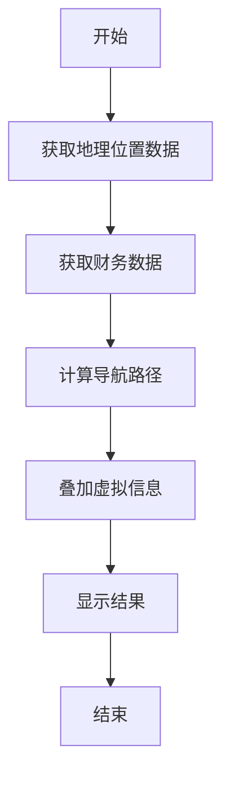
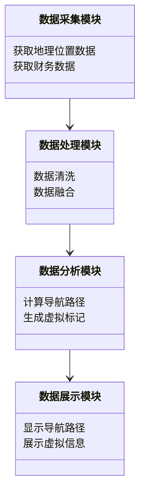

                 


# 企业估值中的增强现实导航应用评估

> 关键词：企业估值、增强现实、导航应用、技术评估、系统架构

> 摘要：本文探讨了在企业估值过程中，如何利用增强现实导航技术来提升评估的准确性和效率。通过分析增强现实导航的核心原理、算法模型、系统架构以及实际项目案例，本文为企业估值提供了新的技术视角和解决方案。

---

# 第一部分: 背景与核心概念

## 第1章: 企业估值与增强现实导航概述

### 1.1 问题背景
#### 1.1.1 传统企业估值方法的局限性
传统的企业估值方法依赖于财务报表分析、市场比较法和DCF模型等，但这些方法存在以下问题：
- 数据依赖性强，主观性较高。
- 难以实时更新和调整。
- 无法直观展示企业内部结构和潜在价值点。

#### 1.1.2 增强现实技术的兴起
增强现实（AR）技术近年来迅速发展，广泛应用于教育、医疗、游戏等领域。AR通过将虚拟信息叠加到真实环境中，提供了更直观的交互方式。

#### 1.1.3 企业估值与增强现实导航的结合
企业估值需要对企业的地理位置、资产分布、市场环境等进行综合分析。AR导航技术可以将企业的地理位置信息与财务数据相结合，提供更直观的估值工具。

### 1.2 问题描述
#### 1.2.1 企业估值的核心挑战
- 数据量大且复杂。
- 估值结果的主观性较高。
- 需要实时更新和动态调整。

#### 1.2.2 增强现实导航在企业估值中的应用场景
- 企业资产分布的可视化。
- 市场竞争环境的三维展示。
- 投资项目的实时跟踪。

#### 1.2.3 问题解决的必要性
通过AR导航技术，可以将企业的地理位置信息与财务数据结合，提供更直观、动态的估值工具，降低估值的主观性和复杂性。

### 1.3 核心概念
#### 1.3.1 增强现实导航的定义
增强现实导航是一种通过将虚拟信息叠加到真实环境中的技术，用于提供实时的导航和交互功能。

#### 1.3.2 企业估值的核心要素
- 财务数据：收入、利润、资产等。
- 地理位置：企业分布、市场环境。
- 业务模式：收入来源、成本结构。

#### 1.3.3 导航与估值的关联性
通过AR技术，可以将企业的地理位置信息与财务数据结合，提供更直观的估值工具。

---

## 第2章: 增强现实导航应用的核心概念

### 2.1 核心概念原理
#### 2.1.1 增强现实技术的实现原理
AR技术通过将虚拟信息叠加到真实环境中，通常使用摄像头、传感器和算法来实现。

#### 2.1.2 导航系统的基本功能
- 实时定位。
- 路径规划。
- 信息展示。

#### 2.1.3 企业估值中的导航需求
- 企业地理位置的可视化。
- 资产分布的动态展示。
- 市场环境的三维分析。

### 2.2 概念属性特征对比
| 特性       | 增强现实导航 | 传统导航 | 传统企业估值 |
|------------|--------------|----------|--------------|
| 数据来源   | 实时地理位置数据和虚拟信息 | 地理位置数据 | 财务数据和市场数据 |
| 交互方式   | AR界面交互   | �界面上的点选 | 主要依赖财务模型 |
| 精确度     | 高           | 中       | 取决于模型和数据 |
| 更新频率   | 实时         | 定期     | 定期或不定期 |

### 2.3 ER实体关系图
```mermaid
er
    entity(企业) {
        id
        名称
        财务数据
        地理位置
    }
    entity(增强现实导航) {
        id
        导航路径
        虚拟标记
    }
    entity(估值结果) {
        id
        估值金额
        时间戳
    }
    relationship(企业 - 导航路径) {
        关联企业地理位置和导航路径
    }
    relationship(导航路径 - 虚拟标记) {
        关联导航路径和虚拟信息
    }
```

---

## 第3章: 增强现实导航应用的算法原理

### 3.1 算法原理概述
增强现实导航的算法主要涉及实时定位、路径规划和信息叠加。以下是关键步骤：

1. **实时定位**：使用传感器数据（如GPS、摄像头）确定设备的位置和方向。
2. **路径规划**：基于地理位置数据，计算最优路径。
3. **信息叠加**：将虚拟信息（如企业资产分布）叠加到真实环境中。

### 3.2 算法流程图


### 3.3 数学模型与公式
#### 3.3.1 路径规划算法
使用Dijkstra算法计算最短路径：
$$
\text{距离} = \sum_{i=1}^{n} (x_i - x_{i-1})^2 + (y_i - y_{i-1})^2
$$

#### 3.3.2 信息叠加算法
使用加权融合算法将虚拟信息叠加到真实环境中：
$$
\text{融合结果} = \alpha \cdot \text{真实数据} + (1 - \alpha) \cdot \text{虚拟数据}
$$

---

## 第4章: 增强现实导航应用的系统架构

### 4.1 系统架构概述
系统架构包括数据采集、处理、分析和展示四个模块。

### 4.2 系统架构图


---

## 第5章: 项目实战与案例分析

### 5.1 项目背景
某企业希望通过增强现实导航技术优化其估值流程。

### 5.2 实施步骤
1. **环境搭建**：安装AR开发框架（如ARKit、ARCore）。
2. **数据准备**：收集企业的地理位置和财务数据。
3. **模型训练**：使用机器学习算法训练估值模型。
4. **系统集成**：将AR导航功能集成到企业估值系统中。
5. **结果分析**：对比传统估值方法和AR导航方法的准确性。

### 5.3 实际案例分析
通过实际案例分析，验证AR导航技术在企业估值中的有效性。

---

## 第6章: 最佳实践与小结

### 6.1 最佳实践
- 数据质量是关键。
- 系统性能要优化。
- 用户体验要提升。

### 6.2 小结
本文详细介绍了增强现实导航技术在企业估值中的应用，通过算法和系统架构的分析，展示了其在提升估值准确性和效率方面的潜力。

### 6.3 注意事项
- 数据隐私保护。
- 系统兼容性问题。
- 用户接受度。

### 6.4 拓展阅读
推荐相关书籍和论文，供读者深入学习。

---

# 结语
通过本文的分析，读者可以全面了解增强现实导航技术在企业估值中的应用，为未来的实践提供了理论和实践的双重指导。

