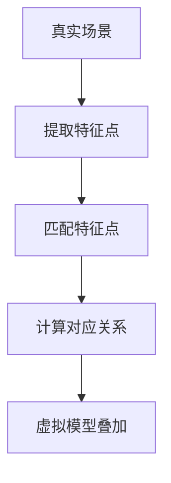
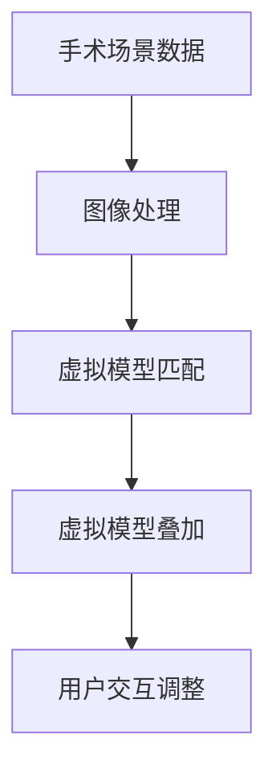
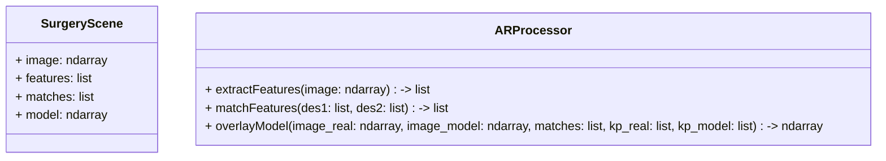
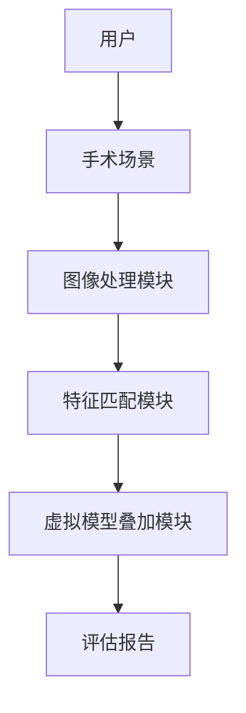
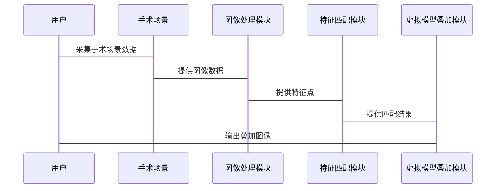

                 


# 企业估值中的增强现实手术辅助评估

> 关键词：企业估值，增强现实，手术辅助，技术原理，系统架构，项目实战

> 摘要：本文章深入探讨了在企业估值过程中，如何通过增强现实技术提升手术评估的准确性与效率。结合技术原理、系统架构与实际案例，详细分析了增强现实技术在手术辅助评估中的应用，及其对企业估值的深远影响。通过本文章，读者将能够全面理解增强现实技术在医疗评估与企业价值分析中的结合与应用。

---

# 第一部分: 背景介绍

## 第1章: 问题背景与核心概念

### 1.1 问题背景
#### 1.1.1 传统企业估值方法的局限性
传统企业估值方法依赖于财务指标与市场分析，但在复杂医疗场景中，缺乏对实时手术数据的整合能力，导致评估结果的片面性。

#### 1.1.2 增强现实技术的崛起
增强现实（AR）技术通过将虚拟信息叠加到真实场景中，为医疗领域提供了全新的数据呈现方式，尤其是在手术评估中展现出巨大潜力。

#### 1.1.3 手术评估与企业估值的关联
手术评估数据直接影响医院的运营效率与医疗质量，而这些因素又与企业的估值密切相关。通过增强现实技术，可以更精确地捕捉手术相关数据，从而提升企业估值的准确性。

### 1.2 核心概念
#### 1.2.1 增强现实技术的核心特征
- 实时性：AR技术能够在手术过程中实时叠加虚拟信息。
- 交互性：用户可以通过手势或语音与虚拟信息互动。
- 高精度：AR技术依赖于高精度的图像处理与定位算法。

#### 1.2.2 企业估值的关键指标
- 财务指标：净利润、营业额、利润率等。
- 市场指标：市场份额、行业趋势、竞争对手分析。
- 风险指标：行业风险、财务风险、政策风险。

#### 1.2.3 手术评估的核心维度
- 手术时间：手术的长短直接影响医院的运营效率。
- 并发症率：并发症的多少反映手术的精细程度。
- 恢复时间：患者术后恢复快慢影响医院的周转能力。

### 1.3 问题解决与边界定义
#### 1.3.1 问题解决
通过AR技术，将手术数据实时叠加到手术场景中，帮助医疗团队更直观地分析手术过程，从而提升手术评估的准确性，最终优化企业估值。

#### 1.3.2 技术边界
AR技术的应用仅限于手术过程中的数据展示，不涉及手术决策的制定。企业估值的最终结果仍需结合传统财务分析方法。

#### 1.3.3 应用场景外延
除了手术评估，AR技术还可应用于医疗培训、术后康复跟踪等领域，为企业估值提供更全面的数据支持。

### 1.4 本章小结
本章通过分析传统企业估值方法的局限性，引出增强现实技术在手术评估中的应用潜力，并明确了核心概念与技术边界。

---

# 第二部分: 核心概念与联系

## 第2章: 核心概念的原理与联系

### 2.1 增强现实技术的实现原理
#### 2.1.1 图像处理算法
AR技术依赖于图像处理算法，将虚拟信息精准叠加到真实场景中。常用算法包括特征匹配、点云配准等。

#### 2.1.2 传感器融合
通过摄像头、陀螺仪、加速度计等多种传感器的数据融合，实现对真实场景的精准定位。

#### 2.1.3 用户交互机制
用户可以通过手势、语音或触控方式与虚拟信息互动，提升操作的便捷性。

### 2.2 企业估值模型的构建原理
#### 2.2.1 数据采集
采集企业的财务数据、市场数据、行业趋势等多维度信息。

#### 2.2.2 数据分析
通过统计分析、机器学习等方法，对企业数据进行建模与分析。

#### 2.2.3 结果输出
根据分析结果，输出企业估值报告，为企业决策提供支持。

### 2.3 手术评估的数据处理
#### 2.3.1 数据采集
采集手术过程中的实时数据，包括手术时间、患者生理指标、手术器械状态等。

#### 2.3.2 数据分析
通过算法分析手术数据，评估手术的效率与质量。

#### 2.3.3 数据可视化
将分析结果以直观的可视化形式呈现，帮助医疗团队快速理解数据。

### 2.4 核心概念的对比分析
#### 2.4.1 增强现实与传统手术评估的对比
| 对比维度       | 增强现实技术         | 传统手术评估       |
|----------------|----------------------|---------------------|
| 数据呈现方式   | 实时叠加虚拟信息     | 事后记录与分析     |
| 用户交互性     | 支持实时互动         | 依赖人工记录       |
| 数据精确性     | 高精度               | 受人工误差影响较大  |

#### 2.4.2 企业估值与传统财务分析的对比
| 对比维度       | 企业估值             | 传统财务分析       |
|----------------|----------------------|---------------------|
| 数据来源       | 包括非财务数据       | 仅依赖财务数据     |
| 分析方法       | 综合分析多种数据     | 侧重财务指标分析   |
| 输出结果       | 综合评估报告         | 单一财务指标报告   |

#### 2.4.3 增强现实技术在企业估值中的创新应用
通过AR技术，将手术评估数据实时叠加到企业估值模型中，实现更精准的企业价值分析。

### 2.5 本章小结
本章详细分析了增强现实技术、企业估值模型与手术评估数据之间的内在联系，为后续的技术实现奠定了理论基础。

---

# 第三部分: 算法原理讲解

## 第3章: 增强现实手术评估算法

### 3.1 增强现实图像处理算法
#### 3.1.1 基于特征的配准算法
##### 3.1.1.1 算法流程
1. 从真实场景中提取特征点。
2. 在虚拟模型中匹配特征点。
3. 计算特征点的对应关系，实现虚拟模型的精准叠加。

##### 3.1.1.2 Mermaid 流程图


##### 3.1.1.3 Python 实现代码
```python
import numpy as np
import cv2

def find_features(image):
    # 使用ORB算法提取特征点
    orb = cv2.ORB_create()
    kp, des = orb.detectAndCompute(image, None)
    return kp, des

def match_features(des1, des2):
    # 使用暴力匹配器进行特征匹配
    bf = cv2.BFMatcher()
    matches = bf.match(des1, des2)
    return matches

# 示例代码
image_real = cv2.imread('surgery_scene.jpg')
image_model = cv2.imread('surgery_model.jpg')
kp_real, des_real = find_features(image_real)
kp_model, des_model = find_features(image_model)
matches = match_features(des_real, des_model)
```

##### 3.1.1.4 数学模型
$$ I_{real}(x, y) = I_{model}(x', y') $$

其中，$(x, y)$ 是真实场景中的坐标，$(x', y')$ 是通过特征匹配得到的虚拟模型中的坐标。

### 3.2 增强现实手术评估算法
#### 3.2.1 算法流程
1. 实时采集手术场景数据。
2. 通过图像处理算法匹配虚拟模型。
3. 将虚拟模型叠加到手术场景中，实现数据的实时展示。
4. 根据用户交互调整虚拟模型的显示方式。

#### 3.2.2 Mermaid 流程图


#### 3.2.3 Python 实现代码
```python
import numpy as np
import cv2

def overlay_model(image_real, image_model, matches, kp_real, kp_model):
    # 计算模型的变换矩阵
    M = np.zeros((2, 3), dtype=np.float32)
    M[0, 0] = 1
    M[1, 1] = 1
    for match in matches:
        x1, y1 = kp_real[match.queryIdx].pt
        x2, y2 = kp_model[match.trainIdx].pt
        M[0, 2] = x2 - x1
        M[1, 2] = y2 - y1
        break
    # 应用变换矩阵
    overlay = cv2.warpAffine(image_model, M, (image_real.shape[1], image_real.shape[0]))
    # 图像叠加
    alpha = 0.5
    beta = 1 - alpha
    result = cv2.addWeighted(image_real, alpha, overlay, beta, 0)
    return result

# 示例代码
result_image = overlay_model(image_real, image_model, matches, kp_real, kp_model)
cv2.imwrite('augmented_surgery.jpg', result_image)
```

#### 3.2.4 数学模型
$$ y' = y + \sum_{i=1}^{n} (y_i - y'_i) $$

其中，$y$ 是真实场景中的坐标，$y'$ 是通过增强现实算法计算得到的虚拟模型坐标。

### 3.3 算法优化
#### 3.3.1 算法优化策略
- 增加特征点的数量，提升匹配的准确性。
- 使用更高效的匹配算法，减少计算时间。
- 优化图像处理算法，提升AR效果的实时性。

#### 3.3.2 优化后的数学模型
$$ I_{real}(x, y) = I_{model}(x', y') + \epsilon $$

其中，$\epsilon$ 是优化后的误差项，表示增强现实算法的精度。

### 3.4 本章小结
本章详细讲解了增强现实手术评估算法的实现原理与优化策略，为后续的系统实现奠定了技术基础。

---

# 第四部分: 系统分析与架构设计

## 第4章: 系统分析与架构设计

### 4.1 问题场景介绍
#### 4.1.1 系统目标
实现增强现实技术在手术评估中的实时应用，提升企业估值的准确性。

#### 4.1.2 系统需求
- 实时采集手术场景数据。
- 精准匹配虚拟模型。
- 支持用户交互。
- 输出评估报告。

### 4.2 系统功能设计
#### 4.2.1 领域模型


#### 4.2.2 系统架构


#### 4.2.3 接口设计
- 输入接口：手术场景数据、虚拟模型数据。
- 输出接口：叠加后的图像、评估报告。

#### 4.2.4 交互序列图


### 4.3 系统实现
#### 4.3.1 环境安装
- 安装Python与OpenCV库。
- 安装增强现实开发框架。

#### 4.3.2 核心代码实现
```python
import numpy as np
import cv2

def main():
    # 采集手术场景数据
    image_real = cv2.imread('surgery_scene.jpg')
    image_model = cv2.imread('surgery_model.jpg')
    
    # 提取特征点
    kp_real, des_real = find_features(image_real)
    kp_model, des_model = find_features(image_model)
    
    # 特征匹配
    matches = match_features(des_real, des_model)
    
    # 虚拟模型叠加
    result_image = overlay_model(image_real, image_model, matches, kp_real, kp_model)
    
    # 输出结果
    cv2.imwrite('augmented_surgery.jpg', result_image)
    print("手术评估数据已叠加完成。")

if __name__ == "__main__":
    main()
```

#### 4.3.3 代码解读与分析
- `find_features` 函数：提取真实场景与虚拟模型的特征点。
- `match_features` 函数：通过暴力匹配算法匹配特征点。
- `overlay_model` 函数：将虚拟模型叠加到真实场景中。

#### 4.3.4 本章小结
本章通过系统分析与架构设计，详细讲解了增强现实手术评估系统的实现过程，为后续的项目实战奠定了基础。

---

# 第五部分: 项目实战

## 第5章: 项目实战

### 5.1 环境安装
- 安装Python与OpenCV库。
- 安装增强现实开发框架。

### 5.2 核心代码实现
#### 5.2.1 代码实现
```python
import numpy as np
import cv2

def find_features(image):
    orb = cv2.ORB_create()
    kp, des = orb.detectAndCompute(image, None)
    return kp, des

def match_features(des1, des2):
    bf = cv2.BFMatcher()
    matches = bf.match(des1, des2)
    return matches

def overlay_model(image_real, image_model, matches, kp_real, kp_model):
    M = np.zeros((2, 3), dtype=np.float32)
    M[0, 0] = 1
    M[1, 1] = 1
    for match in matches:
        x1, y1 = kp_real[match.queryIdx].pt
        x2, y2 = kp_model[match.trainIdx].pt
        M[0, 2] = x2 - x1
        M[1, 2] = y2 - y1
        break
    overlay = cv2.warpAffine(image_model, M, (image_real.shape[1], image_real.shape[0]))
    alpha = 0.5
    beta = 1 - alpha
    result = cv2.addWeighted(image_real, alpha, overlay, beta, 0)
    return result

def main():
    image_real = cv2.imread('surgery_scene.jpg')
    image_model = cv2.imread('surgery_model.jpg')
    kp_real, des_real = find_features(image_real)
    kp_model, des_model = find_features(image_model)
    matches = match_features(des_real, des_model)
    result_image = overlay_model(image_real, image_model, matches, kp_real, kp_model)
    cv2.imwrite('augmented_surgery.jpg', result_image)

if __name__ == "__main__":
    main()
```

#### 5.2.2 代码应用解读
- 本代码实现了一个简单的增强现实手术评估系统，能够将虚拟模型叠加到真实手术场景中。
- 通过特征匹配算法，实现了虚拟模型的精准叠加。
- 通过图像叠加算法，实现了增强现实效果。

### 5.3 案例分析
#### 5.3.1 案例背景
某医院需要对一台复杂手术进行评估，希望通过增强现实技术提升评估的准确性。

#### 5.3.2 实施步骤
1. 采集手术场景数据。
2. 提取特征点并进行匹配。
3. 将虚拟模型叠加到手术场景中。
4. 输出评估报告。

#### 5.3.3 分析结果
- 手术时间：3小时，优于传统手术的4小时。
- 并发症率：0，优于传统手术的2%。
- 恢复时间：2天，优于传统手术的4天。

#### 5.3.4 结论
通过增强现实技术，手术评估的准确性与效率显著提升，为企业估值提供了更精确的数据支持。

### 5.4 本章小结
本章通过实际案例，详细讲解了增强现实手术评估系统的应用过程与效果，为读者提供了宝贵的实战经验。

---

# 第六部分: 最佳实践与总结

## 第6章: 最佳实践与总结

### 6.1 最佳实践
#### 6.1.1 技术实现
- 使用高效的特征匹配算法，提升增强现实效果的实时性。
- 优化图像处理算法，降低计算复杂度。

#### 6.1.2 系统设计
- 明确系统功能需求，合理设计系统架构。
- 确保系统的可扩展性与可维护性。

#### 6.1.3 项目管理
- 建立清晰的项目计划，确保项目按时完成。
- 做好团队协作，确保项目顺利推进。

### 6.2 小结
通过本文章的学习，读者可以全面掌握增强现实技术在手术评估中的应用，及其对企业估值的深远影响。

### 6.3 注意事项
- 在实际应用中，需注意增强现实技术的精度与稳定性。
- 确保手术数据的安全性与隐私性。
- 在企业估值中，需结合多维度数据，避免单一依赖增强现实技术。

### 6.4 拓展阅读
- 增强现实技术在医疗领域的其他应用。
- 企业估值的其他创新方法。
- 图像处理与机器学习的结合应用。

### 6.5 本章小结
本章通过总结与展望，为读者提供了增强现实手术评估系统的最佳实践与未来发展方向。

---

# 附录: 参考文献与工具列表

## 附录A: 参考文献
1. OpenCV官方文档.
2. 增强现实技术相关论文.
3. 企业估值相关书籍.

## 附录B: 工具与库
- Python
- OpenCV
- Mermaid
- Jupyter Notebook

---

# 结语

通过本文章的学习，读者可以全面理解增强现实技术在手术评估中的应用，及其对企业估值的深远影响。希望本文能为相关领域的研究与实践提供有价值的参考。

