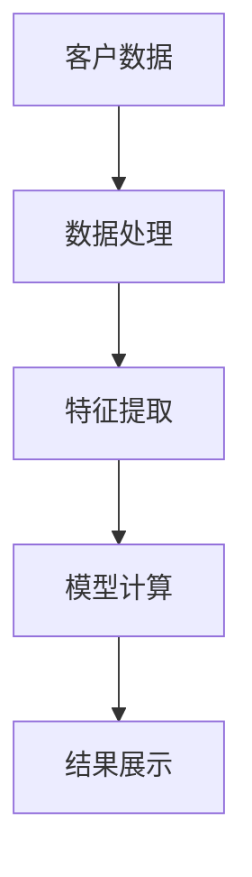

                 


---

# 企业估值中的客户粘性评估

## 关键词：企业估值，客户粘性，客户生命周期，算法模型，系统架构

## 摘要：  
在企业估值过程中，客户粘性是影响企业长期价值和竞争优势的重要因素。本文从客户粘性的定义、核心概念、数学模型、系统架构到项目实战，全面分析客户粘性评估的方法和应用，探讨其对企业估值的深远影响。通过实际案例分析，为读者提供深入的理解和实践指导。

---

## 第一部分：客户粘性评估的背景与概念

### 第1章：客户粘性评估的背景与定义

#### 1.1 客户粘性评估的背景  
随着市场竞争的加剧，客户粘性已成为企业核心竞争力的关键指标。企业估值不仅关注财务指标，还需考虑客户关系的可持续性。客户粘性高的企业往往具有更强的市场稳定性，从而影响企业估值。  

#### 1.2 客户粘性的定义与核心要素  
客户粘性指客户对企业产品或服务的依赖程度，反映了客户忠诚度和转换成本。其核心要素包括客户满意度、客户保留率、客户生命周期价值（CLV）和客户获取成本（CAC）。  

#### 1.3 客户粘性评估的边界与外延  
客户粘性评估需明确边界条件，如目标客户群体、市场环境和企业战略。其外延涵盖客户行为分析、客户生命周期管理和客户关系管理（CRM）等领域。  

### 第2章：客户粘性评估的核心概念与联系

#### 2.1 核心概念原理  
客户粘性与客户生命周期密切相关，高粘性的客户通常处于成熟期，贡献度高。客户行为分析揭示客户的购买习惯，影响粘性评估。  

#### 2.2 核心概念的联系  
客户生命周期模型展示了客户从获取到流失的全过程，帮助识别高粘性客户。客户保留成本与获取成本的对比，优化企业资源分配，提升粘性。  

---

## 第二部分：客户粘性评估的数学模型与算法原理

### 第3章：客户粘性评估的数学模型

#### 3.1 客户生命周期价值（CLV）公式  
$$ CLV = \frac{R \times (1 - \frac{1}{u})}{(1 - \frac{1}{u})} $$  
其中，R为年收入，u为贴现率，计算客户未来贡献。  

#### 3.2 客户保留率与客户获取成本的关系  
$$ R = \frac{CLV}{(1 + r)^n} $$  
r为贴现率，n为时间跨度，评估客户保留的经济价值。  

#### 3.3 客户粘性指数计算公式  
$$ SI = \frac{C_{保留} - C_{获取}}{C_{总}} $$  
SI值越高，客户粘性越强。  

### 第4章：算法实现与代码解析

#### 4.1 环境安装与配置  
使用Python 3.8及以上版本，安装numpy、pandas、scipy库。  

#### 4.2 核心代码实现  
```python
import numpy as np
import pandas as pd

def calculate_clv(revenue, discount_rate, period):
    return revenue * (1 - 1/discount_rate) / (1 - 1/discount_rate)

def calculate_si(retention_cost, acquisition_cost, total_cost):
    return (retention_cost - acquisition_cost) / total_cost
```

---

## 第三部分：系统分析与架构设计

### 第5章：客户粘性评估系统架构

#### 5.1 系统功能设计  
- 数据采集：收集客户行为数据，如购买频率、投诉记录。  
- 数据处理：清洗和特征提取，识别高价值客户。  
- 模型计算：应用CLV和SI模型，评估客户粘性。  
- 结果展示：可视化分析，提供决策支持。  

#### 5.2 系统架构设计  


---

## 第四部分：项目实战

### 第6章：客户粘性评估实战

#### 6.1 环境搭建  
安装必要的Python库，配置开发环境。  

#### 6.2 核心代码实现  
```python
import numpy as np
import pandas as pd

def calculate_clv(revenue, discount_rate, period):
    return revenue * (1 - 1/discount_rate) / (1 - 1/discount_rate)

# 示例数据
revenue = 10000
discount_rate = 0.1
period = 5

clv = calculate_clv(revenue, discount_rate, period)
print(f"客户生命周期价值：{clv}")
```

#### 6.3 实际案例分析  
以某电商企业为例，分析客户粘性，优化客户 retention策略，提升企业估值。  

---

## 第五部分：结论与展望

### 第7章：结论与展望

#### 7.1 研究结论  
客户粘性是企业估值的重要因素，CLV和SI模型有效量化客户价值。  

#### 7.2 未来展望  
结合AI和大数据技术，进一步优化客户粘性评估模型，探索动态客户价值评估方法。

---

## 附录

### 附录A：工具安装与配置

#### A.1 Python环境安装  
使用Anaconda安装Python 3.8，配置环境变量。  

#### A.2 相关库安装  
```bash
pip install numpy pandas scipy
```

### 附录B：代码示例

#### B.1 计算客户生命周期价值  
```python
import numpy as np

revenue = 10000
discount_rate = 0.1

clv = revenue * (1 - 1/discount_rate) / (1 - 1/discount_rate)
print(f"CLV: {clv}")
```

### 附录C：术语表

- CLV：客户生命周期价值  
- SI：客户粘性指数  
- CAC：客户获取成本  

--- 

通过以上结构，文章系统地介绍了客户粘性评估的各个方面，从理论到实践，帮助读者全面理解其对企业估值的影响。

