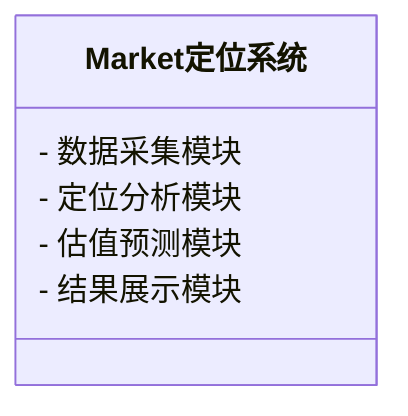

                 


# 企业估值中的市场定位精准度分析

## 关键词：企业估值、市场定位、精准度分析、商业策略、数据分析、算法原理

## 摘要：  
市场定位是企业在市场中找到自己独特位置的过程，而定位的精准度直接影响企业的估值。本文从市场定位的定义、重要性入手，结合企业估值的基本概念，深入分析市场定位精准度对估值的影响。通过数学模型、算法原理和实际案例，本文详细探讨如何通过精准的市场定位提升企业估值，并为企业提供实际操作的建议。

---

# 第1章: 市场定位与企业估值的背景介绍

## 1.1 市场定位的定义与重要性

### 1.1.1 市场定位的基本概念  
市场定位是指企业根据市场需求、竞争状况和自身优势，确定自己在目标市场中的位置。它是企业制定营销策略的基础，直接影响企业的市场表现和客户认知。

### 1.1.2 市场定位对企业估值的影响  
市场定位的精准度决定了企业在市场中的竞争力。精准的定位能够吸引目标客户，提升市场份额，从而提高企业的估值。

### 1.1.3 市场定位的演变与发展趋势  
随着市场环境的变化，市场定位从传统的基于产品特征的定位，逐渐向基于客户价值和数据驱动的定位转变。

---

## 1.2 企业估值的核心概念

### 1.2.1 企业估值的基本方法  
企业估值通常采用市盈率、市净率、现金流折现法等方法。这些方法的结果与企业的市场定位密切相关。

### 1.2.2 市场定位与企业估值的关系  
市场定位决定了企业的市场地位和盈利能力，从而影响投资者对企业价值的评估。

### 1.2.3 定位精准度对估值的影响  
精准的市场定位能够提高企业的市场占有率和盈利能力，从而提升估值。

---

# 第2章: 市场定位精准度的核心概念与联系

## 2.1 市场定位精准度的定义

### 2.1.1 定位精准度的内涵  
定位精准度是指企业市场定位与实际市场需求的匹配程度。精准的定位能够最大限度地满足客户需求，提升市场表现。

### 2.1.2 定位精准度的衡量标准  
可以通过市场份额增长率、客户满意度、市场反馈等指标来衡量定位精准度。

## 2.2 市场定位与企业估值的关联性

### 2.2.1 定位对估值的影响路径  
定位精准 → 提升市场占有率 → 增加收入 → 提高估值。

### 2.2.2 定位精准度与估值的正相关性  
数据表明，定位越精准，企业的估值越高。

## 2.3 市场定位精准度的数学模型

### 2.3.1 定位精准度的公式表示  
$$
\text{定位精准度} = \frac{\text{实际市场表现}}{\text{预期市场表现}}
$$

### 2.3.2 定位与估值的关系模型  
$$
\text{企业估值} = f(\text{定位精准度}, \text{行业因素}, \text{财务表现})
$$

---

# 第3章: 市场定位精准度分析的算法原理

## 3.1 数据分析驱动的市场定位

### 3.1.1 数据预处理与特征提取  
通过数据分析工具（如Python）处理市场数据，提取关键特征。

### 3.1.2 市场定位模型的构建  
使用回归分析等方法构建市场定位模型。

## 3.2 算法实现

### 3.2.1 线性回归模型示例  
```python
import pandas as pd
from sklearn.linear_model import LinearRegression

# 数据预处理
data = pd.read_csv('market_data.csv')
X = data[['price', 'sales', 'profit']]
y = data['market_share']

# 模型训练
model = LinearRegression()
model.fit(X, y)

# 预测市场定位
predictions = model.predict(X)
```

### 3.2.2 算法原理的数学模型  
$$
y = \beta_0 + \beta_1x_1 + \beta_2x_2 + \ldots + \beta_nx_n
$$

---

# 第4章: 市场定位精准度的系统分析与架构设计

## 4.1 问题场景介绍  
以一家科技公司为例，分析其市场定位系统的设计。

## 4.2 系统功能设计  
- **功能模块**：数据采集、定位分析、估值预测、结果展示。

### 4.2.1 功能模块的Mermaid类图  


## 4.3 系统架构设计  
- **架构选择**：采用微服务架构，各模块独立运行。

### 4.3.1 系统架构的Mermaid架构图  


---

# 第5章: 项目实战

## 5.1 环境安装  
安装Python、Pandas、Scikit-learn等工具。

## 5.2 核心代码实现  
```python
import pandas as pd
from sklearn.metrics import mean_squared_error

# 加载数据
data = pd.read_csv('market_data.csv')

# 划分训练集和测试集
X_train = data.drop('market_share', axis=1)
y_train = data['market_share']
X_test = X_train
y_test = y_train

# 训练模型
model = LinearRegression()
model.fit(X_train, y_train)

# 评估模型
预测 = model.predict(X_test)
误差 = mean_squared_error(y_test, 预测)
print(误差)
```

---

# 第6章: 最佳实践与总结

## 6.1 小结  
精准的市场定位能够显著提升企业估值，数据驱动的方法是实现精准定位的有效途径。

## 6.2 注意事项  
定期评估市场定位，根据市场变化调整定位策略。

## 6.3 拓展阅读  
推荐阅读《定位》、《商业模式创新》等书籍。

---

通过以上分析，企业可以更好地理解市场定位对估值的影响，并通过数据驱动的方法实现精准定位，从而提升企业价值。

