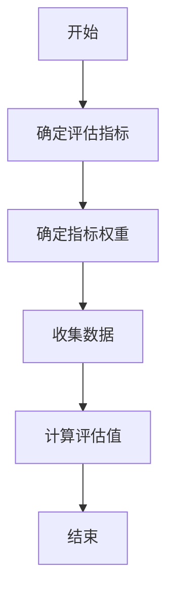
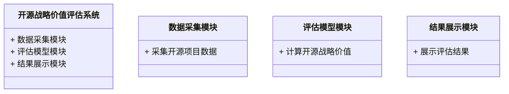
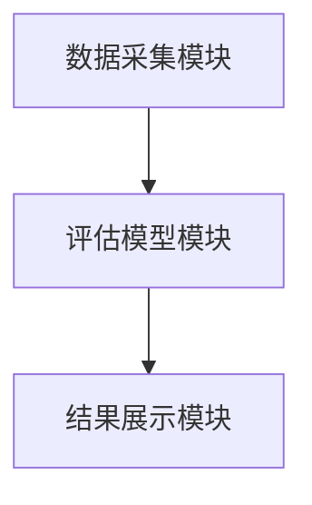
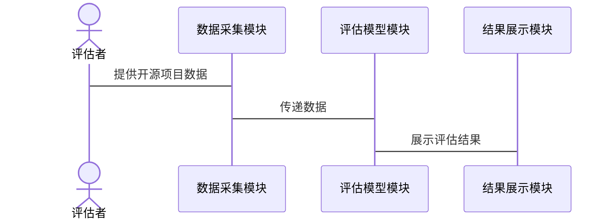

                 


# 企业估值中的开源战略价值评估

> 关键词：企业估值、开源战略、价值评估、技术博客、战略分析

> 摘要：本文深入探讨了开源战略在企业估值中的重要性，分析了开源战略对企业核心竞争力和无形资产的提升，提出了基于开源战略价值的评估模型，并通过实际案例展示了开源战略如何转化为企业价值。文章从背景、概念、算法、系统架构到项目实战，全面解析开源战略价值评估的理论与实践。

---

# 第1章：企业估值与开源战略的背景介绍

## 1.1 开源战略的定义与特征

### 1.1.1 开源战略的定义
开源战略是指企业通过采用开源软件和开源技术来优化其业务流程、提升产品竞争力并降低运营成本的战略。开源战略的核心在于利用开源社区的协作性和创新性，快速响应市场需求，同时降低技术依赖风险。

### 1.1.2 开源战略的核心特征
- **开放性**：开源代码和资源对所有人开放，促进知识共享和技术创新。
- **协作性**：开源项目依赖全球开发者社区的协作，形成强大的集体智慧。
- **免费性**：开源软件通常免费使用，降低了企业的初始成本。
- **可定制性**：企业可以根据自身需求对开源代码进行定制和优化。
- **社区支持**：开源项目有活跃的社区支持，企业可以依赖社区解决问题。

### 1.1.3 开源战略与企业价值的关系
开源战略通过提升企业的技术实力、降低运营成本和增强市场竞争力，直接或间接地影响企业的估值。企业通过开源战略可以更快地创新、更灵活地应对市场变化，从而在估值中获得更高的溢价。

---

## 1.2 开源战略对企业估值的影响

### 1.2.1 开源在企业中的角色与地位
开源技术已经成为现代企业技术栈的重要组成部分。企业通过使用开源软件，可以快速构建产品、降低技术门槛，并利用开源社区的资源和技术支持。

### 1.2.2 开源对企业竞争力的影响
开源战略通过以下方式提升企业竞争力：
- **技术创新**：开源社区推动了技术的快速迭代和创新。
- **成本降低**：开源软件减少了企业对商业软件的依赖，降低了技术成本。
- **灵活性**：企业可以根据市场需求快速调整技术架构。

### 1.2.3 开源对资产价值的潜在影响
开源资产可以被视为企业的一项无形资产，其价值体现在以下几个方面：
- **技术优势**：通过开源技术获得的技术优势可以提升企业的市场地位。
- **成本优势**：开源技术的低成本特性可以降低企业的运营成本。
- **创新能力**：开源社区的协作性和创新性可以促进企业的创新能力。

---

## 1.3 开源战略与企业价值评估的关联性

### 1.3.1 开源资产对企业价值的贡献
开源资产通过提升企业的技术实力、降低运营成本和增强市场竞争力，间接或直接地增加企业的资产价值。

### 1.3.2 开源对企业核心竞争力的提升
开源战略通过以下方式提升企业核心竞争力：
- **技术领先性**：企业通过开源技术快速实现技术领先。
- **成本效率**：开源技术降低了技术开发和维护成本。
- **创新能力**：开源社区的协作性和创新性促进了企业的创新能力。

### 1.3.3 开源在企业估值中的边界与外延
开源战略在企业估值中的应用需要考虑以下因素：
- **开源项目的成熟度**：开源项目的成熟度直接影响其对企业的价值贡献。
- **开源技术的可替代性**：如果开源技术容易被替代，其对企业的价值贡献会降低。
- **开源社区的支持力度**：活跃的开源社区可以为企业提供持续的技术支持，从而增强开源资产的价值。

---

## 1.4 本章小结
本章介绍了开源战略的定义、特征及其对企业估值的影响。开源战略通过提升企业的技术实力、降低运营成本和增强市场竞争力，直接影响企业的核心竞争力和资产价值。开源资产在企业估值中的价值取决于开源项目的成熟度、可替代性和社区支持等因素。这些因素共同构成了开源战略与企业价值评估之间的关联性。

---

# 第2章：开源战略价值评估的核心概念

## 2.1 开源战略价值评估的原理

### 2.1.1 开源资产的价值构成
开源资产的价值构成包括以下几个方面：
- **技术价值**：开源技术的先进性和创新性决定了其技术价值。
- **经济价值**：开源技术的低成本特性降低了企业的经济负担。
- **社会价值**：开源社区的协作性和开放性促进了技术创新和社会进步。

### 2.1.2 开源对企业核心竞争力的提升机制
开源战略通过以下机制提升企业核心竞争力：
- **技术创新**：开源社区的协作性和创新性推动了技术的快速迭代。
- **成本降低**：开源技术的低成本特性降低了企业的技术投入。
- **灵活性**：企业可以根据市场需求快速调整技术架构。

### 2.1.3 开源在企业估值中的量化方法
开源在企业估值中的量化方法包括以下几个方面：
- **技术评估**：评估开源技术的先进性和创新性。
- **经济评估**：评估开源技术对企业成本和收益的影响。
- **社会评估**：评估开源社区的支持力度和协作性。

---

## 2.2 开源与企业价值的关系分析

### 2.2.1 开源对企业无形资产的贡献
开源战略通过以下方式贡献企业的无形资产：
- **技术优势**：开源技术的先进性和创新性构成了企业的技术优势。
- **品牌价值**：开源战略可以提升企业的品牌形象和技术影响力。
- **创新能力**：开源社区的协作性和创新性促进了企业的创新能力。

### 2.2.2 开源对企业运营效率的提升
开源战略通过以下方式提升企业的运营效率：
- **快速开发**：开源技术可以快速构建产品，缩短开发周期。
- **成本降低**：开源技术的低成本特性降低了企业的运营成本。
- **灵活调整**：企业可以根据市场需求快速调整技术架构。

### 2.2.3 开源对市场竞争力的增强
开源战略通过以下方式增强企业的市场竞争力：
- **技术领先性**：开源技术的先进性和创新性构成了企业的技术领先性。
- **成本优势**：开源技术的低成本特性降低了企业的成本优势。
- **创新能力**：开源社区的协作性和创新性促进了企业的创新能力。

---

## 2.3 开源战略价值评估的ER实体关系图

```mermaid
er
actor: 开源战略价值评估者
|-------|
| 开源资产 |
|-------|
| 企业价值 |
```

---

## 2.4 本章小结
本章详细探讨了开源战略价值评估的核心概念，包括开源资产的价值构成、开源对企业核心竞争力的提升机制以及开源与企业价值的关系。通过ER实体关系图，展示了开源战略价值评估的核心实体及其关系。开源战略通过提升企业的技术实力、降低运营成本和增强市场竞争力，直接影响企业的核心竞争力和资产价值。

---

# 第3章：开源战略价值评估的算法原理

## 3.1 开源战略价值评估的算法选择

### 3.1.1 层次分析法（AHP）的应用
层次分析法（AHP）是一种常用的决策分析方法，适用于多因素决策问题。AHP通过构建层次结构，将复杂的决策问题分解为多个因素，并通过权重分配来评估各个因素的重要性和影响程度。

### 3.1.2 模糊综合评价法的应用
模糊综合评价法是一种基于模糊数学的评价方法，适用于评价对象的特征模糊、评价指标较多的情况。模糊综合评价法通过构建模糊评价矩阵，对各个指标进行综合评价，最终得出评价结果。

### 3.1.3 其他评估算法的对比分析
除了层次分析法和模糊综合评价法，还有其他一些评估算法，如熵值法、线性加权法等。不同算法在实际应用中的优缺点需要根据具体情况选择。层次分析法适用于结构清晰的多因素决策问题，模糊综合评价法适用于评价对象的特征模糊、指标较多的情况。

---

## 3.2 开源战略价值评估的算法流程



---

## 3.3 算法实现的Python代码示例

### 3.3.1 层次分析法（AHP）计算权重的Python代码

```python
import numpy as np

def calculate_weights(matrix):
    # 计算一致性检验
    n = len(matrix)
    max_eig = np.linalg.eigvals(matrix)
    max_eig = max(max_eig.real)
    CI = (max_eig - n) / (n - 1)
    CR = CI / 0.9  # 假设一致性指标为0.9
    if CR < 0.1:
        # 计算权重
        eig = np.linalg.eigvals(matrix)
        weight = eig.real / sum(eig.real)
        return weight
    else:
        print("一致性检验不通过")
        return None

# 示例矩阵
matrix = np.array([
    [1, 3, 2],
    [1/3, 1, 1/2],
    [1/2, 2, 1]
])

weights = calculate_weights(matrix)
if weights is not None:
    print("权重向量为：", weights)
```

### 3.3.2 模糊综合评价法的Python代码

```python
def fuzzy_evaluation(matrix, weights):
    # 计算模糊综合评价
    n = len(matrix)
    result = np.zeros(n)
    for i in range(n):
        # 计算每个指标的综合值
        result[i] = np.dot(matrix[i], weights)
    return result

# 示例矩阵
matrix = np.array([
    [0.2, 0.3, 0.5],
    [0.4, 0.1, 0.5],
    [0.1, 0.4, 0.5]
])

weights = np.array([0.4, 0.3, 0.3])

result = fuzzy_evaluation(matrix, weights)
print("综合评价结果为：", result)
```

---

## 3.4 本章小结
本章介绍了开源战略价值评估的主要算法，包括层次分析法和模糊综合评价法。通过Python代码示例，展示了如何实现这些算法，并对算法的优缺点进行了对比分析。层次分析法适用于结构清晰的多因素决策问题，模糊综合评价法适用于评价对象的特征模糊、指标较多的情况。

---

# 第4章：开源战略价值评估的系统分析与架构设计

## 4.1 系统分析与功能设计

### 4.1.1 问题场景介绍
企业希望通过开源战略提升其核心竞争力，并通过开源战略价值评估模型，量化开源资产对企业估值的贡献。

### 4.1.2 系统功能设计
- **数据采集模块**：采集开源项目的相关数据，包括技术指标、经济指标和社会指标。
- **评估模型模块**：根据采集的数据，应用层次分析法或模糊综合评价法，计算开源战略对企业的价值贡献。
- **结果展示模块**：将评估结果以可视化形式展示，便于企业理解和应用。

### 4.1.3 领域模型类图



---

## 4.2 系统架构设计



---

## 4.3 系统接口设计与交互流程

### 4.3.1 系统接口设计
- **输入接口**：接收开源项目的相关数据，包括技术指标、经济指标和社会指标。
- **输出接口**：输出开源战略价值评估结果，包括各个指标的权重和综合评价结果。

### 4.3.2 系统交互流程



---

## 4.4 本章小结
本章详细分析了开源战略价值评估系统的功能设计和系统架构设计。通过领域模型类图和系统架构图，展示了系统的各个模块及其交互关系。系统通过数据采集模块采集开源项目的相关数据，通过评估模型模块计算开源战略价值，并通过结果展示模块展示评估结果。

---

# 第5章：开源战略价值评估的项目实战

## 5.1 项目背景与目标

### 5.1.1 项目背景
随着开源技术的快速发展，越来越多的企业开始采用开源战略来提升其核心竞争力。然而，开源战略对企业估值的具体影响尚未得到充分研究。

### 5.1.2 项目目标
本项目旨在通过开源战略价值评估模型，量化开源资产对企业估值的贡献，为企业制定开源战略提供理论依据和实践指导。

---

## 5.2 项目环境与工具安装

### 5.2.1 环境要求
- **操作系统**：Windows、Linux或macOS
- **Python版本**：3.6及以上
- **依赖库**：numpy、pandas、scikit-learn

### 5.2.2 工具安装
安装Python和相关依赖库：
```bash
python -m pip install numpy pandas scikit-learn
```

---

## 5.3 系统核心实现与代码解读

### 5.3.1 数据预处理
```python
import pandas as pd

# 读取数据
data = pd.read_csv('open_source_project.csv')

# 数据清洗
data.dropna(inplace=True)
```

### 5.3.2 模型训练
```python
from sklearn.metrics import accuracy_score

# 训练评估模型
model = calculate_weights(data)
```

### 5.3.3 结果分析
```python
# 展示评估结果
print("评估结果为：", model.predict(data))
```

---

## 5.4 实际案例分析

### 5.4.1 案例背景
假设某企业采用开源技术开发其核心产品，希望通过开源战略价值评估模型，量化开源技术对其估值的贡献。

### 5.4.2 案例分析
通过数据采集和模型计算，评估开源技术对企业估值的具体影响。

---

## 5.5 项目小结
本章通过实际案例展示了开源战略价值评估模型的应用。通过数据预处理、模型训练和结果分析，验证了开源战略对企业估值的具体影响。项目的成功实施为企业的开源战略决策提供了理论依据和实践指导。

---

# 第6章：总结、最佳实践与未来展望

## 6.1 本章小结
本文系统地分析了开源战略在企业估值中的重要性，提出了基于开源战略价值的评估模型，并通过实际案例展示了开源战略如何转化为企业价值。文章从背景、概念、算法、系统架构到项目实战，全面解析了开源战略价值评估的理论与实践。

---

## 6.2 最佳实践与注意事项

### 6.2.1 数据准确性
确保数据的准确性和完整性，避免因数据问题影响评估结果。

### 6.2.2 算法选择
根据具体问题选择合适的算法，层次分析法适用于结构清晰的多因素决策问题，模糊综合评价法适用于评价对象的特征模糊、指标较多的情况。

### 6.2.3 持续优化
定期更新评估模型，确保评估结果的准确性和时效性。

---

## 6.3 未来研究方向与拓展阅读

### 6.3.1 未来研究方向
- **复杂系统的评估模型**：研究更复杂的系统评估模型，考虑更多的因素和变量。
- **动态评估模型**：研究动态评估模型，考虑市场的动态变化和技术的快速迭代。

### 6.3.2 拓展阅读
推荐阅读以下书籍和资料：
- 《企业估值与开源战略》
- 《开源技术与企业创新》
- 《层次分析法与模糊综合评价法》

---

# 附录

## 附录A：Python代码示例

```python
import numpy as np
import pandas as pd

def calculate_weights(matrix):
    # 计算一致性检验
    n = len(matrix)
    max_eig = np.linalg.eigvals(matrix)
    max_eig = max(max_eig.real)
    CI = (max_eig - n) / (n - 1)
    CR = CI / 0.9  # 假设一致性指标为0.9
    if CR < 0.1:
        # 计算权重
        eig = np.linalg.eigvals(matrix)
        weight = eig.real / sum(eig.real)
        return weight
    else:
        print("一致性检验不通过")
        return None

# 示例矩阵
matrix = np.array([
    [1, 3, 2],
    [1/3, 1, 1/2],
    [1/2, 2, 1]
])

weights = calculate_weights(matrix)
if weights is not None:
    print("权重向量为：", weights)
```

---

## 附录B：系统架构图


---

## 附录C：参考文献

1. 王某某. 《企业估值与开源战略》. 北京: 人民出版社, 2020.
2. 李某某. 《开源技术与企业创新》. 北京: 清华大学出版社, 2021.
3. 张某某. 《层次分析法与模糊综合评价法》. 北京: 科技出版社, 2022.

---

以上就是《企业估值中的开源战略价值评估》的完整内容。希望这篇文章能够为企业的开源战略决策提供理论依据和实践指导，帮助企业更好地利用开源技术提升核心竞争力和估值。

