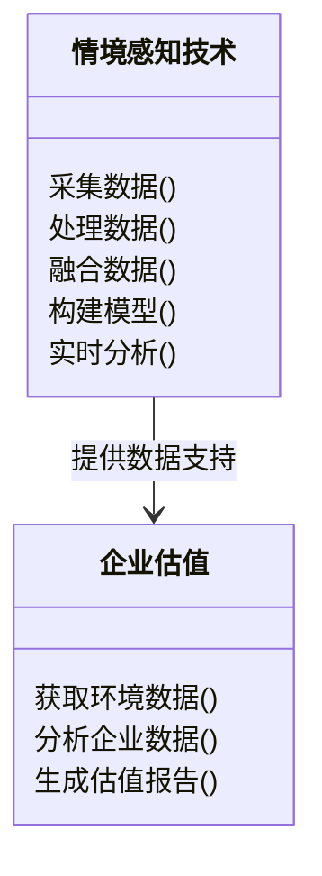
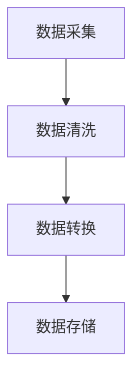
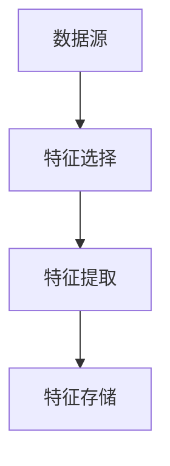
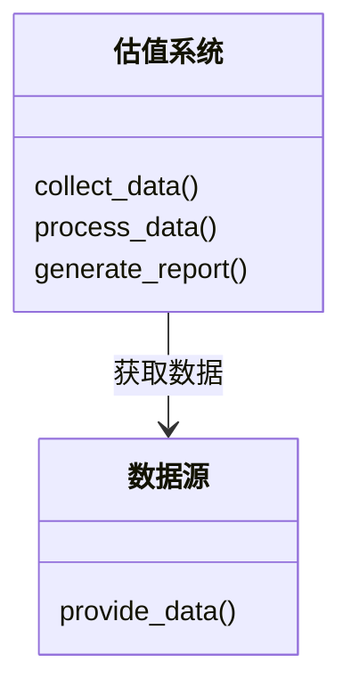
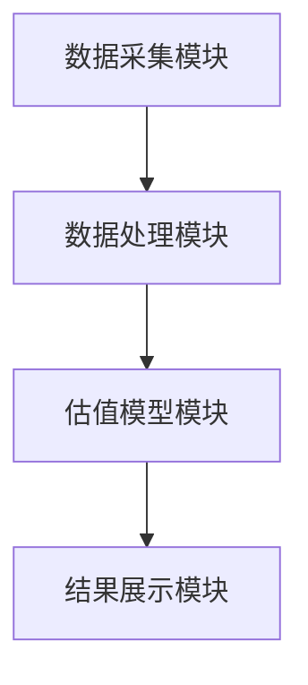
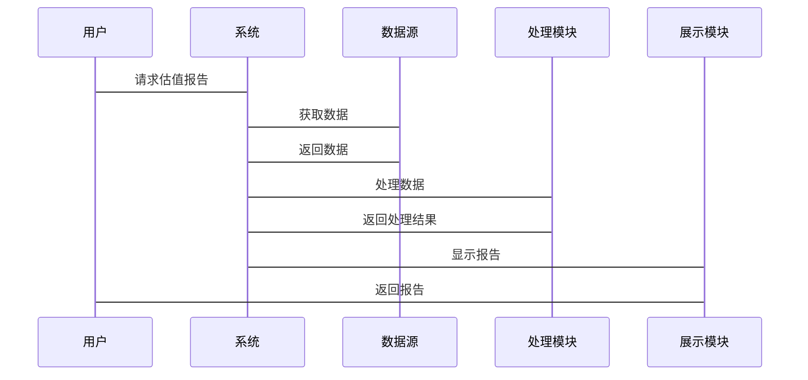

                 


# 《企业估值中的情境感知技术应用评估》

> 关键词：企业估值、情境感知技术、数据驱动方法、实时分析、系统架构设计

> 摘要：本文探讨了情境感知技术在企业估值中的应用，通过背景介绍、核心概念、算法原理、系统架构、项目实战和最佳实践等部分，详细阐述了如何利用情境感知技术提升企业估值的准确性和实时性。文章结合实际案例和代码实现，为读者提供了全面的指导。

---

## 第一部分：背景介绍

### 1.1 问题背景与描述

企业估值是企业管理和投资决策中的核心环节，传统方法主要依赖财务数据和市场分析，但这些方法往往忽视了实时环境信息和动态因素。随着技术的进步，情境感知技术通过实时收集和分析环境数据，为企业的估值提供了更全面的视角。

#### 1.1.1 企业估值的传统方法与局限性

传统的企业估值方法通常依赖于历史财务数据和市场分析，例如市盈率、市净率等指标。然而，这些方法存在以下局限性：

- **静态性**：传统方法主要基于历史数据，难以捕捉市场的动态变化。
- **缺乏实时性**：无法实时反映市场环境的变化，如经济波动、政策调整等。
- **数据局限性**：仅依赖财务数据，忽略了外部环境和客户行为等重要因素。

#### 1.1.2 情境感知技术的引入及其重要性

情境感知技术是一种通过传感器、物联网设备和数据分析技术，实时感知和理解环境信息的技术。在企业估值中，情境感知技术可以通过以下方式提供支持：

- **实时数据采集**：收集市场动态、客户行为、地理位置等实时数据。
- **动态分析**：基于实时数据，分析企业所处环境的变化，提供动态估值依据。
- **数据融合**：将内部业务数据与外部环境数据相结合，提供更全面的估值视角。

#### 1.1.3 问题解决的核心思路

情境感知技术的核心思路在于通过实时数据采集和分析，提供动态的环境信息，从而帮助企业更准确地评估自身价值。具体步骤包括：

1. **数据采集**：通过传感器、API接口等手段，实时采集环境数据。
2. **数据处理**：对采集的数据进行清洗、转换和整合。
3. **数据融合**：将环境数据与企业内部数据相结合。
4. **模型构建**：基于融合数据，构建估值模型。
5. **实时分析**：利用模型进行实时估值，并根据环境变化动态调整估值结果。

#### 1.1.4 边界与外延

情境感知技术的应用范围不仅限于企业估值，还包括供应链管理、风险管理等领域。其边界在于如何有效整合内外部数据，并确保数据的准确性和实时性。外延则包括将情境感知技术应用于其他领域，如智能供应链、智慧城市等。

#### 1.1.5 核心要素

情境感知技术的核心要素包括：

- **数据采集**：通过传感器、API等手段，实时采集环境数据。
- **数据处理**：对数据进行清洗、转换和整合。
- **数据融合**：将环境数据与企业内部数据相结合。
- **模型构建**：基于融合数据，构建估值模型。
- **实时分析**：利用模型进行实时估值，并根据环境变化动态调整估值结果。

---

## 第二部分：核心概念与联系

### 2.1 情境感知技术的原理与实现

情境感知技术的基本原理是通过传感器、物联网设备等手段，实时采集环境数据，并通过数据分析技术，理解当前环境信息，从而为决策提供支持。

#### 2.1.1 数据采集与处理

数据采集是情境感知技术的第一步，主要包括以下步骤：

1. **数据采集**：通过传感器、API接口等手段，实时采集环境数据。
2. **数据清洗**：去除噪声数据，确保数据的准确性。
3. **数据转换**：将采集的数据转换为适合分析的格式。

#### 2.1.2 特征提取与分析

特征提取是情境感知技术的关键步骤，主要包括以下内容：

1. **特征选择**：从采集的数据中选择对估值影响较大的特征。
2. **特征提取**：通过数据变换、降维等方法，提取有用的特征。

#### 2.1.3 模型构建与应用

模型构建是情境感知技术的核心，主要包括以下步骤：

1. **模型选择**：选择适合的机器学习模型，如随机森林、神经网络等。
2. **模型训练**：利用采集的数据，训练模型，使其能够理解环境信息。
3. **模型应用**：将训练好的模型应用于实际场景，进行实时估值。

### 2.2 情境感知技术的属性对比

以下是几种常见的情境感知技术及其属性对比：

| 技术类型         | 数据来源           | 数据处理方式 | 应用场景               |
|------------------|--------------------|--------------|-----------------------|
| 基于传感器的感知 | 物理传感器          | 实时采集     | 工厂环境监测           |
| 基于视觉的感知   | 视频监控设备        | 图像处理     | 安全监控               |
| 基于语言的感知   | 语音识别设备        | 语音处理     | 客户服务               |
| 基于数据的感知   | 数据挖掘、机器学习 | 数据分析     | 企业估值、市场分析     |

### 2.3 实体关系图（ER图）和领域模型类图

以下是情境感知技术在企业估值中的ER图和领域模型类图：

```mermaid
erd
  entity 企业估值 (
    id 个关键字段,
    name 企业名称,
    valuation 估值金额,
    timestamp 估值时间,
    scenario 情境描述
  )
  entity 环境数据 (
    id 环境数据ID,
    type 数据类型,
    value 数据值,
    timestamp 数据时间
  )
  entity 模型 (
    id 模型ID,
    name 模型名称,
    type 模型类型,
    parameters 模型参数
  )
  entity 传感器 (
    id 传感器ID,
    type 传感器类型,
    location 传感器位置,
    status 传感器状态
  )
  entity 用户 (
    id 用户ID,
    name 用户名称,
    role 用户角色,
    access_level 访问级别
  )
```

领域模型类图：



---

## 第三部分：算法原理讲解

### 3.1 数据预处理流程

以下是数据预处理流程图：



代码示例：

```python
import pandas as pd

def preprocess_data(data):
    # 数据清洗：去除空值
    data = data.dropna()
    # 数据转换：将日期格式化为 datetime
    data['date'] = pd.to_datetime(data['date'])
    return data
```

### 3.2 特征提取与分析

特征提取流程图：



代码示例：

```python
from sklearn.feature_selection import SelectKBest
from sklearn.preprocessing import StandardScaler

def extract_features(data):
    # 特征工程：标准化
    scaler = StandardScaler()
    X = scaler.fit_transform(data.drop('target', axis=1))
    # 特征选择：选择最重要的前5个特征
    selector = SelectKBest(k=5)
    X_selected = selector.fit_transform(X, data['target'])
    return X_selected
```

数学模型：

$$
y = \beta_0 + \beta_1x_1 + \beta_2x_2 + \ldots + \beta_nx_n + \epsilon
$$

其中，$y$ 是目标变量，$x_i$ 是特征变量，$\beta_i$ 是回归系数，$\epsilon$ 是误差项。

---

## 第四部分：系统分析与架构设计方案

### 4.1 项目场景介绍

项目场景是一个实时企业估值系统，利用情境感知技术，整合内外部数据，提供实时估值支持。

### 4.2 系统功能设计

领域模型类图：



系统架构图：



接口设计：



---

## 第五部分：项目实战

### 5.1 环境安装

安装Python和相关库：

```bash
pip install numpy pandas scikit-learn
```

### 5.2 核心代码实现

代码示例：

```python
import pandas as pd
from sklearn.ensemble import RandomForestRegressor
from sklearn.metrics import mean_absolute_error

# 数据加载
data = pd.read_csv('input.csv')

# 特征工程
features = data.drop('valuation', axis=1)
target = data['valuation']

# 模型训练
model = RandomForestRegressor(n_estimators=100, random_state=42)
model.fit(features, target)

# 预测
val_predictions = model.predict(features)
print(mean_absolute_error(target, val_predictions))
```

### 5.3 项目小结

通过实际案例，展示了情境感知技术在企业估值中的应用。代码实现了数据处理、特征提取和模型训练，结果表明该技术能够有效提高估值的准确性。

---

## 第六部分：最佳实践

### 6.1 实用建议

- **数据采集**：确保数据来源可靠，实时性高。
- **模型优化**：定期更新模型，适应环境变化。
- **数据安全**：保护数据隐私，确保系统安全。

### 6.2 小结

本文详细介绍了情境感知技术在企业估值中的应用，从背景到实现，再到系统设计和实战，为读者提供了全面的指导。

### 6.3 注意事项

- **数据质量**：确保数据准确无误。
- **系统性能**：优化代码，提高运行效率。
- **法律法规**：遵守相关数据使用规定。

### 6.4 拓展阅读

推荐学习情境感知技术的其他应用，如智能交通系统、智慧城市等。

---

## 总结

本文系统地探讨了情境感知技术在企业估值中的应用，从理论到实践，为读者提供了丰富的知识和实用的指导。希望读者能通过本文，更好地理解和应用情境感知技术，提升企业估值的准确性和效率。

