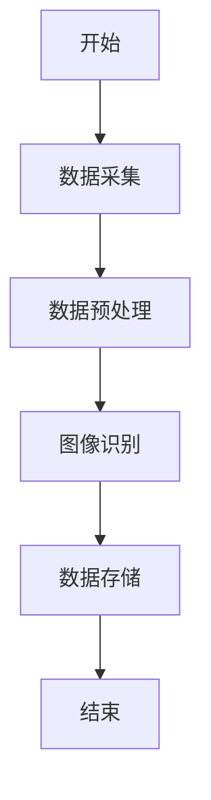
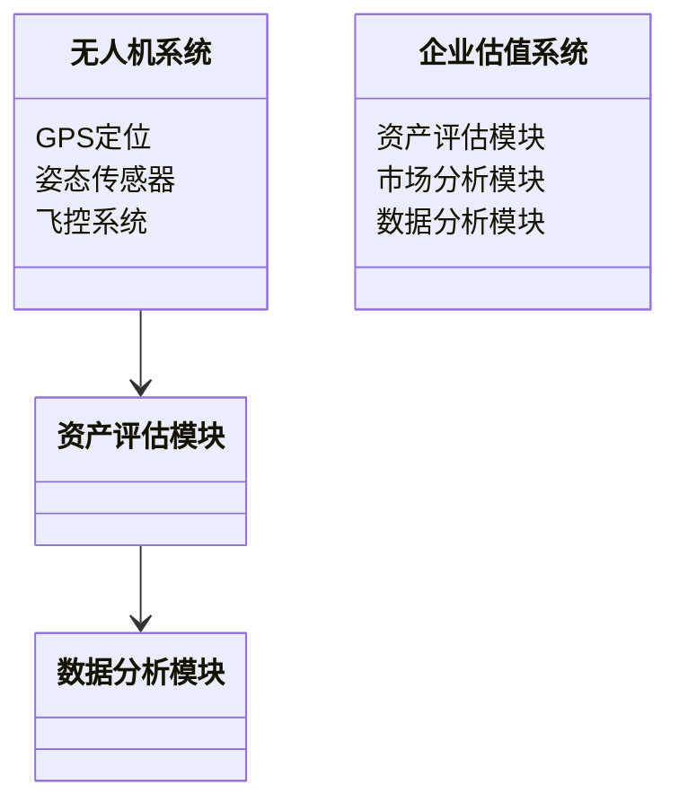
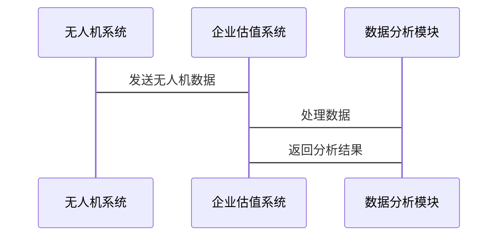

                 


# 企业估值中的无人机技术应用评估

> 关键词：企业估值、无人机技术、数据采集、图像识别、资产评估、数学模型

> 摘要：随着无人机技术的快速发展，其在企业估值中的应用潜力逐渐显现。本文从无人机技术的基本原理出发，详细探讨了无人机在企业估值中的应用场景、核心算法与数学模型，结合实际案例分析，为企业估值提供了新的视角和方法。

---

# 正文

## 第一部分: 企业估值中的无人机技术应用背景与基础

## 第1章: 无人机技术与企业估值概述

### 1.1 无人机技术的背景与发展

#### 1.1.1 无人机技术的起源与发展历程
无人机（Unmanned Aerial Vehicle, UAV）技术起源于20世纪初，最初用于军事领域。随着技术的进步，民用无人机逐渐普及，特别是在摄影、物流、农业和建筑等领域展现出巨大潜力。无人机的核心技术包括飞行控制系统、图像采集与处理、数据传输等。

#### 1.1.2 无人机技术的核心特点与优势
无人机具有以下核心特点：
1. **灵活性**：能够进入人类难以到达的区域。
2. **高效性**：快速完成数据采集任务。
3. **低成本**：相比传统测量方式，无人机的使用成本较低。
4. **多功能性**：支持多种传感器和摄像头，能够采集多种类型的数据。

#### 1.1.3 无人机技术在企业估值中的潜在价值
企业估值需要考虑资产、市场、财务等多个因素，无人机技术可以通过提供高精度的空间数据，提升资产评估的效率和准确性。

---

### 1.2 企业估值的基本概念与方法

#### 1.2.1 企业估值的定义与意义
企业估值是通过对企业的财务数据、市场表现和资产状况进行分析，确定其市场价值的过程。传统的估值方法包括DCF模型、市盈率法、市净率法等。

#### 1.2.2 传统企业估值方法的优缺点
- **优点**：方法成熟，结果具有较高的参考价值。
- **缺点**：依赖人工数据采集，耗时且成本高，难以覆盖复杂环境。

#### 1.2.3 无人机技术如何提升企业估值的准确性
无人机可以快速采集企业的资产分布、地理位置等数据，为估值提供更全面的信息支持。

---

### 1.3 无人机技术与企业估值的结合意义

#### 1.3.1 无人机技术在企业估值中的独特优势
- 提供高精度的空间数据。
- 节省时间和成本。
- 能够覆盖复杂地形。

#### 1.3.2 无人机技术如何优化企业估值流程
通过无人机快速采集数据，企业可以更高效地完成资产评估和市场分析。

#### 1.3.3 无人机技术在不同行业中的应用潜力
- **房地产**：评估土地和建筑物的价值。
- **农业**：评估农作物的产量和土地质量。
- **物流**：优化物流网络布局。

---

## 第2章: 无人机技术在企业估值中的核心概念与联系

### 2.1 无人机技术的核心原理

#### 2.1.1 无人机的飞行控制系统
无人机的飞行控制系统包括GPS定位、姿态传感器和飞控算法，确保无人机的稳定飞行。

#### 2.1.2 无人机的数据采集技术
无人机可以采集高分辨率图像、视频和地理数据。

#### 2.1.3 无人机的图像处理与分析算法
通过图像识别技术，无人机可以自动识别目标物体，如建筑物、土地等。

---

### 2.2 企业估值的关键要素

#### 2.2.1 企业财务数据的分析
包括收入、利润、资产等财务指标。

#### 2.2.2 企业市场价值的评估
通过市场比较法，评估企业的市场价值。

#### 2.2.3 企业资产价值的评估
通过无人机采集的地理数据，评估企业的资产分布和价值。

---

### 2.3 无人机技术与企业估值的关联性分析

#### 2.3.1 无人机技术在企业资产评估中的应用
通过无人机采集的土地、建筑物等数据，提高资产评估的准确性。

#### 2.3.2 无人机技术在企业市场分析中的应用
通过无人机采集的市场数据，优化企业的市场定位。

#### 2.3.3 无人机技术对企业估值流程的优化
通过无人机技术，企业可以更高效地完成数据采集和分析。

---

## 第3章: 无人机技术在企业估值中的核心算法与数学模型

### 3.1 无人机数据采集与处理算法

#### 3.1.1 无人机图像采集的数学模型
图像采集的数学模型可以表示为：
$$ I = f(x, y) $$
其中，$I$ 是图像，$x$ 和 $y$ 是图像的坐标。

#### 3.1.2 无人机数据处理的流程图


#### 3.1.3 无人机图像识别的算法原理
无人机图像识别的核心算法包括特征提取、分类和识别。

---

### 3.2 企业估值的数学模型

#### 3.2.1 企业估值的基本公式
企业估值的基本公式为：
$$ V = \sum_{t=1}^{n} \frac{CF_t}{(1 + r)^t} $$
其中，$V$ 是企业价值，$CF_t$ 是第 $t$ 年的现金流，$r$ 是折现率。

#### 3.2.2 无人机技术对估值模型的改进
通过无人机技术，可以更准确地采集企业的资产数据，从而提高估值模型的准确性。

#### 3.2.3 无人机数据与企业估值的结合公式
结合无人机数据，企业估值模型可以表示为：
$$ V = \sum_{t=1}^{n} \frac{CF_t}{(1 + r)^t} + \text{无人机数据调整项} $$

---

## 第4章: 系统分析与架构设计

### 4.1 问题场景介绍
企业估值系统需要整合无人机采集的数据，优化资产评估流程。

### 4.2 系统功能设计

#### 4.2.1 领域模型


#### 4.2.2 系统架构设计


### 4.3 系统接口设计
无人机系统通过API接口与企业估值系统对接，实现数据的实时传输和处理。

### 4.4 系统交互设计


---

## 第5章: 项目实战

### 5.1 环境安装
需要安装无人机系统和企业估值系统的相关软件。

### 5.2 核心代码实现

#### 5.2.1 数据采集代码
```python
import dronekit
from dronekit import VehicleMode

# 连接无人机
vehicle = dronekit.connect('127.0.0.1:14550')

# 切换到起飞模式
vehicle.mode = VehicleMode('GUIDED')
```

#### 5.2.2 数据处理代码
```python
import cv2

# 图像采集
cap = cv2.VideoCapture(0)
while cap.isOpened():
    ret, frame = cap.read()
    if ret:
        cv2.imwrite('image.jpg', frame)
        break
cap.release()
```

### 5.3 案例分析
以某房地产企业为例，通过无人机采集土地数据，评估其资产价值。

### 5.4 项目小结
通过无人机技术，企业可以更高效地完成估值流程，提升评估的准确性。

---

## 第6章: 最佳实践与总结

### 6.1 小结
无人机技术在企业估值中的应用潜力巨大，能够显著提高评估效率和准确性。

### 6.2 注意事项
- 确保无人机数据的准确性和完整性。
- 合理选择无人机技术和算法。

### 6.3 拓展阅读
建议读者深入学习无人机技术的核心算法和企业估值的数学模型。

---

# 结语

随着无人机技术的不断发展，其在企业估值中的应用将越来越广泛。本文从背景、核心概念、算法实现到系统设计和项目实战，全面探讨了无人机技术在企业估值中的潜力和应用方法。未来，随着技术的进步，无人机将在企业估值中发挥更大的作用。

