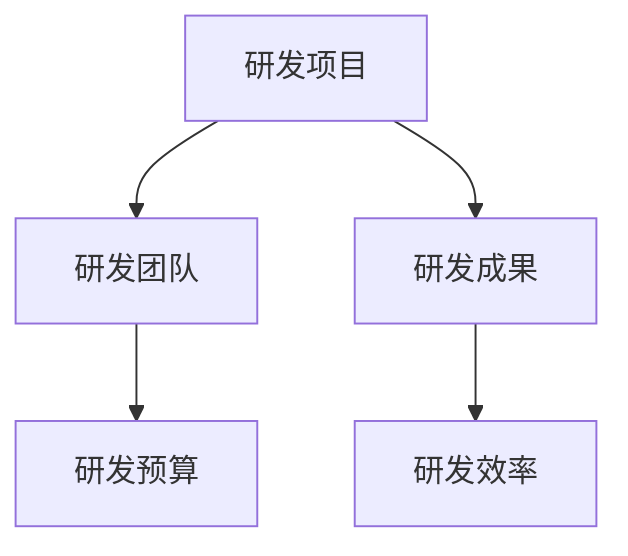
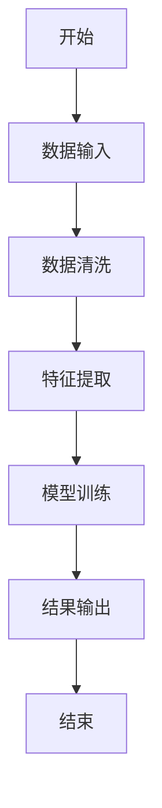
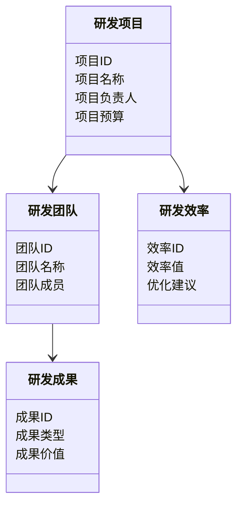
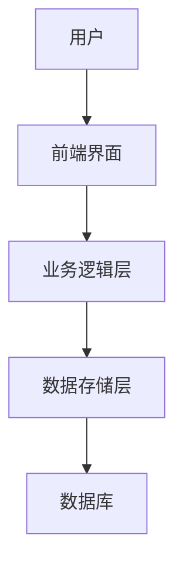
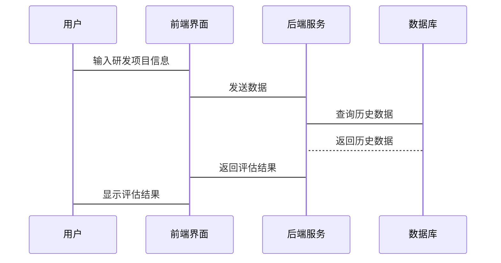

                 


# 企业估值中的研发效率评估

> 关键词：企业估值、研发效率、研发管理、研发产出、研发投入、效率评估、技术经济分析

> 摘要：研发效率评估是企业在技术经济分析中的核心问题之一。随着企业对技术创新的需求不断增加，研发效率评估的重要性日益凸显。本文将从研发效率评估的背景、核心概念、算法原理、系统分析、项目实战等多个维度展开，深入探讨研发效率评估的方法、工具和最佳实践。通过本文的分析，读者将能够全面理解研发效率评估对企业估值的影响，并掌握如何在实际工作中应用这些方法。

---

# 第1章: 研发效率评估的背景与重要性

## 1.1 研发效率评估的背景介绍
### 1.1.1 企业估值中的研发效率问题背景
企业估值的核心在于对企业未来盈利能力的预测。研发效率作为影响企业技术创新能力的关键因素，直接影响企业的市场竞争力和长期盈利能力。尤其是在科技行业，研发效率已成为企业估值的重要考量因素。

### 1.1.2 研发效率对企业价值的影响
研发效率高的企业能够更快地将技术转化为产品，降低研发成本，提高市场响应速度。这些因素直接提升了企业的市场地位和估值。

### 1.1.3 研发效率评估的重要性
研发效率评估能够帮助企业识别研发过程中的瓶颈，优化资源配置，提升研发产出的质量和数量。同时，研发效率评估也是企业融资、并购和上市等重大决策的重要依据。

## 1.2 研发效率评估的核心概念
### 1.2.1 研发效率的定义与维度
研发效率是指企业在一定资源投入下，实现技术研发目标的能力。它可以从时间、成本、质量等多个维度进行评估。

### 1.2.2 研发效率评估的边界与外延
研发效率评估不仅关注研发过程本身，还涉及研发成果的市场价值和后续应用效果。其外延包括从研发项目启动到最终产品落地的全生命周期。

### 1.2.3 研发效率评估的核心要素组成
- **研发投入**：包括人力、资金、时间等资源的投入。
- **研发产出**：包括技术成果的数量和质量，如专利数量、产品发布速度等。
- **研发周期**：从项目启动到最终交付的时间长度。

## 1.3 研发效率评估的理论基础
### 1.3.1 研发效率评估的基本原理
研发效率评估基于技术经济学的基本原理，结合企业研发活动的特点，通过量化分析和对比研究，得出研发效率的评价结果。

### 1.3.2 研发效率评估的数学模型
$$研发效率 = \frac{研发产出}{研发投入}$$
其中，研发产出可以用专利数量、产品发布数量等指标衡量，研发投入可以用人力成本、时间成本等指标衡量。

### 1.3.3 研发效率评估的适用范围与限制
研发效率评估适用于所有类型的企业，但其准确性受到数据质量和评估模型选择的影响。对于小企业或初创企业，数据不足可能导致评估结果偏差。

## 1.4 本章小结
本章从背景、核心概念和理论基础三个方面介绍了研发效率评估的重要性和基本框架。通过本章内容，读者可以初步理解研发效率评估的定义、维度和核心要素。

---

# 第2章: 研发效率评估的核心概念与联系

## 2.1 研发效率评估的核心概念
### 2.1.1 研发投入与研发产出的关系
研发投入和研发产出之间存在非线性关系。投入的增加并不一定能带来产出的线性增长，存在边际效益递减的现象。

### 2.1.2 研发效率的多维度评估
研发效率可以从以下维度进行评估：
- 时间维度：研发周期的长短。
- 成本维度：单位产出的研发成本。
- 质量维度：研发成果的市场价值和应用前景。

### 2.1.3 研发效率与企业价值的关联
研发效率高的企业通常具有更强的市场竞争力和持续创新能力，这直接提升了企业的估值。

## 2.2 研发效率评估的核心指标
### 2.2.1 研发投入产出比
研发投入产出比 = 研发成果价值 / 研发投入
- 研发成果价值可以用专利价值、产品市场收益等指标衡量。

### 2.2.2 研发周期与效率
研发周期 = 研发项目从启动到交付的时间
- 研发效率与研发周期呈反比关系。

### 2.2.3 研发成果的质量与数量
- 质量：研发成果的创新性和市场价值。
- 数量：研发成果的数量，如专利数量、产品数量。

## 2.3 研发效率评估的流程与步骤
### 2.3.1 数据收集与整理
- 数据来源：企业内部数据、公开报告、第三方数据等。
- 数据清洗：去除无效数据，确保数据的准确性和完整性。

### 2.3.2 数据分析与建模
- 数据分析方法：回归分析、聚类分析等。
- 建模工具：Python的Pandas、NumPy库，R语言等。

### 2.3.3 结果解读与优化建议
- 结果解读：分析研发效率的高低原因。
- 优化建议：提出提升研发效率的具体措施。

## 2.4 研发效率评估的ER实体关系图


## 2.5 本章小结
本章通过核心概念、核心指标和评估流程的分析，详细介绍了研发效率评估的关键要素及其相互关系。通过ER实体关系图，读者可以清晰理解研发效率评估的数据流和关系结构。

---

# 第3章: 研发效率评估的算法原理与数学模型

## 3.1 研发效率评估的算法原理
### 3.1.1 研发效率评估的基本算法
- 线性回归模型：用于分析研发效率与研发投入之间的关系。
- 聚类分析：用于将企业分为不同研发效率类别。

### 3.1.2 研发效率评估的改进算法
- 网络分析法：通过构建研发过程的网络模型，分析关键路径和瓶颈。
- 绩效评价模型：结合定量和定性指标，综合评估研发效率。

### 3.1.3 算法的优缺点分析
- 线性回归模型：简单易懂，但可能忽略非线性关系。
- 聚类分析：能够发现数据中的潜在结构，但需要处理噪声数据。

## 3.2 研发效率评估的数学模型
### 3.2.1 研发效率的基本公式
$$研发效率 = \frac{研发产出}{研发投入}$$

### 3.2.2 研发周期与效率的关系
$$研发周期 = \frac{研发投入}{研发效率}$$

### 3.2.3 研发效率的综合评价模型
$$综合研发效率 = \alpha \cdot 研发产出 + (1-\alpha) \cdot 研发周期$$
其中，$\alpha$ 是权重系数，通常取0.5或0.6。

## 3.3 研发效率评估的算法流程图


## 3.4 本章小结
本章通过算法原理和数学模型的分析，详细介绍了研发效率评估的技术实现方法。通过对不同算法的优缺点分析，读者可以更好地选择适合自身需求的评估方法。

---

# 第4章: 研发效率评估的系统分析与架构设计

## 4.1 系统分析
### 4.1.1 问题场景介绍
企业希望通过研发效率评估系统，优化研发过程，提升研发效率。

### 4.1.2 项目目标与范围
- 目标：构建研发效率评估模型，提供优化建议。
- 范围：涵盖研发项目管理、团队协作、资源分配等方面。

## 4.2 系统功能设计
### 4.2.1 领域模型


### 4.2.2 系统架构设计


## 4.3 系统接口设计
- 用户接口：提供研发项目信息输入、评估结果查询等功能。
- 数据接口：与企业现有数据系统对接，获取研发数据。

## 4.4 系统交互设计


## 4.5 本章小结
本章通过系统分析和架构设计，详细介绍了研发效率评估系统的实现方案。通过领域模型和系统架构图，读者可以清晰理解系统的组成和工作流程。

---

# 第5章: 研发效率评估的项目实战

## 5.1 项目背景
某科技公司希望通过研发效率评估系统，优化其软件开发过程。

## 5.2 项目实现
### 5.2.1 环境安装
- Python 3.8+
- 数据处理库：Pandas、NumPy
- 可视化库：Matplotlib、Seaborn
- 机器学习库：Scikit-learn

### 5.2.2 核心代码实现
```python
import pandas as pd
from sklearn.linear_model import LinearRegression

# 数据加载
data = pd.read_csv('研发数据.csv')

# 特征工程
X = data[['研发投入']]
y = data['研发产出']

# 模型训练
model = LinearRegression()
model.fit(X, y)

# 模型评估
print('研发效率 =', model.coef_[0], ' * 投入 +', model.intercept_)
```

### 5.2.3 代码应用解读
- 数据加载：读取研发数据，包括研发投入和产出。
- 特征工程：选择研发投入作为特征变量。
- 模型训练：使用线性回归模型拟合数据。
- 模型评估：输出研发效率的回归系数和截距。

## 5.3 项目案例分析
### 5.3.1 案例背景
某科技公司开发新产品，研发投入为1000万元，研发周期为12个月，研发产出为5项专利。

### 5.3.2 实施步骤
1. 数据收集：收集过去三年的研发数据。
2. 数据分析：使用线性回归模型评估研发效率。
3. 优化建议：根据评估结果优化研发流程。

## 5.4 项目小结
本章通过一个实际案例，详细介绍了研发效率评估的项目实施过程。通过代码实现和案例分析，读者可以掌握研发效率评估的具体操作方法。

---

# 第6章: 总结与展望

## 6.1 本章总结
研发效率评估是企业估值中的关键环节，通过对研发效率的量化分析，企业可以优化研发过程，提升研发产出。本章从理论到实践，全面介绍了研发效率评估的方法和工具。

## 6.2 研发效率评估的未来展望
随着人工智能和大数据技术的发展，研发效率评估将更加智能化和精准化。未来的研究方向包括：
- 结合AI技术，实现研发效率的实时监测和预测。
- 引入区块链技术，提升研发数据的安全性和可信度。

## 6.3 最佳实践 tips
- 数据是研发效率评估的基础，确保数据的准确性和完整性。
- 结合企业实际情况，选择合适的评估模型。
- 持续优化研发效率评估模型，提升评估结果的准确性。

## 6.4 本章小结
本章总结了研发效率评估的核心内容，并展望了未来的发展方向。通过最佳实践 tips，读者可以更好地应用研发效率评估的方法，提升企业的研发能力。

---

# 附录: 研发效率评估的常见问题解答

## 附录1: 如何选择合适的研发效率评估模型？
- 根据企业的具体情况选择模型，线性回归适用于简单的线性关系，聚类分析适用于分类问题。

## 附录2: 研发效率评估的常见误区
- 过度依赖单一指标，忽视多维度评估。
- 忽略数据质量，导致评估结果偏差。

## 附录3: 研发效率评估工具推荐
- Python的Scikit-learn库。
- R语言的igraph包。
- Tableau的可视化工具。

---

# 参考文献
（此处列出相关的参考文献）

---

通过以上目录结构，您可以根据需要逐步展开每个部分的具体内容，撰写一篇详细的关于企业估值中的研发效率评估的技术博客文章。

