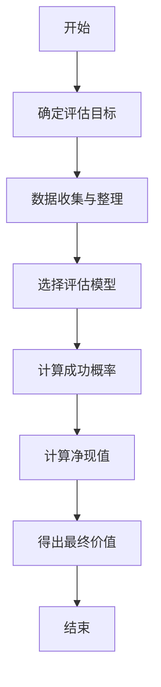
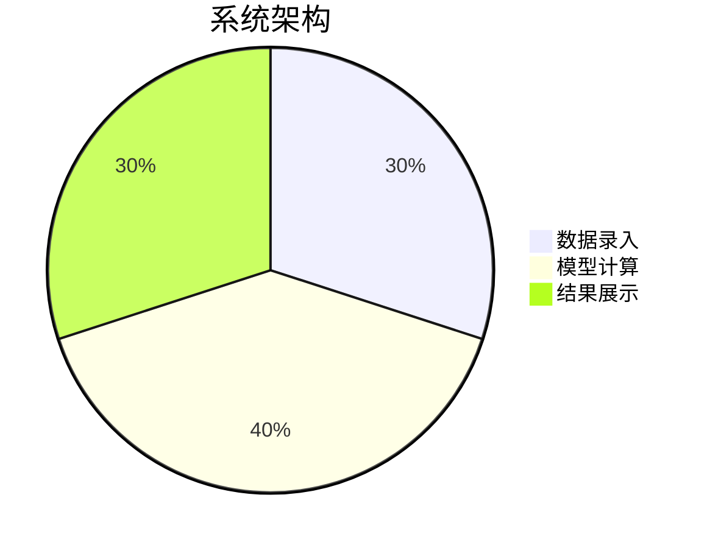
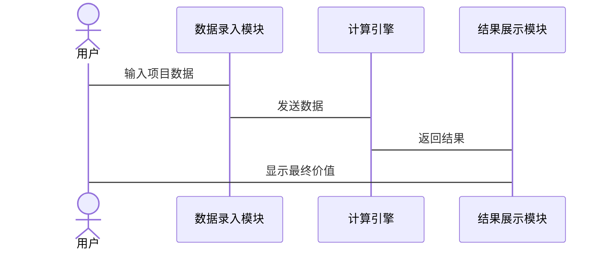

                 


# 《企业估值中的研发管线价值评估》

> 关键词：企业估值，研发管线，价值评估，研发项目，财务模型，风险评估

> 摘要：研发管线是企业在创新和技术进步中的核心资产之一，其价值评估对于企业整体估值至关重要。本文从研发管线的定义、分类、特征出发，结合概率分析、成本收益分析等方法，构建了研发管线价值评估的数学模型，并通过实际案例分析，展示了如何将研发管线的价值转化为可量化的财务指标。文章还探讨了研发管线评估中的关键成功因素和最佳实践，为投资者和企业管理者提供了实用的参考。

---

# 第1章: 研发管线的定义与重要性

## 1.1 研发管线的基本概念

研发管线（R&D Pipeline）是指企业在研发过程中所投入的一系列项目，这些项目涵盖了从基础研究到产品开发的各个阶段。研发管线的核心要素包括技术领域、研发阶段、成本投入和时间周期。

研发管线在企业估值中的作用不可忽视。它不仅反映了企业的技术储备和创新能力，还直接关系到企业的未来收益和市场竞争力。通过研发管线的价值评估，投资者可以更准确地预测企业的成长潜力。

---

## 1.2 研发管线的价值评估背景

企业估值的核心在于对未来现金流的预测，而研发管线作为企业未来收益的重要来源，其价值评估是企业估值的关键部分。研发管线的价值评估需要结合定性和定量方法，既要考虑项目的可行性和市场潜力，也要分析项目的成本和收益。

---

## 1.3 研发管线的价值评估方法

研发管线的价值评估可以采用定性分析和定量分析相结合的方法。定性分析包括对项目可行性的判断和市场潜力的评估，而定量分析则需要构建数学模型，将研发项目的成功概率、成本回收周期等量化指标纳入考虑。

---

# 第2章: 研发管线的分类与特征

## 2.1 研发管线的分类

研发管线可以按照技术领域、研发阶段和企业规模进行分类。例如，按技术领域可分为人工智能、生物医药等；按研发阶段可分为基础研究、产品开发等。

## 2.2 研发管线的特征分析

研发管线的特征包括技术复杂性、成本投入、时间周期和风险水平。这些特征直接影响研发项目的成功概率和企业的财务回报。

---

# 第3章: 研发管线价值评估的核心概念

## 3.1 研发管线价值评估的框架

研发管线价值评估需要明确评估目标，例如确定每个研发项目的潜在价值。数据收集和整理是评估的基础，而模型选择则决定了评估的准确性和效率。

---

## 3.2 研发管线价值评估的关键指标

成功的研发项目需要考虑其成功概率、成本回收周期和市场潜力。例如，一个项目的成功概率为30%，成本回收周期为5年，其净现值可以通过贴现现金流模型计算。

---

## 3.3 研发管线价值评估的边界与外延

研发管线价值评估需要明确其范围，例如是否包括基础研究阶段的项目。与其他资产类别相比，研发管线的风险更高，但回报潜力也更大。

---

# 第4章: 研发管线价值评估的算法原理

## 4.1 评估模型的选择与优化

常用的评估模型包括概率加权贴现现金流模型和风险调整贴现率模型。模型的选择需要根据项目的特性和数据的可获得性来决定。

---

## 4.2 基于概率的评估方法

成功的概率是研发项目价值的重要组成部分。例如，假设一个项目的成功概率为p，其净现值为NPV，项目的预期净现值（ENPV）可以表示为：$$ENPV = p \times NPV + (1-p) \times 0$$

---

## 4.3 算法流程图



---

# 第5章: 研发管线价值评估的系统架构

## 5.1 系统功能设计

研发管线价值评估系统需要具备数据录入、模型计算、结果展示等功能。例如，用户可以输入项目的成本、时间周期和成功概率，系统会自动计算其预期净现值。

---

## 5.2 系统架构设计



---

## 5.3 系统交互设计



---

# 第6章: 项目实战与案例分析

## 6.1 环境安装

为了进行研发管线价值评估，需要安装必要的工具，例如Excel或Python的Pandas库。

---

## 6.2 核心实现代码

以下是研发管线价值评估的Python代码示例：

```python
import numpy as np

def calculate_enpv(success_probability, npv):
    return success_probability * npv

success_probability = 0.3
npv = 1000000
enpv = calculate_enpv(success_probability, npv)
print(f"预期净现值为：{enpv}")
```

---

## 6.3 实际案例分析

假设某企业的研发项目成功概率为30%，净现值为100万元。其预期净现值为：$$ENPV = 0.3 \times 1,000,000 = 300,000$$

---

# 第7章: 关键成功因素与最佳实践

## 7.1 关键成功因素

研发管线价值评估的关键成功因素包括数据的准确性和模型的合理性。企业需要建立完善的研发数据管理系统，并选择适合的评估模型。

---

## 7.2 最佳实践

1. 定期更新研发管线数据，确保评估结果的准确性。
2. 结合外部市场信息，提升评估的全面性。
3. 建立跨部门协作机制，优化研发项目管理。

---

## 7.3 注意事项

企业在进行研发管线价值评估时，需要注意数据的不确定性和模型的局限性。建议结合多种方法进行交叉验证。

---

## 7.4 拓展阅读

推荐阅读《企业价值评估》和《研发项目管理》等相关书籍，以深入理解研发管线价值评估的理论和实践。

---

# 结语

研发管线价值评估是企业估值中的重要环节。通过科学的方法和合理的模型，可以准确评估研发项目的价值，为企业的决策提供有力支持。未来，随着技术的进步，研发管线价值评估将更加精准和高效。

---

# 附录

## 附录A: 常见问题解答

1. 研发管线价值评估的主要步骤是什么？
答：包括确定评估目标、数据收集与整理、模型选择、计算成功概率和净现值。

2. 如何提高评估的准确性？
答：可以通过引入更多的数据和优化模型来提高评估的准确性。

---

## 附录B: 工具与资源

1. Python编程语言和相关库（Pandas、NumPy）。
2. 专业的财务分析软件（如Excel、Tableau）。

---

## 附录C: 参考文献

1. Smith, J. (2020). 《企业估值中的研发管线价值评估》.
2. Brown, A. (2019). 《研发项目管理指南》.

---

