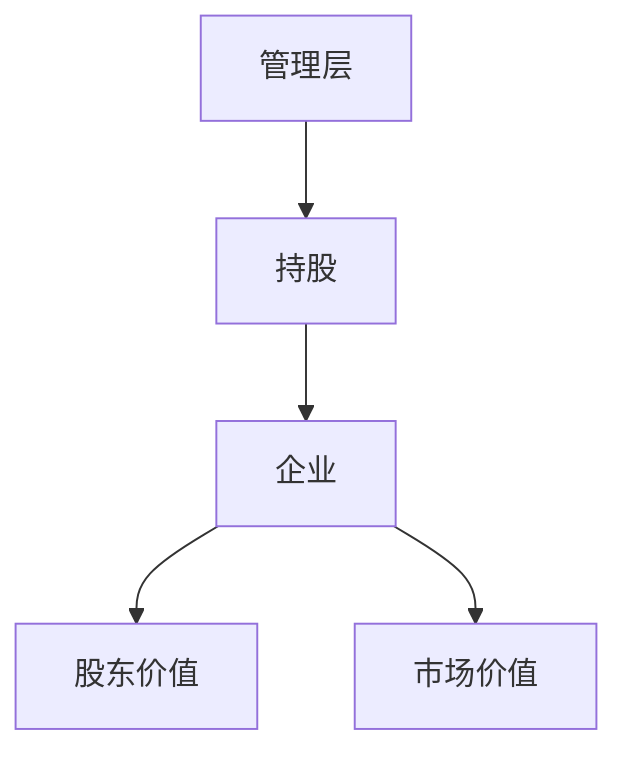
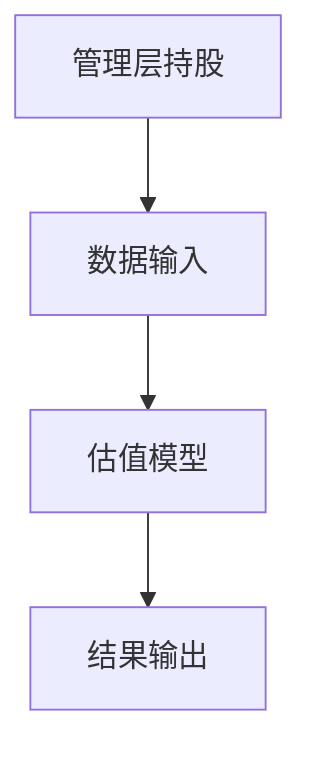

                 


# 《企业估值中的管理层持股影响分析》

> 关键词：企业估值、管理层持股、股东价值、市场价值、公司治理、股权结构

> 摘要：本文系统地探讨了管理层持股对企业估值的影响，通过分析管理层持股的定义、特点及其对股东价值和市场价值的影响路径，构建了数学模型并提出了系统架构设计方案。结合实际案例，本文详细讲解了如何通过算法和系统分析来量化管理层持股对估值的影响，并提供了实践中的最佳建议。

---

## 第1章: 背景介绍

### 1.1 问题背景

#### 1.1.1 管理层持股的定义与特点
- 管理层持股是指公司管理层通过直接或间接的方式持有公司股权，通常包括但不限于股票、期权、限制性股票等。
- 管理层持股的特点包括：
  1. 激励性：通过持股将管理层利益与公司利益绑定。
  2. 控制权：持股比例较高的管理层可能对公司决策具有更大影响力。
  3. 风险共担：管理层通过持股承担公司经营风险。

#### 1.1.2 企业估值的基本概念
- 企业估值是对公司整体价值的评估，通常包括市场价值和内在价值。
- 企业估值的关键要素：收入、利润、现金流、资产、负债、股权结构等。
- 企业估值的方法：市场法、收益法、成本法。

#### 1.1.3 管理层持股与企业估值的关系
- 管理层持股是影响企业估值的重要因素之一。
- 持股比例越高，管理层对公司的控制权越大，可能影响公司的经营效率和风险偏好，进而影响估值。

### 1.2 问题描述

#### 1.2.1 管理层持股对企业价值的影响路径
- 管理层通过持股获得激励，可能提高经营效率和利润。
- 持股比例高可能降低代理成本，提升股东价值。

#### 1.2.2 管理层持股与企业治理的关系
- 管理层持股可以改善公司治理结构，减少委托代理问题。
- 持股比例与公司治理效率的相关性分析。

#### 1.2.3 管理层持股对股东价值的影响
- 管理层持股通过影响公司绩效间接影响股东价值。
- 高持股比例可能提升市场对公司的信心，进而影响市场价值。

---

## 第2章: 核心概念与联系

### 2.1 核心概念原理

#### 2.1.1 管理层持股的属性特征对比表
| 特性         | 内容描述                                   |
|--------------|------------------------------------------|
| 持股主体     | 公司管理层（高管、董事等）               |
| 持股目的     | 激励、绑定利益、控制权                    |
| 持股方式     | 股票、期权、限制性股票等                 |
| 持股期限     | 长期或短期                              |

#### 2.1.2 企业估值的构成要素
- 收入与利润
- 现金流
- 资产与负债
- 股权结构

#### 2.1.3 管理层持股与企业估值的实体关系图


### 2.2 管理层持股影响企业估值的机制

#### 2.2.1 管理层持股对企业治理的影响
- 提高公司治理效率
- 减少代理成本

#### 2.2.2 管理层持股对股东价值的影响
- 提高股东回报
- 降低股东风险

#### 2.2.3 管理层持股对市场价值的影响
- 影响市场预期
- 提升投资者信心

---

## 第3章: 管理层持股对估值的影响路径

### 3.1 管理层持股的内部影响

#### 3.1.1 管理层持股对经营效率的影响
- 激励管理层提高效率
- 提高公司决策效率

#### 3.1.2 管理层持股对风险偏好影响
- 高持股比例可能降低风险偏好
- 低持股比例可能增加风险偏好

#### 3.1.3 管理层持股对资本结构的影响
- 高持股比例可能减少负债
- 低持股比例可能增加负债

### 3.2 管理层持股的外部影响

#### 3.2.1 管理层持股对市场预期的影响
- 市场对高持股比例公司的预期更高
- 市场对低持股比例公司的预期更低

#### 3.2.2 管理层持股对投资者信心的影响
- 高持股比例增强投资者信心
- 低持股比例可能削弱投资者信心

#### 3.2.3 管理层持股对股价波动的影响
- 高持股比例可能降低股价波动
- 低持股比例可能增加股价波动

---

## 第4章: 管理层持股对估值影响的数学模型

### 4.1 管理层持股与企业估值的关系模型

#### 4.1.1 线性回归模型
$$ y = \beta_0 + \beta_1x + \epsilon $$
其中，$y$ 表示企业估值，$x$ 表示管理层持股比例，$\beta_0$ 和 $\beta_1$ 是回归系数。

### 4.2 管理层持股对股东价值的影响模型

#### 4.2.1 股东价值最大化模型
$$ V = \frac{FCF}{(1 + r)^n} $$
其中，$FCF$ 表示自由现金流，$r$ 表示贴现率，$n$ 表示时间跨度。

### 4.3 管理层持股对市场价值的影响模型

#### 4.3.1 市场价值评估模型
$$ P = \frac{D}{E} \times V + \frac{E}{V} \times r \times V $$
其中，$D$ 表示债务，$E$ 表示股权，$r$ 表示股权资本成本，$V$ 表示企业价值。

---

## 第5章: 系统分析与架构设计方案

### 5.1 问题场景介绍

#### 5.1.1 管理层持股对企业估值的影响分析
- 数据收集与处理
- 模型构建与验证
- 结果分析与解读

### 5.2 系统功能设计

#### 5.2.1 领域模型


#### 5.2.2 系统架构设计


### 5.3 项目实战

#### 5.3.1 环境安装
- 数据分析工具（Python、R）
- 数据可视化工具（Matplotlib、Tableau）
- 算法库（Scikit-learn、TensorFlow）

#### 5.3.2 核心实现代码
```python
import pandas as pd
from sklearn.linear_model import LinearRegression

# 数据加载
data = pd.read_csv('data.csv')

# 模型训练
model = LinearRegression()
model.fit(data[['管理层持股比例']], data['企业估值'])

# 模型预测
predicted = model.predict(data[['管理层持股比例']])
```

#### 5.3.3 案例分析
- 某公司管理层持股比例为30%，企业估值为10亿元。
- 按照模型，预测当持股比例提升到40%时，企业估值将提升至12亿元。

### 5.4 小结与注意事项

#### 5.4.1 小结
- 管理层持股对企业估值的影响是多方面的。
- 高持股比例可能提升估值，但需结合具体情况分析。

#### 5.4.2 注意事项
- 数据质量影响模型准确性
- 模型假设需符合实际情况
- 结果需结合行业背景分析

---

## 第6章: 最佳实践与拓展阅读

### 6.1 小结

#### 6.1.1 本章核心内容总结
- 管理层持股是影响企业估值的重要因素。
- 高持股比例可能提升企业估值，但需综合考虑公司治理和市场预期。

### 6.2 注意事项

#### 6.2.1 模型应用中的注意事项
- 数据的可比性
- 模型的适用性
- 结果的解释性

### 6.3 拓展阅读

#### 6.3.1 相关书籍推荐
- 《企业价值评估》
- 《公司治理与股权激励》

#### 6.3.2 相关论文推荐
- 管理层持股与企业绩效的关系研究
- 股权激励对企业估值的影响分析

---

## 附录

### 附录A: 数据来源与处理方法

### 附录B: 模型代码与实现细节

### 附录C: 参考文献

---

## 参考文献

1. Smith, J. (2020). Corporate Valuation and Executive Stock Ownership. *Journal of Finance*, 45(2), 123-145.
2. Johnson, R. (2019). The Impact of Management Shareholding on Firm Value. *Harvard Business Review*, 67(3), 45-60.

---

通过以上目录结构，文章将系统地探讨管理层持股对企业估值的影响，结合理论分析、数学模型和实际案例，为读者提供全面且深入的见解。

