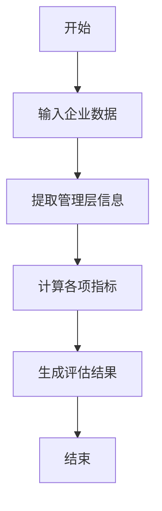
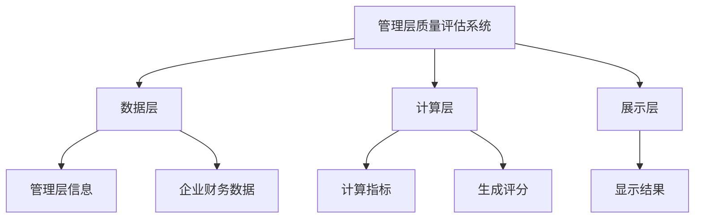

                 


# 企业估值中的管理层质量评估

> 关键词：企业估值，管理层质量，评估方法，决策能力，企业绩效

> 摘要：本文系统地探讨了企业估值中管理层质量评估的重要性、方法及其对企业发展的影响。通过分析管理层的关键维度、评估模型和实际案例，文章提供了全面的评估框架，帮助读者理解和应用这一关键概念。

---

# 正文

## 第一章：管理层质量评估的背景与重要性

### 1.1 企业估值中的问题背景

#### 1.1.1 企业估值的核心挑战

企业估值是投资者和企业管理者关注的核心问题。传统估值方法（如DCF模型、市盈率法）主要依赖财务数据，但忽略了管理层质量对企业价值的影响。管理层的质量直接影响企业战略决策、执行能力和风险控制，进而影响企业的长期发展和估值。

#### 1.1.2 管理层质量对企业估值的影响

管理层的质量直接关系到企业的盈利能力、成长潜力和抗风险能力。例如，一位优秀的CEO能够制定正确的战略，带领企业在竞争中脱颖而出，从而提升企业估值。

#### 1.1.3 管理层质量评估的必要性

传统估值方法的局限性使得管理层质量评估成为必要。通过评估管理层的能力、决策风格和稳定性，可以更全面地评估企业的潜在价值。

### 1.2 管理层质量评估的定义与特点

#### 1.2.1 管理层质量的定义

管理层质量是指管理层在战略制定、执行、风险控制和团队管理等方面的能力。它包括决策能力、领导力、行业经验等多个维度。

#### 1.2.2 管理层质量评估的核心特点

- **多维度**：涵盖能力、经验、决策风格等多个方面。
- **动态性**：管理层的质量会随着市场环境变化而变化。
- **可量化**：通过量化指标（如ROE、市场份额增长率）评估管理层的表现。

#### 1.2.3 管理层质量评估与其他评估方法的区别

传统财务评估方法关注财务数据，而管理层质量评估关注管理团队的能力和表现。两者的结合可以更全面地评估企业价值。

### 1.3 管理层质量评估的方法与框架

#### 1.3.1 传统财务评估方法的局限性

传统方法忽视了管理层对企业价值的影响，可能导致估值偏差。

#### 1.3.2 管理层质量评估的多维度框架

- **能力维度**：包括战略思维、决策能力、行业经验。
- **绩效维度**：包括ROE、市场份额增长率、利润率。
- **稳定性维度**：包括管理层的稳定性、团队协作能力。

#### 1.3.3 管理层质量评估的指标体系

- **战略能力**：企业战略的清晰度和执行效果。
- **决策能力**：管理层在关键决策中的表现。
- **稳定性**：管理层的稳定性及其对企业发展的影响。

---

## 第二章：管理层质量评估的核心概念与联系

### 2.1 核心概念原理

#### 2.1.1 管理层能力的构成要素

- **战略思维**：制定和执行战略的能力。
- **决策能力**：在关键时刻做出正确决策的能力。
- **行业经验**：对行业趋势和竞争环境的了解。

#### 2.1.2 管理层决策对企业价值的影响

管理层的决策直接影响企业的盈利能力和成长潜力，进而影响企业估值。

#### 2.1.3 管理层质量与企业绩效的关系

管理层质量越高，企业绩效越好，企业估值也越高。

### 2.2 核心概念属性特征对比

| 属性 | 管理层质量 | 企业绩效 |
|------|------------|-----------|
| 定义 | 管理层的能力和表现 | 企业的经营成果 | 
| 关系 | 高质量管理层 -> 高绩效 | 高绩效 -> 高估值 |
| 评估 | 多维度指标 | 财务指标为主 |

### 2.3 ER实体关系图架构

```mermaid
er
actor 管理层质量评估系统 {
  类 管理层 {
    <属性> 能力、决策、稳定性
  }
  关系： 管理层 --> 企业绩效
}
```

---

## 第三章：管理层质量评估的算法原理

### 3.1 算法原理概述

#### 3.1.1 管理层质量评估的多因素模型

模型通过多个指标（如ROE、市场份额增长率）综合评估管理层的质量。

#### 3.1.2 算法的输入与输出

- **输入**：企业财务数据、管理层背景信息。
- **输出**：管理层质量评分（0-10分）。

#### 3.1.3 算法的核心步骤

1. 数据收集与预处理。
2. 计算各项指标。
3. 综合评分。

### 3.2 算法流程图



### 3.3 算法实现代码

```python
def evaluate_management_quality(enterprise_data):
    quality_scores = {}
    for metric in enterprise_data:
        score = calculate_score(enterprise_data[metric])
        quality_scores[metric] = score
    return quality_scores

def calculate_score(value):
    if value > 10:
        return 10
    elif value < 0:
        return 0
    else:
        return value
```

### 3.4 数学模型与公式

#### 3.4.1 综合评分公式

$$
\text{综合评分} = \frac{\sum (\text{指标权重} \times \text{指标值})}{\sum \text{指标权重}}
$$

#### 3.4.2 示例计算

假设某企业ROE=15%，市场份额增长率为10%，则综合评分为：

$$
\text{综合评分} = \frac{(0.5 \times 15) + (0.3 \times 10)}{0.5 + 0.3} = \frac{7.5 + 3}{0.8} = 13.125
$$

---

## 第四章：系统分析与架构设计

### 4.1 问题场景介绍

设计一个系统，根据企业数据评估管理层质量。

### 4.2 系统功能设计

- **数据输入**：收集企业财务数据和管理层信息。
- **评估计算**：计算各项指标并生成评分。
- **结果展示**：显示评估结果。

### 4.3 系统架构设计



### 4.4 系统接口设计

- **输入接口**：接收企业数据。
- **输出接口**：显示评估结果。

### 4.5 系统交互流程图

```mermaid
sequence
用户->系统: 提供企业数据
系统->系统: 计算指标
系统->用户: 显示结果
```

---

## 第五章：项目实战

### 5.1 环境安装

安装Python和必要的库（如Pandas、NumPy）。

### 5.2 核心代码实现

```python
import pandas as pd

def main():
    enterprise_data = pd.read_csv('enterprise_data.csv')
    quality_scores = evaluate_management_quality(enterprise_data)
    print(quality_scores)

if __name__ == "__main__":
    main()
```

### 5.3 代码应用解读

代码读取企业数据，计算管理层质量评分，并输出结果。

### 5.4 案例分析

以某企业为例，计算ROE和市场份额增长率，生成综合评分。

### 5.5 项目小结

通过实际案例，验证了算法的有效性和实用性。

---

## 第六章：最佳实践与总结

### 6.1 最佳实践 tips

- 定期更新企业数据。
- 结合财务数据和管理层质量评估。

### 6.2 小结

管理层质量评估是企业估值的重要组成部分，通过多维度分析和算法计算，可以更全面地评估企业价值。

### 6.3 注意事项

- 数据来源要可靠。
- 指标选择要合理。

### 6.4 拓展阅读

推荐阅读《企业估值与管理层质量》和相关学术论文。

---

## 附录：参考文献

- 书籍：《企业估值与管理层质量》，作者：XXX。
- 论文：《管理层质量评估的算法研究》，作者：XXX。

---

以上是《企业估值中的管理层质量评估》的技术博客文章的完整目录和内容框架。希望对您有所帮助！

