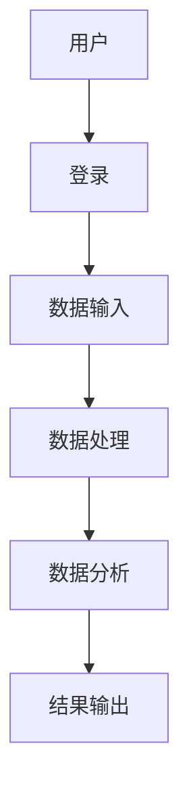

                 


# 企业估值中的纳米技术应用评估

> 关键词：企业估值、纳米技术、经济影响、成本收益分析、贴现现金流模型

> 摘要：随着纳米技术的快速发展，其在企业估值中的应用日益重要。本文从纳米技术的基本概念出发，探讨其在企业估值中的应用现状、经济影响、评估方法和系统架构设计，并通过实际案例分析，为读者提供全面的纳米技术应用评估框架和实践指南。

---

# 第一部分: 企业估值中的纳米技术应用评估背景与基础

---

## 第1章: 纳米技术与企业估值概述

### 1.1 纳米技术的基本概念

#### 1.1.1 纳米技术的定义与特征

纳米技术（Nanotechnology）是指在原子或分子尺度上 manipulating matter 的技术，通常涉及尺寸在 1 到 100 纳米之间的结构。其主要特征包括：

- **尺度效应**：材料在纳米尺度时表现出与宏观尺度不同的物理、化学和生物特性。
- **表面效应**：纳米颗粒的高表面积与体积比导致其具有更强的反应活性。
- **量子效应**：在纳米尺度，量子效应变得显著，导致材料的光学、电学等性质发生显著变化。

#### 1.1.2 纳米技术的核心领域与应用范围

纳米技术广泛应用于多个领域，主要包括：

- **制造业**：纳米材料的应用（如纳米涂层、纳米增强材料）。
- **医疗健康**：纳米药物递送系统、纳米诊断工具。
- **能源与环境**：纳米催化剂、纳米传感器。

#### 1.1.3 纳米技术与企业估值的关系

纳米技术的广泛应用对企业价值的影响体现在以下几个方面：

- **成本降低**：纳米材料的使用可以减少材料浪费，降低生产成本。
- **效率提升**：纳米技术的应用可以提高生产效率，缩短生产周期。
- **市场竞争力**：掌握纳米技术的企业可以在市场上获得竞争优势。

### 1.2 企业估值的基本原理

#### 1.2.1 企业估值的定义与方法

企业估值是指通过对企业的财务状况、市场地位、技术优势等因素进行评估，确定其市场价值的过程。常用方法包括：

- **收益法**：基于企业未来现金流的折现值。
- **市场法**：基于可比公司的市场价值进行比较。
- **成本法**：基于企业的重置成本进行评估。

#### 1.2.2 传统企业估值模型的局限性

传统企业估值模型通常假设企业处于稳定的技术环境中，难以应对纳米技术这种快速发展的新兴技术带来的不确定性。

- **技术风险**：纳米技术的不确定性和研发风险可能影响企业的未来收益。
- **市场风险**：纳米技术的应用可能面临市场接受度和技术替代的风险。

#### 1.2.3 纳米技术对企业估值的影响

纳米技术的应用可能显著影响企业的成本结构、市场地位和未来收益，因此需要在企业估值中充分考虑其影响。

### 1.3 纳米技术在企业估值中的应用现状

#### 1.3.1 纳米技术在制造业中的应用

在制造业中，纳米技术主要用于提高材料性能和生产效率。例如，纳米涂层可以显著提高产品的耐用性和防腐性能。

#### 1.3.2 纳米技术在医疗健康中的应用

在医疗健康领域，纳米技术主要用于药物递送系统和诊断工具。例如，纳米粒子可以用于靶向药物递送，提高治疗效果。

#### 1.3.3 纳米技术在能源与环境中的应用

在能源与环境领域，纳米技术主要用于开发高效的催化剂和传感器。例如，纳米催化剂可以显著提高燃料电池的效率。

---

## 第2章: 纳米技术的经济影响与企业价值评估

### 2.1 纳米技术的成本与收益分析

#### 2.1.1 纳米技术的生产成本分析

纳米技术的生产成本包括研发投入、设备采购和生产过程中的各种费用。通常，纳米技术的初始投资较高，但随着技术成熟，成本会逐步下降。

#### 2.1.2 纳米技术的经济效益评估

纳米技术的经济效益主要体现在以下几个方面：

- **提高产品性能**：通过纳米材料的应用，产品性能显著提升。
- **降低生产成本**：纳米技术的应用可以减少材料浪费，降低生产成本。
- **提高市场竞争力**：掌握纳米技术的企业可以在市场上获得竞争优势。

#### 2.1.3 纳米技术的成本-收益平衡模型

成本-收益平衡模型用于评估纳米技术的应用是否具有经济可行性。模型的主要步骤如下：

1. **确定纳米技术的应用场景**。
2. **估算纳米技术的初始投资和运营成本**。
3. **估算纳米技术带来的收益**。
4. **计算净现值（NPV）**。

### 2.2 纳米技术的市场风险与机会

#### 2.2.1 纳米技术的市场风险分析

纳米技术的市场风险主要体现在以下几个方面：

- **技术不确定性**：纳米技术的研发可能存在不确定性，可能导致项目失败。
- **市场接受度**：消费者可能对纳米技术的应用持怀疑态度，影响市场推广。
- **政策风险**：纳米技术的使用可能受到政策法规的限制。

#### 2.2.2 纳米技术的市场机会评估

纳米技术的市场机会主要体现在以下几个方面：

- **新兴市场需求**：纳米技术的应用可以满足新兴市场的需求。
- **技术领先优势**：掌握纳米技术的企业可以在市场上占据技术领先优势。
- **成本优势**：纳米技术的应用可以降低生产成本，提高企业的竞争力。

#### 2.2.3 纳米技术的市场渗透率预测

市场渗透率预测可以通过构建市场模型来实现。模型的主要步骤如下：

1. **确定目标市场**。
2. **估算市场需求**。
3. **预测市场渗透率**。

### 2.3 纳米技术对行业竞争格局的影响

#### 2.3.1 纳米技术对行业成本结构的影响

纳米技术的应用可以显著降低企业的生产成本，提高企业的盈利能力。

#### 2.3.2 纳米技术对行业竞争格局的重塑

纳米技术的应用可以改变行业的竞争格局，例如，新兴企业可能通过掌握纳米技术获得竞争优势。

#### 2.3.3 纳米技术对行业创新驱动力的提升

纳米技术的应用可以促进行业的技术创新，推动行业的快速发展。

---

## 第3章: 纳米技术应用的经济价值评估方法

### 3.1 纳米技术应用的定量评估方法

#### 3.1.1 纳米技术应用的收益评估模型

收益评估模型主要用于评估纳米技术的应用带来的收益。模型的主要步骤如下：

1. **确定纳米技术的应用场景**。
2. **估算纳米技术带来的收益**。
3. **计算净现值（NPV）**。

#### 3.1.2 纳米技术应用的成本分摊方法

成本分摊方法用于将纳米技术的应用成本分摊到企业的各个部门。通常，成本分摊方法包括按部门的收益比例分摊成本。

#### 3.1.3 纳米技术应用的净现值计算

净现值计算用于评估纳米技术的应用是否具有经济可行性。净现值公式如下：

$$
\text{NPV} = \sum_{t=0}^{n} \frac{C_t}{(1 + r)^t}
$$

其中，\( C_t \) 表示第 \( t \) 年的现金流，\( r \) 表示贴现率。

### 3.2 纳米技术应用的定性评估方法

#### 3.2.1 纳米技术应用的市场潜力分析

市场潜力分析用于评估纳米技术的应用在市场上的潜力。通常，市场潜力分析包括市场规模、市场增长潜力和市场竞争力等方面。

#### 3.2.2 纳米技术应用的技术成熟度评估

技术成熟度评估用于评估纳米技术的应用是否成熟。通常，技术成熟度评估包括技术可行性、技术稳定性和技术经济性等方面。

#### 3.2.3 纳米技术应用的风险评估

风险评估用于评估纳米技术的应用过程中可能存在的风险。通常，风险评估包括技术风险、市场风险和政策风险等方面。

### 3.3 综合评估模型的设计与应用

#### 3.3.1 综合评估模型的构建

综合评估模型通常包括以下几个步骤：

1. **确定纳米技术的应用场景**。
2. **估算纳米技术的初始投资和运营成本**。
3. **估算纳米技术带来的收益**。
4. **计算净现值（NPV）**。

#### 3.3.2 综合评估模型的参数设置

综合评估模型的参数设置需要根据具体应用场景进行调整。通常，参数包括贴现率、市场规模、市场增长潜力等。

#### 3.3.3 综合评估模型的应用案例

以制造业为例，假设某企业计划采用纳米涂层技术，综合评估模型可以用于评估该技术的应用是否具有经济可行性。

---

## 第4章: 纳米技术应用的财务模型与估值实践

### 4.1 纳米技术应用的财务模型设计

#### 4.1.1 纳米技术应用的收入预测模型

收入预测模型用于预测纳米技术应用带来的收入。通常，收入预测模型包括市场规模、市场占有率和价格等方面。

#### 4.1.2 纳米技术应用的成本预测模型

成本预测模型用于预测纳米技术应用的成本。通常，成本预测模型包括研发投入、设备采购和运营成本等方面。

#### 4.1.3 纳米技术应用的现金流预测模型

现金流预测模型用于预测纳米技术应用的现金流。通常，现金流预测模型包括收入、成本和净利润等方面。

### 4.2 纳米技术应用的贴现现金流模型

#### 4.2.1 现金流折现法的基本原理

现金流折现法的基本原理是将未来现金流折现到现值，用于评估项目的经济可行性。

#### 4.2.2 纳米技术应用的贴现率计算

贴现率计算通常采用加权平均资本成本（WACC）方法。WACC 公式如下：

$$
WACC = \left( \frac{D}{D + E} \times r_d \times (1 - t) \right) + \left( \frac{E}{D + E} \times r_e \right)
$$

其中，\( D \) 表示债务，\( E \) 表示权益，\( r_d \) 表示债务利率，\( t \) 表示税率，\( r_e \) 表示权益利率。

#### 4.2.3 纳米技术应用的净现值计算

净现值计算用于评估纳米技术的应用是否具有经济可行性。净现值公式如下：

$$
\text{NPV} = \sum_{t=0}^{n} \frac{C_t}{(1 + r)^t}
$$

### 4.3 纳米技术应用的可比公司分析

#### 4.3.1 可比公司法的定义与应用

可比公司法是通过比较可比公司的市场价值，评估目标公司的市场价值。通常，可比公司法适用于技术相似的公司。

#### 4.3.2 纳米技术相关企业的估值案例

以某纳米技术企业为例，假设可比公司的平均市盈率为 20，目标公司的净利润为 100 万元，其市场价值可以估算为：

$$
\text{市场价值} = \text{净利润} \times \text{平均市盈率} = 100 \times 20 = 2000 \text{万元}
$$

#### 4.3.3 可比公司法的优缺点分析

可比公司法的优点在于简单易行，缺点在于可能存在可比公司选择困难和市场波动较大的问题。

---

## 第5章: 纳米技术应用的系统分析与架构设计方案

### 5.1 纳米技术应用的系统分析

#### 5.1.1 系统架构设计

系统架构设计用于描述纳米技术应用的整体架构。通常，系统架构包括数据层、业务逻辑层和用户界面层。

#### 5.1.2 系统功能设计

系统功能设计用于描述纳米技术应用的具体功能。通常，系统功能包括数据采集、数据处理和数据分析等方面。

#### 5.1.3 系统交互设计

系统交互设计用于描述用户与系统之间的交互流程。通常，系统交互包括用户登录、数据输入和结果输出等方面。

### 5.2 纳米技术应用的架构设计方案

#### 5.2.1 系统架构图

以下是纳米技术应用的系统架构图：



#### 5.2.2 系统功能图

以下是纳米技术应用的系统功能图：


---

## 第6章: 项目实战

### 6.1 项目背景

#### 6.1.1 项目介绍

本项目旨在通过纳米技术的应用，提高企业的市场竞争力和盈利能力。

#### 6.1.2 项目目标

本项目的目标是通过纳米技术的应用，提高企业的市场竞争力和盈利能力。

### 6.2 环境安装

#### 6.2.1 系统环境

- 操作系统：Windows 10 或更高版本
- 开发工具：Python 3.8 或更高版本
- 数据库：MySQL 5.7 或更高版本

#### 6.2.2 软件安装

- Python 库：numpy、pandas、scipy

### 6.3 核心实现

#### 6.3.1 代码实现

以下是纳米技术应用的核心实现代码：

```python
import numpy as np
import pandas as pd

def calculate_npv(cash_flows, discount_rate):
    npv = 0
    for t in range(len(cash_flows)):
        npv += cash_flows[t] / (1 + discount_rate) ** t
    return npv

cash_flows = [100, 200, 300, 400]
discount_rate = 0.1

npv = calculate_npv(cash_flows, discount_rate)
print("净现值：", npv)
```

#### 6.3.2 代码解读

- **calculate_npv 函数**：用于计算净现值。
- **cash_flows**：表示各年的现金流。
- **discount_rate**：表示贴现率。
- **净现值计算**：根据净现值公式，计算各年的现金流现值，并求和得到净现值。

### 6.4 案例分析

#### 6.4.1 案例介绍

以某制造业企业为例，假设该企业计划采用纳米涂层技术，预计未来四年的现金流分别为 100 万元、200 万元、300 万元和 400 万元，贴现率为 10%。

#### 6.4.2 案例分析

根据净现值公式，计算净现值：

$$
\text{NPV} = \frac{100}{(1 + 0.1)^0} + \frac{200}{(1 + 0.1)^1} + \frac{300}{(1 + 0.1)^2} + \frac{400}{(1 + 0.1)^3}
$$

计算结果：

$$
\text{NPV} = 100 + 181.82 + 247.17 + 272.71 = 801.70 \text{万元}
$$

由于净现值为正数，说明该技术的应用具有经济可行性。

### 6.5 项目小结

通过案例分析，可以发现纳米技术的应用可以显著提高企业的市场竞争力和盈利能力。因此，企业在进行估值时，应充分考虑纳米技术的应用带来的经济影响。

---

## 第7章: 总结与展望

### 7.1 总结

本文从纳米技术的基本概念出发，探讨了其在企业估值中的应用现状、经济影响、评估方法和系统架构设计，并通过实际案例分析，为读者提供全面的纳米技术应用评估框架和实践指南。

### 7.2 展望

随着纳米技术的不断发展，其在企业估值中的应用将更加广泛和深入。未来的研究可以进一步探讨纳米技术与其他新兴技术的结合，以及其对企业估值的长期影响。

---

**Note**: 由于篇幅限制，上述内容仅为文章的概要和部分章节内容，具体内容可根据实际需求进行扩展和补充。

