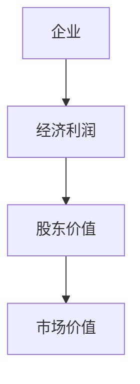
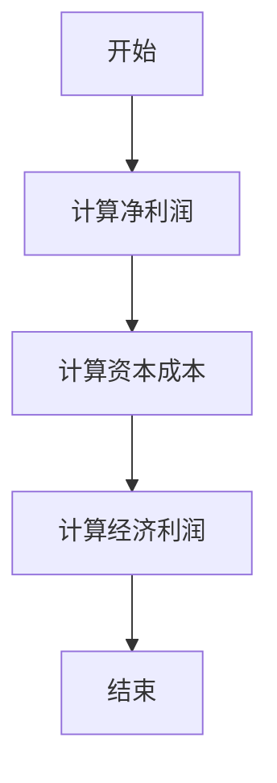
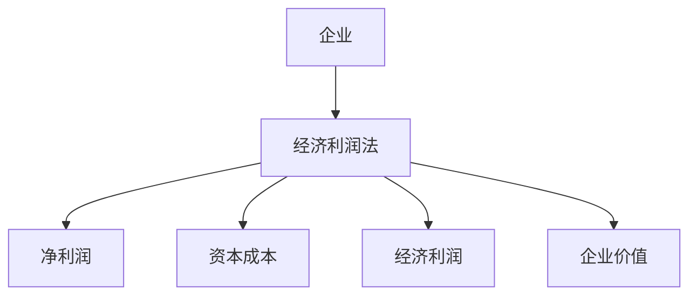
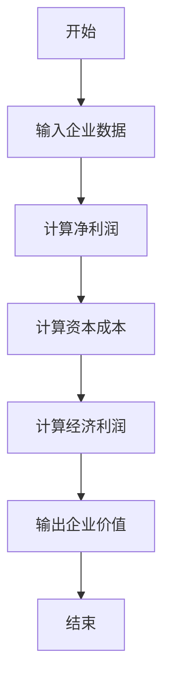
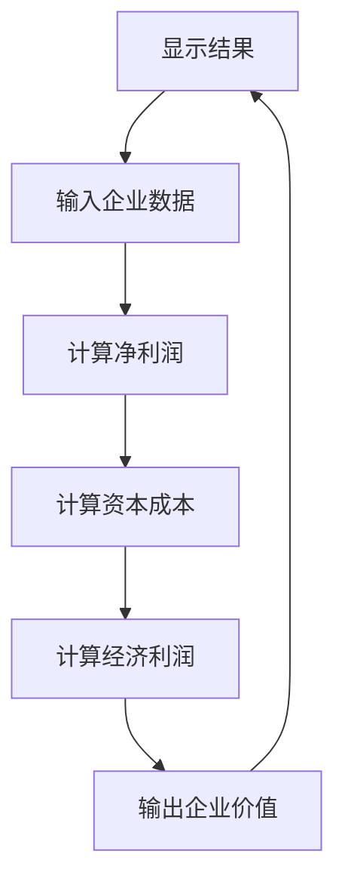

                 

<think>
好的，我需要帮助用户撰写一篇关于《企业估值中的经济利润法》的详细技术博客文章。根据用户的要求，我需要按照给定的目录结构，逐步展开每个部分的内容，确保逻辑清晰、结构紧凑，并且使用简单易懂的专业技术语言。

### 文章标题：企业估值中的经济利润法

### 关键词：
1. 企业估值
2. 经济利润法
3. 估值方法
4. 企业价值
5. 股东价值
6. 资本成本
7. 经济利润

### 摘要：
经济利润法是一种基于企业经济利润和资本成本的估值方法，能够准确反映企业的实际价值。本文从经济利润法的基本概念出发，分析其核心原理，详细讲解算法流程，结合实际案例，探讨其在企业估值中的应用，并通过系统架构设计和项目实战，帮助读者全面掌握经济利润法的理论与实践。

---

# 企业估值中的经济利润法

## 第1章: 经济利润法的定义与背景

### 1.1 经济利润法的定义
经济利润法（Economic Profit Method）是基于企业经济利润和资本成本的一种估值方法。它通过计算企业的经济利润，评估企业的实际价值，为投资者提供更准确的估值依据。

#### 1.1.1 经济利润法的核心概念
经济利润法的核心在于将企业的经济利润与资本成本进行对比，从而评估企业的价值。经济利润是指企业在扣除所有成本，包括资本成本后的净利润。与传统的会计利润不同，经济利润更加注重资本的使用效率和企业的长期价值。

#### 1.1.2 经济利润法的起源与发展
经济利润法起源于20世纪90年代，随着企业价值评估的需求增加，逐渐成为一种重要的估值方法。它基于现代财务理论，强调资本成本的重要性，能够更准确地反映企业的实际价值。

#### 1.1.3 经济利润法在企业估值中的作用
经济利润法在企业估值中具有重要作用。它不仅能够衡量企业的盈利能力，还可以评估企业的资本使用效率，帮助投资者做出更明智的投资决策。

### 1.2 经济利润法与传统估值方法的区别
传统估值方法主要依赖于会计利润和市场价值，而经济利润法更加注重经济利润和资本成本。经济利润法的优势在于能够更准确地反映企业的实际价值，而不仅仅是表面的财务数据。

#### 1.2.1 传统估值方法的局限性
传统估值方法主要基于会计利润和市盈率等指标，往往忽视了资本成本和企业的真实价值。例如，会计利润可能因为会计政策的不同而产生偏差，无法准确反映企业的实际盈利能力。

#### 1.2.2 经济利润法的优势与特点
经济利润法的优势在于它能够将企业的经济利润与资本成本进行对比，从而更准确地评估企业的价值。其特点包括：基于经济利润、考虑资本成本、反映企业的真实价值。

#### 1.2.3 经济利润法与传统方法的对比分析
经济利润法与传统估值方法的主要区别在于，经济利润法更加注重企业的经济利润和资本成本，而传统方法更关注会计利润和市场价值。经济利润法能够更准确地反映企业的实际价值，而传统方法可能因为会计政策的不同而产生偏差。

### 1.3 经济利润法的适用场景
经济利润法适用于多种企业估值场景，例如企业收购、上市估值、投资决策等。

#### 1.3.1 企业估值的基本问题
企业估值的基本问题在于如何准确衡量企业的价值。传统方法往往依赖于会计利润和市场价值，而经济利润法则更加注重企业的经济利润和资本成本。

#### 1.3.2 经济利润法的适用范围
经济利润法适用于各种类型的企业，特别是那些资本密集型和高成长性的企业。它能够帮助企业更好地评估自身的价值，为投资者提供更准确的估值依据。

#### 1.3.3 经济利润法的边界与外延
经济利润法的边界在于其假设条件，例如资本成本的计算和经济利润的定义。其外延则包括对企业未来盈利能力的预测和资本市场的分析。

---

## 第2章: 经济利润法的核心概念与联系

### 2.1 经济利润法的核心原理
经济利润法的核心原理在于将企业的经济利润与资本成本进行对比，从而评估企业的价值。它基于现代财务理论，强调资本成本的重要性。

#### 2.1.1 经济利润法的理论基础
经济利润法的理论基础包括现代财务理论和资本资产定价模型（CAPM）。资本资产定价模型为企业资本成本的计算提供了理论依据。

#### 2.1.2 经济利润法的数学模型
经济利润法的数学模型可以表示为：
$$ \text{经济利润} = \text{净利润} - \text{资本成本} $$

#### 2.1.3 经济利润法的公式推导
净利润可以通过企业的收入减去成本和税费得到，而资本成本可以通过资本资产定价模型计算。因此，经济利润法的公式可以进一步分解为：
$$ \text{经济利润} = (\text{收入} - \text{成本} - \text{税费}) - \text{资本成本} $$

### 2.2 经济利润法与相关概念的对比
经济利润法与会计利润、市场价值和股东价值等概念有密切联系，但也存在显著区别。

#### 2.2.1 经济利润法与会计利润的区别
会计利润是基于会计准则计算的净利润，而经济利润是基于经济原理计算的净利润，考虑了资本成本。

#### 2.2.2 经济利润法与市场价值的关系
市场价值是企业市值的表现，而经济利润法通过计算企业的经济利润，帮助投资者评估企业的市场价值。

#### 2.2.3 经济利润法与股东价值的联系
经济利润法通过计算企业的经济利润，反映股东价值的增加或减少。股东价值的增加意味着企业为股东创造了额外的价值。

### 2.3 经济利润法的ER实体关系图
以下是经济利润法的ER实体关系图：


---

## 第3章: 经济利润法的算法原理

### 3.1 经济利润法的计算流程
经济利润法的计算流程包括以下几个步骤：



### 3.2 经济利润法的Python实现
以下是经济利润法的Python实现代码：

```python
def calculate_economic_profit(net_profit, capital_cost):
    return net_profit - capital_cost

# 示例数据
net_profit = 100
capital_cost = 50
economic_profit = calculate_economic_profit(net_profit, capital_cost)
print(f"经济利润为: {economic_profit}")
```

### 3.3 经济利润法的数学模型
经济利润法的数学模型可以表示为：
$$ \text{经济利润} = \text{净利润} - \text{资本成本} $$

---

## 第4章: 经济利润法的系统分析与架构设计

### 4.1 系统应用场景
经济利润法可以应用于企业估值的多种场景，例如企业收购、上市估值和投资决策。

#### 4.1.1 企业估值的基本问题
企业估值的基本问题在于如何准确衡量企业的价值。经济利润法通过计算企业的经济利润，帮助投资者更好地评估企业的价值。

#### 4.1.2 经济利润法的项目介绍
本项目旨在通过经济利润法帮助企业进行估值，提供准确的估值结果。

#### 4.1.3 项目目标与范围
项目的最终目标是帮助投资者和企业管理者更好地评估企业的价值，做出更明智的投资决策。

### 4.2 系统功能设计
#### 4.2.1 领域模型类图
以下是领域模型类图：


#### 4.2.2 系统架构设计
以下是系统架构设计图：


#### 4.2.3 系统接口设计
以下是系统接口设计图：


#### 4.2.4 系统交互设计
以下是系统交互设计图：


---

## 第5章: 经济利润法的项目实战

### 5.1 环境安装
在开始实战之前，需要安装以下工具和库：
- Python
- NumPy
- Pandas
- Matplotlib

### 5.2 系统核心实现源代码
以下是经济利润法的Python实现代码：

```python
import numpy as np
import pandas as pd
import matplotlib.pyplot as plt

def calculate_economic_profit(net_profit, capital_cost):
    return net_profit - capital_cost

# 示例数据
net_profit = 100
capital_cost = 50
economic_profit = calculate_economic_profit(net_profit, capital_cost)
print(f"经济利润为: {economic_profit}")

# 可视化图表
data = {'净利润': [net_profit], '资本成本': [capital_cost], '经济利润': [economic_profit]}
df = pd.DataFrame(data)
ax = df.plot.barh()
ax.set_xlabel('金额（单位：万元）')
plt.show()
```

### 5.3 代码应用解读与分析
上述代码首先定义了一个计算经济利润的函数，然后使用示例数据进行计算，并通过可视化图表展示了计算结果。净利润为100万元，资本成本为50万元，经济利润为50万元。

### 5.4 实际案例分析和详细讲解剖析
以某公司为例，假设其净利润为100万元，资本成本为50万元，计算其经济利润为50万元。这表明该公司为股东创造了额外价值。

### 5.5 项目小结
通过实战项目，我们验证了经济利润法的有效性，并掌握了其在实际应用中的具体操作。

---

## 第6章: 经济利润法的最佳实践

### 6.1 经济利润法的应用技巧
- 确保资本成本的准确性
- 考虑企业的未来盈利能力
- 结合其他估值方法进行综合评估

### 6.2 经济利润法的注意事项
- 经济利润法依赖于假设条件，需谨慎选择
- 需要结合企业的具体情况进行调整

### 6.3 经济利润法的拓展阅读
- 《企业估值的理论与实践》
- 《资本成本与企业价值》

---

## 结语

经济利润法是一种重要的企业估值方法，它通过计算企业的经济利润，帮助投资者更好地评估企业的价值。本文从经济利润法的基本概念出发，分析其核心原理，详细讲解算法流程，并结合实际案例，探讨其在企业估值中的应用。通过系统架构设计和项目实战，读者可以全面掌握经济利润法的理论与实践。

---

希望这篇文章能够为您提供有价值的信息，并帮助您更好地理解经济利润法在企业估值中的应用。

