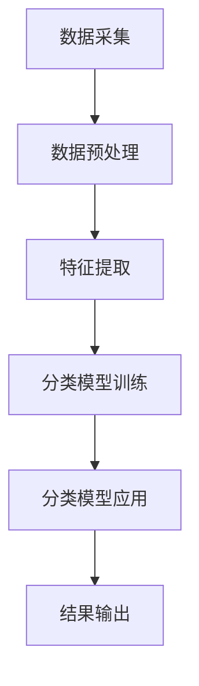
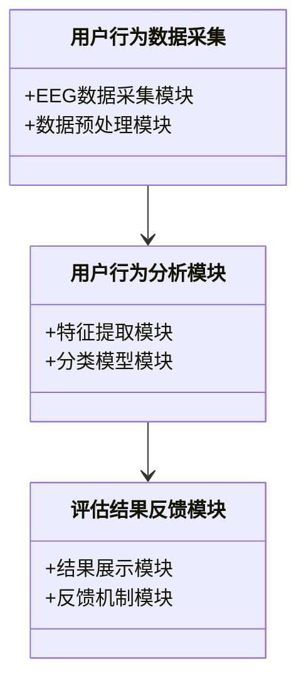
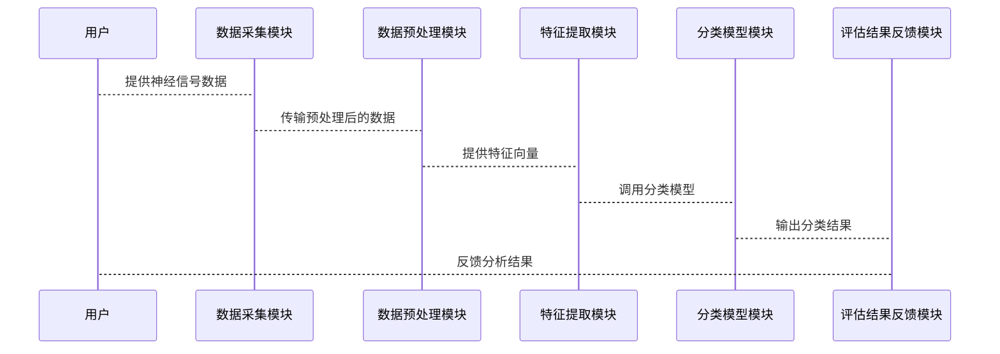

                 


# 企业估值中的脑机接口游戏平台评估

> 关键词：企业估值，脑机接口，游戏平台，用户行为分析，神经信号，数据处理

> 摘要：本文深入探讨了脑机接口（BCI）技术在游戏平台评估中的应用，特别是在企业估值中的重要性。通过分析脑机接口的工作原理、游戏平台评估的核心指标，结合具体的算法原理和系统架构设计，本文详细阐述了如何利用脑机接口技术提升游戏平台的用户行为分析能力，从而为企业的估值提供更准确的依据。

---

## 第一部分：脑机接口与游戏平台评估的背景介绍

### 第1章：脑机接口与游戏平台评估的背景介绍

#### 1.1 脑机接口技术的基本概念

##### 1.1.1 脑机接口的定义与核心原理

脑机接口（Brain-Computer Interface, BCI）是一种能够直接连接人类大脑与外部设备的技术，通过采集和分析大脑神经信号，实现人与计算机或其他设备之间的信息交互。其核心原理包括信号采集、特征提取、模式识别和反馈机制。

- **信号采集**：通过 EEG（脑电图）等技术采集大脑神经信号。
- **特征提取**：对采集到的神经信号进行降噪和特征提取，提取有用的特征向量。
- **模式识别**：利用机器学习算法对特征向量进行分类，识别用户的意图或情感状态。
- **反馈机制**：将识别结果反馈给用户或系统，形成闭环。

##### 1.1.2 游戏平台评估的基本概念

游戏平台评估是指通过对游戏平台的性能、用户行为、用户满意度等多维度指标进行分析，从而对平台的价值进行量化评估的过程。其核心在于通过数据采集和分析，发现平台的优缺点，并为企业决策提供支持。

##### 1.1.3 脑机接口在游戏平台评估中的应用背景

随着游戏行业的快速发展，用户行为分析成为企业估值的重要依据。传统的游戏评估方法主要依赖问卷调查和用户行为日志，存在主观性高、数据片面等问题。而脑机接口技术能够通过采集用户的神经信号，实时捕捉用户的注意力、情感状态等信息，为游戏平台评估提供了更客观、更精细的数据支持。

#### 1.2 脑机接口与游戏平台评估的核心问题

##### 1.2.1 游戏用户行为分析的难点

- **数据多样性**：用户行为数据来源复杂，包括点击、输入、时间戳等，难以统一分析。
- **数据实时性**：游戏平台需要实时反馈用户行为，这对数据处理和分析提出了更高的要求。
- **用户隐私保护**：采集和处理用户的神经信号需要严格遵守隐私保护法规。

##### 1.2.2 脑机接口技术在用户行为分析中的优势

- **实时性**：脑机接口能够实时采集和分析用户的神经信号，提供即时反馈。
- **准确性**：通过分析神经信号，可以更准确地捕捉用户的注意力和情感状态。
- **非侵入性**：脑机接口技术通常是无创的，用户体验较好。

##### 1.2.3 企业估值中的脑机接口游戏平台评估的边界与外延

- **边界**：主要关注用户在游戏平台上的行为数据，不涉及企业的财务数据或其他外部因素。
- **外延**：可以通过脑机接口技术扩展到其他领域，如教育平台、虚拟现实等领域。

#### 1.3 脑机接口游戏平台评估的核心要素组成

##### 1.3.1 用户行为数据的采集与处理

- **数据采集**：通过脑机接口设备采集用户的神经信号，如EEG、EOG等。
- **数据预处理**：对采集到的数据进行降噪、去伪迹等处理，提取有用的特征。

##### 1.3.2 游戏平台性能指标的定义

- **性能指标**：包括游戏流畅度、响应速度、用户留存率等。
- **用户满意度指标**：包括用户情感状态、注意力集中度等。

##### 1.3.3 企业估值的关键影响因素

- **用户活跃度**：用户在游戏平台上的活跃程度直接影响企业的估值。
- **用户留存率**：高用户留存率通常意味着更高的企业价值。
- **用户付费率**：用户付费行为是企业收入的重要来源。

---

## 第二部分：脑机接口与游戏平台评估的核心概念与联系

### 第2章：脑机接口与游戏平台评估的核心概念与联系

#### 2.1 脑机接口技术的核心原理

##### 2.1.1 神经信号的采集与处理

- **信号采集**：通过 EEG 设备采集用户的神经信号，如 α 波、β 波等。
- **信号预处理**：对采集到的信号进行降噪处理，消除环境噪声和肌肉噪声。

##### 2.1.2 神经信号的特征提取与分析

- **特征提取**：提取神经信号的时域特征（如均值、标准差）和频域特征（如功率谱密度）。
- **特征分析**：通过统计分析或机器学习方法，分析特征与用户行为之间的关系。

##### 2.1.3 神经信号的模式识别与分类

- **模式识别**：利用支持向量机（SVM）、随机森林等算法，对神经信号进行分类。
- **分类结果**：识别用户的注意力集中度、情感状态等。

#### 2.2 游戏平台评估的核心指标

##### 2.2.1 游戏用户行为的多维度评估

- **用户活跃度**：用户在游戏中的活跃程度，如日活跃用户数（DAU）、月活跃用户数（MAU）。
- **用户留存率**：用户在一定时间内的留存情况，如7天留存率、30天留存率。
- **用户付费率**：用户在游戏中的付费行为，如付费用户数、付费率。

##### 2.2.2 游戏平台性能指标的量化

- **性能指标**：包括游戏的加载速度、响应时间、帧率等。
- **用户体验指标**：包括用户的满意度、幸福感等。

##### 2.2.3 游戏平台用户满意度的评估模型

- **评估模型**：构建基于用户神经信号的满意度评估模型，结合传统的用户反馈数据，进行综合评估。

#### 2.3 脑机接口与游戏平台评估的关联性分析

##### 2.3.1 脑机接口技术在游戏用户行为分析中的应用

- **注意力分析**：通过分析用户的神经信号，识别用户在游戏中的注意力集中区域。
- **情感分析**：通过分析用户的脑电波，识别用户在游戏中的情感状态（如愉悦、焦虑）。

##### 2.3.2 游戏平台评估指标与脑机接口数据的关系

- **相关性分析**：通过统计方法，分析神经信号特征与游戏平台评估指标之间的相关性。
- **因果关系分析**：通过因果推断，识别神经信号特征对游戏平台评估指标的影响路径。

##### 2.3.3 脑机接口技术在企业估值中的潜在价值

- **提升估值准确性**：通过更精准的用户行为分析，提高企业估值的准确性。
- **优化企业决策**：基于用户神经信号数据，优化游戏设计和运营策略。

---

## 第三部分：脑机接口游戏平台评估的算法原理

### 第3章：脑机接口游戏平台评估的算法原理

#### 3.1 脑机接口数据的预处理算法

##### 3.1.1 数据采集与降噪处理

- **数据采集**：通过EEG设备采集用户的神经信号。
- **降噪处理**：使用独立成分分析（ICA）或小波变换等方法，消除环境噪声和肌肉噪声。

##### 3.1.2 数据特征提取与分析

- **特征提取**：提取神经信号的时域特征和频域特征。
- **特征分析**：通过统计分析或机器学习方法，分析特征与用户行为之间的关系。

##### 3.1.3 数据标准化与归一化处理

- **标准化**：将数据按比例缩放到同一范围内，如Z-score标准化。
- **归一化**：将数据按比例缩放到[0,1]范围内。

#### 3.2 脑机接口数据的分类与分析算法

##### 3.2.1 分类算法的选择与实现

- **分类算法**：支持向量机（SVM）、随机森林、神经网络等。
- **分类实现**：通过训练好的模型，对新的神经信号进行分类，识别用户的注意力集中度或情感状态。

##### 3.2.2 分类结果的评估与优化

- **评估指标**：准确率、召回率、F1值等。
- **优化方法**：通过调整模型参数或使用集成学习方法，提高分类准确率。

##### 3.2.3 分类模型的实时应用

- **实时分类**：在游戏平台中实时采集用户的神经信号，进行实时分类，反馈用户行为。

#### 3.3 基于脑机接口的游戏平台评估算法实现

##### 3.3.1 算法流程图



##### 3.3.2 核心算法代码实现

```python
import numpy as np
from sklearn.svm import SVC
from sklearn.model_selection import train_test_split
from sklearn.metrics import accuracy_score

# 示例数据：假设X为神经信号特征，y为标签（0或1）
X = np.random.rand(100, 10)  # 100个样本，10个特征
y = np.random.randint(0, 2, 100)

# 数据分割
X_train, X_test, y_train, y_test = train_test_split(X, y, test_size=0.2)

# 模型训练
model = SVC()
model.fit(X_train, y_train)

# 模型预测
y_pred = model.predict(X_test)

# 模型评估
accuracy = accuracy_score(y_test, y_pred)
print(f"准确率: {accuracy}")
```

##### 3.3.3 算法原理的数学模型与公式

- **分类模型**：支持向量机（SVM）的数学模型如下：
$$ \text{minimize} \frac{1}{2} \|w\|^2 $$
$$ \text{subject to} \quad y_i(w \cdot x_i + b) \geq 1, \quad i=1,2,\ldots,n $$

---

## 第四部分：脑机接口游戏平台评估的系统分析与架构设计

### 第4章：脑机接口游戏平台评估的系统分析与架构设计

#### 4.1 系统分析

##### 4.1.1 问题场景介绍

- **问题场景**：用户在游戏平台上的行为数据，如何通过脑机接口技术进行分析，为企业估值提供支持。

##### 4.1.2 项目介绍

- **项目目标**：构建一个基于脑机接口的游戏平台评估系统，实现用户行为的实时分析和评估。
- **项目范围**：包括数据采集、处理、分析和反馈等模块。

#### 4.2 系统功能设计

##### 4.2.1 领域模型



##### 4.2.2 系统架构设计


##### 4.2.3 系统接口设计

- **数据接口**：用户提供EEG数据采集接口，接收用户的神经信号数据。
- **分析接口**：提供特征提取和分类模型调用接口，输出用户的注意力集中度和情感状态。
- **反馈接口**：将分析结果反馈给用户或游戏平台，实现实时互动。

##### 4.2.4 系统交互流程图



---

## 第五部分：脑机接口游戏平台评估的项目实战

### 第5章：脑机接口游戏平台评估的项目实战

#### 5.1 项目环境安装与配置

##### 5.1.1 环境安装

- **Python环境**：安装Python 3.8及以上版本。
- **依赖库安装**：安装numpy、scikit-learn、mermaid等库。
  ```bash
  pip install numpy scikit-learn mermaid
  ```

##### 5.1.2 数据采集工具安装

- **EEG设备**：安装脑机接口数据采集设备（如OpenBCI Ganglion）。
- **数据采集软件**：安装并配置数据采集软件（如OpenBCI GUI）。

#### 5.2 项目核心代码实现

##### 5.2.1 数据采集与预处理

```python
import numpy as np
import openbcisimulate as obs

# 模拟数据采集
data = obs.simulate_eeg_data(duration=10, sample_rate=250)
```

##### 5.2.2 特征提取与分类模型训练

```python
from sklearn.svm import SVC
from sklearn.model_selection import train_test_split

# 数据分割
X_train, X_test, y_train, y_test = train_test_split(data.features, data.labels, test_size=0.2)

# 模型训练
model = SVC()
model.fit(X_train, y_train)

# 模型预测
y_pred = model.predict(X_test)

# 模型评估
accuracy = accuracy_score(y_test, y_pred)
print(f"准确率: {accuracy}")
```

##### 5.2.3 评估结果展示与反馈

```python
# 反馈机制
feedback = "用户注意力集中度：{}%".format(round((y_pred.mean()) * 100))
print(feedback)
```

#### 5.3 项目小结

- **项目实现**：通过脑机接口技术实现游戏平台用户行为的实时分析和评估。
- **项目意义**：为企业的估值提供更精准的数据支持，提升游戏平台的用户体验和企业价值。

---

## 第六部分：脑机接口游戏平台评估的最佳实践

### 第6章：脑机接口游戏平台评估的最佳实践

#### 6.1 项目总结与经验分享

##### 6.1.1 项目总结

- **项目成果**：构建了一个基于脑机接口的游戏平台评估系统，实现了用户行为的实时分析和评估。
- **项目经验**：脑机接口技术在游戏平台评估中的应用具有很大的潜力，但也面临数据采集和处理的挑战。

##### 6.1.2 经验分享

- **数据质量**：确保数据采集的质量，减少噪声对分析结果的影响。
- **模型优化**：通过不断优化分类模型的参数和结构，提高分类准确率。
- **用户隐私**：严格遵守用户隐私保护法规，确保数据的安全性。

#### 6.2 小结与注意事项

##### 6.2.1 小结

- **脑机接口技术**：在游戏平台评估中的应用前景广阔，能够为企业的估值提供更精准的数据支持。
- **系统设计**：在系统设计中，需要综合考虑数据采集、处理、分析和反馈等模块的协调配合。

##### 6.2.2 注意事项

- **数据采集**：确保数据采集的准确性和实时性。
- **数据处理**：注意数据预处理和特征提取的准确性。
- **模型优化**：不断优化分类模型的性能，提高分析结果的准确性。

#### 6.3 拓展阅读与学习资源

##### 6.3.1 拓展阅读

- **脑机接口技术**：阅读相关学术论文和书籍，深入了解脑机接口的工作原理和技术应用。
- **游戏平台评估**：研究游戏平台评估的理论和方法，结合脑机接口技术进行创新。

##### 6.3.2 学习资源

- **推荐书籍**：
  - 《Brain-Computer Interface: Theory and Applications》
  - 《Game Analytics: Quantitative Approaches to Software Evaluation》
- **推荐论文**：
  - "A Brain-Computer Interface-Based Approach for Game User Experience Analysis"
  - "Neurofeedback and Its Applications in Game Design"

---

## 第七部分：总结与展望

### 第7章：总结与展望

#### 7.1 总结

脑机接口技术在游戏平台评估中的应用为企业的估值提供了新的思路和方法。通过实时采集和分析用户的神经信号，可以更准确地捕捉用户的注意力和情感状态，为游戏平台的优化和企业的决策提供有力支持。

#### 7.2 展望

随着脑机接口技术的不断发展和游戏行业的持续创新，脑机接口在游戏平台评估中的应用将更加广泛和深入。未来的研究方向包括：

- **提高数据采集和处理的准确性**：通过改进数据采集设备和算法，提高神经信号的采集和处理精度。
- **优化分类模型的性能**：通过引入深度学习等新技术，进一步提高分类模型的准确率和实时性。
- **拓展应用场景**：将脑机接口技术应用于更多领域，如教育平台、虚拟现实等，实现更广泛的应用。

---

通过本文的系统分析和详细阐述，我们相信脑机接口技术在游戏平台评估中的应用将为企业的估值带来新的突破和机遇。

