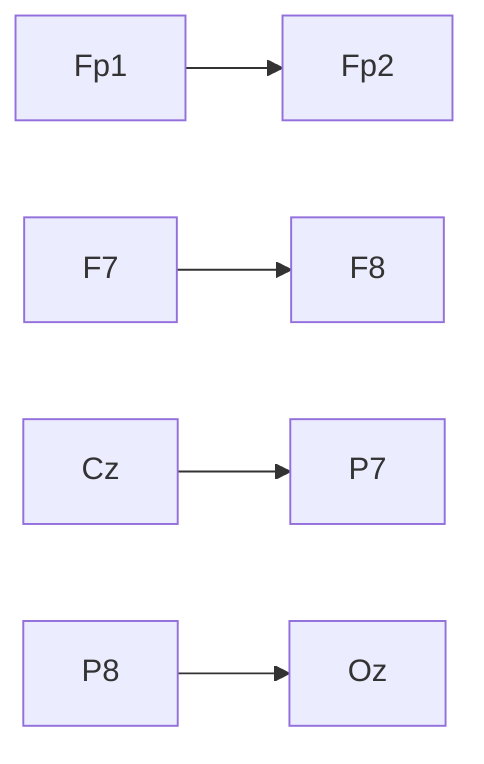
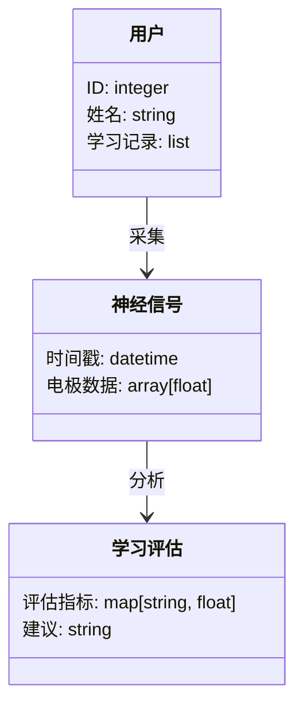

                 


# 脑机接口辅助学习平台评估

> **关键词**：脑机接口（BCI）、企业估值、学习平台、神经科学、机器学习、评估模型  
> **摘要**：本文探讨了脑机接口技术在企业估值中的应用，特别是其在辅助学习平台评估方面的潜力。通过分析神经信号采集与处理、学习行为建模、评估指标设计等关键环节，结合实际案例和系统架构设计，展示了如何利用脑机接口技术优化企业学习平台的评估过程。文章最后总结了当前技术的应用现状及未来发展方向。

---

## 第1章: 脑机接口辅助学习平台的背景与概念

### 1.1 脑机接口技术的背景与发展

#### 1.1.1 脑机接口技术的起源与演进
脑机接口（Brain-Computer Interface，BCI）是一种通过技术手段直接连接人脑与外部设备的系统，其起源可以追溯到20世纪60年代。最初的研究集中在医疗领域，用于帮助瘫痪患者恢复部分身体功能。随着技术的进步，BCI的应用逐渐扩展到教育、娱乐、工业控制等领域。

**图1-1：BCI技术的演进历程**  


#### 1.1.2 脑机接口技术的核心概念
BCI的核心在于通过采集和分析神经信号，将其转化为可被计算机或外部设备识别的指令。常见的BCI类型包括基于 EEG（脑电图）的系统和基于 fMRI（功能性磁共振成像）的系统。 EEG通过头皮电极采集神经活动产生的电信号，而fMRI则通过测量血流变化间接反映神经活动。

#### 1.1.3 脑机接口技术在企业中的应用价值
在企业环境中，BCI技术可以帮助优化学习平台的评估过程。例如，通过分析员工在学习过程中的神经信号，企业可以实时了解员工的学习状态和情绪变化，从而调整教学策略，提高学习效率。

### 1.2 学习平台评估的必要性

#### 1.2.1 企业估值中的学习平台评估
企业学习平台的评估通常涉及多个维度，包括学习效果、用户体验、成本效益等。传统的评估方法依赖于问卷调查和数据分析，而BCI技术可以通过实时监测员工的学习状态提供更客观的评估依据。

#### 1.2.2 脑机接口技术在学习平台评估中的作用
BCI技术可以通过分析员工的神经信号，识别学习过程中的注意力集中程度、情绪波动和认知负荷。这些数据可以为学习平台的优化提供科学依据，从而提升员工的学习效果。

#### 1.2.3 辅助学习平台评估的边界与外延
尽管BCI技术在学习平台评估中具有巨大潜力，但其应用也受到技术限制和隐私问题的制约。例如，EEG信号的采集需要特定的设备，且数据处理复杂，可能影响实时性。

### 1.3 脑机接口辅助学习平台的核心要素

#### 1.3.1 神经信号采集与处理
神经信号的采集是BCI技术的基础。常用的采集方法包括 EEG、fMRI和近红外光谱分析（NIRS）等。每种方法都有其优缺点，例如EEG设备便携性高，但信号噪声比低；fMRI精度高，但成本昂贵。

#### 1.3.2 学习行为分析与建模
通过分析神经信号，可以建立学习行为的数学模型。例如，利用机器学习算法对注意力集中程度进行分类，或者对情绪波动进行预测。

#### 1.3.3 平台评估指标与方法
评估指标通常包括学习效率、员工满意度、知识掌握程度等。BCI技术可以提供实时的神经数据，为这些指标的评估提供更客观的依据。

### 1.4 本章小结
本章介绍了脑机接口技术的背景和发展，探讨了其在企业学习平台评估中的应用价值。通过分析神经信号采集、学习行为建模和评估指标设计，为后续的技术实现奠定了基础。

---

## 第2章: 脑机接口技术的核心原理与算法

### 2.1 神经信号的采集与处理

#### 2.1.1 EEG信号采集原理
EEG（脑电图）通过放置在头皮上的电极采集神经细胞活动产生的微小电位变化。常见的EEG电极布局包括国际标准10-20布局，可测量多个脑区的神经活动。

**图2-1：EEG电极布局**  


#### 2.1.2 神经信号的预处理方法
EEG信号通常包含噪声，需要通过滤波、降噪等预处理步骤提取有用的信号。例如，使用小波变换去除高频噪声，或使用经验模态分解（EMD）方法分离不同频段的信号。

#### 2.1.3 神经信号特征提取
特征提取是将EEG信号转化为可识别的特征向量。常用的特征包括功率谱密度（PSD）、平均波形长度（MWA）和神经振荡的频率。

### 2.2 脑机接口的分类与实现

#### 2.2.1 基于EEG的BCI系统
基于EEG的BCI系统通常采用分类算法对神经信号进行分析。例如，使用支持向量机（SVM）对注意力集中程度进行分类。

#### 2.2.2 基于fMRI的BCI系统
fMRI通过测量血液氧合状态间接反映神经活动。与EEG相比，fMRI的空间分辨率更高，但采集速度较慢。

#### 2.2.3 其他类型脑机接口技术
除了EEG和fMRI，还有基于NIRS和脑机接口（BCI）技术的其他实现，如基于肌电图（EMG）的系统。

### 2.3 脑机接口技术的核心算法

#### 2.3.1 基于特征提取的分类算法
特征提取是将原始信号转化为高维特征向量的过程。常用的特征包括时域特征（均值、标准差）和频域特征（功率谱密度）。

#### 2.3.2 基于深度学习的分类算法
深度学习算法，如卷积神经网络（CNN）和长短期记忆网络（LSTM），可以用于EEG信号的分类。例如，使用CNN对EEG信号进行分类，提取空间和时间特征。

#### 2.3.3 神经网络模型的优化与调优
模型优化是提高分类准确率的关键步骤。例如，通过调整学习率、选择合适的激活函数和正则化方法，可以提高模型的泛化能力。

---

## 第3章: 脑机接口辅助学习平台的系统分析与架构设计

### 3.1 问题场景介绍
在企业学习平台评估中，传统方法依赖于问卷调查和学习效果测试，但难以实时监测员工的学习状态。通过引入BCI技术，可以实时采集员工的神经信号，分析其注意力集中程度和情绪变化，从而优化学习策略。

### 3.2 项目介绍

#### 3.2.1 项目目标
本项目旨在设计一个基于BCI的学习平台评估系统，通过实时监测员工的神经信号，提供个性化学习建议，提高学习效率。

#### 3.2.2 项目需求
系统需要实现以下功能：
1. 实时采集员工的EEG信号。
2. 分析神经信号，识别注意力集中程度和情绪变化。
3. 提供个性化学习建议。

### 3.3 系统功能设计

#### 3.3.1 领域模型


#### 3.3.2 系统架构设计


#### 3.3.3 系统接口设计
系统需要与学习平台的API进行对接，例如通过RESTful API获取用户的学习记录和实时数据。

### 3.4 本章小结
本章通过系统分析与架构设计，展示了如何将BCI技术应用于企业学习平台的评估。通过实时采集和分析神经信号，系统可以提供个性化的学习建议，优化学习效果。

---

## 第4章: 脑机接口辅助学习平台的项目实战

### 4.1 环境安装

#### 4.1.1 安装必要的库
需要安装以下Python库：
- `numpy`
- `scipy`
- `scikit-learn`
- `pyriadesigner`

#### 4.1.2 安装BCI相关设备驱动
例如，安装OpenBCI的设备驱动和SDK。

### 4.2 系统核心实现源代码

#### 4.2.1 数据采集模块
```python
import numpy as np
import pandas as pd
from sklearn import preprocessing

# 采集EEG信号
def collect_eeg_data():
    # 这里假设已经连接到OpenBCI设备
    data = np.random.randn(1000, 16)  # 16通道，1000个时间点
    return data

# 预处理数据
def preprocess_data(data):
    # 标准化处理
    scaler = preprocessing.StandardScaler()
    data_normalized = scaler.fit_transform(data)
    return data_normalized

# 特征提取
def extract_features(data):
    # 计算均值和标准差
    features = []
    for channel in data.T:
        mean = np.mean(channel)
        std = np.std(channel)
        features.append([mean, std])
    return np.array(features)
```

#### 4.2.2 分析与分类模块
```python
from sklearn.svm import SVC
from sklearn.metrics import accuracy_score

# 分类算法
def classify_attention(data):
    # 训练模型
    model = SVC()
    model.fit(X_train, y_train)
    # 预测注意力集中程度
    y_pred = model.predict(X_test)
    return accuracy_score(y_test, y_pred)
```

### 4.3 实际案例分析

#### 4.3.1 案例背景
某企业希望通过引入BCI技术优化其学习平台的评估过程。

#### 4.3.2 数据分析与结果解读
通过采集和分析员工的EEG信号，识别其注意力集中程度和情绪变化。例如，发现某些员工在学习过程中注意力不集中，可能需要调整教学内容或节奏。

### 4.4 项目小结
本章通过实际案例展示了如何将BCI技术应用于企业学习平台的评估。通过实时监测员工的神经信号，可以提供个性化的学习建议，优化学习效果。

---

## 第5章: 总结与展望

### 5.1 最佳实践 tips
在实际应用中，需要注意以下几点：
1. 数据隐私保护：确保员工的神经信号数据不被滥用。
2. 技术可行性：根据实际需求选择合适的BCI技术方案。
3. 用户体验：确保设备易用性和数据采集的便捷性。

### 5.2 小结
本文探讨了脑机接口技术在企业学习平台评估中的应用，展示了其在优化学习效果方面的巨大潜力。通过实时监测员工的神经信号，可以提供个性化的学习建议，提高学习效率。

### 5.3 未来展望
随着技术的进步，脑机接口技术在企业中的应用将更加广泛。未来的研究方向包括提高数据采集的实时性和准确性，优化分类算法的性能，以及探索新的应用场景。

### 5.4 注意事项
在实际应用中，需要注意数据隐私和伦理问题，确保员工的权益不受侵害。

### 5.5 拓展阅读
- 相关书籍：《脑机接口：从原理到应用》
- 相关论文：《基于EEG的注意力检测在教育中的应用》

---

通过以上步骤，本文详细探讨了脑机接口技术在企业学习平台评估中的应用，从技术原理到系统实现，再到实际案例，为读者提供了全面的指导。

