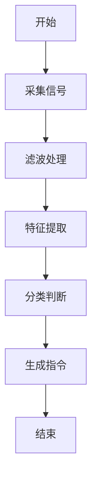
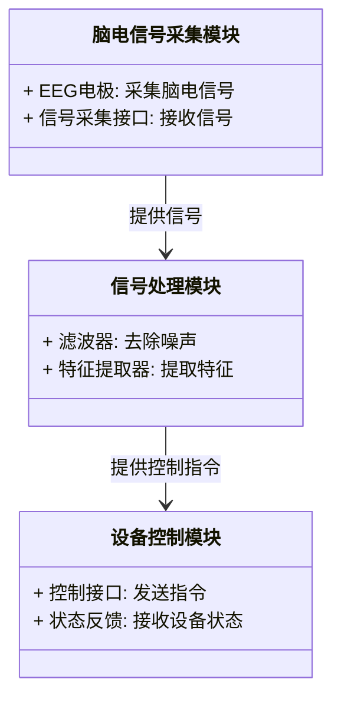
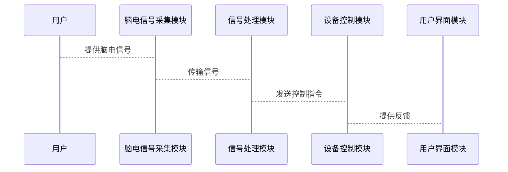

                 


# 企业估值中的脑机接口远程操控系统评估

## 关键词：企业估值，脑机接口，远程操控，系统评估，技术应用，系统架构，算法原理

## 摘要：  
脑机接口（BCI）技术作为一种革命性的创新，正在逐渐改变我们与技术交互的方式。在企业估值领域，脑机接口远程操控系统能够提供更加精准和高效的评估手段。本文将深入探讨这一系统的背景、核心概念、算法原理、系统架构设计以及实际应用案例，为读者提供全面的技术解析和实践指导。

---

# 第一部分: 背景介绍

## 第1章: 脑机接口远程操控系统概述

### 1.1 脑机接口技术的定义与原理  
脑机接口（Brain-Computer Interface，BCI）是一种能够直接将人脑信号转化为计算机可识别指令的技术。它通过采集、处理和分析大脑神经信号，实现人与外部设备的直接交互。  

#### 1.1.1 脑机接口的基本概念  
- **定义**：脑机接口通过采集大脑电活动（如EEG信号），将其转化为控制信号，用于操作外部设备（如计算机、机器人等）。  
- **关键组成部分**：信号采集设备、信号处理算法、控制模块。  

#### 1.1.2 脑机接口的工作原理  
1. **信号采集**：通过 EEG 电极采集大脑电信号。  
2. **信号处理**：对采集到的信号进行滤波、特征提取和分类。  
3. **指令生成**：根据处理后的信号生成控制指令，用于操作外部设备。  

#### 1.1.3 远程操控系统的定义与组成部分  
- **定义**：远程操控系统通过脑机接口技术，实现对远程设备的实时控制。  
- **组成部分**：信号采集模块、信号传输模块、设备控制模块、用户界面模块。  

---

## 第2章: 企业估值中的脑机接口应用背景  

### 2.1 企业估值的基本概念  
- 企业估值是通过对企业财务状况、市场表现、技术实力等多方面进行评估，确定其市场价值的过程。  
- 常见的估值方法包括DCF模型、EV/EBITDA倍数法等。  

### 2.2 脑机接口技术在企业估值中的潜在价值  
- **提高评估效率**：通过脑机接口技术，可以实时采集评估专家的脑部活动，快速捕捉其决策偏好。  
- **增强评估准确性**：脑机接口能够捕捉到人类难以察觉的细微信号，提供更精准的评估依据。  
- **优化决策过程**：通过实时数据分析，脑机接口可以帮助评估团队更快地做出决策。  

### 2.3 远程操控系统在企业估值中的应用场景  
- **实时数据监控**：通过远程操控系统，评估团队可以实时监控企业的生产、销售等数据。  
- **精准决策支持**：脑机接口技术可以辅助评估专家快速判断企业的市场潜力和风险。  

---

## 第3章: 脑机接口远程操控系统的边界与外延  

### 3.1 系统的边界定义  
- **输入边界**：包括脑电信号、外部设备指令等。  
- **输出边界**：包括对远程设备的控制指令、系统反馈信息等。  

### 3.2 系统的外延与扩展性  
- **扩展性**：脑机接口远程操控系统可以扩展到更多设备和场景，例如智能家居、医疗设备等。  
- **灵活性**：系统可以根据不同企业的需求进行定制化开发。  

### 3.3 系统与企业估值的关联性  
- **数据依赖性**：脑机接口系统依赖于高质量的脑电信号数据。  
- **技术可行性**：远程操控系统的稳定性直接影响评估结果的准确性。  

---

## 第4章: 脑机接口远程操控系统的概念结构  

### 4.1 系统的核心要素组成  
- **信号采集模块**：负责采集大脑电信号。  
- **信号处理模块**：对信号进行预处理和特征提取。  
- **远程操控模块**：根据处理后的信号生成控制指令。  
- **用户界面模块**：提供人机交互界面。  

### 4.2 系统的功能模块划分  
- **数据采集功能**：实时采集脑电信号。  
- **数据处理功能**：对信号进行滤波、降噪处理。  
- **控制功能**：根据处理后的信号生成设备控制指令。  

### 4.3 系统的层次结构与逻辑关系  
- **数据流**：从信号采集到指令生成的完整流程。  
- **功能模块**：各模块之间的协作关系。  

---

## 本章小结  
通过本章的介绍，我们了解了脑机接口远程操控系统的定义、原理及其在企业估值中的应用背景。接下来，我们将深入探讨系统的核心概念与联系，进一步理解其技术实现的细节。  

---

## 第二部分: 核心概念与联系  

## 第5章: 脑机接口远程操控系统的核心概念与联系  

### 5.1 脑机接口的核心概念原理  

#### 5.1.1 信息采集与处理的原理  
- **信息采集**：通过 EEG 电极采集大脑电信号。  
- **信息处理**：对信号进行预处理、特征提取和分类。  

#### 5.1.2 数据传输与解析的机制  
- **数据传输**：通过无线或有线方式将处理后的数据传输到控制中心。  
- **数据解析**：对数据进行进一步分析，生成控制指令。  

#### 5.1.3 远程操控的实现方式  
- **实时控制**：根据脑电信号实时生成控制指令。  
- **延迟优化**：通过技术优化减少操控延迟。  

### 5.2 核心概念属性特征对比表格  

| 特性         | 脑机接口远程操控系统 | 传统操控方式 |
|--------------|----------------------|--------------|
| 信号来源     | 脑电信号             | 外部输入设备 |
| 操控延迟     | 较低                 | 较高          |
| 精准度       | 高                   | 中等          |
| 可用场景     | 医疗、工业、企业     | 日常办公、娱乐 |

### 5.3 ER实体关系图架构  

```mermaid
erDiagram
    actor 用户
    actor 评估专家
    actor 系统管理员
    database 系统数据
    device 远程设备
    process 信号处理
    process 指令生成
    用户 --> 系统数据 : 提供脑电信号
    系统数据 --> 信号处理 : 信号处理
    信号处理 --> 指令生成 : 生成控制指令
    指令生成 --> 远程设备 : 发送控制指令
```

---

## 本章小结  
本章通过对比和图表分析，详细阐述了脑机接口远程操控系统的核心概念及其与传统操控方式的差异，为后续的技术实现提供了理论基础。  

---

## 第三部分: 算法原理  

## 第6章: 脑机接口远程操控系统的算法原理  

### 6.1 算法原理概述  

#### 6.1.1 信号处理算法  
- **滤波算法**：去除信号中的噪声。  
- **特征提取算法**：提取信号中的有效特征。  

#### 6.1.2 模式识别算法  
- **分类算法**：对特征进行分类，生成控制指令。  
- **机器学习算法**：使用神经网络等方法提高分类准确率。  

### 6.2 算法流程图  



### 6.3 算法实现代码  

#### 6.3.1 信号处理代码  

```python
import numpy as np
from scipy.signal import butterworth

def butterworth_filter(signal, cutoff_freq, fs, order=5):
    """
    Butterworth滤波器实现。
    Args:
        signal: 输入信号
        cutoff_freq: 截止频率
        fs: 采样频率
        order: 滤波器阶数
    Returns:
        过滤后的信号
    """
    b, a = butterworth(order, cutoff_freq, fs=fs, btype='lowpass')
    filtered_signal = np.convolve(signal, a, mode='full')[:len(signal)]
    return filtered_signal

# 示例信号处理
signal = np.random.normal(0, 1, 1000)
fs = 1000
cutoff_freq = 50
filtered_signal = butterworth_filter(signal, cutoff_freq, fs)
```

#### 6.3.2 模式识别代码  

```python
from sklearn.svm import SVC
from sklearn.preprocessing import StandardScaler

# 特征提取
features = [...]  # 提取的特征向量
labels = [...]    # 对应的标签

# 标准化处理
scaler = StandardScaler()
features_scaled = scaler.fit_transform(features)

# 模型训练
model = SVC()
model.fit(features_scaled, labels)

# 预测
new_features = [...]  # 新的特征向量
new_features_scaled = scaler.transform(new_features)
predicted_label = model.predict(new_features_scaled)
```

### 6.4 算法的数学模型与公式  

#### 6.4.1 滤波器设计  
滤波器的设计可以通过以下公式实现：  
$$ H(f) = \frac{\omega_c}{\sqrt{(f/f_c)^2 + \omega_c^2}} $$  
其中，$\omega_c$ 是截止频率，$f_c$ 是滤波器的截止频率。  

#### 6.4.2 分类算法  
支持向量机（SVM）的数学模型可以表示为：  
$$ \min_{\alpha} \frac{1}{2} \sum_{i=1}^n \alpha_i^2 C_i - \sum_{i=1}^n \alpha_i y_i $$  
其中，$\alpha_i$ 是拉格朗日乘子，$C_i$ 是对偶变量。  

---

## 本章小结  
本章通过代码和公式详细讲解了脑机接口远程操控系统的算法原理，包括信号处理和模式识别的核心算法。这些算法为系统的实现提供了坚实的技术基础。  

---

## 第四部分: 系统分析与架构设计  

## 第7章: 脑机接口远程操控系统的系统分析与架构设计  

### 7.1 问题场景介绍  
- **目标**：设计一个基于脑机接口的远程操控系统，用于企业估值中的实时数据采集与分析。  
- **需求**：实现对远程设备的实时控制，提高企业估值的效率和准确性。  

### 7.2 项目介绍  

#### 7.2.1 项目目标  
- 开发一个基于脑机接口的远程操控系统，用于企业估值中的数据采集与分析。  

#### 7.2.2 项目范围  
- 系统架构设计：包括信号采集模块、信号处理模块、设备控制模块。  
- 系统功能：实时采集脑电信号，处理信号并生成控制指令。  

### 7.3 系统功能设计  

#### 7.3.1 领域模型  



### 7.4 系统架构设计  


### 7.5 系统接口设计  

#### 7.5.1 系统接口定义  
- **输入接口**：脑电信号采集接口、用户输入接口。  
- **输出接口**：设备控制接口、系统反馈接口。  

### 7.6 系统交互流程图  



---

## 本章小结  
本章通过系统架构设计和交互流程图，详细描述了脑机接口远程操控系统的实现方案，为后续的开发工作提供了明确的指导。  

---

## 第五部分: 项目实战  

## 第8章: 脑机接口远程操控系统项目实战  

### 8.1 环境安装  

#### 8.1.1 安装Python环境  
- 安装Python 3.8 或更高版本。  
- 安装必要的库：numpy、scipy、sklearn、mermaid、matplotlib。  

#### 8.1.2 安装脑电信号采集设备  
- 选择支持的EEG采集设备（如OpenBCI Ganglion）。  
- 安装相应的驱动程序和采集软件。  

### 8.2 系统核心实现  

#### 8.2.1 信号采集代码  

```python
import numpy as np
import time
from openbci import Cyton

# 初始化采集设备
cyton = Cyton()

def collect_signal(duration=5):
    """
    采集脑电信号。
    Args:
        duration: 采集时长（秒）
    Returns:
        采集到的信号
    """
    data = []
    start_time = time.time()
    while time.time() - start_time < duration:
        sample = cyton.get_sample()
        data.append(sample.channels)
    return data

# 示例信号采集
signal_data = collect_signal()
```

#### 8.2.2 信号处理代码  

```python
from scipy.signal import butterworth

def preprocess_signal(signal):
    """
    预处理脑电信号。
    Args:
        signal: 输入信号
    Returns:
        处理后的信号
    """
    fs = 250  # 采样频率
    cutoff_freq = 50  # 截止频率
    order = 5  # 滤波器阶数
    filtered_signal = butterworth_filter(signal, cutoff_freq, fs, order)
    return filtered_signal

# 示例信号处理
processed_data = preprocess_signal(signal_data)
```

#### 8.2.3 设备控制代码  

```python
import serial

def send_instruction(device_id, instruction):
    """
    发送控制指令到远程设备。
    Args:
        device_id: 设备标识
        instruction: 控制指令
    """
    ser = serial.Serial(device_id, 9600)
    ser.write(instruction.encode())
    ser.close()

# 示例设备控制
send_instruction('COM3', 'FORWARD')
```

### 8.3 代码应用解读与分析  

#### 8.3.1 信号采集模块  
- **功能**：通过EEG采集设备实时采集脑电信号。  
- **实现细节**：使用OpenBCI库实现信号采集，确保设备与计算机的兼容性。  

#### 8.3.2 信号处理模块  
- **功能**：对采集到的信号进行预处理，包括滤波和特征提取。  
- **实现细节**：使用Scipy库中的Butterworth滤波器进行信号降噪。  

#### 8.3.3 设备控制模块  
- **功能**：根据处理后的信号生成控制指令，发送到远程设备。  
- **实现细节**：使用PySerial库实现设备控制，确保通信的稳定性。  

### 8.4 实际案例分析  

#### 8.4.1 案例背景  
- **企业**：某科技公司，需要实时监控生产设备的运行状态。  
- **目标**：通过脑机接口远程操控系统实现对生产设备的实时控制。  

#### 8.4.2 操作流程  
1. 采集设备运行状态数据。  
2. 通过脑电信号生成控制指令。  
3. 发送指令到生产设备，调整其运行参数。  

### 8.5 项目小结  

---

## 第六部分: 最佳实践  

## 第9章: 脑机接口远程操控系统评估的注意事项与最佳实践  

### 9.1 项目开发中的注意事项  

#### 9.1.1 信号采集的准确性  
- 确保EEG电极的正确安装，避免信号干扰。  
- 定期校准设备，保证采集信号的稳定性。  

#### 9.1.2 系统架构的可扩展性  
- 设计模块化的系统架构，便于后续功能的扩展。  
- 确保系统的灵活性，适应不同企业的需求。  

### 9.2 最佳实践  

#### 9.2.1 系统测试与优化  
- 在不同场景下测试系统性能，记录并分析结果。  
- 根据测试结果优化算法，提高系统的稳定性和准确性。  

#### 9.2.2 代码开发规范  
- 遵循代码规范，确保代码的可读性和可维护性。  
- 定期进行代码审查，发现并修复潜在问题。  

---

## 本章小结  
本章总结了脑机接口远程操控系统在企业估值中的应用注意事项和最佳实践，帮助读者在实际项目中避免常见问题，提高系统的开发效率和质量。  

---

## 结语  

脑机接口远程操控系统在企业估值中的应用前景广阔，随着技术的不断进步，其应用范围和深度将进一步扩大。通过本文的详细讲解，读者可以深入了解系统的实现细节和实际应用案例，为后续的研究和开发工作提供坚实的基础。  

---

**感谢您的阅读！**

