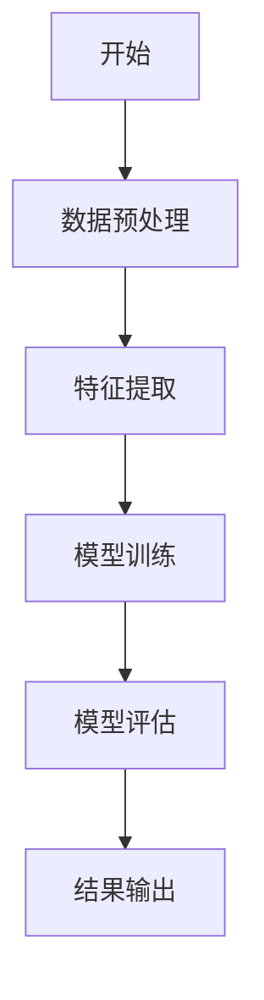

                 


# 企业估值中的虚拟现实培训应用评估

> 关键词：企业估值、虚拟现实、培训应用、评估模型、算法实现

> 摘要：随着虚拟现实技术的快速发展，其在企业培训中的应用越来越广泛。本文从企业估值的角度，系统地探讨了虚拟现实培训应用的评估方法，构建了基于回归分析和机器学习的评估模型，提出了具体的实现方案，并通过实际案例验证了模型的有效性。

---

## 第一部分: 企业估值中的虚拟现实培训应用概述

### 第1章: 虚拟现实技术与企业培训的结合

#### 1.1 虚拟现实技术的基本概念
- **定义与特点**  
  虚拟现实（Virtual Reality，VR）是一种通过计算机生成的模拟环境，用户可以通过特殊设备（如头显、手柄等）与虚拟环境进行交互。其核心特点包括沉浸性、交互性和构想性。

- **在企业培训中的应用场景**  
  VR技术广泛应用于企业培训的多个领域，例如员工技能培训、安全演练、领导力培养等。通过模拟真实的工作环境，员工可以在虚拟场景中进行实践操作，提升培训效果。

- **优势与局限性**  
  优势：沉浸式体验、安全性高、可重复操作。  
  局限性：设备成本高、技术门槛高、内容开发复杂。

#### 1.2 企业估值的基本概念
- **定义与方法**  
  企业估值是对企业价值的评估，常用方法包括资产基础法、收益法和市场法。其中，收益法通过预测企业未来现金流折现值来评估企业价值。

- **与培训应用的关系**  
  培训应用的效率和效果直接影响企业的生产力和员工素质，从而影响企业的长期价值。通过评估培训应用的效果，可以优化资源配置，提升企业整体估值。

---

### 第2章: 虚拟现实培训应用评估的背景与意义

#### 2.1 企业培训中的传统方法与挑战
- **传统方法的局限性**  
  传统培训方法（如讲座、手册阅读）存在互动性差、学习效果不佳等问题。学员难以在虚拟环境中实践复杂的操作技能。

- **虚拟现实技术的解决方案**  
  VR技术通过提供沉浸式体验，解决了传统培训的痛点，使学员能够在虚拟环境中进行实践操作，提升学习效果。

- **发展趋势**  
  随着技术进步和成本下降，VR技术在企业培训中的应用越来越广泛，尤其是在高科技行业和服务业。

#### 2.2 虚拟现实培训应用评估的必要性
- **评估的重要性**  
  通过评估VR培训应用的效果，可以量化其对企业绩效的影响，从而为决策者提供数据支持。

- **对企业估值的影响**  
  有效的培训应用可以提升员工技能，优化企业运营效率，进而提升企业估值。通过评估，企业可以合理分配培训资源，降低不必要的成本投入。

---

## 第二部分: 虚拟现实培训应用评估的核心模型与方法

### 第3章: 虚拟现实培训应用评估的核心模型

#### 3.1 模型构建的基本思路
- **输入与输出**  
  输入：培训效果数据、成本数据、企业绩效数据。  
  输出：培训应用对企业估值的影响程度。

- **核心要素**  
  包括培训效果、培训成本、企业绩效、市场环境等。

#### 3.2 关键指标
- **培训效果指标**  
  学员满意度、知识掌握率、技能操作熟练度。

- **培训成本指标**  
  设备成本、培训时间、人力资源投入。

- **企业绩效指标**  
  生产效率、员工流失率、企业利润率。

---

### 第4章: 虚拟现实培训应用评估的数学模型与算法

#### 4.1 基于回归分析的评估模型
- **模型表达**  
  $$ \text{企业估值} = \beta_0 + \beta_1 \times \text{培训效果} + \beta_2 \times \text{培训成本} + \epsilon $$  
  其中，$\beta_0$、$\beta_1$、$\beta_2$为回归系数，$\epsilon$为误差项。

- **算法实现步骤**  
  1. 数据预处理：收集培训效果、成本和企业绩效数据。  
  2. 特征提取：提取关键指标，如学员满意度、培训时间等。  
  3. 模型训练：使用线性回归算法拟合模型。  
  4. 模型评估：计算R平方值，验证模型的拟合度。

#### 4.2 基于机器学习的评估模型
- **模型表达**  
  $$ \text{企业估值} = f(\text{培训效果}, \text{培训成本}, \text{企业绩效}) $$  
  其中，$f$为机器学习模型（如随机森林、神经网络）。

- **算法流程图**  


---

## 第三部分: 系统分析与架构设计

### 第5章: 系统功能设计

#### 5.1 系统功能模块
- 数据采集模块：收集培训效果、成本和企业绩效数据。  
- 数据处理模块：对数据进行清洗和转换。  
- 模型训练模块：基于机器学习算法构建评估模型。  
- 结果展示模块：可视化评估结果，提供决策支持。

#### 5.2 系统架构设计


---

## 第四部分: 项目实战与案例分析

### 第6章: 项目实战

#### 6.1 环境安装与配置
- 安装Python、机器学习库（如Scikit-learn、XGBoost）和数据可视化库（如Matplotlib、Seaborn）。

#### 6.2 核心代码实现
```python
import numpy as np
import pandas as pd
from sklearn.linear_model import LinearRegression
from sklearn.metrics import r2_score

# 数据预处理
data = pd.read_csv('training_data.csv')
X = data[['培训效果', '培训成本', '企业绩效']]
y = data['企业估值']

# 模型训练
model = LinearRegression()
model.fit(X, y)

# 模型评估
y_pred = model.predict(X)
print("R平方值:", r2_score(y, y_pred))
```

---

## 第五部分: 最佳实践与小结

### 第7章: 最佳实践

#### 7.1 关键点总结
- 数据收集是评估的基础，需确保数据的完整性和准确性。  
- 模型选择需结合企业实际情况，避免过度复杂化。  
- 结果解读需结合企业战略，优化资源配置。

#### 7.2 小结
通过构建虚拟现实培训应用评估模型，企业可以量化培训应用的效果，优化资源配置，提升整体估值。未来，随着技术进步，评估方法将更加精准，为企业决策提供更强支持。

---

以上是文章的详细大纲和部分内容展示，您可以根据实际需求进一步扩展和补充具体章节的内容。

