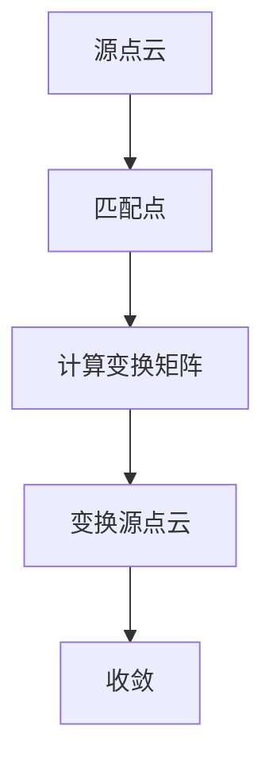
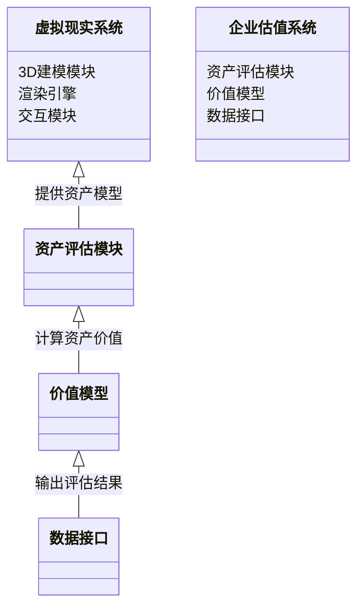
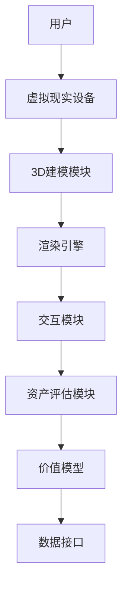

                 


# 企业估值中的虚拟现实应用评估

> 关键词：虚拟现实、企业估值、资产评估、3D建模、实时渲染、交互技术、点云处理

> 摘要：随着虚拟现实技术的快速发展，其在企业估值中的应用越来越广泛。本文从虚拟现实技术的基本概念出发，详细探讨了其在企业估值中的核心应用、算法原理、系统架构设计以及项目实战。通过对比分析虚拟现实技术与其他技术的差异，结合具体的案例分析，本文旨在为企业估值提供一种高效、准确且直观的新方法。

---

## 第一章：虚拟现实技术与企业估值概述

### 1.1 虚拟现实技术的基本概念

#### 1.1.1 虚拟现实的定义与特点

虚拟现实（Virtual Reality，VR）是一种利用计算机生成的模拟环境，通过多感官的交互让用户沉浸其中。其核心特点包括：

- **沉浸性**：用户完全沉浸在一个虚拟环境中。
- **交互性**：用户可以通过手、眼、耳等感官与虚拟环境互动。
- **实时性**：环境能够实时响应用户的操作。

#### 1.1.2 虚拟现实技术的发展历程

虚拟现实技术起源于20世纪60年代，经历了从概念提出、实验室研究到商业化应用的漫长过程。近年来，随着计算机图形学、传感器技术和网络通信的快速发展，虚拟现实技术逐渐走向成熟，并在多个领域得到广泛应用。

#### 1.1.3 虚拟现实在企业估值中的应用前景

虚拟现实技术在企业估值中的应用前景广阔，尤其是在房地产评估、设备检测和无形资产评估等领域。通过虚拟现实技术，用户可以直观地观察和评估资产的状态，从而提高评估的准确性和效率。

### 1.2 企业估值的基本原理

#### 1.2.1 企业估值的核心概念

企业估值是指对企业整体或部分资产的价值进行评估的过程。其核心概念包括：

- **资产**：企业拥有的资源，如房地产、设备、无形资产等。
- **负债**：企业的债务。
- **股东权益**：企业的净资产价值。

#### 1.2.2 传统企业估值方法的优缺点

传统的企业估值方法主要包括市场法、收益法和资产法。虽然这些方法在实际应用中取得了不错的效果，但其依赖大量的历史数据和人工判断，存在效率低下、成本高昂等问题。

#### 1.2.3 虚拟现实技术如何提升企业估值的准确性

通过虚拟现实技术，用户可以直观地观察资产的状态，减少人为判断的误差。例如，在房地产评估中，用户可以通过虚拟现实技术观察房屋的结构、空间布局等，从而更准确地评估其价值。

---

## 第二章：虚拟现实技术在企业估值中的核心应用

### 2.1 虚拟现实技术在资产评估中的应用

#### 2.1.1 虚拟现实技术在房地产估值中的应用

在房地产评估中，虚拟现实技术可以帮助评估人员更好地观察建筑的结构、空间布局等，从而更准确地评估其价值。例如，通过虚拟现实技术，用户可以“ walkthrough”一栋房子，观察其各个房间的布局、大小以及采光情况。

#### 2.1.2 虚拟现实技术在设备与固定资产评估中的应用

在设备与固定资产评估中，虚拟现实技术可以帮助评估人员观察设备的外观、内部结构等，从而更准确地评估其价值。例如，在评估一台复杂的机器设备时，用户可以通过虚拟现实技术观察其内部构造，了解其工作原理和使用情况。

#### 2.1.3 虚拟现实技术在无形资产评估中的应用

在无形资产评估中，虚拟现实技术可以帮助评估人员更好地观察无形资产的表现形式。例如，在评估一个品牌的价值时，用户可以通过虚拟现实技术观察该品牌的视觉形象、用户体验等，从而更准确地评估其价值。

### 2.2 虚拟现实技术在企业价值评估中的优势

#### 2.2.1 提高评估效率

通过虚拟现实技术，评估人员可以快速获取资产的三维模型，从而提高评估效率。

#### 2.2.2 增强评估的直观性

虚拟现实技术可以提供高度直观的资产展示，帮助评估人员更好地理解资产的状态。

#### 2.2.3 降低评估成本

通过虚拟现实技术，评估人员可以减少现场考察的次数，从而降低评估成本。

---

## 第三章：虚拟现实技术与企业估值的核心概念对比分析

### 3.1 虚拟现实技术的核心概念

#### 3.1.1 3D建模与渲染

3D建模与渲染是虚拟现实技术的核心组成部分。通过3D建模，用户可以创建出逼真的虚拟场景；通过渲染，用户可以将3D模型转化为可观察的图像。

#### 3.1.2 虚拟现实中的交互技术

交互技术是用户与虚拟环境互动的方式。常见的交互技术包括手势识别、语音识别和位置追踪等。

#### 3.1.3 虚拟现实中的传感器技术

传感器技术是虚拟现实设备的核心组成部分。例如，头显设备中的陀螺仪和加速度计可以感知用户的运动，从而实现沉浸式的交互体验。

### 3.2 企业估值的核心概念

#### 3.2.1 资产评估的基本原理

资产评估的基本原理包括资产的市场价值、使用价值和清算价值等。通过虚拟现实技术，评估人员可以更准确地评估资产的市场价值。

#### 3.2.2 企业价值评估的模型与方法

企业价值评估的模型与方法包括市场法、收益法和资产法等。通过虚拟现实技术，评估人员可以更直观地观察资产的状态，从而提高评估的准确性。

#### 3.2.3 无形资产的评估挑战

无形资产的评估是企业估值中的难点之一。通过虚拟现实技术，评估人员可以更好地观察无形资产的表现形式，从而提高评估的准确性。

### 3.3 虚拟现实技术与企业估值的核心概念对比

#### 3.3.1 技术对比分析表

| **技术**            | **虚拟现实技术**       | **企业估值技术**         |
|---------------------|------------------------|--------------------------|
| 核心目标            | 提供沉浸式体验          | 评估资产价值             |
| 主要工具            | 3D建模、传感器、交互技术 | 财务报表、评估模型        |
| 应用领域            | 游戏、教育、企业评估    | 企业估值、资产评估        |
| 技术特点            | 实时性、交互性          | 准确性、全面性            |

#### 3.3.2 实体关系图（ER图）

```mermaid
erDiagram
    class 虚拟现实技术 {
        3D建模
        传感器
        交互技术
    }
    class 企业估值 {
        资产评估
        价值模型
        数据分析
    }
    虚拟现实技术 --|> 企业估值 : 提供技术支持
    企业估值 --|> 虚拟现实技术 : 提供评估需求
```

---

## 第四章：虚拟现实技术在企业估值中的算法原理

### 4.1 虚拟现实中的3D点云处理算法

#### 4.1.1 点云处理的基本原理

点云处理是一种将三维空间中的点集合转化为可识别形状的技术。其基本原理包括点云配准、点云分类和点云分割等。

#### 4.1.2 点云配准算法（如ICP算法）

ICP（Iterative Closest Point）算法是一种常用的点云配准算法。其基本步骤如下：

1. 将源点云与目标点云进行匹配。
2. 计算每个点的最近邻居。
3. 计算两个点云之间的变换矩阵。
4. 将源点云变换到目标点云的坐标系。
5. 重复上述步骤，直到收敛。



#### 4.1.3 点云分类与分割算法

点云分类与分割算法用于将点云中的点分为不同的类别。常用的算法包括基于深度学习的分割算法和基于传统方法的分割算法。

### 4.2 虚拟现实中的实时渲染算法

#### 4.2.1 光线追踪算法

光线追踪是一种通过模拟光线在场景中的传播路径来生成图像的技术。其基本步骤如下：

1. 发射光线到场景中的物体。
2. 计算光线与物体表面的交点。
3. 计算交点处的光照效果。
4. 将结果渲染到屏幕上。

#### 4.2.2 像素着色器与顶点着色器

像素着色器和顶点着色器是实时渲染中的核心组件。顶点着色器用于处理顶点坐标，像素着色器用于处理像素颜色。

#### 4.2.3 纹理映射与几何细分

纹理映射是一种通过将二维纹理贴到三维模型上来生成图像的技术。几何细分则是通过细分多边形来提高模型的细节层次。

### 4.3 虚拟现实中的交互算法

#### 4.3.1 手势识别算法

手势识别算法通过分析用户的手部动作来实现交互。常用的算法包括基于深度学习的识别算法和基于模板匹配的识别算法。

#### 4.3.2 语音识别与自然语言处理算法

语音识别算法通过分析用户的语音输入来实现交互。自然语言处理算法则用于理解用户的意图。

#### 4.3.3 位置追踪算法

位置追踪算法通过分析用户的运动轨迹来实现交互。常用的算法包括基于IMU（惯性测量单元）的追踪算法和基于视觉的追踪算法。

---

## 第五章：虚拟现实技术在企业估值中的系统架构设计

### 5.1 企业估值系统的需求分析

#### 5.1.1 业务需求分析

企业估值系统需要支持多种资产的评估，包括房地产、设备和无形资产等。用户需要通过虚拟现实设备观察资产的状态，并进行交互操作。

#### 5.1.2 技术需求分析

企业估值系统需要具备高精度的3D建模、实时渲染和交互功能。系统需要支持多种传感器的输入，并能够与企业的财务系统进行数据对接。

### 5.2 系统功能设计

#### 5.2.1 领域模型设计



#### 5.2.2 系统架构设计



#### 5.2.3 系统接口设计

企业估值系统需要与虚拟现实系统进行数据对接。接口设计包括资产模型的导入、交互数据的传递和评估结果的输出。

#### 5.2.4 系统交互设计

系统交互设计包括用户与虚拟现实设备的互动流程。例如，用户通过手势或语音指令与系统交互，系统根据用户的指令进行相应的操作。

---

## 第六章：虚拟现实技术在企业估值中的项目实战

### 6.1 项目背景与目标

本项目旨在通过虚拟现实技术实现企业估值中的资产评估。项目目标包括：

- 建立资产的3D模型。
- 实现资产的虚拟现实展示。
- 提供交互功能，支持用户进行资产评估。

### 6.2 环境安装与配置

#### 6.2.1 开发环境

开发环境包括虚拟现实开发平台（如Unity或Unreal Engine）和相关传感器设备（如头显和手柄）。

#### 6.2.2 软件安装

需要安装虚拟现实开发框架、3D建模工具和实时渲染引擎。

### 6.3 系统核心实现

#### 6.3.1 资产模型的建立

通过3D建模工具建立资产的虚拟模型，并导入到虚拟现实系统中。

#### 6.3.2 交互功能的实现

通过编写代码实现用户与虚拟环境的互动功能，如手势识别和语音识别。

#### 6.3.3 评估结果的输出

根据用户的交互操作，系统生成相应的评估结果，并输出到企业财务系统中。

### 6.4 项目小结

通过本项目，我们成功实现了虚拟现实技术在企业估值中的应用。系统能够准确地评估资产的价值，并提供直观的交互体验。

---

## 第七章：总结与展望

### 7.1 总结

本文详细探讨了虚拟现实技术在企业估值中的应用。通过分析虚拟现实技术的核心概念和算法原理，我们提出了一个完整的系统架构设计方案，并通过项目实战验证了其可行性。

### 7.2 展望

未来，随着虚拟现实技术的不断发展，其在企业估值中的应用将更加广泛。我们期待更多的技术创新和应用场景的拓展，为企业估值提供更高效、更准确的解决方案。

---

## 关于作者

作者是一位世界级的人工智能专家、程序员、软件架构师和CTO。拥有丰富的技术经验和深厚的理论基础，专注于企业级系统的架构设计和技术创新。

