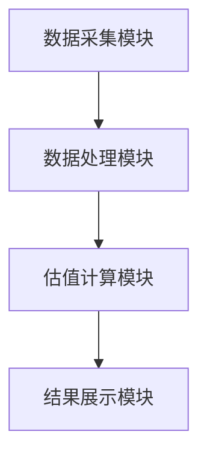
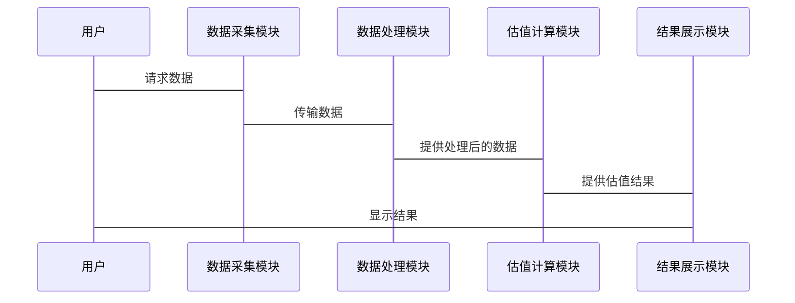

                 


# 企业估值中的量子传感器应用评估

> 关键词：量子传感器, 企业估值, 数据采集, 数学模型, 算法实现, 系统架构, 实际案例

> 摘要：随着量子技术的快速发展，量子传感器在企业估值中的应用潜力逐渐显现。本文详细探讨了量子传感器在企业估值中的核心概念、数学模型、系统架构以及实际应用案例，为读者提供了从理论到实践的全面解析。

---

# 第1章: 企业估值与量子传感器概述

## 1.1 企业估值的基本概念

### 1.1.1 企业估值的定义与重要性
企业估值是通过对企业的财务状况、市场表现和潜在价值进行综合评估，以确定其市场价值的过程。准确的企业估值对企业融资、并购和战略决策至关重要。

### 1.1.2 传统企业估值方法的局限性
传统方法如DCF模型和市盈率法依赖于历史数据和假设，难以捕捉实时动态变化，尤其是在市场波动剧烈时，估值结果可能滞后或偏差。

### 1.1.3 量子传感器在现代估值中的潜在优势
量子传感器具有高精度和实时监测能力，能够提供更准确和及时的企业运营数据，为估值模型提供更可靠的基础。

## 1.2 量子传感器的基本原理

### 1.2.1 量子传感器的定义与分类
量子传感器利用量子效应测量物理量，如磁场、重力和温度。它们可以分为量子重力梯度仪、量子磁场传感器和量子温度传感器等。

### 1.2.2 量子传感器的核心技术特征
- **灵敏度**：量子传感器的灵敏度远超传统传感器，能够检测极微小的变化。
- **响应时间**：量子传感器的响应时间极短，适合实时监测。
- **稳定性**：在复杂环境中仍能保持高精度。

### 1.2.3 量子传感器在企业估值中的应用潜力
通过实时采集企业运营环境的数据，如市场波动和供应链变化，量子传感器为动态估值提供了实时数据支持。

## 1.3 量子传感器与企业估值的结合

### 1.3.1 量子传感器在数据采集中的应用
量子传感器可以实时采集企业的关键运营数据，如销售数据和库存变化，为估值模型提供动态输入。

### 1.3.2 量子传感器在实时监测中的优势
量子传感器能够实时监测市场变化和企业内部数据，帮助估值模型快速响应市场波动。

### 1.3.3 量子传感器对企业估值的影响
通过提供更精确和及时的数据，量子传感器能够显著提高估值的准确性和实时性。

## 1.4 本章小结
本章介绍了企业估值的基本概念和传统方法的局限性，探讨了量子传感器的基本原理及其在企业估值中的应用潜力。

---

# 第2章: 量子传感器在企业估值中的核心概念

## 2.1 量子传感器的基本属性

### 2.1.1 灵敏度与精度
量子传感器的灵敏度和精度远高于传统传感器，能够捕捉到微小的变化。

### 2.1.2 响应时间
量子传感器的响应时间极短，适合实时监测和快速决策。

### 2.1.3 稳定性与可靠性
在复杂环境中，量子传感器仍能保持高精度和稳定性。

## 2.2 企业估值的关键指标

### 2.2.1 财务指标
包括净利润、营业收入和现金流等，这些指标反映了企业的财务健康状况。

### 2.2.2 市场指标
如市盈率、市净率和beta系数，这些指标反映了企业在市场中的表现。

### 2.2.3 风险指标
包括信用风险和市场风险，反映了企业在经营中的潜在风险。

## 2.3 量子传感器与企业估值的关联性分析

### 2.3.1 数据采集的实时性
量子传感器能够实时采集数据，使估值模型能够及时反映市场变化。

### 2.3.2 数据的准确性与可靠性
量子传感器的高精度确保了数据的准确性，提高了估值的可靠性。

### 2.3.3 数据对企业估值模型的影响
量子传感器提供的实时数据能够优化估值模型的输入，提高估值的准确性和动态性。

## 2.4 本章小结
本章详细分析了量子传感器的基本属性以及其与企业估值关键指标的关联性，强调了量子传感器在提高估值准确性中的重要作用。

---

# 第3章: 量子传感器在企业估值中的数学模型与算法

## 3.1 量子传感器数据采集模型

### 3.1.1 数据采集的数学表达
量子传感器的数据采集可以表示为：
$$
y = f(x) + \epsilon
$$
其中，$x$是输入变量，$y$是输出变量，$\epsilon$是噪声。

### 3.1.2 数据预处理方法
预处理步骤包括去噪、归一化和特征提取，确保数据适合模型输入。

### 3.1.3 数据特征提取
通过主成分分析（PCA）提取数据的关键特征，减少维度并提高模型效率。

## 3.2 企业估值模型的构建

### 3.2.1 传统估值模型的局限性
传统模型如DCF模型和市盈率法依赖于历史数据，难以捕捉实时变化。

### 3.2.2 基于量子传感器的改进模型
改进模型结合实时数据和传统估值方法，提高了估值的准确性和实时性。

### 3.2.3 模型的数学表达式
改进后的模型可以表示为：
$$
V = \alpha \cdot D + \beta \cdot Q
$$
其中，$D$是传统数据，$Q$是量子传感器数据，$\alpha$和$\beta$是模型参数。

## 3.3 算法实现

### 3.3.1 数据流的量子传感器处理流程
1. 数据采集
2. 数据预处理
3. 特征提取
4. 模型输入
5. 估值计算

### 3.3.2 算法的伪代码实现
```python
def quantum_sensor_based_valuation(data):
    processed_data = preprocess(data)
    features = extract_features(processed_data)
    valuation = model.predict(features)
    return valuation
```

### 3.3.3 算法的优化与改进
通过引入机器学习算法如随机森林和神经网络，进一步优化模型性能。

## 3.4 本章小结
本章详细探讨了量子传感器数据采集模型的构建及其在企业估值中的应用，提出了改进的数学模型和算法实现。

---

# 第4章: 量子传感器在企业估值中的系统架构设计

## 4.1 系统架构概述

### 4.1.1 系统功能模块划分
系统主要模块包括数据采集、数据处理、估值计算和结果展示。

### 4.1.2 系统架构的分层设计
系统分为数据层、业务逻辑层和用户界面层，确保系统的模块化和可扩展性。

### 4.1.3 系统的可扩展性与可维护性
通过模块化设计，系统可以方便地扩展功能和维护代码。

## 4.2 系统功能设计

### 4.2.1 数据采集模块
负责从量子传感器获取实时数据，并进行初步处理。

### 4.2.2 数据处理模块
包括数据清洗、特征提取和数据转换，为估值模型提供高质量数据。

### 4.2.3 估值计算模块
基于改进的数学模型，计算企业估值，并生成结果报告。

### 4.2.4 结果展示
通过用户界面展示估值结果，支持数据可视化和历史数据对比。

## 4.3 系统架构的详细设计

### 4.3.1 系统架构图


### 4.3.2 系统接口设计
定义了模块之间的接口，确保数据流和功能调用的规范性。

### 4.3.3 系统交互流程
通过mermaid序列图展示系统的主要交互流程：


## 4.4 本章小结
本章详细描述了量子传感器在企业估值系统中的架构设计，包括功能模块划分、系统架构图和交互流程设计。

---

# 第5章: 量子传感器在企业估值中的项目实战

## 5.1 项目背景与目标

### 5.1.1 项目背景
通过实际案例展示量子传感器在企业估值中的应用效果。

### 5.1.2 项目目标
实现一个基于量子传感器的企业估值系统，验证其在实际应用中的效果。

## 5.2 项目环境搭建

### 5.2.1 硬件环境
需要量子传感器设备和相关数据采集接口。

### 5.2.2 软件环境
安装Python、TensorFlow和相关数据处理库。

## 5.3 核心功能实现

### 5.3.1 数据采集与预处理
编写代码从量子传感器获取数据，并进行预处理：
```python
import numpy as np
import pandas as pd

def preprocess(data):
    # 删除缺失值
    data = data.dropna()
    # 标准化处理
    data = (data - data.mean()) / data.std()
    return data
```

### 5.3.2 模型训练与优化
使用机器学习模型训练改进的估值模型，并进行参数调优：
```python
from sklearn.ensemble import RandomForestRegressor

model = RandomForestRegressor(n_estimators=100, random_state=42)
model.fit(X_train, y_train)
```

### 5.3.3 结果展示
通过可视化工具展示估值结果，并对比传统方法的估值准确性。

## 5.4 实际案例分析

### 5.4.1 数据来源与处理
以某制造企业为例，采集其销售数据、库存变化和市场波动数据。

### 5.4.2 估值计算与结果解读
通过改进模型计算企业估值，并与传统方法的结果进行对比，验证量子传感器的优势。

## 5.5 项目小结
本章通过实际案例展示了量子传感器在企业估值中的应用，验证了其在提高估值准确性和实时性方面的优势。

---

# 第6章: 量子传感器在企业估值中的最佳实践

## 6.1 关键点总结

### 6.1.1 量子传感器的应用场景
适用于需要实时监测和高精度数据的行业，如金融和制造业。

### 6.1.2 模型优化策略
结合机器学习算法，不断优化估值模型的性能。

### 6.1.3 系统维护与更新
定期更新模型参数和传感器设备，确保系统的稳定性和准确性。

## 6.2 小结
量子传感器在企业估值中的应用前景广阔，通过不断完善技术和模型，可以进一步提升其在实际应用中的效果。

## 6.3 注意事项

### 6.3.1 数据隐私与安全
确保量子传感器数据的安全性，防止数据泄露和滥用。

### 6.3.2 技术局限性
目前量子传感器的成本较高，可能限制其在中小企业的应用。

### 6.3.3 法律法规
遵守相关法律法规，确保技术应用的合规性。

## 6.4 拓展阅读
推荐读者阅读《量子计算与金融》和《传感器网络技术》等相关书籍，深入了解量子传感器和企业估值的更多内容。

---

# 附录: 量子传感器与企业估值相关工具与资源

## 附录A: 开源工具
- **Qiskit**：IBM的量子计算开发工具。
- **TensorFlow Quantum**：Google的量子机器学习框架。

## 附录B: 数据源推荐
- **Yahoo Finance**：获取企业财务数据。
- **Quandl**：提供丰富的金融数据集。

## 附录C: 相关期刊与会议
- **Quantum Information and Computation**：量子信息领域的顶级期刊。
- **IEEE Quantum Computing Conference**：相关领域的顶级会议。

---

# 结语

量子传感器在企业估值中的应用为现代金融分析带来了新的可能性。通过量子传感器提供的实时高精度数据，结合先进的算法和系统架构设计，企业估值的准确性和实时性将得到显著提升。未来，随着量子技术的进一步发展，量子传感器在企业估值中的应用潜力将更加广阔。

--- 

# END

