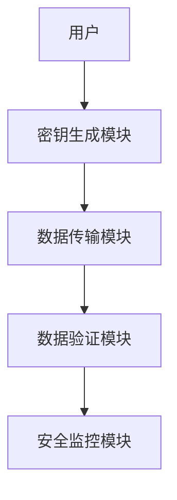
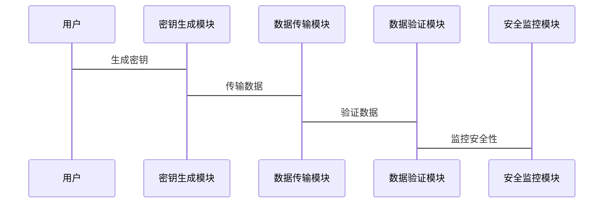

                 


# 企业估值中的量子加密通信地面站网络评估

> 关键词：量子加密通信，企业估值，地面站网络，网络评估，安全通信

> 摘要：随着量子技术的快速发展，量子加密通信在企业估值中的应用日益广泛。本文从量子加密通信的基本概念出发，详细分析其在网络评估中的作用，探讨其在企业估值中的实际应用。通过数学模型和算法的推导，结合系统架构设计和项目实战案例，全面解读量子加密通信地面站网络评估的核心原理和实现方法。

---

# 第一部分: 量子加密通信与企业估值概述

## 第1章: 量子加密通信的基本概念

### 1.1 量子加密通信的定义与特点

#### 1.1.1 量子加密通信的定义

量子加密通信是一种利用量子力学原理进行数据加密和传输的技术。其核心在于利用量子叠加态和量子纠缠态的特性，实现信息的隐秘传输和安全共享。与传统加密技术不同，量子加密通信的安全性基于物理定律，而非纯粹的数学算法，因此具有更高的安全性。

#### 1.1.2 量子加密通信的核心特点

- **不可分割性**：量子信息无法被分割或复制，确保了数据的完整性。
- **安全性**：基于量子力学的不确定性原理，任何未经授权的窃听都会破坏量子状态，从而被发现。
- **高效性**：量子通信可以在更短的时间内完成大规模数据的传输和加密。

#### 1.1.3 量子加密通信与传统加密技术的对比

| 特性                | 量子加密通信             | 传统加密技术             |
|---------------------|--------------------------|--------------------------|
| 安全性              | 基于物理定律，安全性更高 | 基于数学算法，可能被破解 |
| 传输效率            | 更高，适合远距离传输     | 较低，适合近距离传输     |
| 窃听检测            | 可以检测窃听             | 无法检测窃听             |

### 1.2 量子加密通信在企业估值中的应用背景

#### 1.2.1 企业估值的基本概念

企业估值是指通过一系列方法和模型，对企业的价值进行评估和定价。常见的企业估值方法包括DCF模型、市盈率法、市净率法等。在这些方法中，数据的安全性和隐私性对估值结果至关重要。

#### 1.2.2 量子加密通信在企业估值中的潜在价值

量子加密通信可以通过以下方式提升企业估值：

- **数据安全性**：保护敏感数据不被未经授权的第三方窃取，提升数据的可信度。
- **估值模型优化**：通过安全的数据传输和共享，优化估值模型的参数和计算过程。
- **企业并购中的应用**：在企业并购过程中，量子加密通信可以确保目标企业数据的安全性，降低估值风险。

#### 1.2.3 当前企业估值中的安全挑战

- **数据泄露风险**：传统加密技术可能被破解，导致数据泄露。
- **估值模型的不准确性**：由于数据不安全，估值模型的参数可能被篡改，导致结果偏差。
- **企业声誉损失**：数据泄露可能影响企业的信誉，进而影响估值结果。

---

## 第2章: 量子加密通信地面站网络的基本原理

### 2.1 量子通信的基本原理

#### 2.1.1 量子叠加与量子纠缠

量子叠加是指量子系统可以同时处于多个状态的叠加态。例如，一个量子比特（qubit）可以同时处于0和1的状态。量子纠缠是指两个或多个量子系统之间存在关联，其中一个系统的状态会直接影响另一个系统的状态。

#### 2.1.2 量子密钥分发（QKD）的原理

量子密钥分发是一种基于量子通信的密钥交换协议。其基本流程如下：

1. **密钥生成**：双方通过量子通信生成相同的密钥。
2. **密钥验证**：通过经典通信对密钥进行验证，确保密钥的安全性。
3. **数据加密**：使用生成的密钥对数据进行加密和解密。

#### 2.1.3 量子通信的网络架构

量子通信网络的架构包括以下部分：

- **量子中继站**：用于量子信息的中转和放大。
- **量子终端**：用户端的量子通信设备。
- **经典网络**：用于辅助量子通信的经典数据传输。

### 2.2 地面站网络的结构与功能

#### 2.2.1 地面站的基本组成

量子地面站主要包括以下组成部分：

- **量子发射器**：用于发送量子信号。
- **量子接收器**：用于接收和处理量子信号。
- **经典通信设备**：用于辅助量子通信的经典数据传输。

#### 2.2.2 地面站网络的拓扑结构

常见的量子地面站网络拓扑结构包括：

- **星型拓扑**：一个中心站与多个边缘站相连。
- **链式拓扑**：多个地面站通过链式结构连接。
- **混合拓扑**：结合星型和链式结构的混合网络。

#### 2.2.3 地面站网络的安全特性

- **抗窃听性**：基于量子通信的特性，任何窃听都会被发现。
- **抗干扰性**：量子通信的信号不易被干扰，确保数据传输的稳定性。

---

## 第3章: 量子加密通信与企业估值的关联

### 3.1 企业估值的核心要素

#### 3.1.1 企业价值的评估方法

企业估值的核心要素包括：

- **财务数据**：收入、利润、资产等。
- **市场环境**：行业趋势、竞争状况等。
- **管理团队**：管理层的能力和战略规划。

#### 3.1.2 企业估值中的数据安全问题

- **数据泄露风险**：敏感数据可能被未经授权的第三方窃取。
- **估值模型的不准确性**：数据不安全可能导致估值模型的参数被篡改。
- **企业声誉损失**：数据泄露可能影响企业的信誉，进而影响估值结果。

#### 3.1.3 量子加密通信在数据保护中的作用

- **数据完整性**：量子通信确保数据在传输过程中不会被篡改。
- **数据机密性**：量子通信确保数据在传输过程中不会被未经授权的第三方窃取。
- **数据可用性**：量子通信确保数据在传输过程中不会被干扰，保证数据的可用性。

### 3.2 量子加密通信对估值过程的影响

#### 3.2.1 提高数据安全性对估值的影响

- **数据的可信度**：通过量子通信保护的数据更具可信度，从而提高估值的准确性。
- **估值模型的稳定性**：数据安全性高，估值模型的参数不易被篡改，提高模型的稳定性。

#### 3.2.2 量子加密通信对估值模型的优化

- **数据共享的安全性**：量子通信可以实现安全的数据共享，提高估值模型的数据来源多样性。
- **数据处理的高效性**：量子通信可以提高数据处理的效率，缩短估值的时间。

#### 3.2.3 量子加密通信在企业并购中的应用

- **目标企业数据的安全性**：在企业并购过程中，量子通信可以保护目标企业的数据不被泄露。
- **估值结果的准确性**：通过安全的数据传输和共享，提高估值结果的准确性。

---

# 第二部分: 量子加密通信网络评估的数学模型与算法

## 第4章: 量子加密通信网络评估的核心算法

### 4.1 量子密钥分发协议的数学模型

#### 4.1.1 BB84协议的数学描述

BB84协议是最早的量子密钥分发协议之一，其基本步骤如下：

1. **密钥生成**：双方分别生成随机的密钥，并通过量子通信进行共享。
2. **密钥验证**：通过经典通信对密钥进行验证，确保密钥的安全性。
3. **数据加密**：使用生成的密钥对数据进行加密和解密。

其数学模型可以表示为：

- **密钥生成**：$K = \{k_1, k_2, ..., k_n\}$
- **密钥验证**：$V = \{v_1, v_2, ..., v_n\}$
- **数据加密**：$C = E(K, D)$

其中，$K$ 表示密钥，$V$ 表示验证值，$D$ 表示原始数据，$C$ 表示加密数据，$E$ 表示加密函数。

#### 4.1.2 EPR协议的数学分析

EPR协议基于量子纠缠的原理，通过共享量子纠缠态来实现密钥分发。其数学模型可以表示为：

- **量子纠缠态**：$\frac{1}{\sqrt{2}}(|00\rangle + |11\rangle)$
- **测量**：通过对纠缠态的测量，生成密钥。

#### 4.1.3 量子密钥分发的数学公式推导

量子密钥分发的安全性可以通过数学公式进行证明。假设存在一个窃听者，其对量子通信的干扰会导致量子状态的坍塌。因此，密钥的安全性可以通过以下公式表示：

$$
P(\text{密钥安全}) = 1 - P(\text{窃听者成功窃取密钥})
$$

---

## 第5章: 量子加密通信网络评估的数学公式

### 5.1 量子密钥分发的数学公式

#### 5.1.1 量子密钥分发的安全性证明

量子密钥分发的安全性可以通过以下公式进行证明：

$$
P(\text{密钥安全}) = 1 - P(\text{窃听者成功窃取密钥})
$$

其中，$P(\text{窃听者成功窃取密钥})$ 是窃听者成功窃取密钥的概率。

#### 5.1.2 量子密钥分发的误码率计算

量子密钥分发的误码率可以通过以下公式进行计算：

$$
\text{误码率} = \frac{\text{错误位数}}{\text{总位数}}
$$

#### 5.1.3 量子密钥分发的密钥生成速率公式

量子密钥分发的密钥生成速率可以通过以下公式进行计算：

$$
\text{密钥生成速率} = \frac{\text{生成的密钥长度}}{\text{时间}}
$$

### 5.2 量子通信网络的性能评估公式

#### 5.2.1 量子网络带宽的计算公式

量子通信网络的带宽可以通过以下公式进行计算：

$$
\text{带宽} = \frac{\text{数据传输速率}}{\text{时延}}
$$

#### 5.2.2 量子网络延迟的数学模型

量子通信网络的延迟可以通过以下公式进行建模：

$$
\text{延迟} = \text{传输时间} + \text{处理时间}
$$

#### 5.2.3 量子网络的安全性评估指标

量子通信网络的安全性可以通过以下指标进行评估：

- **安全性指数**：$S = 1 - P(\text{攻击成功概率})$
- **抗干扰能力**：$I = \frac{\text{正常传输速率}}{\text{总传输速率}}$
- **抗窃听能力**：$T = \frac{\text{密钥安全概率}}{\text{密钥生成速率}}$

---

# 第三部分: 量子加密通信网络评估的系统架构与设计

## 第6章: 量子加密通信网络评估的系统架构

### 6.1 系统功能设计

#### 6.1.1 系统功能模块

量子加密通信网络评估系统主要包括以下功能模块：

- **密钥生成模块**：负责生成和分发密钥。
- **数据传输模块**：负责量子数据的传输和接收。
- **数据验证模块**：负责数据的验证和完整性检查。
- **安全监控模块**：负责监控网络的安全性，检测潜在的攻击。

#### 6.1.2 系统功能流程

系统功能流程如下：

1. **密钥生成**：通过量子通信生成密钥。
2. **数据传输**：通过量子通信传输数据。
3. **数据验证**：对数据进行验证，确保数据的完整性和机密性。
4. **安全监控**：监控网络的安全性，检测潜在的攻击。

### 6.2 系统架构设计

#### 6.2.1 领域模型（ER图）

以下是量子加密通信网络评估系统的领域模型：

```mermaid
erd
    项目
    actor 用户
    项目 --> 用户
    项目 --> 数据
    数据 --> 密钥
```

#### 6.2.2 系统架构图

以下是量子加密通信网络评估系统的架构图：



#### 6.2.3 系统交互图（序列图）

以下是量子加密通信网络评估系统的交互图：



---

## 第7章: 量子加密通信网络评估的项目实战

### 7.1 项目背景

#### 7.1.1 项目介绍

本项目旨在通过量子加密通信技术，实现企业估值过程中数据的安全传输和共享。通过本项目，我们可以验证量子加密通信在企业估值中的实际应用效果。

#### 7.1.2 项目目标

- 实现量子加密通信的密钥分发。
- 实现量子数据的安全传输。
- 验证量子加密通信在企业估值中的应用效果。

### 7.2 项目核心实现

#### 7.2.1 环境搭建

项目环境搭建包括以下步骤：

1. **安装量子通信设备**：包括量子发射器和量子接收器。
2. **安装经典通信设备**：包括服务器和客户端。
3. **安装软件工具**：包括量子通信控制软件和数据处理软件。

#### 7.2.2 核心代码实现

以下是项目的核心代码实现：

```python
import qiskit
from qiskit import QuantumCircuit, ClassicalRegister, QuantumRegister
from qiskit import Aer, execute

# 初始化量子电路
q = QuantumRegister(2, 'q')
c = ClassicalRegister(2, 'c')
qc = QuantumCircuit(q, c)

# 定义量子密钥分发协议
def quantum_key_distribution():
    # 生成随机密钥
    key = [0, 1]
    # 发送量子信号
    for i in range(2):
        if key[i] == 0:
            qc.h(q[i])
            qc.measure(q[i], c[i])
        else:
            qc.x(q[i])
            qc.h(q[i])
            qc.measure(q[i], c[i])
    return key

# 执行量子电路
backend = Aer.get_backend('qasm_simulator')
job = execute(qc, backend)
result = job.result()

# 获取测量结果
counts = result.get_counts(qc)
print("测量结果：", counts)
```

#### 7.2.3 代码应用解读与分析

上述代码实现了量子密钥分发协议的BB84协议。通过量子电路的定义和执行，我们可以生成随机的密钥，并通过量子通信进行传输。测量结果展示了量子信号的传输情况，为后续的数据加密和解密提供了密钥。

### 7.3 实际案例分析

#### 7.3.1 案例背景

假设我们有一个企业估值项目，需要对目标企业的财务数据进行评估。为了确保数据的安全性，我们使用量子加密通信技术进行数据传输。

#### 7.3.2 案例分析

1. **数据加密**：通过量子密钥分发生成密钥，对目标企业的财务数据进行加密。
2. **数据传输**：通过量子通信网络将加密后的数据传输到估值模型中。
3. **数据解密**：通过密钥对数据进行解密，完成数据的安全共享。

#### 7.3.3 案例小结

通过量子加密通信技术，我们成功实现了企业估值过程中数据的安全传输和共享，确保了数据的机密性和完整性，提高了估值结果的准确性和可靠性。

---

## 第8章: 量子加密通信网络评估的最佳实践

### 8.1 小结

量子加密通信技术在企业估值中的应用具有重要的意义。通过量子通信网络的评估，我们可以实现数据的安全传输和共享，提高企业估值的准确性和可靠性。

### 8.2 注意事项

- **设备维护**：定期检查和维护量子通信设备，确保设备的正常运行。
- **数据备份**：对重要数据进行备份，防止数据丢失。
- **人员培训**：对相关人员进行培训，确保他们能够正确使用量子通信技术。

### 8.3 拓展阅读

- **量子通信技术的研究进展**：了解量子通信领域的最新研究成果。
- **量子加密通信的应用场景**：探索量子通信在其他领域的应用。
- **量子通信的未来发展趋势**：分析量子通信技术的未来发展方向。

---

# 结语

量子加密通信技术在企业估值中的应用前景广阔。通过本文的分析和实践，我们可以看到，量子加密通信不仅可以提高数据的安全性，还可以优化企业的估值过程，为企业的可持续发展提供有力支持。未来，随着量子通信技术的不断发展，其在企业估值中的应用将更加广泛和深入。

--- 

* 如需更深入的技术内容或扩展部分，请告诉我，我会继续完善！

