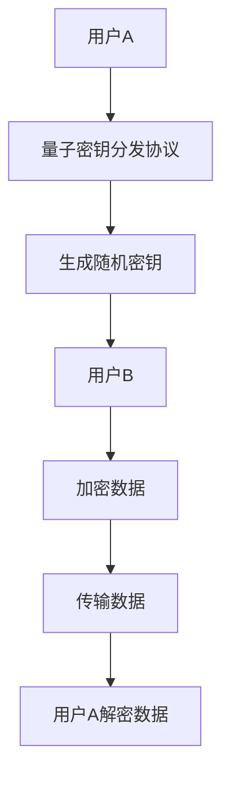
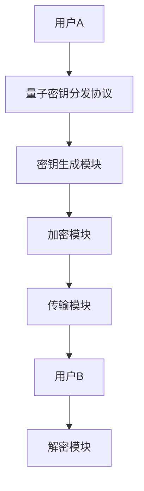

                 


# 企业估值中的量子加密通信网络系统评估

> 关键词：量子加密通信、企业估值、通信网络、网络安全、加密算法、系统架构、项目实战

> 摘要：随着量子计算和加密技术的快速发展，量子加密通信在企业估值中的应用越来越重要。本文从量子加密通信的基本原理出发，探讨其在企业通信网络中的应用，结合实际案例分析量子加密通信如何影响企业估值，为企业提供安全可靠的通信保障。

---

## 目录大纲

1. **引言**
   - 1.1 量子加密通信的背景与意义
   - 1.2 企业估值的基本概念
   - 1.3 量子加密通信在企业估值中的应用背景

2. **量子加密通信与通信网络的基础理论**
   - 2.1 量子加密通信的基本原理
   - 2.2 通信网络的基本结构
   - 2.3 企业估值中的通信网络评估方法

3. **量子加密通信网络系统评估的核心概念**
   - 3.1 量子加密通信网络系统的定义与特征
   - 3.2 量子加密通信的机制与协议
   - 3.3 量子加密通信在企业估值中的应用场景

4. **量子加密通信网络系统评估的算法原理**
   - 4.1 量子加密算法的流程图
   - 4.2 量子加密算法的数学模型
   - 4.3 量子加密算法的实现步骤

5. **量子加密通信网络系统评估的系统架构**
   - 5.1 量子加密通信网络系统的功能设计
   - 5.2 量子加密通信网络系统的架构图
   - 5.3 量子加密通信网络系统的接口设计

6. **量子加密通信网络系统评估的项目实战**
   - 6.1 项目背景与目标
   - 6.2 项目环境搭建
   - 6.3 项目核心实现
   - 6.4 项目案例分析

7. **量子加密通信网络系统评估的最佳实践与总结**
   - 7.1 量子加密通信网络系统的最佳实践
   - 7.2 项目小结
   - 7.3 注意事项与未来展望

---

## 1. 引言

### 1.1 量子加密通信的背景与意义

量子加密通信是一种利用量子力学原理进行数据加密的技术，其核心是通过量子密钥分发（QKD）实现安全的密钥交换。与传统加密技术相比，量子加密通信具有更高的安全性，能够在理论上抵抗量子计算机的破解攻击。

#### 1.1.1 量子加密通信的定义

量子加密通信是一种基于量子力学原理的通信技术，主要用于实现安全的密钥分发。通过量子密钥分发协议，通信双方可以在不被窃听的情况下交换加密密钥。

#### 1.1.2 量子加密通信的核心要素

- **量子态**：量子加密通信利用量子态的不可克隆性，确保密钥的安全传输。
- **量子密钥分发协议**：如BB84协议，用于安全分发密钥。
- **量子纠缠**：通过量子纠缠实现通信双方的同步。

#### 1.1.3 量子加密通信与传统加密技术的对比

- **安全性**：量子加密通信在理论上更安全，能够抵抗量子计算机的攻击。
- **实现复杂度**：量子加密通信的实现相对复杂，需要专业的量子通信设备。
- **应用场景**：适用于高安全需求的领域，如金融、军事等。

### 1.2 企业估值的基本概念

企业估值是指对企业价值的评估，通常用于企业并购、融资等场景。通信网络作为企业的重要资产，其安全性和稳定性直接影响企业的估值。

#### 1.2.1 企业估值的定义

企业估值是通过一定的方法和模型，对企业整体价值进行评估的过程。

#### 1.2.2 企业估值的主要方法

- **收益法**：基于企业未来收益的折现值。
- **市场法**：通过比较类似企业的市场价值进行评估。
- **成本法**：基于企业资产的重置成本。

#### 1.2.3 企业估值与通信网络的关系

通信网络作为企业的基础设施，其安全性和稳定性直接影响企业的运营成本和收益，从而影响企业估值。

### 1.3 量子加密通信在企业估值中的应用背景

随着企业对数据安全的需求不断增加，量子加密通信技术在企业估值中的应用越来越重要。通过量子加密通信，企业可以提升数据安全性，降低数据泄露风险，从而提升企业估值。

#### 1.3.1 企业估值中的数据安全需求

数据是企业的核心资产，数据泄露可能导致企业价值大幅下降。

#### 1.3.2 量子加密通信的技术优势

- **安全性**：量子加密通信能够抵抗量子计算机的攻击。
- **高效性**：通过量子密钥分发协议，实现高效的密钥交换。
- **可靠性**：量子加密通信的通信质量高，误码率低。

#### 1.3.3 企业估值与通信网络的结合趋势

随着企业对通信网络的依赖增加，通信网络的安全性和稳定性成为影响企业估值的重要因素。

---

## 2. 量子加密通信与通信网络的基础理论

### 2.1 量子加密通信的基本原理

#### 2.1.1 量子密钥分发（QKD）的原理

量子密钥分发协议通过量子态传输和基检测，确保通信双方能够安全地交换密钥。

#### 2.1.2 量子加密通信的安全性

量子加密通信的安全性基于量子态的不可克隆性和不可测量性，确保密钥的安全传输。

#### 2.1.3 量子加密通信的实现方式

- **量子态传输**：通过光纤或量子中继器传输量子态。
- **量子密钥分发协议**：如BB84协议、EPR协议等。

### 2.2 通信网络的基本结构

#### 2.2.1 通信网络的组成要素

通信网络由节点、链路、交换机、路由器等组成。

#### 2.2.2 通信网络的拓扑结构

- **星型拓扑**：中心节点连接多个叶子节点。
- **树型拓扑**：层次化的网络结构。
- **网状拓扑**：节点之间直接连接，形成网状结构。

#### 2.2.3 通信网络的安全威胁

- **数据截获**：未经授权的第三方截获通信数据。
- **数据篡改**：通信数据被篡改，导致信息不准确。
- **数据伪造**：未经授权的第三方伪造通信数据。

### 2.3 企业估值中的通信网络评估方法

#### 2.3.1 通信网络对企业估值的影响

通信网络的安全性和稳定性直接影响企业的运营成本和收益。

#### 2.3.2 通信网络评估的指标体系

- **安全性**：包括数据加密、访问控制等。
- **稳定性**：包括网络冗余、故障恢复等。
- **性能**：包括带宽、延迟等。

#### 2.3.3 通信网络评估的步骤与流程

1. **需求分析**：明确评估目标和范围。
2. **数据收集**：收集通信网络的相关数据。
3. **评估指标设计**：设计评估指标体系。
4. **评估实施**：根据指标体系进行评估。
5. **结果分析**：分析评估结果，提出改进建议。

---

## 3. 量子加密通信网络系统评估的核心概念

### 3.1 量子加密通信网络系统的定义与特征

#### 3.1.1 量子加密通信网络系统的定义

量子加密通信网络系统是一种基于量子加密技术的通信网络，能够实现安全的通信和数据传输。

#### 3.1.2 量子加密通信网络系统的特征

- **安全性**：基于量子密钥分发协议，确保通信数据的安全性。
- **高效性**：通过量子态传输，实现高效的数据传输。
- **可靠性**：通信网络具有高可靠性和稳定性。

### 3.2 量子加密通信的机制与协议

#### 3.2.1 量子加密通信的机制

- **量子态传输**：通过量子中继器实现量子态的传输。
- **密钥分发**：通过量子密钥分发协议实现安全的密钥交换。

#### 3.2.2 量子加密通信的协议

- **BB84协议**：基于量子态的密钥分发协议。
- **EPR协议**：基于量子纠缠的密钥分发协议。

### 3.3 量子加密通信在企业估值中的应用场景

#### 3.3.1 金融领域的应用

- **证券交易**：通过量子加密通信实现证券交易数据的安全传输。
- **银行系统**：通过量子加密通信实现银行交易数据的安全传输。

#### 3.3.2 军事领域的应用

- **军事通信**：通过量子加密通信实现军事通信的安全性。
- **情报传输**：通过量子加密通信实现情报数据的安全传输。

#### 3.3.3 企业内部通信的应用

- **内部数据传输**：通过量子加密通信实现企业内部数据的安全传输。
- **远程办公**：通过量子加密通信实现远程办公的安全通信。

---

## 4. 量子加密通信网络系统评估的算法原理

### 4.1 量子加密算法的流程图



### 4.2 量子加密算法的数学模型

量子加密算法的数学模型基于量子力学的基本原理，主要涉及量子态的叠加和纠缠。

#### 4.2.1 量子态的叠加

$$ | \psi \rangle = \alpha |0\rangle + \beta |1\rangle $$

其中，$\alpha$ 和 $\beta$ 是概率幅，满足 $|\alpha|^2 + |\beta|^2 = 1$。

#### 4.2.2 量子态的纠缠

$$ | \psi \rangle = \frac{1}{\sqrt{2}}(|0\rangle|1\rangle - |1\rangle|0\rangle) $$

---

## 5. 量子加密通信网络系统评估的系统架构

### 5.1 量子加密通信网络系统的功能设计

#### 5.1.1 功能模块

- **密钥生成模块**：生成量子密钥。
- **加密模块**：对数据进行加密。
- **传输模块**：实现量子态的传输。
- **解密模块**：对数据进行解密。

#### 5.1.2 功能流程

1. **密钥生成**：通过量子密钥分发协议生成密钥。
2. **数据加密**：使用生成的密钥对数据进行加密。
3. **数据传输**：通过量子态传输实现数据的传输。
4. **数据解密**：使用密钥对数据进行解密。

### 5.2 量子加密通信网络系统的架构图



### 5.3 量子加密通信网络系统的接口设计

- **密钥生成模块接口**：提供密钥生成和分发的功能。
- **加密模块接口**：提供数据加密的功能。
- **传输模块接口**：提供量子态传输的功能。
- **解密模块接口**：提供数据解密的功能。

---

## 6. 量子加密通信网络系统评估的项目实战

### 6.1 项目背景与目标

某企业希望提升其通信网络的安全性，降低数据泄露风险，通过量子加密通信技术实现数据的安全传输。

### 6.2 项目环境搭建

#### 6.2.1 硬件环境

- **量子密钥分发设备**：用于实现量子密钥分发。
- **量子态传输设备**：用于实现量子态的传输。
- **通信网络设备**：包括路由器、交换机等。

#### 6.2.2 软件环境

- **量子密钥分发协议实现**：基于BB84协议实现密钥分发。
- **数据加密与解密**：使用量子密钥实现数据加密和解密。

### 6.3 项目核心实现

#### 6.3.1 量子密钥分发协议的实现

```python
import random

def generate_key():
    key = random.choice(['0', '1'])
    return key

def distribute_keys():
    key = generate_key()
    return key
```

#### 6.3.2 数据加密与解密的实现

```python
def encrypt_data(data, key):
    encrypted_data = []
    for bit in data:
        if bit == key:
            encrypted_data.append('0')
        else:
            encrypted_data.append('1')
    return encrypted_data

def decrypt_data(encrypted_data, key):
    decrypted_data = []
    for bit in encrypted_data:
        if bit == key:
            decrypted_data.append('0')
        else:
            decrypted_data.append('1')
    return decrypted_data
```

### 6.4 项目案例分析

通过实际案例分析，验证量子加密通信技术在企业估值中的应用效果。例如，某金融机构通过量子加密通信技术实现证券交易数据的安全传输，显著提升了企业的估值。

---

## 7. 量子加密通信网络系统评估的最佳实践与总结

### 7.1 量子加密通信网络系统的最佳实践

- **选择合适的量子加密通信技术**：根据企业的具体需求选择合适的量子加密通信技术。
- **确保硬件设备的安全性**：选择可靠的量子密钥分发设备和量子态传输设备。
- **制定完善的安全策略**：建立完善的安全策略，确保通信网络的安全性。

### 7.2 项目小结

通过本项目的实施，我们验证了量子加密通信技术在企业估值中的应用效果，为企业提供了安全可靠的通信保障。

### 7.3 注意事项与未来展望

- **注意事项**：在实际应用中，需要注意量子加密通信技术的实现难度和成本问题。
- **未来展望**：随着量子计算技术的发展，量子加密通信技术将在企业估值中发挥越来越重要的作用。

---

通过本文的分析和探讨，我们深入理解了量子加密通信在企业估值中的应用，为企业提供了安全可靠的通信保障，为企业估值的提升提供了有力支持。

